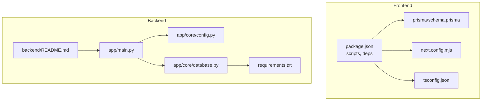
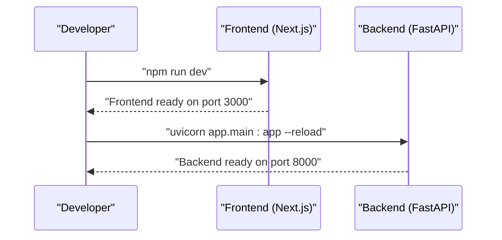

# Getting Started

<cite>
**Referenced Files in This Document**
- [package.json](file://english_pronunciation_app/frontend/package.json)
- [README.md](file://english_pronunciation_app/frontend/README.md)
- [GOOGLE_OAUTH_SETUP.md](file://english_pronunciation_app/frontend/GOOGLE_OAUTH_SETUP.md)
- [QUICK_START_GOOGLE_OAUTH.md](file://english_pronunciation_app/frontend/QUICK_START_GOOGLE_OAUTH.md)
- [schema.prisma](file://english_pronunciation_app/frontend/prisma/schema.prisma)
- [next.config.mjs](file://english_pronunciation_app/frontend/next.config.mjs)
- [tsconfig.json](file://english_pronunciation_app/frontend/tsconfig.json)
- [backend README.md](file://english_pronunciation_app/backend/README.md)
- [backend main.py](file://english_pronunciation_app/backend/app/main.py)
- [backend config.py](file://english_pronunciation_app/backend/app/core/config.py)
- [backend database.py](file://english_pronunciation_app/backend/app/core/database.py)
- [backend requirements.txt](file://english_pronunciation_app/backend/requirements.txt)
</cite>

## Table of Contents
1. [Introduction](#introduction)
2. [Project Structure](#project-structure)
3. [Prerequisites](#prerequisites)
4. [Installation](#installation)
5. [Development Setup](#development-setup)
6. [First Run](#first-run)
7. [Development Server Startup](#development-server-startup)
8. [Initial Verification](#initial-verification)
9. [Common Setup Issues and Troubleshooting](#common-setup-issues-and-troubleshooting)
10. [Deployment Guidance](#deployment-guidance)
11. [Conclusion](#conclusion)

## Introduction
This guide helps you set up and run the Web_HoTroPhatAmEN English pronunciation learning application locally. It covers prerequisites, installation for both frontend and backend, environment configuration, database setup, OAuth, and first-run tasks. It also includes troubleshooting tips and guidance for different development environments and deployment scenarios.

## Project Structure
The project consists of:
- Frontend built with Next.js 16, TypeScript, Prisma, and PostgreSQL
- Backend built with FastAPI and Uvicorn
- Shared Prisma schema for database modeling
- OAuth configuration for Google sign-in

**Diagram sources**
- [package.json:1-45](file://english_pronunciation_app/frontend/package.json#L1-L45)
- [schema.prisma:1-501](file://english_pronunciation_app/frontend/prisma/schema.prisma#L1-L501)
- [next.config.mjs:1-5](file://english_pronunciation_app/frontend/next.config.mjs#L1-L5)
- [tsconfig.json:1-42](file://english_pronunciation_app/frontend/tsconfig.json#L1-L42)
- [backend README.md:1-52](file://english_pronunciation_app/backend/README.md#L1-L52)
- [backend main.py:1-43](file://english_pronunciation_app/backend/app/main.py#L1-L43)
- [backend config.py:1-34](file://english_pronunciation_app/backend/app/core/config.py#L1-L34)
- [backend database.py:1-51](file://english_pronunciation_app/backend/app/core/database.py#L1-L51)
- [backend requirements.txt:1-32](file://english_pronunciation_app/backend/requirements.txt#L1-L32)

**Section sources**
- [package.json:1-45](file://english_pronunciation_app/frontend/package.json#L1-L45)
- [README.md:1-33](file://english_pronunciation_app/frontend/README.md#L1-L33)
- [backend README.md:1-52](file://english_pronunciation_app/backend/README.md#L1-L52)

## Prerequisites
Ensure your machine meets the following requirements before installing the project:

- Node.js
  - Version: 18 or later recommended
  - Package manager: npm (bundled with Node.js)
- Python
  - Version: 3.8–3.12 recommended
  - Virtual environment tool: venv (standard library)
- PostgreSQL
  - Version: 12 or later
  - Access: superuser or sufficient privileges to create databases and roles
- Browser
  - Modern browser with JavaScript enabled
  - For speech features: Chrome/Edge with installed voices
- Operating system
  - Windows, macOS, or Linux

Notes:
- The frontend uses Prisma for database operations and expects a PostgreSQL connection string.
- The backend exposes a health endpoint and supports CORS configuration via environment variables.

**Section sources**
- [README.md:1-33](file://english_pronunciation_app/frontend/README.md#L1-L33)
- [backend README.md:1-52](file://english_pronunciation_app/backend/README.md#L1-L52)

## Installation
Follow these steps to install the project locally.

### 1) Install frontend dependencies
- Navigate to the frontend directory and install dependencies:
  - Command: npm install

What this does:
- Installs Next.js, React, Prisma, NextAuth, and related packages
- Sets up TypeScript and Tailwind tooling

**Section sources**
- [package.json:1-45](file://english_pronunciation_app/frontend/package.json#L1-L45)
- [README.md:5-14](file://english_pronunciation_app/frontend/README.md#L5-L14)

### 2) Configure environment variables (frontend)
- Copy the example environment file to .env.local (or .env):
  - Command: copy .env.example .env.local
- Open .env.local and set:
  - DATABASE_URL: your PostgreSQL connection string
  - AUTH_SECRET: a secure random secret (min 32 characters)
  - AUTH_URL: your frontend origin (e.g., http://localhost:3000)
  - AUTH_GOOGLE_ID and AUTH_GOOGLE_SECRET: obtained from Google OAuth setup

Notes:
- Keep .env.local private and do not commit it to version control
- For production, configure equivalent environment variables on your hosting platform

**Section sources**
- [GOOGLE_OAUTH_SETUP.md:95-145](file://english_pronunciation_app/frontend/GOOGLE_OAUTH_SETUP.md#L95-L145)
- [QUICK_START_GOOGLE_OAUTH.md:35-60](file://english_pronunciation_app/frontend/QUICK_START_GOOGLE_OAUTH.md#L35-L60)

### 3) Prepare the database
- Create a PostgreSQL database named english_app (or customize as needed)
- Confirm DATABASE_URL in .env.local points to the correct host, port, database, user, and password
- Initialize Prisma:
  - Command: npx prisma db push
- Optional cleanup:
  - Command: npx tsx prisma/db_cleanup.ts

**Section sources**
- [README.md:7-13](file://english_pronunciation_app/frontend/README.md#L7-L13)
- [schema.prisma:5-8](file://english_pronunciation_app/frontend/prisma/schema.prisma#L5-L8)

### 4) Seed the database
- Seed lessons and content:
  - Command: npm run db:seed:lessons
- Seed audio assets (run once, idempotent):
  - Command: npx tsx prisma/seed_audio_local.ts

Notes:
- Audio mp3 files are downloaded locally and stored under frontend/public/audio
- Some entries may require manual review if external APIs lack audio

**Section sources**
- [README.md:11-13](file://english_pronunciation_app/frontend/README.md#L11-L13)

### 5) Install backend dependencies (Python)
- Navigate to the backend directory
- Recreate the virtual environment if needed:
  - Remove old venv: Remove-Item -Recurse -Force .\venv
  - Create new venv: python -m venv venv
  - Activate venv and install dependencies: pip install -r requirements.txt

**Section sources**
- [backend README.md:18-26](file://english_pronunciation_app/backend/README.md#L18-L26)
- [backend requirements.txt:1-32](file://english_pronunciation_app/backend/requirements.txt#L1-L32)

## Development Setup
Configure your development environment for both frontend and backend.

- Frontend
  - Build and run:
    - Command: npm run dev
  - Build for production:
    - Command: npm run build
  - Start production server:
    - Command: npm start
  - Lint:
    - Command: npm run lint

- Backend
  - Run with hot reload:
    - Command: .\venv\Scripts\python.exe -m uvicorn app.main:app --reload --host 127.0.0.1 --port 8000
  - Health check:
    - Endpoint: GET http://127.0.0.1:8000/health

- CORS configuration (backend)
  - Set CORS_ORIGINS to allowlist origins (comma-separated)
  - Defaults include localhost:3000 and localhost:3010

**Section sources**
- [package.json:6-13](file://english_pronunciation_app/frontend/package.json#L6-L13)
- [backend README.md:11-32](file://english_pronunciation_app/backend/README.md#L11-L32)
- [backend config.py:15-20](file://english_pronunciation_app/backend/app/core/config.py#L15-L20)

## First Run
Complete the following steps to initialize the application after installation.

### 1) Database initialization
- Ensure Prisma schema is applied:
  - Command: npx prisma db push
- Seed lessons and content:
  - Command: npm run db:seed:lessons
- Seed audio assets:
  - Command: npx tsx prisma/seed_audio_local.ts

### 2) OAuth setup
- Create a Google Cloud project and OAuth credentials
- Configure redirect URIs for development:
  - http://localhost:3000/api/auth/callback/google
  - http://localhost:3001/api/auth/callback/google
- Add Google OAuth variables to .env.local:
  - AUTH_GOOGLE_ID and AUTH_GOOGLE_SECRET
- Restart the frontend server

Verification:
- Visit http://localhost:3000/register or http://localhost:3000/login
- Confirm the “Continue with Google” button appears and logs you in successfully

**Section sources**
- [GOOGLE_OAUTH_SETUP.md:1-320](file://english_pronunciation_app/frontend/GOOGLE_OAUTH_SETUP.md#L1-L320)
- [QUICK_START_GOOGLE_OAUTH.md:1-159](file://english_pronunciation_app/frontend/QUICK_START_GOOGLE_OAUTH.md#L1-L159)
- [README.md:11-13](file://english_pronunciation_app/frontend/README.md#L11-L13)

## Development Server Startup
Start both frontend and backend servers.

- Frontend (Next.js)
  - Command: npm run dev
  - Default port: 3000
  - Additional ports: 3001 (if needed)

- Backend (FastAPI/Uvicorn)
  - Command: .\venv\Scripts\python.exe -m uvicorn app.main:app --reload --host 127.0.0.1 --port 8000
  - Default port: 8000

- CORS and origins
  - Update CORS_ORIGINS in backend environment to include your frontend origins

**Diagram sources**
- [package.json:7-10](file://english_pronunciation_app/frontend/package.json#L7-L10)
- [backend README.md:13-16](file://english_pronunciation_app/backend/README.md#L13-L16)
- [backend config.py:15-20](file://english_pronunciation_app/backend/app/core/config.py#L15-L20)

**Section sources**
- [package.json:6-13](file://english_pronunciation_app/frontend/package.json#L6-L13)
- [backend README.md:11-32](file://english_pronunciation_app/backend/README.md#L11-L32)
- [backend config.py:15-20](file://english_pronunciation_app/backend/app/core/config.py#L15-L20)

## Initial Verification
Perform these checks to confirm everything is working.

- Frontend
  - Open http://localhost:3000 in your browser
  - Verify pages load without errors
  - Check that the Google OAuth button appears on login/register pages

- Backend
  - Health check: GET http://127.0.0.1:8000/health
  - Expected response includes service metadata and database status

- Database
  - Confirm schema is up-to-date: npx prisma db push
  - Verify seeded content exists in tables (topics, exercises, questions)

- Audio assets
  - Ensure audio files are downloaded under frontend/public/audio

**Section sources**
- [README.md:14-19](file://english_pronunciation_app/frontend/README.md#L14-L19)
- [backend README.md:28-32](file://english_pronunciation_app/backend/README.md#L28-L32)
- [backend main.py:25-42](file://english_pronunciation_app/backend/app/main.py#L25-L42)

## Common Setup Issues and Troubleshooting
Below are typical problems and their solutions.

- Frontend OAuth button not visible
  - Cause: Missing AUTH_GOOGLE_ID or AUTH_GOOGLE_SECRET in .env.local
  - Fix: Add variables and restart the frontend server

- OAuth redirect_uri_mismatch
  - Cause: Redirect URI mismatch in Google Cloud Console
  - Fix: Ensure Authorized redirect URIs include:
    - http://localhost:3000/api/auth/callback/google
    - http://localhost:3001/api/auth/callback/google

- OAuth access_denied
  - Cause: OAuth Consent Screen in Testing mode without approved test users
  - Fix: Add your email to Test users or publish the app

- Missing AUTH_SECRET
  - Cause: NextAuth requires a strong secret
  - Fix: Generate and set AUTH_SECRET in .env.local

- Backend health check fails
  - Cause: DATABASE_URL not configured or unreachable
  - Fix: Set DATABASE_URL in backend environment and verify connectivity

- CORS errors in browser console
  - Cause: Frontend origin not included in CORS_ORIGINS
  - Fix: Set CORS_ORIGINS to include http://localhost:3000 and/or http://localhost:3010

- Audio not playing
  - Cause: Missing local audio files
  - Fix: Run npx tsx prisma/seed_audio_local.ts once

- Database schema issues
  - Fix: Apply schema updates with npx prisma db push

**Section sources**
- [GOOGLE_OAUTH_SETUP.md:167-207](file://english_pronunciation_app/frontend/GOOGLE_OAUTH_SETUP.md#L167-L207)
- [GOOGLE_OAUTH_SETUP.md:225-257](file://english_pronunciation_app/frontend/GOOGLE_OAUTH_SETUP.md#L225-L257)
- [backend README.md:34-42](file://english_pronunciation_app/backend/README.md#L34-L42)
- [backend database.py:31-50](file://english_pronunciation_app/backend/app/core/database.py#L31-L50)

## Deployment Guidance
Deploying the application involves configuring both frontend and backend for production.

- Frontend (Next.js)
  - Build: npm run build
  - Environment variables:
    - DATABASE_URL
    - AUTH_SECRET
    - AUTH_URL
    - AUTH_GOOGLE_ID
    - AUTH_GOOGLE_SECRET
  - Hosting platforms: Vercel, Netlify, or static hosting
  - Notes: Ensure redirect URIs match production URLs in Google Cloud Console

- Backend (FastAPI)
  - Use a WSGI server (e.g., Uvicorn) behind a reverse proxy
  - Environment variables:
    - DATABASE_URL (optional but recommended)
    - CORS_ORIGINS (comma-separated production origins)
  - Health endpoint: GET /health for monitoring

- OAuth in production
  - Update Authorized JavaScript origins and redirect URIs in Google Cloud Console
  - Publish the OAuth app for public access

- Database
  - Provision a managed PostgreSQL instance
  - Use DATABASE_URL pointing to production database

**Section sources**
- [GOOGLE_OAUTH_SETUP.md:225-257](file://english_pronunciation_app/frontend/GOOGLE_OAUTH_SETUP.md#L225-L257)
- [backend README.md:34-52](file://english_pronunciation_app/backend/README.md#L34-L52)
- [backend config.py:24-33](file://english_pronunciation_app/backend/app/core/config.py#L24-L33)

## Conclusion
You now have the fundamentals to develop and run the Web_HoTroPhatAmEN application locally, configure OAuth, seed the database, and prepare for deployment. If you encounter issues, consult the troubleshooting section and verify environment variables and CORS settings. For production, align OAuth URIs and environment variables with your hosting platform and database provider.