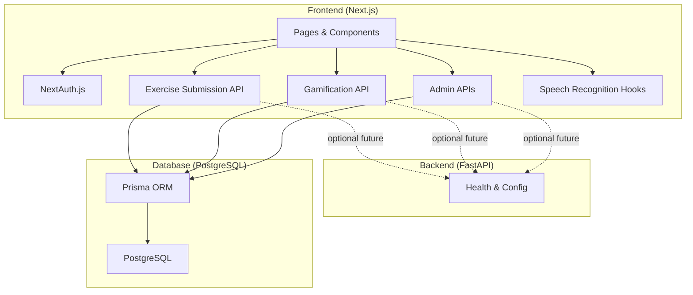
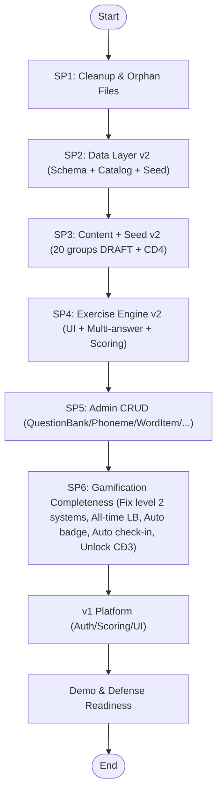
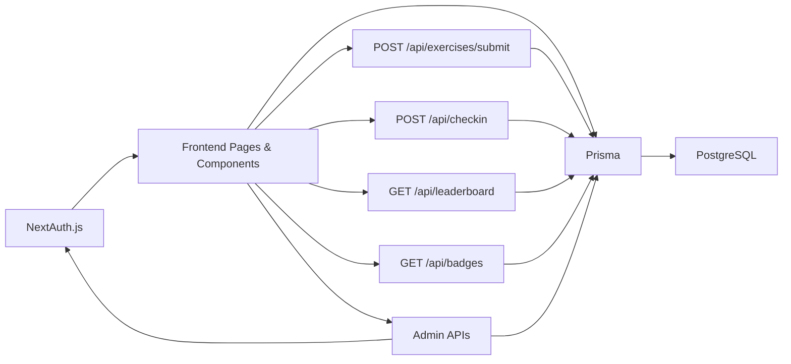
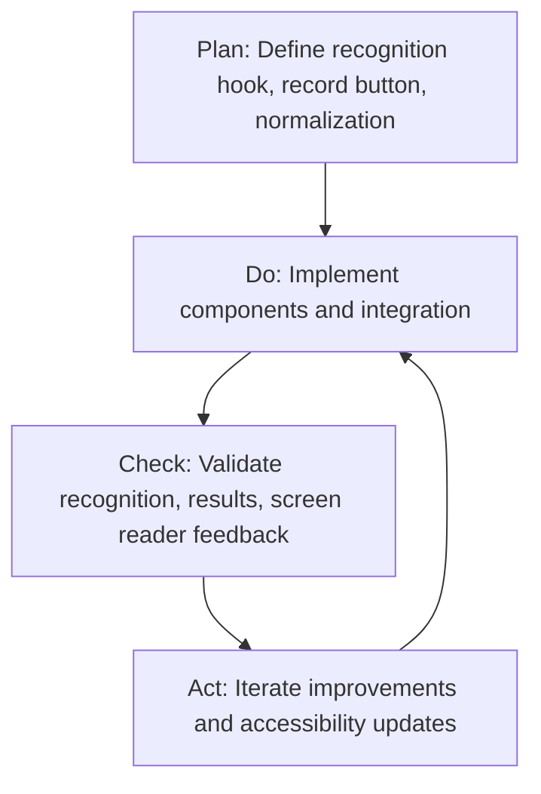

# Planning and Roadmap

<cite>
**Referenced Files in This Document**
- [PLAN/README.md](file://PLAN/README.md)
- [ACTION_PLAN_NEXT_STEPS.md](file://PLAN/01_Roadmap/ACTION_PLAN_NEXT_STEPS.md)
- [KE_HOACH_THUC_HIEN.md](file://PLAN/01_Roadmap/KE_HOACH_THUC_HIEN.md)
- [PDCA.md](file://PLAN/01_Roadmap/PDCA.md)
- [CURRENT_PROJECT_CONTEXT.md](file://PLAN/00_Project_Context/CURRENT_PROJECT_CONTEXT.md)
- [DE_CUONG_DO_AN.md](file://PLAN/00_Project_Context/DE_CUONG_DO_AN.md)
- [DATA_SEED_PLAN.md](file://PLAN/02_Database_And_Data/DATA_SEED_PLAN.md)
- [DB_AUDIT_REPORT.md](file://PLAN/02_Database_And_Data/DB_AUDIT_REPORT.md)
- [LESSON_SYLLABUS_STRUCTURE.md](file://PLAN/02_Database_And_Data/LESSON_SYLLABUS_STRUCTURE.md)
- [API_CONTRACT_PLAN.md](file://PLAN/01_Roadmap/API_CONTRACT_PLAN.md)
- [BADGE_SYSTEM_PLAN.md](file://PLAN/04_Features/BADGE_SYSTEM_PLAN.md)
- [SCORING_AND_LEADERBOARD_PLAN.md](file://PLAN/04_Features/SCORING_AND_LEADERBOARD_PLAN.md)
- [DAILY_CHECKIN_FEATURE.md](file://PLAN/04_Features/DAILY_CHECKIN_FEATURE.md)
- [STREAK_GAMIFICATION_GUIDE.md](file://PLAN/04_Features/STREAK_GAMIFICATION_GUIDE.md)
- [HCI_ACCESSIBILITY_AUDIT.md](file://PLAN/03_UI_UX/HCI_ACCESSIBILITY_AUDIT.md)
- [UI_COMPONENTS_GUIDE.md](file://PLAN/03_UI_UX/UI_COMPONENTS_GUIDE.md)
- [SKILL_USAGE_BY_PHASE.md](file://PLAN/05_AI_Skills/SKILL_USAGE_BY_PHASE.md)
</cite>

## Table of Contents
1. [Introduction](#introduction)
2. [Project Structure](#project-structure)
3. [Core Components](#core-components)
4. [Architecture Overview](#architecture-overview)
5. [Detailed Component Analysis](#detailed-component-analysis)
6. [Dependency Analysis](#dependency-analysis)
7. [Performance Considerations](#performance-considerations)
8. [Troubleshooting Guide](#troubleshooting-guide)
9. [Conclusion](#conclusion)
10. [Appendices](#appendices)

## Introduction
This document presents the comprehensive planning and development roadmap for the English pronunciation learning platform “Web_HoTroPhatAmEN.” It consolidates strategic vision, milestone achievements, and future development plans. It explains the project timeline, feature prioritization, and resource allocation strategies, and documents planned enhancements, technical improvements, and new feature development. It also describes the PDCA cycle implementation, progress tracking methodologies, and quality improvement processes. Finally, it outlines research initiatives, academic collaboration expectations, pedagogical development, project governance, decision-making processes, stakeholder engagement, lessons learned, best practices, and continuous improvement strategies.

## Project Structure
The repository organizes planning artifacts under PLAN/, separating context, roadmap, database/data, UI/UX, features, and AI skills. The frontend and backend codebases reside under english_pronunciation_app/, while superpowers plans/specs are stored under docs/superpowers/.

```mermaid
graph TB
subgraph "Repository Root"
PLAN["PLAN/"]
DOCS_SUPER["docs/superpowers/"]
APP["english_pronunciation_app/"]
OTHER["Other assets"]
end
PLAN --> PLAN_CTX["00_Project_Context/"]
PLAN --> PLAN_ROAD["01_Roadmap/"]
PLAN --> PLAN_DB["02_Database_And_Data/"]
PLAN --> PLAN_UI["03_UI_UX/"]
PLAN --> PLAN_FEAT["04_Features/"]
PLAN --> PLAN_AI["05_AI_Skills/"]
PLAN_ROAD --> API_CONTRACT["API_CONTRACT_PLAN.md"]
PLAN_ROAD --> ACTION_PLAN["ACTION_PLAN_NEXT_STEPS.md"]
PLAN_ROAD --> ROADMAP_SPEC["KE_HOACH_THUC_HIEN.md"]
PLAN_ROAD --> PDCA_CYCLE["PDCA.md"]
PLAN_CTX --> CURR_CTX["CURRENT_PROJECT_CONTEXT.md"]
PLAN_CTX --> SPEC_DOC["DE_CUONG_DO_AN.md"]
PLAN_DB --> DATA_PLAN["DATA_SEED_PLAN.md"]
PLAN_DB --> DB_AUDIT["DB_AUDIT_REPORT.md"]
PLAN_DB --> LESSON_SYLL["LESSON_SYLLABUS_STRUCTURE.md"]
PLAN_FEAT --> BADGE_PLAN["BADGE_SYSTEM_PLAN.md"]
PLAN_FEAT --> SCORE_PLAN["SCORING_AND_LEADERBOARD_PLAN.md"]
PLAN_FEAT --> DAILY_CHECKIN["DAILY_CHECKIN_FEATURE.md"]
PLAN_FEAT --> STREAK_GUIDE["STREAK_GAMIFICATION_GUIDE.md"]
PLAN_UI --> HCI_AUDIT["HCI_ACCESSIBILITY_AUDIT.md"]
PLAN_UI --> UI_GUIDE["UI_COMPONENTS_GUIDE.md"]
PLAN_AI --> SKILL_PLAN["SKILL_USAGE_BY_PHASE.md"]
```

**Diagram sources**
- [PLAN/README.md](file://PLAN/README.md)
- [ACTION_PLAN_NEXT_STEPS.md](file://PLAN/01_Roadmap/ACTION_PLAN_NEXT_STEPS.md)
- [CURRENT_PROJECT_CONTEXT.md](file://PLAN/00_Project_Context/CURRENT_PROJECT_CONTEXT.md)
- [DE_CUONG_DO_AN.md](file://PLAN/00_Project_Context/DE_CUONG_DO_AN.md)
- [DATA_SEED_PLAN.md](file://PLAN/02_Database_And_Data/DATA_SEED_PLAN.md)
- [DB_AUDIT_REPORT.md](file://PLAN/02_Database_And_Data/DB_AUDIT_REPORT.md)
- [LESSON_SYLLABUS_STRUCTURE.md](file://PLAN/02_Database_And_Data/LESSON_SYLLABUS_STRUCTURE.md)
- [API_CONTRACT_PLAN.md](file://PLAN/01_Roadmap/API_CONTRACT_PLAN.md)
- [BADGE_SYSTEM_PLAN.md](file://PLAN/04_Features/BADGE_SYSTEM_PLAN.md)
- [SCORING_AND_LEADERBOARD_PLAN.md](file://PLAN/04_Features/SCORING_AND_LEADERBOARD_PLAN.md)
- [DAILY_CHECKIN_FEATURE.md](file://PLAN/04_Features/DAILY_CHECKIN_FEATURE.md)
- [STREAK_GAMIFICATION_GUIDE.md](file://PLAN/04_Features/STREAK_GAMIFICATION_GUIDE.md)
- [HCI_ACCESSIBILITY_AUDIT.md](file://PLAN/03_UI_UX/HCI_ACCESSIBILITY_AUDIT.md)
- [UI_COMPONENTS_GUIDE.md](file://PLAN/03_UI_UX/UI_COMPONENTS_GUIDE.md)
- [SKILL_USAGE_BY_PHASE.md](file://PLAN/05_AI_Skills/SKILL_USAGE_BY_PHASE.md)

**Section sources**
- [PLAN/README.md](file://PLAN/README.md)

## Core Components
- Strategic Vision and Academic Alignment: The project aligns with the official project specification and aims to integrate gamification with IPA-based pronunciation training, supported by HCI and accessibility standards.
- Roadmap and Phases: The roadmap is organized into phases (SP1–SP6) with concrete deliverables, milestones, and quality gates validated by audits and tests.
- Gamification and Scoring: Clear scoring and leaderboard policies separate XP and ranking scores, with daily bonuses and anti-farming mechanisms.
- Data and Content Pipeline: A structured question bank and lesson catalog define content creation, review, and seeding workflows.
- UI/UX and Accessibility: Comprehensive guidelines and audits ensure WCAG 2.1 AA compliance and human-centered design.
- API Contracts: Well-defined contracts govern submission, check-in, badges, leaderboard, and admin APIs.
- PDCA Cycle: Iterative cycles for speech recognition and audio components ensure continuous improvement aligned with accessibility goals.

**Section sources**
- [DE_CUONG_DO_AN.md](file://PLAN/00_Project_Context/DE_CUONG_DO_AN.md)
- [CURRENT_PROJECT_CONTEXT.md](file://PLAN/00_Project_Context/CURRENT_PROJECT_CONTEXT.md)
- [ACTION_PLAN_NEXT_STEPS.md](file://PLAN/01_Roadmap/ACTION_PLAN_NEXT_STEPS.md)
- [SCORING_AND_LEADERBOARD_PLAN.md](file://PLAN/04_Features/SCORING_AND_LEADERBOARD_PLAN.md)
- [DATA_SEED_PLAN.md](file://PLAN/02_Database_And_Data/DATA_SEED_PLAN.md)
- [HCI_ACCESSIBILITY_AUDIT.md](file://PLAN/03_UI_UX/HCI_ACCESSIBILITY_AUDIT.md)
- [API_CONTRACT_PLAN.md](file://PLAN/01_Roadmap/API_CONTRACT_PLAN.md)
- [PDCA.md](file://PLAN/01_Roadmap/PDCA.md)

## Architecture Overview
The system follows a frontend-first architecture with Next.js App Router, complemented by a lightweight Python FastAPI backend for health checks and potential future expansion. The frontend integrates:
- Authentication via NextAuth.js
- Exercise submission and scoring logic
- Gamification services (XP, streaks, badges, leaderboard)
- Admin CRUD for content management
- UI components designed for accessibility and responsiveness

**Diagram sources**
- [CURRENT_PROJECT_CONTEXT.md](file://PLAN/00_Project_Context/CURRENT_PROJECT_CONTEXT.md)
- [ACTION_PLAN_NEXT_STEPS.md](file://PLAN/01_Roadmap/ACTION_PLAN_NEXT_STEPS.md)
- [API_CONTRACT_PLAN.md](file://PLAN/01_Roadmap/API_CONTRACT_PLAN.md)

## Detailed Component Analysis

### Strategic Vision and Academic Alignment
- Purpose: Build a web-based IPA-aligned pronunciation trainer integrated with gamification to enhance motivation and retention.
- Academic Scope: The project specification defines the scope, methodology, and timeline, emphasizing HCI, gamification, PostgreSQL, Next.js, FastAPI, and speech AI.
- Timeline: The official timeline spans weeks 1–10, with current progress in Weeks 1–6 and active development in Weeks 7–10.

**Section sources**
- [DE_CUONG_DO_AN.md](file://PLAN/00_Project_Context/DE_CUONG_DO_AN.md)

### Current Project Context and Status
- Tech Stack: Next.js 16, React 18, Prisma, PostgreSQL, NextAuth, Tailwind, FastAPI minimal backend, Web Speech API for recognition.
- Architecture: Scoring and gamification logic reside in the frontend; backend remains minimal for now.
- Gamification Live: XP, streak, badge, leaderboard, daily bonus, and auto badge checks are operational.
- Data Catalog: 26 tables, 4 topics, 25 sound groups, 44 phonemes, 100 exercises, 25 learning maps, 94 QuestionBankItem, 120 questions.
- Roadmap Snapshot: ~42%–~60% completion; priorities include content for CD2/CD4, CĐ4 UI and multi-answer modes, and SP6 fixes.

**Section sources**
- [CURRENT_PROJECT_CONTEXT.md](file://PLAN/00_Project_Context/CURRENT_PROJECT_CONTEXT.md)

### Roadmap Phases and Milestones
- SP1–SP6: Sub-projects with deliverables, risks, and quality gates.
- Priority Recommendations: CD2 content (12 groups) and CD4 (4 groups) are highest risk; CĐ4 UI depends on CD4 content; SP6 unlocks CĐ3 and fixes level systems.

**Diagram sources**
- [CURRENT_PROJECT_CONTEXT.md](file://PLAN/00_Project_Context/CURRENT_PROJECT_CONTEXT.md)

**Section sources**
- [CURRENT_PROJECT_CONTEXT.md](file://PLAN/00_Project_Context/CURRENT_PROJECT_CONTEXT.md)

### API Contracts and Integration Points
- Core Contracts: POST /api/exercises/submit, GET/POST /api/checkin, GET /api/leaderboard, GET /api/badges, POST /api/badges/check, Admin CRUD endpoints.
- Principles: JSON consistency, session-based user resolution, server-side scoring, anti-farming controls, and robust error handling.
- Implementation Status: MVP endpoints implemented; session-based user retrieval is transitioning; admin endpoints ready for UI integration.

**Section sources**
- [API_CONTRACT_PLAN.md](file://PLAN/01_Roadmap/API_CONTRACT_PLAN.md)
- [ACTION_PLAN_NEXT_STEPS.md](file://PLAN/01_Roadmap/ACTION_PLAN_NEXT_STEPS.md)

### Scoring, XP, Leaderboard, and Anti-Farming
- Separation of Concerns: XP for progression; Ranking Score for weekly/monthly leaderboards.
- Scoring Policy: Base scores per question type; accuracy-based scoring for voice tasks; XP multipliers by question type; daily bonuses capped.
- Anti-Farming: Only best scores contribute to leaderboard deltas; small XP/Ranking Score on retakes; daily caps; limits on retake bonuses.
- Thresholds: >=70 pass, >=80 good, >=90 excellent for badges.

**Section sources**
- [SCORING_AND_LEADERBOARD_PLAN.md](file://PLAN/04_Features/SCORING_AND_LEADERBOARD_PLAN.md)

### Gamification: Badges, Streaks, and Daily Check-in
- Badge System: 12 MVP badges across progress, skill, streak, improvement, and ranking categories; periodic validity for ranking badges.
- Streak System: Automatic streak growth on consecutive exercise completions; milestones with achievements; popup rewards.
- Daily Check-in: Auto-triggered upon exercise completion; weekly reward progression; milestone badges.

**Section sources**
- [BADGE_SYSTEM_PLAN.md](file://PLAN/04_Features/BADGE_SYSTEM_PLAN.md)
- [STREAK_GAMIFICATION_GUIDE.md](file://PLAN/04_Features/STREAK_GAMIFICATION_GUIDE.md)
- [DAILY_CHECKIN_FEATURE.md](file://PLAN/04_Features/DAILY_CHECKIN_FEATURE.md)

### Data Pipeline: Question Bank and Lesson Catalog
- Approach: Choose “Way B” — maintain a canonical QuestionBankItem source with status, difficulty, and source metadata.
- Content Generation: Each SoundGroup generates four question types; MVP seeds 3 groups; remaining groups are DRAFT pending content.
- Data Integrity: Audit revealed prior seed issues; remediation included cleanup, corrected topic assignments, real distractors, and audio sourcing.

**Section sources**
- [DATA_SEED_PLAN.md](file://PLAN/02_Database_And_Data/DATA_SEED_PLAN.md)
- [LESSON_SYLLABUS_STRUCTURE.md](file://PLAN/02_Database_And_Data/LESSON_SYLLABUS_STRUCTURE.md)
- [DB_AUDIT_REPORT.md](file://PLAN/02_Database_And_Data/DB_AUDIT_REPORT.md)

### UI/UX and Accessibility
- Audit Findings: WCAG 2.1 AA compliance at ~75%; critical gaps in navbar, semantic HTML, and ARIA labeling were identified.
- Improvements: Skip links, mobile menu, active link states, footer landmarks, and improved semantic markup.
- Components: Reusable UI components with accessibility baked-in; design system with color palette, typography, and spacing.

**Section sources**
- [HCI_ACCESSIBILITY_AUDIT.md](file://PLAN/03_UI_UX/HCI_ACCESSIBILITY_AUDIT.md)
- [UI_COMPONENTS_GUIDE.md](file://PLAN/03_UI_UX/UI_COMPONENTS_GUIDE.md)

### PDCA Cycle for Speech Recognition and Audio Components
- Plan: Define speech recognition hook, record button, and normalization logic.
- Do: Implement components and integrate with IPA chart.
- Check: Validate recognition accuracy, result display, and screen reader announcements.
- Act: Iterate based on feedback and accessibility outcomes.

**Section sources**
- [PDCA.md](file://PLAN/01_Roadmap/PDCA.md)

### Research Initiatives and Pedagogical Development
- Pedagogy: IPA-based instruction, minimal pairs, connected speech modes, and phoneme-coloring feedback.
- Data Sources: CMU Pronouncing Dictionary, Free Dictionary API, and manual/local audio for critical items.
- Future Brainstorming: WPM fluency mode, per-phoneme route, and per-phoneme coloring polish are deferred but scoped.

**Section sources**
- [CURRENT_PROJECT_CONTEXT.md](file://PLAN/00_Project_Context/CURRENT_PROJECT_CONTEXT.md)

### Governance, Decision-Making, and Stakeholder Engagement
- Decision Framework: Skill usage mapped per phase; architects and subject matter experts guide implementation.
- Quality Gates: Prisma validate, TypeScript check, tests, and build must pass before milestones.
- Stakeholders: Academic alignment with school guidelines; internal team ownership per feature area.

**Section sources**
- [SKILL_USAGE_BY_PHASE.md](file://PLAN/05_AI_Skills/SKILL_USAGE_BY_PHASE.md)
- [CURRENT_PROJECT_CONTEXT.md](file://PLAN/00_Project_Context/CURRENT_PROJECT_CONTEXT.md)

## Dependency Analysis
The system exhibits layered dependencies:
- Frontend depends on Next.js, Prisma, and NextAuth for routing, data access, and authentication.
- Backend remains minimal but may expand for analytics and ASR in the future.
- Gamification and scoring depend on consistent API contracts and database state.
- Admin CRUD depends on authenticated sessions and strict validation.

**Diagram sources**
- [API_CONTRACT_PLAN.md](file://PLAN/01_Roadmap/API_CONTRACT_PLAN.md)
- [CURRENT_PROJECT_CONTEXT.md](file://PLAN/00_Project_Context/CURRENT_PROJECT_CONTEXT.md)

**Section sources**
- [API_CONTRACT_PLAN.md](file://PLAN/01_Roadmap/API_CONTRACT_PLAN.md)
- [CURRENT_PROJECT_CONTEXT.md](file://PLAN/00_Project_Context/CURRENT_PROJECT_CONTEXT.md)

## Performance Considerations
- Build and Type Safety: Strict TypeScript checks and build passes ensure stability.
- Test Coverage: Unit tests for scoring and gamification logic improve reliability.
- Database Operations: Transactions for scoring and gamification updates minimize inconsistency.
- Accessibility Audits: Automated and manual audits reduce runtime issues and improve UX.

[No sources needed since this section provides general guidance]

## Troubleshooting Guide
Common issues and resolutions:
- Type Errors: Resolve TypeScript issues in exercise components and Prisma config; rebuild to validate.
- Speech Recognition Limitations: Provide fallback messaging for unsupported browsers; ensure proper normalization logic.
- Data Integrity: Use cleanup scripts and re-seed according to the audit remediation steps.
- Admin Access: Enforce role-based authorization and validate payloads server-side.
- Accessibility Gaps: Address skipped links, ARIA labels, semantic HTML, and keyboard navigation.

**Section sources**
- [ACTION_PLAN_NEXT_STEPS.md](file://PLAN/01_Roadmap/ACTION_PLAN_NEXT_STEPS.md)
- [DB_AUDIT_REPORT.md](file://PLAN/02_Database_And_Data/DB_AUDIT_REPORT.md)
- [HCI_ACCESSIBILITY_AUDIT.md](file://PLAN/03_UI_UX/HCI_ACCESSIBILITY_AUDIT.md)

## Conclusion
The project maintains a clear, phased roadmap aligned with academic requirements and practical delivery. The frontend’s gamification and scoring systems are operational, the data pipeline is standardized, and UI/UX improvements are ongoing with strong accessibility adherence. The PDCA cycle ensures iterative refinement, while quality gates and audits safeguard progress. Moving forward, the focus should remain on content completion (CD2/CD4), CĐ4 UI and multi-answer modes, and SP6 fixes to finalize the platform for demo and defense readiness.

[No sources needed since this section summarizes without analyzing specific files]

## Appendices

### Appendix A: Feature Prioritization Matrix
- Highest Risk: CD2 (12 groups) + CD4 (4 groups)
- Medium Risk: SP4 CĐ4 UI + Multi-answer + Scoring
- Low Risk: SP6 unlock gating + level system fixes + all-time leaderboard
- Deferred: SP5 admin CRUD for user and badges-config

**Section sources**
- [CURRENT_PROJECT_CONTEXT.md](file://PLAN/00_Project_Context/CURRENT_PROJECT_CONTEXT.md)

### Appendix B: PDCA Example Flow (Speech Recognition)

**Diagram sources**
- [PDCA.md](file://PLAN/01_Roadmap/PDCA.md)

### Appendix C: API Contract Highlights
- POST /api/exercises/submit: Server-side scoring, XP/Ranking updates, badge checks.
- GET/POST /api/checkin: Daily check-in with streak progression and rewards.
- GET /api/leaderboard: Weekly/monthly rankings with current user highlights.
- GET /api/badges: Earned and available badges with progress.
- Admin APIs: CRUD for exercises, questions, topics, levels, maps with status management.

**Section sources**
- [API_CONTRACT_PLAN.md](file://PLAN/01_Roadmap/API_CONTRACT_PLAN.md)