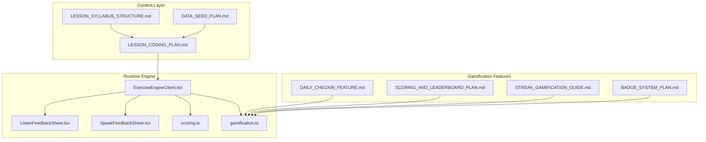
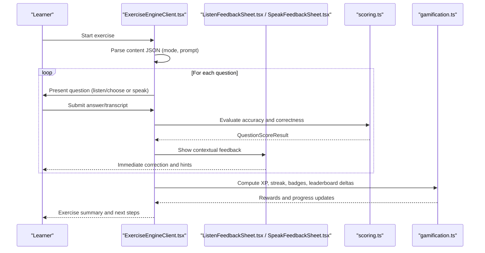
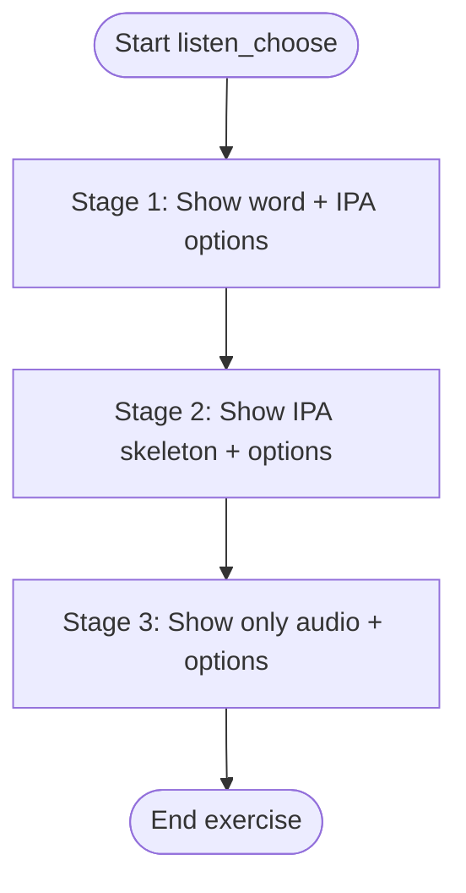
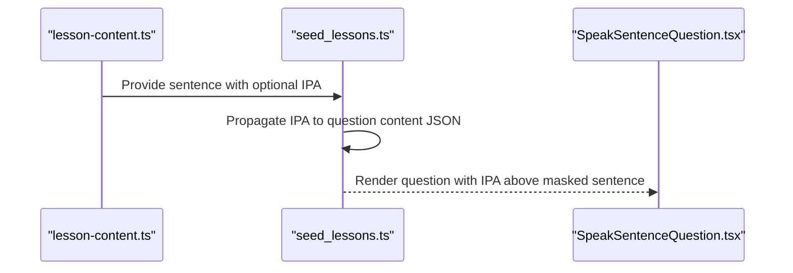
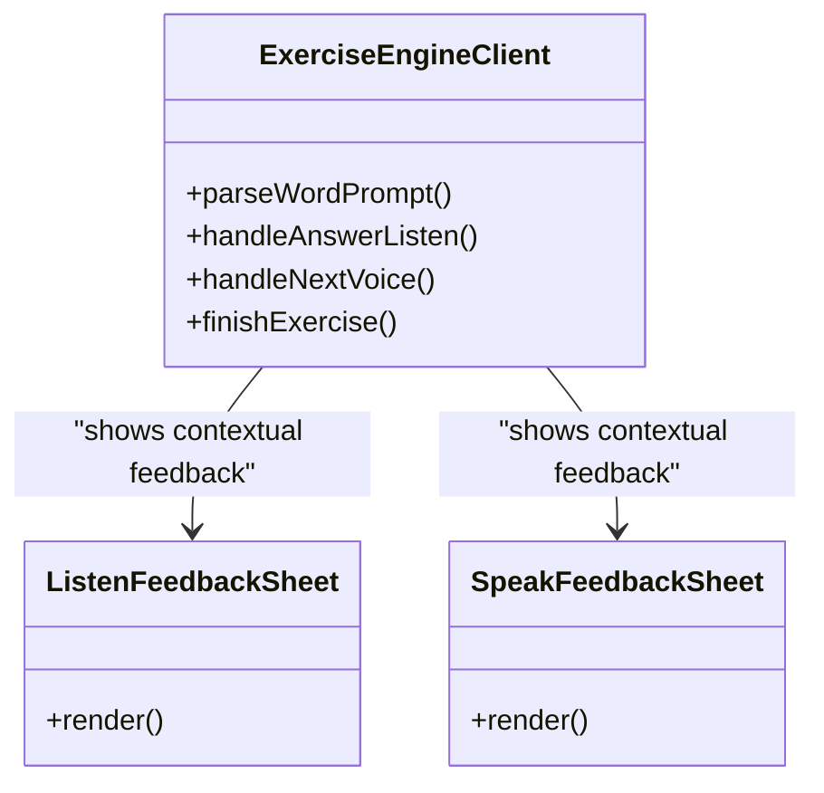
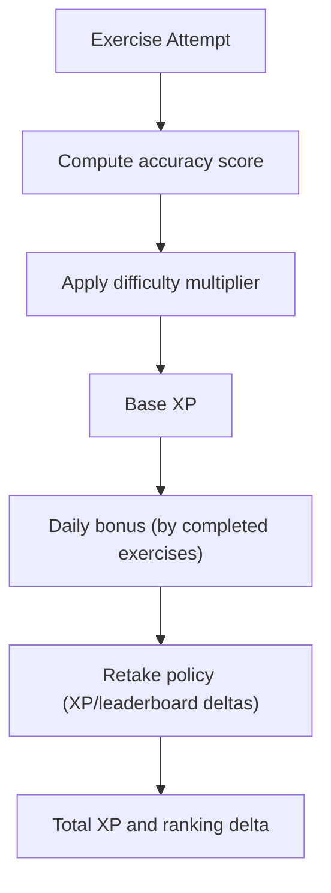
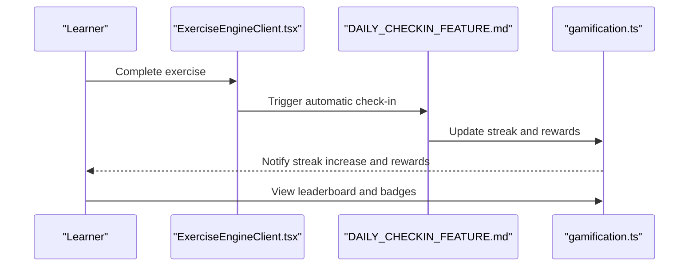
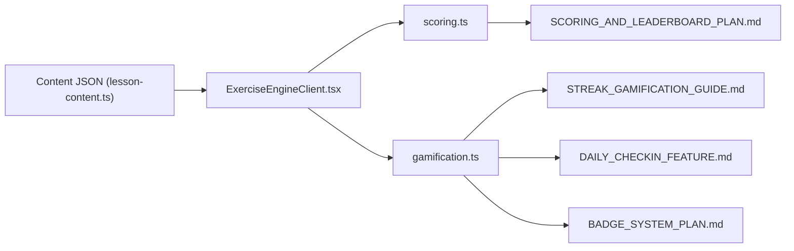

# Educational Methodology

<cite>
**Referenced Files in This Document**
- [CURRENT_PROJECT_CONTEXT.md](file://PLAN/00_Project_Context/CURRENT_PROJECT_CONTEXT.md)
- [LESSON_SYLLABUS_STRUCTURE.md](file://PLAN/02_Database_And_Data/LESSON_SYLLABUS_STRUCTURE.md)
- [DATA_SEED_PLAN.md](file://PLAN/02_Database_And_Data/DATA_SEED_PLAN.md)
- [LESSON_CODING_PLAN.md](file://PLAN/02_Database_And_Data/LESSON_CODING_PLAN.md)
- [2026-06-18-listen-choose-3stage-phoneme-id-design.md](file://docs/superpowers/specs/2026-06-18-listen-choose-3stage-phoneme-id-design.md)
- [2026-06-19-sp3b-pilot-sentence-ipa-design.md](file://docs/superpowers/specs/2026-06-19-sp3b-pilot-sentence-ipa-design.md)
- [SKILL.md](file://english_pronunciation_app/.agents/skills/ipa-pronunciation-pedagogy/SKILL.md)
- [sources.md](file://english_pronunciation_app/.agents/skills/ipa-pronunciation-pedagogy/references/sources.md)
- [ExerciseEngineClient.tsx](file://english_pronunciation_app/frontend/src/app/exercises/[id]/ExerciseEngineClient.tsx)
- [ListenFeedbackSheet.tsx](file://english_pronunciation_app/frontend/src/app/exercises/[id]/ListenFeedbackSheet.tsx)
- [SpeakFeedbackSheet.tsx](file://english_pronunciation_app/frontend/src/app/exercises/[id]/SpeakFeedbackSheet.tsx)
- [scoring.ts](file://english_pronunciation_app/frontend/src/lib/scoring.ts)
- [gamification.ts](file://english_pronunciation_app/frontend/src/lib/gamification.ts)
- [DAILY_CHECKIN_FEATURE.md](file://PLAN/04_Features/DAILY_CHECKIN_FEATURE.md)
- [SCORING_AND_LEADERBOARD_PLAN.md](file://PLAN/04_Features/SCORING_AND_LEADERBOARD_PLAN.md)
- [STREAK_GAMIFICATION_GUIDE.md](file://PLAN/04_Features/STREAK_GAMIFICATION_GUIDE.md)
- [BADGE_SYSTEM_PLAN.md](file://PLAN/04_Features/BADGE_SYSTEM_PLAN.md)
</cite>

## Table of Contents
1. [Introduction](#introduction)
2. [Project Structure](#project-structure)
3. [Core Components](#core-components)
4. [Architecture Overview](#architecture-overview)
5. [Detailed Component Analysis](#detailed-component-analysis)
6. [Dependency Analysis](#dependency-analysis)
7. [Performance Considerations](#performance-considerations)
8. [Troubleshooting Guide](#troubleshooting-guide)
9. [Conclusion](#conclusion)
10. [Appendices](#appendices)

## Introduction
This document presents the educational methodology and pedagogical approach underpinning the Web_HoTroPhatAmEN platform. It synthesizes the scientific foundations of English pronunciation learning—phonetic principles, IPA usage, and connected speech patterns—with a structured learning progression from basic sounds to complex pronunciation scenarios. Evidence-based gamification elements are documented to enhance motivation and retention, alongside adaptive learning mechanisms that personalize difficulty and content delivery. Research-backed assessment criteria, immediate feedback mechanisms, and spaced repetition principles are explained, with special attention to how the platform addresses common pronunciation challenges specific to Vietnamese learners. Finally, the cognitive load theory and multimedia learning principles applied in the design are outlined.

## Project Structure
The platform is organized around a data-driven lesson catalog and a modular exercise engine. Content is structured by four main topics (vowels, consonants, minimal pairs, and connected speech), each mapped to sound groups and exercises. The exercise engine renders question types dynamically from stored content JSON, while scoring and gamification operate on the client-side to provide immediate feedback and reinforcement.

**Diagram sources**
- [LESSON_SYLLABUS_STRUCTURE.md:1-198](file://PLAN/02_Database_And_Data/LESSON_SYLLABUS_STRUCTURE.md#L1-L198)
- [DATA_SEED_PLAN.md:1-418](file://PLAN/02_Database_And_Data/DATA_SEED_PLAN.md#L1-L418)
- [LESSON_CODING_PLAN.md:1-473](file://PLAN/02_Database_And_Data/LESSON_CODING_PLAN.md#L1-L473)
- [ExerciseEngineClient.tsx:1-645](file://english_pronunciation_app/frontend/src/app/exercises/[id]/ExerciseEngineClient.tsx#L1-L645)
- [ListenFeedbackSheet.tsx:1-151](file://english_pronunciation_app/frontend/src/app/exercises/[id]/ListenFeedbackSheet.tsx#L1-L151)
- [SpeakFeedbackSheet.tsx:1-96](file://english_pronunciation_app/frontend/src/app/exercises/[id]/SpeakFeedbackSheet.tsx#L1-L96)
- [scoring.ts:1-227](file://english_pronunciation_app/frontend/src/lib/scoring.ts#L1-L227)
- [gamification.ts:1-575](file://english_pronunciation_app/frontend/src/lib/gamification.ts#L1-L575)
- [DAILY_CHECKIN_FEATURE.md:1-371](file://PLAN/04_Features/DAILY_CHECKIN_FEATURE.md#L1-L371)
- [SCORING_AND_LEADERBOARD_PLAN.md:1-280](file://PLAN/04_Features/SCORING_AND_LEADERBOARD_PLAN.md#L1-L280)
- [STREAK_GAMIFICATION_GUIDE.md:1-569](file://PLAN/04_Features/STREAK_GAMIFICATION_GUIDE.md#L1-L569)
- [BADGE_SYSTEM_PLAN.md:1-156](file://PLAN/04_Features/BADGE_SYSTEM_PLAN.md#L1-L156)

**Section sources**
- [CURRENT_PROJECT_CONTEXT.md:1-178](file://PLAN/00_Project_Context/CURRENT_PROJECT_CONTEXT.md#L1-L178)
- [LESSON_SYLLABUS_STRUCTURE.md:1-198](file://PLAN/02_Database_And_Data/LESSON_SYLLABUS_STRUCTURE.md#L1-L198)
- [LESSON_CODING_PLAN.md:1-473](file://PLAN/02_Database_And_Data/LESSON_CODING_PLAN.md#L1-L473)

## Core Components
- Scientific foundation: IPA-centered instruction, minimal pairs, and connected speech sequencing align with established pronunciation pedagogy.
- Structured progression: Four-topic syllabus with 30 sound groups and 112 exercises, moving from receptive identification to productive production.
- Immediate feedback: In-exercise feedback sheets and adaptive scoring reinforce correct production and guide improvement.
- Adaptive personalization: Scoring multipliers, daily bonuses, and streak mechanics adjust perceived difficulty and reward pacing.
- Research-backed assessment: Threshold-based completion, accuracy-based scores, and leaderboard periods support valid measurement.
- Spaced repetition alignment: Daily check-in and streak mechanics encourage distributed practice; future enhancements can incorporate algorithmic scheduling.
- Vietnamese-specific considerations: Targeted minimal pairs and connected speech modes address common substitution patterns and phonological transfer issues.

**Section sources**
- [SKILL.md:1-56](file://english_pronunciation_app/.agents/skills/ipa-pronunciation-pedagogy/SKILL.md#L1-L56)
- [LESSON_SYLLABUS_STRUCTURE.md:1-198](file://PLAN/02_Database_And_Data/LESSON_SYLLABUS_STRUCTURE.md#L1-L198)
- [SCORING_AND_LEADERBOARD_PLAN.md:1-280](file://PLAN/04_Features/SCORING_AND_LEADERBOARD_PLAN.md#L1-L280)
- [DAILY_CHECKIN_FEATURE.md:1-371](file://PLAN/04_Features/DAILY_CHECKIN_FEATURE.md#L1-L371)
- [STREAK_GAMIFICATION_GUIDE.md:1-569](file://PLAN/04_Features/STREAK_GAMIFICATION_GUIDE.md#L1-L569)
- [BADGE_SYSTEM_PLAN.md:1-156](file://PLAN/04_Features/BADGE_SYSTEM_PLAN.md#L1-L156)

## Architecture Overview
The system integrates a lesson catalog with a dynamic exercise engine. Exercises are generated from a content bank and rendered via question types. Scoring and gamification occur client-side, enabling responsive feedback and persistent progress tracking.

**Diagram sources**
- [ExerciseEngineClient.tsx:323-645](file://english_pronunciation_app/frontend/src/app/exercises/[id]/ExerciseEngineClient.tsx#L323-L645)
- [ListenFeedbackSheet.tsx:34-151](file://english_pronunciation_app/frontend/src/app/exercises/[id]/ListenFeedbackSheet.tsx#L34-L151)
- [SpeakFeedbackSheet.tsx:15-96](file://english_pronunciation_app/frontend/src/app/exercises/[id]/SpeakFeedbackSheet.tsx#L15-L96)
- [scoring.ts:191-227](file://english_pronunciation_app/frontend/src/lib/scoring.ts#L191-L227)
- [gamification.ts:195-234](file://english_pronunciation_app/frontend/src/lib/gamification.ts#L195-L234)

## Detailed Component Analysis

### Scientific Basis and Pedagogical Principles
- IPA-centered instruction: The curriculum emphasizes stable IPA representations for accurate phonetic targets, with minimal technical jargon for beginners.
- Minimal pairs: Confusing contrasts are introduced via paired stimuli to develop discriminating listening and targeted production.
- Sequencing from receptive to productive: Learners progress from identifying contrasts to selecting answers, then producing words and sentences.
- Vietnamese learner considerations: Likely mistakes are surfaced in content metadata to guide corrective feedback.

**Section sources**
- [SKILL.md:18-56](file://english_pronunciation_app/.agents/skills/ipa-pronunciation-pedagogy/SKILL.md#L18-L56)
- [sources.md:1-23](file://english_pronunciation_app/.agents/skills/ipa-pronunciation-pedagogy/references/sources.md#L1-L23)

### Structured Learning Progression
- Topic 1: Monophthongs and diphthongs (10 groups) → foundational vowel contrasts.
- Topic 2: Consonants across five acoustic tiers (12 groups) → place and manner distinctions.
- Topic 3: Hard minimal pairs (4 groups) → integrated production with multiple targets.
- Topic 4: Stress and connected speech (4 groups) → weak forms, linking, assimilation, and elision.

Each topic builds progressively from receptive identification to productive accuracy, with sentence-level practice integrating multiple targets.

**Section sources**
- [LESSON_SYLLABUS_STRUCTURE.md:22-162](file://PLAN/02_Database_And_Data/LESSON_SYLLABUS_STRUCTURE.md#L22-L162)

### Phoneme Identification 3-Stage Listening (Evidence-Based Enhancement)
A redesigned listening mode progresses learners through three stages:
- Stage 1: Word + audio + IPA options to connect spelling and sound.
- Stage 2: IPA skeleton to isolate target phoneme recognition.
- Stage 3: Pure audio to challenge discrimination without visual cues.

Exact-match scoring preserves IPA precision while maintaining normalized matching for word modes.

**Diagram sources**
- [2026-06-18-listen-choose-3stage-phoneme-id-design.md:61-96](file://docs/superpowers/specs/2026-06-18-listen-choose-3stage-phoneme-id-design.md#L61-L96)

**Section sources**
- [2026-06-18-listen-choose-3stage-phoneme-id-design.md:1-156](file://docs/superpowers/specs/2026-06-18-listen-choose-3stage-phoneme-id-design.md#L1-L156)
- [ExerciseEngineClient.tsx:182-304](file://english_pronunciation_app/frontend/src/app/exercises/[id]/ExerciseEngineClient.tsx#L182-L304)
- [scoring.ts:74-106](file://english_pronunciation_app/frontend/src/lib/scoring.ts#L74-L106)

### Sentence Practice with IPA Support
A pilot enhancement adds sentence-level IPA to aid production monitoring during cloze reading. The content schema supports optional IPA, propagated from the bank to questions, and rendered above the masked sentence.

**Diagram sources**
- [2026-06-19-sp3b-pilot-sentence-ipa-design.md:28-106](file://docs/superpowers/specs/2026-06-19-sp3b-pilot-sentence-ipa-design.md#L28-L106)

**Section sources**
- [2026-06-19-sp3b-pilot-sentence-ipa-design.md:1-162](file://docs/superpowers/specs/2026-06-19-sp3b-pilot-sentence-ipa-design.md#L1-L162)
- [LESSON_CODING_PLAN.md:226-267](file://PLAN/02_Database_And_Data/LESSON_CODING_PLAN.md#L226-L267)

### Immediate Feedback Mechanisms
- In-exercise feedback: Listen and Speak feedback sheets provide contextual reinforcement, contrast comparisons, and hints.
- Micro-rewards: Correct answers trigger SFX and combo streaks; incorrect answers offer corrective prompts.
- Summary screen: Consolidates performance, incorrect items, and next steps.

**Diagram sources**
- [ExerciseEngineClient.tsx:323-645](file://english_pronunciation_app/frontend/src/app/exercises/[id]/ExerciseEngineClient.tsx#L323-L645)
- [ListenFeedbackSheet.tsx:34-151](file://english_pronunciation_app/frontend/src/app/exercises/[id]/ListenFeedbackSheet.tsx#L34-L151)
- [SpeakFeedbackSheet.tsx:15-96](file://english_pronunciation_app/frontend/src/app/exercises/[id]/SpeakFeedbackSheet.tsx#L15-L96)

**Section sources**
- [ListenFeedbackSheet.tsx:1-151](file://english_pronunciation_app/frontend/src/app/exercises/[id]/ListenFeedbackSheet.tsx#L1-L151)
- [SpeakFeedbackSheet.tsx:1-96](file://english_pronunciation_app/frontend/src/app/exercises/[id]/SpeakFeedbackSheet.tsx#L1-L96)
- [ExerciseEngineClient.tsx:306-477](file://english_pronunciation_app/frontend/src/app/exercises/[id]/ExerciseEngineClient.tsx#L306-L477)

### Adaptive Learning and Personalization
- Scoring multipliers and daily bonuses adjust perceived difficulty and reward pacing.
- Retake policies provide incremental XP and modest leaderboard deltas for repeated attempts.
- Streak and daily check-in mechanics encourage distributed practice and reduce forgetting.

**Diagram sources**
- [SCORING_AND_LEADERBOARD_PLAN.md:26-190](file://PLAN/04_Features/SCORING_AND_LEADERBOARD_PLAN.md#L26-L190)
- [gamification.ts:195-234](file://english_pronunciation_app/frontend/src/lib/gamification.ts#L195-L234)

**Section sources**
- [SCORING_AND_LEADERBOARD_PLAN.md:1-280](file://PLAN/04_Features/SCORING_AND_LEADERBOARD_PLAN.md#L1-L280)
- [gamification.ts:1-575](file://english_pronunciation_app/frontend/src/lib/gamification.ts#L1-L575)

### Evidence-Based Gamification Elements
- Streak system: Automatic streak growth upon exercise completion and daily check-in, with milestone badges and weekly rewards.
- Daily check-in: Passive, automatic check-in triggers to maintain habit formation.
- Badges: Progress, skill, streak, improvement, and ranking categories to acknowledge achievements.
- Leaderboards: Weekly and monthly periods to sustain competitive motivation.

**Diagram sources**
- [STREAK_GAMIFICATION_GUIDE.md:167-193](file://PLAN/04_Features/STREAK_GAMIFICATION_GUIDE.md#L167-L193)
- [DAILY_CHECKIN_FEATURE.md:108-137](file://PLAN/04_Features/DAILY_CHECKIN_FEATURE.md#L108-L137)
- [gamification.ts:490-531](file://english_pronunciation_app/frontend/src/lib/gamification.ts#L490-L531)

**Section sources**
- [STREAK_GAMIFICATION_GUIDE.md:1-569](file://PLAN/04_Features/STREAK_GAMIFICATION_GUIDE.md#L1-L569)
- [DAILY_CHECKIN_FEATURE.md:1-371](file://PLAN/04_Features/DAILY_CHECKIN_FEATURE.md#L1-L371)
- [BADGE_SYSTEM_PLAN.md:1-156](file://PLAN/04_Features/BADGE_SYSTEM_PLAN.md#L1-L156)
- [gamification.ts:65-176](file://english_pronunciation_app/frontend/src/lib/gamification.ts#L65-L176)

### Assessment Criteria and Validation
- Threshold-based completion: 70% or higher for passing, with ratings (Pass/Good/Excellent) guiding next steps.
- Accuracy-based scoring: Word overlap accuracy for voice tasks; exact matching for multiple choice and phoneme identification.
- Retake policies: Improved attempts yield partial credit; repeated low attempts receive small XP and minimal leaderboard deltas.

**Section sources**
- [SCORING_AND_LEADERBOARD_PLAN.md:9-244](file://PLAN/04_Features/SCORING_AND_LEADERBOARD_PLAN.md#L9-L244)
- [scoring.ts:203-227](file://english_pronunciation_app/frontend/src/lib/scoring.ts#L203-L227)

### Addressing Vietnamese Learners’ Pronunciation Challenges
- Targeted minimal pairs: Focus on front/back vowel contrasts, lateral/rhotic substitutions, final consonant deletion, and dental/alveolar confusion.
- Connected speech modes: Weak forms, linking, and assimilation/elision address transfer patterns common among Vietnamese speakers.
- IPA visibility: Sentence-level IPA support aids production monitoring and reduces guesswork.

**Section sources**
- [LESSON_SYLLABUS_STRUCTURE.md:95-148](file://PLAN/02_Database_And_Data/LESSON_SYLLABUS_STRUCTURE.md#L95-L148)
- [2026-06-19-sp3b-pilot-sentence-ipa-design.md:1-162](file://docs/superpowers/specs/2026-06-19-sp3b-pilot-sentence-ipa-design.md#L1-L162)
- [SKILL.md:25-25](file://english_pronunciation_app/.agents/skills/ipa-pronunciation-pedagogy/SKILL.md#L25-L25)

### Cognitive Load Theory and Multimedia Learning Principles
- Cognitive load management: Three-stage listening reduces extraneous load by isolating target phonemes progressively; sentence IPA supports intrinsic processing without splitting attention.
- Multimedia alignment: Audio + visual IPA scaffolding, with immediate feedback overlays, aligns with dual-channel processing and reduces cognitive overload.
- Feedback timing: Immediate, contextual feedback minimizes misinformation and supports corrective rehearsal.

**Section sources**
- [2026-06-18-listen-choose-3stage-phoneme-id-design.md:1-156](file://docs/superpowers/specs/2026-06-18-listen-choose-3stage-phoneme-id-design.md#L1-L156)
- [ListenFeedbackSheet.tsx:1-151](file://english_pronunciation_app/frontend/src/app/exercises/[id]/ListenFeedbackSheet.tsx#L1-L151)
- [SpeakFeedbackSheet.tsx:1-96](file://english_pronunciation_app/frontend/src/app/exercises/[id]/SpeakFeedbackSheet.tsx#L1-L96)

## Dependency Analysis
The exercise engine depends on content JSON to render question types and on scoring/gamification modules for evaluation and rewards. Gamification integrates with streak, daily check-in, and badge systems.

**Diagram sources**
- [ExerciseEngineClient.tsx:323-645](file://english_pronunciation_app/frontend/src/app/exercises/[id]/ExerciseEngineClient.tsx#L323-L645)
- [scoring.ts:1-227](file://english_pronunciation_app/frontend/src/lib/scoring.ts#L1-L227)
- [gamification.ts:1-575](file://english_pronunciation_app/frontend/src/lib/gamification.ts#L1-L575)
- [STREAK_GAMIFICATION_GUIDE.md:1-569](file://PLAN/04_Features/STREAK_GAMIFICATION_GUIDE.md#L1-L569)
- [DAILY_CHECKIN_FEATURE.md:1-371](file://PLAN/04_Features/DAILY_CHECKIN_FEATURE.md#L1-L371)
- [BADGE_SYSTEM_PLAN.md:1-156](file://PLAN/04_Features/BADGE_SYSTEM_PLAN.md#L1-L156)
- [SCORING_AND_LEADERBOARD_PLAN.md:1-280](file://PLAN/04_Features/SCORING_AND_LEADERBOARD_PLAN.md#L1-L280)

**Section sources**
- [CURRENT_PROJECT_CONTEXT.md:33-41](file://PLAN/00_Project_Context/CURRENT_PROJECT_CONTEXT.md#L33-L41)
- [LESSON_CODING_PLAN.md:28-41](file://PLAN/02_Database_And_Data/LESSON_CODING_PLAN.md#L28-L41)

## Performance Considerations
- Client-side scoring and gamification minimize latency and enable responsive feedback.
- Deterministic content rendering and fixed question sets (MVP) stabilize performance and reduce variability.
- Audio caching and local fallbacks improve reliability and reduce external dependencies.

[No sources needed since this section provides general guidance]

## Troubleshooting Guide
Common issues and resolutions:
- Scoring anomalies for IPA: Ensure exact-match branch for phoneme identification and normalized matching for word modes.
- Missing audio in listen questions: Confirm ACTIVE status and presence of audio URLs in content JSON.
- Streak reset or incorrect daily check-in: Verify timezone handling and last check-in date logic.
- Badge eligibility thresholds: Confirm statistics computation and weekly period boundaries.

**Section sources**
- [scoring.ts:74-131](file://english_pronunciation_app/frontend/src/lib/scoring.ts#L74-L131)
- [DAILY_CHECKIN_FEATURE.md:504-553](file://PLAN/04_Features/DAILY_CHECKIN_FEATURE.md#L504-L553)
- [gamification.ts:380-488](file://english_pronunciation_app/frontend/src/lib/gamification.ts#L380-L488)

## Conclusion
Web_HoTroPhatAmEN integrates rigorous phonetic science with a structured, adaptive learning pathway grounded in IPA-centered instruction, minimal pairs, and connected speech. The platform’s immediate feedback mechanisms, spaced repetition-aligned streak and daily check-in systems, and comprehensive gamification framework collectively support sustained motivation and measurable progress. By addressing Vietnamese learners’ specific pronunciation challenges and applying cognitive load and multimedia learning principles, the system offers a robust, scalable foundation for English pronunciation mastery.

[No sources needed since this section summarizes without analyzing specific files]

## Appendices
- Pedagogical references and sources for IPA and pronunciation teaching are curated to avoid copyright infringement and ensure verifiability.

**Section sources**
- [sources.md:1-23](file://english_pronunciation_app/.agents/skills/ipa-pronunciation-pedagogy/references/sources.md#L1-L23)