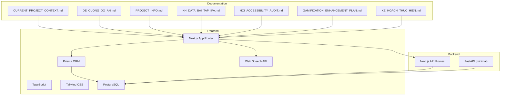
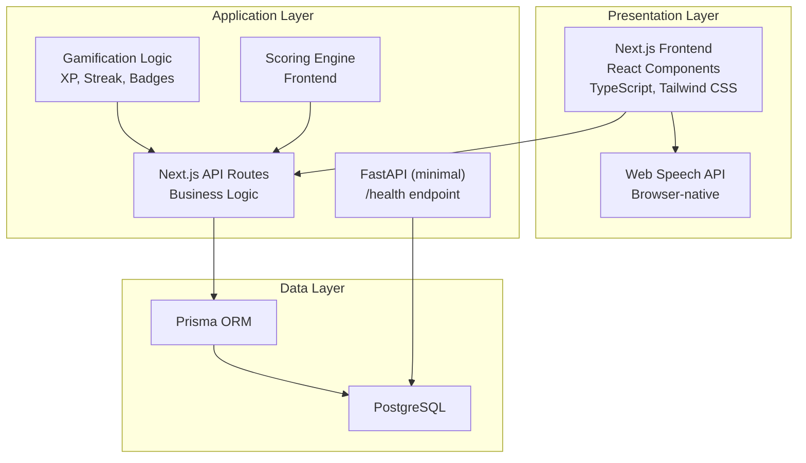
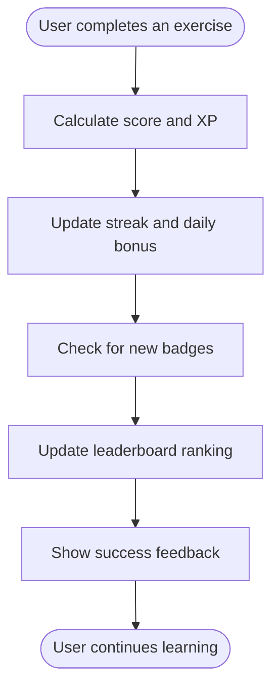
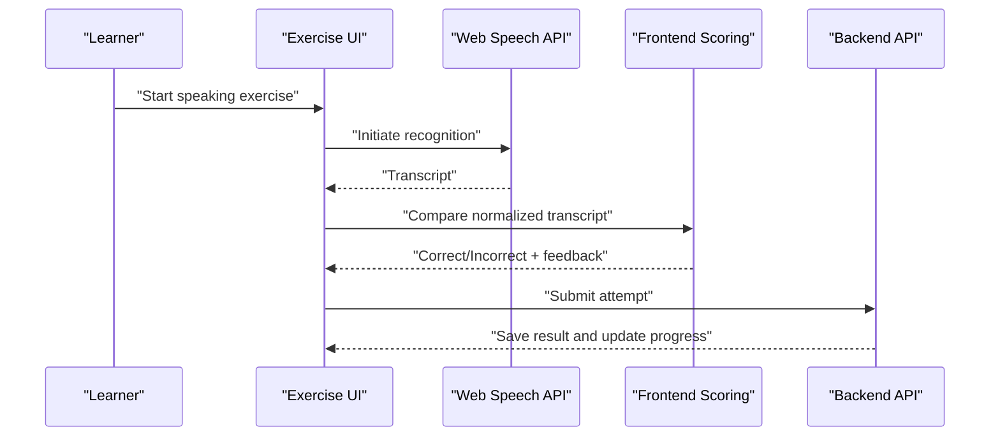
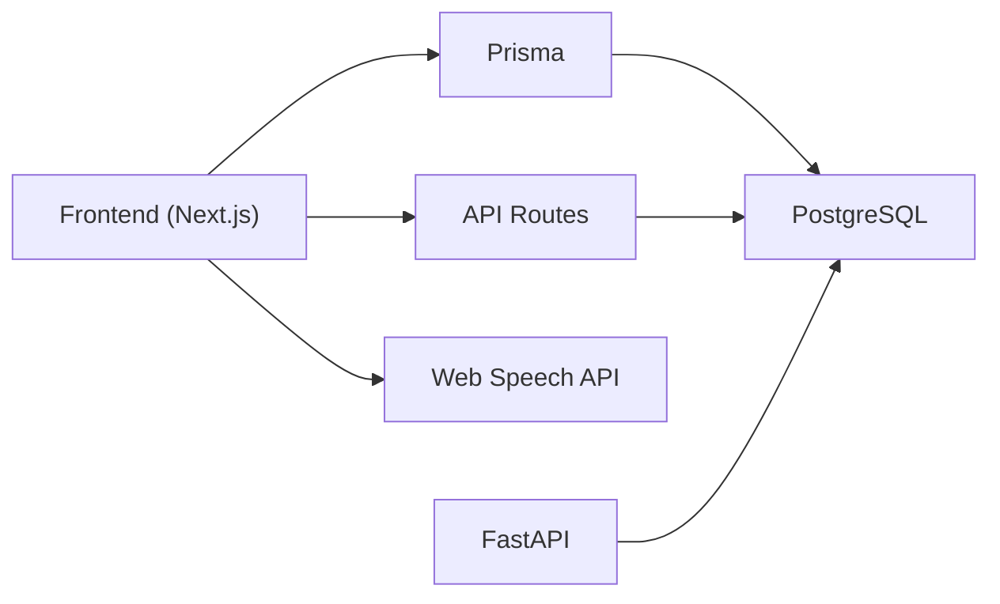

# Introduction and Purpose

<cite>
**Referenced Files in This Document**
- [CURRENT_PROJECT_CONTEXT.md](file://PLAN/00_Project_Context/CURRENT_PROJECT_CONTEXT.md)
- [DE_CUONG_DO_AN.md](file://PLAN/00_Project_Context/DE_CUONG_DO_AN.md)
- [PROJECT_INFO.md](file://WORD/PROJECT_INFO.md)
- [KH_DATA_BAI_TAP_IPA.md](file://PLAN/02_Database_And_Data/KH_DATA_BAI_TAP_IPA.md)
- [DAILY_CHECKIN_FEATURE.md](file://PLAN/04_Features/DAILY_CHECKIN_FEATURE.md)
- [GAMIFICATION_ENHANCEMENT_PLAN.md](file://WORD/GAMIFICATION_ENHANCEMENT_PLAN.md)
- [HCI_ACCESSIBILITY_AUDIT.md](file://PLAN/03_UI_UX/HCI_ACCESSIBILITY_AUDIT.md)
- [KE_HOACH_THUC_HIEN.md](file://PLAN/01_Roadmap/KE_HOACH_THUC_HIEN.md)
- [frontend README.md](file://english_pronunciation_app/frontend/README.md)
</cite>

## Table of Contents
1. [Introduction](#introduction)
2. [Project Structure](#project-structure)
3. [Core Components](#core-components)
4. [Architecture Overview](#architecture-overview)
5. [Detailed Component Analysis](#detailed-component-analysis)
6. [Dependency Analysis](#dependency-analysis)
7. [Performance Considerations](#performance-considerations)
8. [Troubleshooting Guide](#troubleshooting-guide)
9. [Conclusion](#conclusion)
10. [Appendices](#appendices)

## Introduction
Web_HoTroPhatAmEN (English Pronunciation Support Web) is a Vietnamese-developed, web-based application designed to help Vietnamese learners achieve English pronunciation mastery grounded in the International Phonetic Alphabet (IPA). The project’s mission is to bridge the gap between learners’ current abilities and proficiency in English pronunciation by combining evidence-based phonetics instruction with an engaging, gamified learning experience.

The application targets Vietnamese speakers who face common pronunciation challenges when learning English, such as distinguishing minimal pairs, mastering vowel length contrasts, producing fricative sounds accurately, and developing connected speech skills. It offers structured pathways through four major categories of English sounds—vowels, consonants, minimal pairs, and stress/linking—supported by interactive exercises, immediate feedback, and a robust gamification system that encourages consistent practice and long-term retention.

Educational philosophy
- Evidence-based phonetics: Content is grounded in authoritative sources and validated by pedagogical frameworks.
- Progressive skill building: Exercises move from receptive identification to productive speaking, with increasing complexity.
- Immediate, actionable feedback: Learners receive real-time cues to improve accuracy and confidence.
- Motivation through play: Gamification elements reinforce habit formation and sustained engagement.

Target demographic
- Vietnamese learners of English at various levels, from beginner to intermediate.
- Learners seeking structured, IPA-aligned practice to address specific pronunciation difficulties.
- Users who benefit from gamified experiences that combine learning with fun and achievement.

Expected learning outcomes
- Improved accuracy in identifying and producing English phonemes and minimal pairs.
- Enhanced listening comprehension and production of connected speech.
- Increased confidence and fluency through repeated, guided practice.
- Stronger retention and motivation via gamified progress tracking and rewards.

Vision
Web_HoTroPhatAmEN aims to become a leading pronunciation learning platform that blends rigorous phonetic instruction with modern, accessible technology. The platform will continue evolving to incorporate advanced features such as social learning, adaptive difficulty, and immersive storytelling to further enhance motivation and effectiveness.

Cultural and linguistic background
- The curriculum emphasizes Vietnamese learners’ common pronunciation pitfalls, including /θ/ vs /s/, /l/ vs /r/, vowel length contrasts, and final consonant reduction.
- Content design reflects the Vietnamese language’s phonological characteristics to anticipate and address learner misconceptions proactively.
- Accessibility and inclusivity are embedded in the interface design, with ongoing improvements to meet WCAG guidelines and ensure equitable access.

## Project Structure
The project is organized into layered documentation and code repositories that reflect both strategic planning and implementation. The frontend is a Next.js application with TypeScript and Tailwind CSS, while the backend currently provides minimal endpoints for health checks and future expansion. The database is PostgreSQL managed via Prisma.

**Diagram sources**
- [CURRENT_PROJECT_CONTEXT.md:16-40](file://PLAN/00_Project_Context/CURRENT_PROJECT_CONTEXT.md#L16-L40)
- [DE_CUONG_DO_AN.md:33-104](file://PLAN/00_Project_Context/DE_CUONG_DO_AN.md#L33-L104)
- [PROJECT_INFO.md:48-87](file://WORD/PROJECT_INFO.md#L48-L87)

**Section sources**
- [CURRENT_PROJECT_CONTEXT.md:16-40](file://PLAN/00_Project_Context/CURRENT_PROJECT_CONTEXT.md#L16-L40)
- [DE_CUONG_DO_AN.md:33-104](file://PLAN/00_Project_Context/DE_CUONG_DO_AN.md#L33-L104)
- [PROJECT_INFO.md:48-87](file://WORD/PROJECT_INFO.md#L48-L87)

## Core Components
- Interactive IPA chart: A responsive grid of 44 English phonemes with grouped categories, enabling targeted practice and exploration.
- Four exercise modes: Listen-and-choose, speak-word, speak-minimal-pair, and speak-sentence, progressing from receptive identification to productive speaking.
- Gamification system: XP, streaks, badges, leaderboards, and daily check-in to encourage consistent practice and celebrate milestones.
- Speech recognition integration: Web Speech API for real-time pronunciation assessment during speaking exercises.
- Data-driven content: Structured lesson catalogs, question banks, and minimal pairs curated from authoritative sources and validated by pedagogy.

**Section sources**
- [PROJECT_INFO.md:152-172](file://WORD/PROJECT_INFO.md#L152-L172)
- [PROJECT_INFO.md:175-188](file://WORD/PROJECT_INFO.md#L175-L188)
- [PROJECT_INFO.md:191-233](file://WORD/PROJECT_INFO.md#L191-L233)
- [KH_DATA_BAI_TAP_IPA.md:56-74](file://PLAN/02_Database_And_Data/KH_DATA_BAI_TAP_IPA.md#L56-L74)
- [KE_HOACH_THUC_HIEN.md:7-52](file://PLAN/01_Roadmap/KE_HOACH_THUC_HIEN.md#L7-L52)

## Architecture Overview
The system follows a layered architecture with clear separation between presentation, application, and data layers. The frontend handles UI rendering, speech recognition, and gamification logic, while the backend provides lightweight API endpoints and the database persists user progress and content metadata.

**Diagram sources**
- [CURRENT_PROJECT_CONTEXT.md:33-39](file://PLAN/00_Project_Context/CURRENT_PROJECT_CONTEXT.md#L33-L39)
- [PROJECT_INFO.md:263-288](file://WORD/PROJECT_INFO.md#L263-L288)
- [DE_CUONG_DO_AN.md:33-42](file://PLAN/00_Project_Context/DE_CUONG_DO_AN.md#L33-L42)

**Section sources**
- [CURRENT_PROJECT_CONTEXT.md:33-39](file://PLAN/00_Project_Context/CURRENT_PROJECT_CONTEXT.md#L33-L39)
- [PROJECT_INFO.md:263-288](file://WORD/PROJECT_INFO.md#L263-L288)
- [DE_CUONG_DO_AN.md:33-42](file://PLAN/00_Project_Context/DE_CUONG_DO_AN.md#L33-L42)

## Detailed Component Analysis

### Problem Statement: Common Pronunciation Challenges for Vietnamese Learners
Vietnamese learners commonly struggle with:
- Distinctive fricatives and affricates (/θ/, /ð/, /f/, /v/, /s/, /z/, /ʃ/, /ʒ/)
- Vowel length contrasts (/iː/ vs /ɪ/, /uː/ vs /ʊ/)
- Initial and final consonant reduction
- Minimal pairs that differ by a single phoneme
- Connected speech features such as linking, assimilation, and weak forms

These challenges are addressed systematically through carefully sequenced lessons and targeted minimal pairs exercises.

**Section sources**
- [KH_DATA_BAI_TAP_IPA.md:158-186](file://WORD/Chuong1_TongQuan/01_MucTieuNghienCuu_DATA.md#L158-L186)
- [KH_DATA_BAI_TAP_IPA.md:15-28](file://PLAN/02_Database_And_Data/KH_DATA_BAI_TAP_IPA.md#L15-L28)

### Educational Philosophy and Pedagogical Approach
- IPA-centered instruction: All content is grounded in IPA transcriptions, ensuring precision and consistency.
- Progressive skill building: Exercises move from listening identification to speaking production, with increasing complexity.
- Minimal pairs methodology: Focus on contrasting sounds that Vietnamese learners often confuse.
- Immediate feedback loops: Real-time correctness indicators and corrective guidance promote rapid improvement.
- Evidence-based content: Sources include CMU Pronouncing Dictionary, Free Dictionary API, and established phonetics textbooks.

**Section sources**
- [KH_DATA_BAI_TAP_IPA.md:14-28](file://PLAN/02_Database_And_Data/KH_DATA_BAI_TAP_IPA.md#L14-L28)
- [KH_DATA_BAI_TAP_IPA.md:56-74](file://PLAN/02_Database_And_Data/KH_DATA_BAI_TAP_IPA.md#L56-L74)
- [frontend README.md:15-21](file://english_pronunciation_app/frontend/README.md#L15-L21)

### Gamification and Motivation
The gamification system is designed to sustain long-term engagement and build positive learning habits:
- XP and leveling: Reflects competence and progress.
- Streaks: Encourage daily participation and consistency.
- Badges: Recognize milestones and achievements.
- Leaderboards: Foster healthy competition and community.
- Daily check-in: Reinforces routine and provides small rewards.

Future enhancements aim to deepen motivation through randomized rewards, social features, and narrative-driven progression.

**Diagram sources**
- [DAILY_CHECKIN_FEATURE.md:108-137](file://PLAN/04_Features/DAILY_CHECKIN_FEATURE.md#L108-L137)
- [GAMIFICATION_ENHANCEMENT_PLAN.md:10-23](file://WORD/GAMIFICATION_ENHANCEMENT_PLAN.md#L10-L23)

**Section sources**
- [DAILY_CHECKIN_FEATURE.md:13-25](file://PLAN/04_Features/DAILY_CHECKIN_FEATURE.md#L13-L25)
- [DAILY_CHECKIN_FEATURE.md:81-106](file://PLAN/04_Features/DAILY_CHECKIN_FEATURE.md#L81-L106)
- [GAMIFICATION_ENHANCEMENT_PLAN.md:10-23](file://WORD/GAMIFICATION_ENHANCEMENT_PLAN.md#L10-L23)

### Speech Recognition and Assessment
The application integrates browser-native speech recognition for speaking exercises:
- Uses Web Speech API for speech-to-text conversion.
- Normalizes transcripts to compare against answers.
- Provides immediate feedback with correctness indicators and corrective guidance.
- Ensures compatibility with Chrome and Edge browsers, with fallback messaging for unsupported environments.

**Diagram sources**
- [KE_HOACH_THUC_HIEN.md:7-52](file://PLAN/01_Roadmap/KE_HOACH_THUC_HIEN.md#L7-L52)

**Section sources**
- [KE_HOACH_THUC_HIEN.md:7-52](file://PLAN/01_Roadmap/KE_HOACH_THUC_HIEN.md#L7-L52)

### Accessibility and Inclusive Design
Accessibility is a core principle of the application’s design:
- WCAG 2.1 AA compliance is actively tracked and improved.
- Keyboard navigation, ARIA labels, and focus management are prioritized.
- Color contrast meets standards, and decorative elements are marked appropriately.
- Ongoing audits identify areas for improvement, such as skip links, semantic HTML, and mobile navigation.

**Section sources**
- [HCI_ACCESSIBILITY_AUDIT.md:10-19](file://PLAN/03_UI_UX/HCI_ACCESSIBILITY_AUDIT.md#L10-L19)
- [HCI_ACCESSIBILITY_AUDIT.md:65-125](file://PLAN/03_UI_UX/HCI_ACCESSIBILITY_AUDIT.md#L65-L125)
- [HCI_ACCESSIBILITY_AUDIT.md:277-295](file://PLAN/03_UI_UX/HCI_ACCESSIBILITY_AUDIT.md#L277-L295)

## Dependency Analysis
The system’s dependencies are intentionally scoped to ensure maintainability and scalability:
- Frontend: Next.js, React, TypeScript, Tailwind CSS, Prisma, and Web Speech API.
- Backend: Next.js API Routes and a minimal FastAPI service for future expansion.
- Database: PostgreSQL with Prisma ORM for schema management and migrations.
- Data sources: IPA dictionaries, Free Dictionary API, and manually curated minimal pairs.

**Diagram sources**
- [CURRENT_PROJECT_CONTEXT.md:16-31](file://PLAN/00_Project_Context/CURRENT_PROJECT_CONTEXT.md#L16-L31)
- [DE_CUONG_DO_AN.md:92-104](file://PLAN/00_Project_Context/DE_CUONG_DO_AN.md#L92-L104)

**Section sources**
- [CURRENT_PROJECT_CONTEXT.md:16-31](file://PLAN/00_Project_Context/CURRENT_PROJECT_CONTEXT.md#L16-L31)
- [DE_CUONG_DO_AN.md:92-104](file://PLAN/00_Project_Context/DE_CUONG_DO_AN.md#L92-L104)

## Performance Considerations
- Client-side scoring and gamification reduce server load and latency.
- Local audio caching minimizes network dependencies and improves reliability.
- Modular component architecture enables efficient updates and testing.
- Continuous integration through quality gates ensures stability before release.

[No sources needed since this section provides general guidance]

## Troubleshooting Guide
Common issues and resolutions:
- Speech recognition not available: Ensure the browser supports Web Speech API (Chrome/Edge). Provide fallback messaging for unsupported environments.
- Audio playback problems: Verify local audio files were seeded correctly and are accessible in the public directory.
- Gamification inconsistencies: Confirm XP calculations, streak updates, and badge checks are functioning as expected; review logs and test coverage.
- Accessibility concerns: Address missing ARIA labels, keyboard navigation gaps, and semantic HTML issues identified in audits.

**Section sources**
- [KE_HOACH_THUC_HIEN.md:25-27](file://PLAN/01_Roadmap/KE_HOACH_THUC_HIEN.md#L25-L27)
- [frontend README.md:23-26](file://english_pronunciation_app/frontend/README.md#L23-L26)
- [HCI_ACCESSIBILITY_AUDIT.md:297-322](file://PLAN/03_UI_UX/HCI_ACCESSIBILITY_AUDIT.md#L297-L322)

## Conclusion
Web_HoTroPhatAmEN is a purpose-driven platform that combines rigorous phonetic instruction with engaging, gamified learning to help Vietnamese learners master English pronunciation. By addressing specific pronunciation challenges, leveraging evidence-based pedagogy, and embedding accessibility and motivation, the project lays a strong foundation for becoming a leading pronunciation learning platform. As the system evolves, continued enhancements in social features, adaptive difficulty, and immersive storytelling will further strengthen its impact and reach.

[No sources needed since this section summarizes without analyzing specific files]

## Appendices
- Data sources and licensing: IPA dictionaries, Free Dictionary API, and manual minimal pairs content.
- Roadmap highlights: Current progress and upcoming enhancements in content, UI/UX, and gamification.

**Section sources**
- [frontend README.md:15-33](file://english_pronunciation_app/frontend/README.md#L15-L33)
- [CURRENT_PROJECT_CONTEXT.md:90-121](file://PLAN/00_Project_Context/CURRENT_PROJECT_CONTEXT.md#L90-L121)