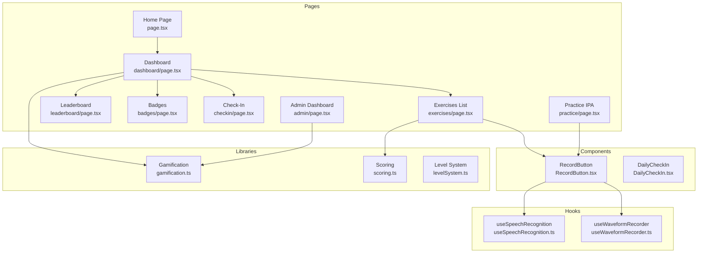
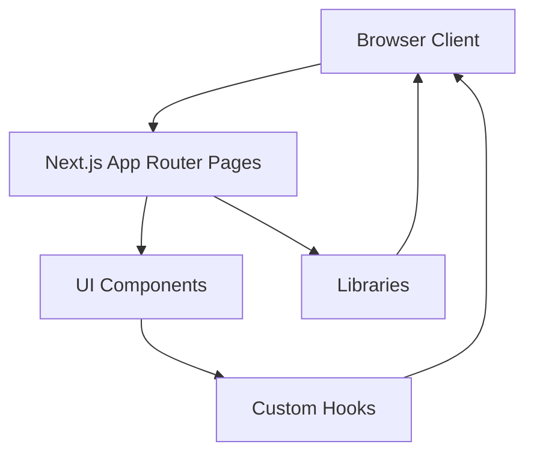
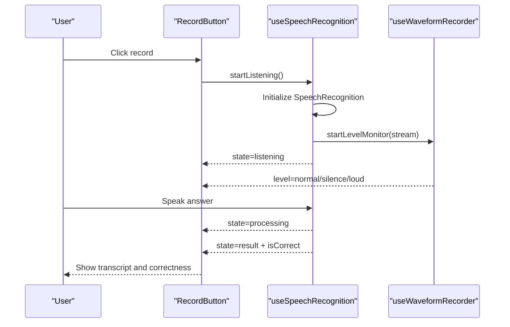
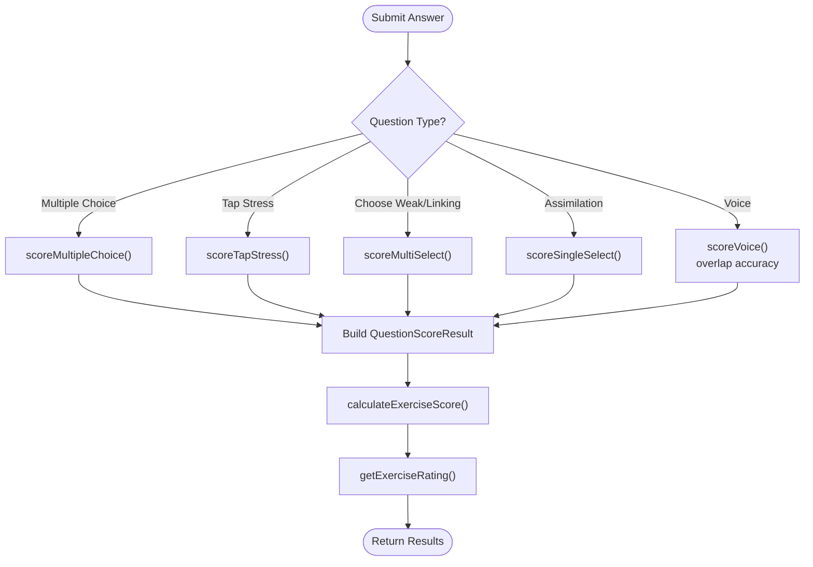
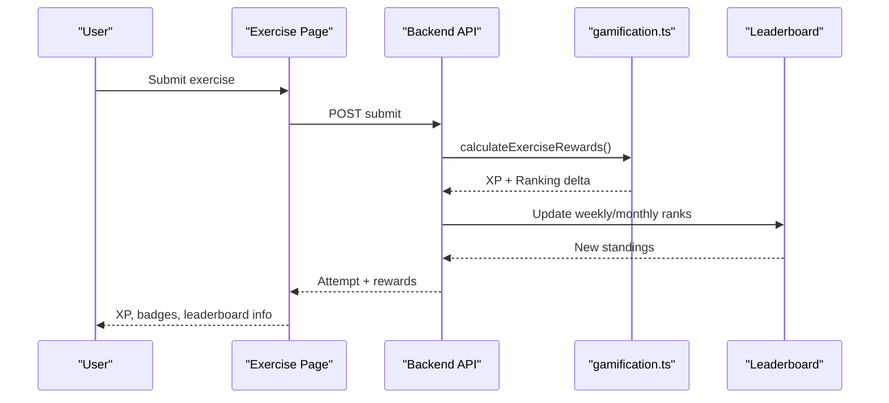
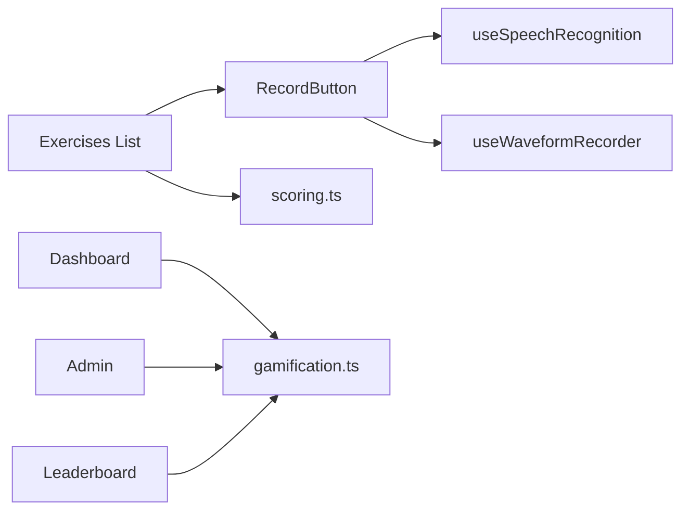

# Key Features and Capabilities

<cite>
**Referenced Files in This Document**
- [page.tsx](file://english_pronunciation_app/frontend/src/app/page.tsx)
- [dashboard/page.tsx](file://english_pronunciation_app/frontend/src/app/dashboard/page.tsx)
- [exercises/page.tsx](file://english_pronunciation_app/frontend/src/app/exercises/page.tsx)
- [admin/page.tsx](file://english_pronunciation_app/frontend/src/app/admin/page.tsx)
- [leaderboard/page.tsx](file://english_pronunciation_app/frontend/src/app/leaderboard/page.tsx)
- [badges/page.tsx](file://english_pronunciation_app/frontend/src/app/badges/page.tsx)
- [checkin/page.tsx](file://english_pronunciation_app/frontend/src/app/checkin/page.tsx)
- [practice/page.tsx](file://english_pronunciation_app/frontend/src/app/practice/page.tsx)
- [RecordButton.tsx](file://english_pronunciation_app/frontend/src/components/audio/RecordButton.tsx)
- [useSpeechRecognition.ts](file://english_pronunciation_app/frontend/src/hooks/useSpeechRecognition.ts)
- [useWaveformRecorder.ts](file://english_pronunciation_app/frontend/src/hooks/useWaveformRecorder.ts)
- [gamification.ts](file://english_pronunciation_app/frontend/src/lib/gamification.ts)
- [scoring.ts](file://english_pronunciation_app/frontend/src/lib/scoring.ts)
- [levelSystem.ts](file://english_pronunciation_app/frontend/src/lib/levelSystem.ts)
- [DailyCheckIn.tsx](file://english_pronunciation_app/frontend/src/components/gamification/DailyCheckIn.tsx)
</cite>

## Table of Contents
1. [Introduction](#introduction)
2. [Project Structure](#project-structure)
3. [Core Components](#core-components)
4. [Architecture Overview](#architecture-overview)
5. [Detailed Component Analysis](#detailed-component-analysis)
6. [Dependency Analysis](#dependency-analysis)
7. [Performance Considerations](#performance-considerations)
8. [Troubleshooting Guide](#troubleshooting-guide)
9. [Conclusion](#conclusion)

## Introduction
Web_HoTroPhatAmEN is a pronunciation training platform focused on mastering 44 English phonemes (IPA). It combines AI-powered speech recognition and scoring, interactive exercises, gamification (XP, streaks, badges, leaderboard), and a structured learning map. Users can practice minimal pairs, connected speech, stress tapping, weak forms, linking, and assimilation. Administrators can manage content and analyze user engagement.

## Project Structure
The frontend is a Next.js application with:
- App router pages under src/app for public/home, dashboard, exercises, leaderboard, badges, check-in, and practice.
- Shared components under src/components for audio recording, gamification widgets, and UI primitives.
- Hooks under src/hooks for speech recognition and waveform visualization.
- Libraries under src/lib for gamification mechanics, scoring, and leveling.

**Diagram sources**
- [page.tsx:1-141](file://english_pronunciation_app/frontend/src/app/page.tsx#L1-L141)
- [dashboard/page.tsx:1-297](file://english_pronunciation_app/frontend/src/app/dashboard/page.tsx#L1-L297)
- [exercises/page.tsx:1-138](file://english_pronunciation_app/frontend/src/app/exercises/page.tsx#L1-L138)
- [leaderboard/page.tsx:1-224](file://english_pronunciation_app/frontend/src/app/leaderboard/page.tsx#L1-L224)
- [badges/page.tsx:1-253](file://english_pronunciation_app/frontend/src/app/badges/page.tsx#L1-L253)
- [checkin/page.tsx:1-146](file://english_pronunciation_app/frontend/src/app/checkin/page.tsx#L1-L146)
- [practice/page.tsx:1-32](file://english_pronunciation_app/frontend/src/app/practice/page.tsx#L1-L32)
- [admin/page.tsx:1-249](file://english_pronunciation_app/frontend/src/app/admin/page.tsx#L1-L249)
- [RecordButton.tsx:1-130](file://english_pronunciation_app/frontend/src/components/audio/RecordButton.tsx#L1-L130)
- [useSpeechRecognition.ts:1-111](file://english_pronunciation_app/frontend/src/hooks/useSpeechRecognition.ts#L1-L111)
- [useWaveformRecorder.ts:1-140](file://english_pronunciation_app/frontend/src/hooks/useWaveformRecorder.ts#L1-L140)
- [gamification.ts:1-575](file://english_pronunciation_app/frontend/src/lib/gamification.ts#L1-L575)
- [scoring.ts:1-227](file://english_pronunciation_app/frontend/src/lib/scoring.ts#L1-L227)
- [levelSystem.ts:1-133](file://english_pronunciation_app/frontend/src/lib/levelSystem.ts#L1-L133)
- [DailyCheckIn.tsx:1-234](file://english_pronunciation_app/frontend/src/components/gamification/DailyCheckIn.tsx#L1-L234)

**Section sources**
- [page.tsx:1-141](file://english_pronunciation_app/frontend/src/app/page.tsx#L1-L141)
- [dashboard/page.tsx:1-297](file://english_pronunciation_app/frontend/src/app/dashboard/page.tsx#L1-L297)
- [exercises/page.tsx:1-138](file://english_pronunciation_app/frontend/src/app/exercises/page.tsx#L1-L138)
- [leaderboard/page.tsx:1-224](file://english_pronunciation_app/frontend/src/app/leaderboard/page.tsx#L1-L224)
- [badges/page.tsx:1-253](file://english_pronunciation_app/frontend/src/app/badges/page.tsx#L1-L253)
- [checkin/page.tsx:1-146](file://english_pronunciation_app/frontend/src/app/checkin/page.tsx#L1-L146)
- [practice/page.tsx:1-32](file://english_pronunciation_app/frontend/src/app/practice/page.tsx#L1-L32)
- [admin/page.tsx:1-249](file://english_pronunciation_app/frontend/src/app/admin/page.tsx#L1-L249)

## Core Components
- Interactive Speech Recognition and Feedback
  - Real-time microphone visualization and audio level monitoring.
  - Browser SpeechRecognition API for spoken answers with normalization and matching.
  - Immediate correctness feedback and optional transcript display.

- Comprehensive Exercise System
  - Multiple question types: multiple choice, minimal pairs, sentence/word speaking, tap stress, choose weak forms, linking, and assimilation.
  - AI-powered scoring for voice answers using word overlap accuracy thresholds.
  - Exercise summary and rating after submission.

- Gamification Elements
  - XP system with base XP, daily bonuses, and retake XP.
  - Streak tracking with freeze mechanics and periodic badge rewards.
  - Achievement badges across categories (progress, skill, streak, improvement, ranking).
  - Leaderboard with weekly and monthly periods and ranking deltas.

- IPA Mastery and Practice
  - IPA chart for 44 phonemes with audio playback.
  - Minimal pairs and connected speech exercises to refine phonetic contrasts.

- Personalized Learning Paths
  - Learning map with topic, level, and prerequisite requirements.
  - Progress tracking and level display based on completed lessons.

- Administrative Dashboard
  - Content management and analytics: user counts, exercise metrics, audio files, and recent attempts.
  - Reports on top exercises and average scores.

**Section sources**
- [RecordButton.tsx:1-130](file://english_pronunciation_app/frontend/src/components/audio/RecordButton.tsx#L1-L130)
- [useSpeechRecognition.ts:1-111](file://english_pronunciation_app/frontend/src/hooks/useSpeechRecognition.ts#L1-L111)
- [useWaveformRecorder.ts:1-140](file://english_pronunciation_app/frontend/src/hooks/useWaveformRecorder.ts#L1-L140)
- [scoring.ts:1-227](file://english_pronunciation_app/frontend/src/lib/scoring.ts#L1-L227)
- [gamification.ts:1-575](file://english_pronunciation_app/frontend/src/lib/gamification.ts#L1-L575)
- [levelSystem.ts:1-133](file://english_pronunciation_app/frontend/src/lib/levelSystem.ts#L1-L133)
- [practice/page.tsx:1-32](file://english_pronunciation_app/frontend/src/app/practice/page.tsx#L1-L32)
- [exercises/page.tsx:1-138](file://english_pronunciation_app/frontend/src/app/exercises/page.tsx#L1-L138)
- [admin/page.tsx:1-249](file://english_pronunciation_app/frontend/src/app/admin/page.tsx#L1-L249)

## Architecture Overview
The system integrates client-side speech capture and visualization with server-backed gamification and analytics. Pages orchestrate user workflows, while libraries encapsulate scoring and progression logic.

**Diagram sources**
- [page.tsx:1-141](file://english_pronunciation_app/frontend/src/app/page.tsx#L1-L141)
- [RecordButton.tsx:1-130](file://english_pronunciation_app/frontend/src/components/audio/RecordButton.tsx#L1-L130)
- [useSpeechRecognition.ts:1-111](file://english_pronunciation_app/frontend/src/hooks/useSpeechRecognition.ts#L1-L111)
- [useWaveformRecorder.ts:1-140](file://english_pronunciation_app/frontend/src/hooks/useWaveformRecorder.ts#L1-L140)
- [scoring.ts:1-227](file://english_pronunciation_app/frontend/src/lib/scoring.ts#L1-L227)
- [gamification.ts:1-575](file://english_pronunciation_app/frontend/src/lib/gamification.ts#L1-L575)

## Detailed Component Analysis

### AI-Powered Pronunciation Assessment
- Speech Recognition Hook
  - Initializes browser SpeechRecognition, sets language, and handles results.
  - Normalizes transcripts and compares against expected answers with partial match support.
  - Manages state transitions: idle, listening, processing, result.

- Waveform Recorder Hook
  - Integrates WaveSurfer with Record plugin for scrolling waveform rendering.
  - Computes RMS amplitude to dynamically color the waveform and infer loudness/silence/normal levels.
  - Provides lifecycle controls: start, stop, reset, and clearing buffers to avoid stale visuals.

- Record Button Component
  - Orchestrates recording lifecycle and presents immediate feedback.
  - Announces state changes for accessibility and displays correctness outcome.

**Diagram sources**
- [RecordButton.tsx:1-130](file://english_pronunciation_app/frontend/src/components/audio/RecordButton.tsx#L1-L130)
- [useSpeechRecognition.ts:1-111](file://english_pronunciation_app/frontend/src/hooks/useSpeechRecognition.ts#L1-L111)
- [useWaveformRecorder.ts:1-140](file://english_pronunciation_app/frontend/src/hooks/useWaveformRecorder.ts#L1-L140)

**Section sources**
- [useSpeechRecognition.ts:1-111](file://english_pronunciation_app/frontend/src/hooks/useSpeechRecognition.ts#L1-L111)
- [useWaveformRecorder.ts:1-140](file://english_pronunciation_app/frontend/src/hooks/useWaveformRecorder.ts#L1-L140)
- [RecordButton.tsx:1-130](file://english_pronunciation_app/frontend/src/components/audio/RecordButton.tsx#L1-L130)

### Interactive Speech Recognition
- Real-time feedback loop:
  - Microphone access and waveform rendering.
  - RMS-based loudness indication to guide pronunciation volume.
  - Accessibility announcements for screen readers.

- Browser compatibility:
  - Uses vendor-prefixed SpeechRecognition APIs and provides user-friendly error messages when unsupported.

**Section sources**
- [RecordButton.tsx:1-130](file://english_pronunciation_app/frontend/src/components/audio/RecordButton.tsx#L1-L130)
- [useSpeechRecognition.ts:1-111](file://english_pronunciation_app/frontend/src/hooks/useSpeechRecognition.ts#L1-L111)
- [useWaveformRecorder.ts:1-140](file://english_pronunciation_app/frontend/src/hooks/useWaveformRecorder.ts#L1-L140)

### Comprehensive Exercise System
- Question Types
  - Multiple choice, minimal pairs, sentence/word speaking, tap stress, choose weak forms, linking, and assimilation.
  - Voice scoring computes word overlap accuracy and applies thresholds for correctness.

- Submission and Scoring
  - scoreQuestion dispatches to specialized scorers per type.
  - calculateExerciseScore aggregates per-question results into an overall percentage and rating.

**Diagram sources**
- [scoring.ts:1-227](file://english_pronunciation_app/frontend/src/lib/scoring.ts#L1-L227)

**Section sources**
- [scoring.ts:1-227](file://english_pronunciation_app/frontend/src/lib/scoring.ts#L1-L227)

### Gamification: XP, Streaks, Badges, Leaderboard
- XP and Rewards
  - Base XP equals raw score; retake XP and daily bonuses apply based on completion and streak thresholds.
  - Ranking delta computed from first attempt, improvement, and retake gains.

- Streak Mechanics
  - Daily check-in increases streak or resets depending on gaps; optional freeze prevents streak loss.
  - Periodic badges unlock milestones (3, 7, 14 days).

- Badges
  - Progress, skill, streak, improvement, and ranking categories with targets and units.
  - Automatic badge checks using user statistics and leaderboard position.

- Leaderboard
  - Weekly and monthly periods with ranking resets.
  - Per-user current rank and score display.

**Diagram sources**
- [gamification.ts:1-575](file://english_pronunciation_app/frontend/src/lib/gamification.ts#L1-L575)
- [leaderboard/page.tsx:1-224](file://english_pronunciation_app/frontend/src/app/leaderboard/page.tsx#L1-L224)

**Section sources**
- [gamification.ts:1-575](file://english_pronunciation_app/frontend/src/lib/gamification.ts#L1-L575)
- [DailyCheckIn.tsx:1-234](file://english_pronunciation_app/frontend/src/components/gamification/DailyCheckIn.tsx#L1-L234)
- [leaderboard/page.tsx:1-224](file://english_pronunciation_app/frontend/src/app/leaderboard/page.tsx#L1-L224)
- [badges/page.tsx:1-253](file://english_pronunciation_app/frontend/src/app/badges/page.tsx#L1-L253)
- [checkin/page.tsx:1-146](file://english_pronunciation_app/frontend/src/app/checkin/page.tsx#L1-L146)

### IPA Symbol Mastery and Practice
- IPA Practice Page
  - Presents a chart of 44 phonemes with interactive playback.
  - Supports minimal pairs and connected speech drills to refine contrasts.

- Learning Map
  - Exercises grouped by topic and level, with prerequisites and counts.
  - Helps users navigate structured pathways.

**Section sources**
- [practice/page.tsx:1-32](file://english_pronunciation_app/frontend/src/app/practice/page.tsx#L1-L32)
- [exercises/page.tsx:1-138](file://english_pronunciation_app/frontend/src/app/exercises/page.tsx#L1-L138)

### Personalized Learning Paths
- Level System
  - Levels derived from completed lessons with titles and icons.
  - Progress bars and color coding for motivation.

- Dashboard
  - Shows streak, level, completed exercises, XP progress, recent attempts, and quick links to leaderboard and badges.

**Section sources**
- [levelSystem.ts:1-133](file://english_pronunciation_app/frontend/src/lib/levelSystem.ts#L1-L133)
- [dashboard/page.tsx:1-297](file://english_pronunciation_app/frontend/src/app/dashboard/page.tsx#L1-L297)

### Administrative Dashboard
- Analytics Overview
  - Totals for users, exercises, audio files, and completed attempts.
  - Recent activity and top-performing exercises.

- Management Tools
  - Lists users, exercises, topics, levels, maps, and audio assets.
  - Filters and summaries for content curation.

**Section sources**
- [admin/page.tsx:1-249](file://english_pronunciation_app/frontend/src/app/admin/page.tsx#L1-L249)

## Dependency Analysis
- Coupling
  - Pages depend on components and libraries for UI and logic.
  - Hooks encapsulate browser APIs to minimize cross-page duplication.
  - Libraries centralize scoring and gamification rules.

- Cohesion
  - Scoring and gamification modules are cohesive around their domains.
  - Speech recognition and waveform hooks share common concerns around media streams and analyzers.

- External Dependencies
  - Browser SpeechRecognition API for voice input.
  - Wavesurfer.js and Record plugin for waveform visualization.
  - Next.js App Router for routing and SSR/SSG.

**Diagram sources**
- [exercises/page.tsx:1-138](file://english_pronunciation_app/frontend/src/app/exercises/page.tsx#L1-L138)
- [RecordButton.tsx:1-130](file://english_pronunciation_app/frontend/src/components/audio/RecordButton.tsx#L1-L130)
- [useSpeechRecognition.ts:1-111](file://english_pronunciation_app/frontend/src/hooks/useSpeechRecognition.ts#L1-L111)
- [useWaveformRecorder.ts:1-140](file://english_pronunciation_app/frontend/src/hooks/useWaveformRecorder.ts#L1-L140)
- [scoring.ts:1-227](file://english_pronunciation_app/frontend/src/lib/scoring.ts#L1-L227)
- [gamification.ts:1-575](file://english_pronunciation_app/frontend/src/lib/gamification.ts#L1-L575)
- [dashboard/page.tsx:1-297](file://english_pronunciation_app/frontend/src/app/dashboard/page.tsx#L1-L297)
- [admin/page.tsx:1-249](file://english_pronunciation_app/frontend/src/app/admin/page.tsx#L1-L249)
- [leaderboard/page.tsx:1-224](file://english_pronunciation_app/frontend/src/app/leaderboard/page.tsx#L1-L224)

**Section sources**
- [exercises/page.tsx:1-138](file://english_pronunciation_app/frontend/src/app/exercises/page.tsx#L1-L138)
- [RecordButton.tsx:1-130](file://english_pronunciation_app/frontend/src/components/audio/RecordButton.tsx#L1-L130)
- [useSpeechRecognition.ts:1-111](file://english_pronunciation_app/frontend/src/hooks/useSpeechRecognition.ts#L1-L111)
- [useWaveformRecorder.ts:1-140](file://english_pronunciation_app/frontend/src/hooks/useWaveformRecorder.ts#L1-L140)
- [scoring.ts:1-227](file://english_pronunciation_app/frontend/src/lib/scoring.ts#L1-L227)
- [gamification.ts:1-575](file://english_pronunciation_app/frontend/src/lib/gamification.ts#L1-L575)
- [dashboard/page.tsx:1-297](file://english_pronunciation_app/frontend/src/app/dashboard/page.tsx#L1-L297)
- [admin/page.tsx:1-249](file://english_pronunciation_app/frontend/src/app/admin/page.tsx#L1-L249)
- [leaderboard/page.tsx:1-224](file://english_pronunciation_app/frontend/src/app/leaderboard/page.tsx#L1-L224)

## Performance Considerations
- Speech Recognition
  - Normalize text efficiently and avoid excessive re-renders by memoizing callbacks.
  - Stop recognition when not listening to conserve resources.

- Waveform Rendering
  - Cancel animation frames and close audio contexts on unmount.
  - Clear plugin buffers to prevent stale waveform artifacts.

- Scoring
  - Keep tokenization and overlap calculations linear in input size.
  - Batch leaderboard updates server-side to reduce client polling.

- UI Responsiveness
  - Debounce leaderboard and badge fetches.
  - Lazy-load heavy components only when needed.

## Troubleshooting Guide
- Speech Recognition Not Supported
  - Symptom: Error message indicating lack of browser support.
  - Resolution: Use supported browsers (Chrome/Edge) or instruct users to enable permissions.

- Microphone Access Denied
  - Symptom: Cannot start recording; warnings in console.
  - Resolution: Ensure HTTPS origin and grant microphone permission; handle exceptions gracefully.

- No Feedback After Recording
  - Symptom: Button stuck in processing or result state without output.
  - Resolution: Verify SpeechRecognition events fire; check normalization logic and thresholds.

- Streak Reset Unexpectedly
  - Symptom: Streak drops despite intended freeze.
  - Resolution: Confirm freeze availability and logic for consecutive-day gaps.

- Leaderboard Data Missing
  - Symptom: Empty leaderboard or connection errors.
  - Resolution: Validate API endpoint and network connectivity; confirm periodic resets.

**Section sources**
- [useSpeechRecognition.ts:1-111](file://english_pronunciation_app/frontend/src/hooks/useSpeechRecognition.ts#L1-L111)
- [useWaveformRecorder.ts:1-140](file://english_pronunciation_app/frontend/src/hooks/useWaveformRecorder.ts#L1-L140)
- [RecordButton.tsx:1-130](file://english_pronunciation_app/frontend/src/components/audio/RecordButton.tsx#L1-L130)
- [gamification.ts:1-575](file://english_pronunciation_app/frontend/src/lib/gamification.ts#L1-L575)
- [leaderboard/page.tsx:1-224](file://english_pronunciation_app/frontend/src/app/leaderboard/page.tsx#L1-L224)

## Conclusion
Web_HoTroPhatAmEN delivers a comprehensive pronunciation learning experience by combining real-time speech recognition with structured exercises, robust gamification, and insightful analytics. Its modular architecture enables maintainability and scalability, while the IPA-focused curriculum supports targeted mastery of English phonemes. Administrators benefit from powerful dashboards to monitor engagement and curate content effectively.