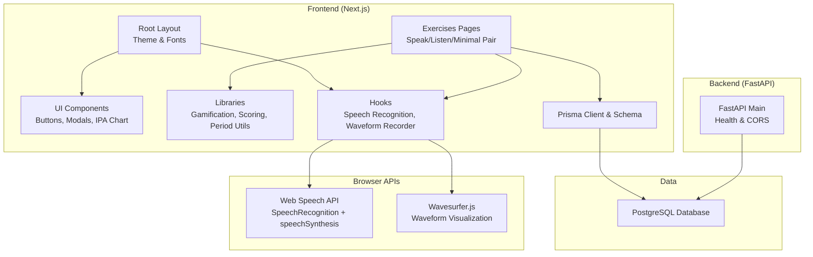
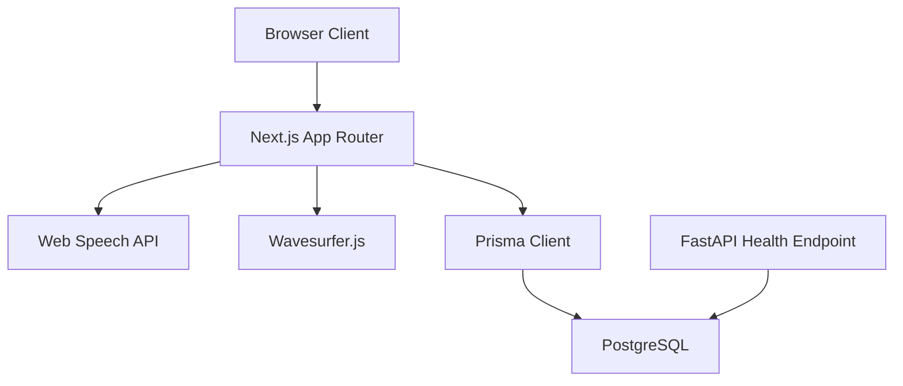
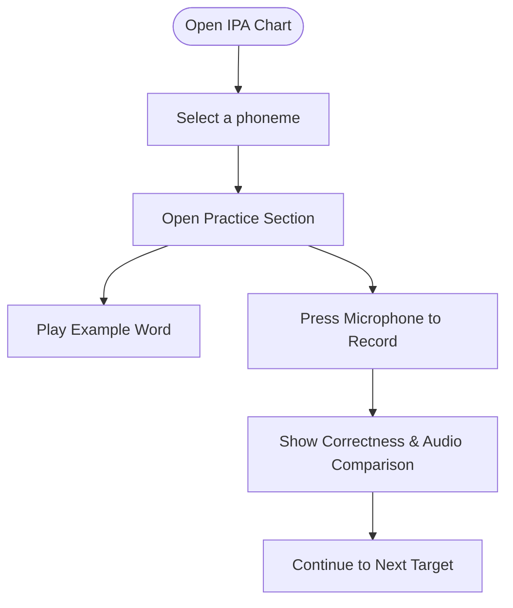
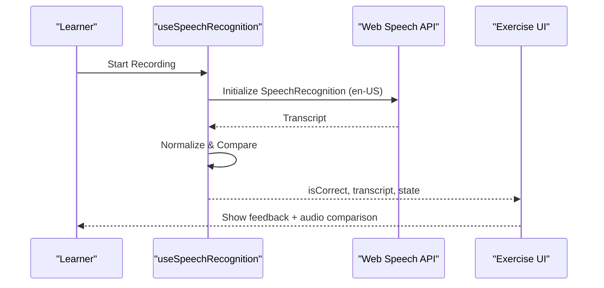
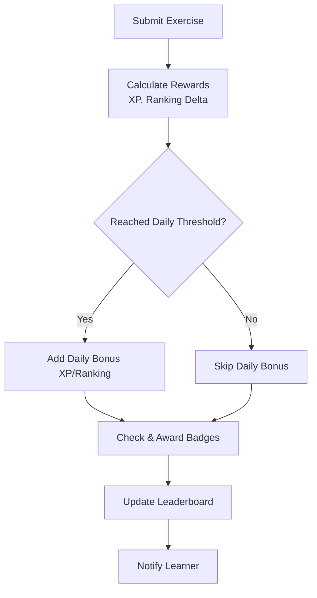
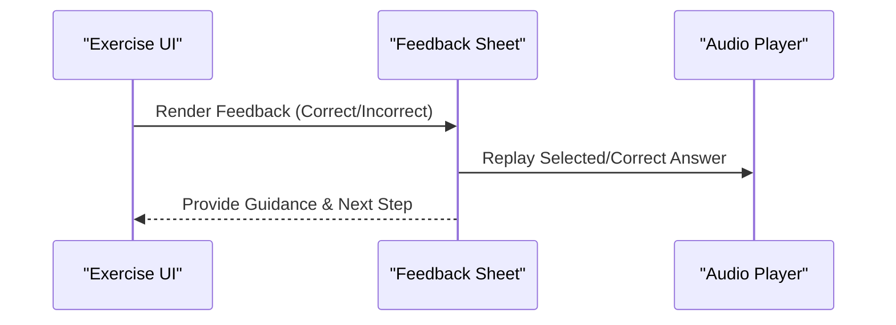
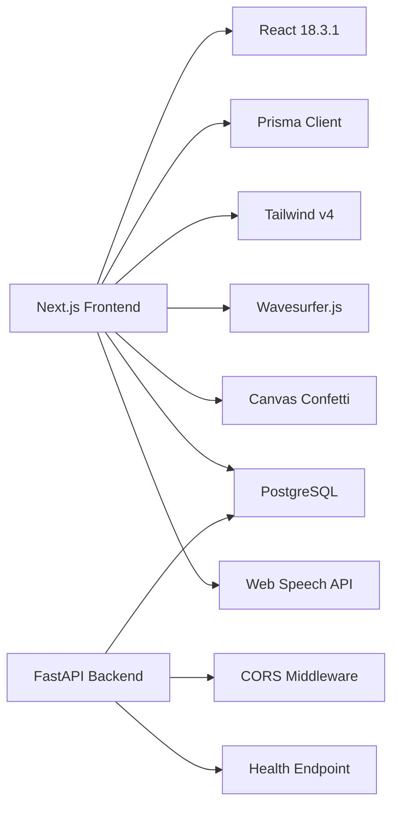

# Project Overview

<cite>
**Referenced Files in This Document**
- [CURRENT_PROJECT_CONTEXT.md](file://PLAN/00_Project_Context/CURRENT_PROJECT_CONTEXT.md)
- [KE_HOACH_THUC_HIEN.md](file://PLAN/01_Roadmap/KE_HOACH_THUC_HIEN.md)
- [layout.tsx](file://english_pronunciation_app/frontend/src/app/layout.tsx)
- [main.py](file://english_pronunciation_app/backend/app/main.py)
- [package.json](file://english_pronunciation_app/frontend/package.json)
- [HCI_ACCESSIBILITY_AUDIT.md](file://PLAN/03_UI_UX/HCI_ACCESSIBILITY_AUDIT.md)
- [BADGE_SYSTEM_PLAN.md](file://PLAN/04_Features/BADGE_SYSTEM_PLAN.md)
- [IPAChart.tsx](file://english_pronunciation_app/frontend/src/components/ipa/IPAChart.tsx)
- [useSpeechRecognition.ts](file://english_pronunciation_app/frontend/src/hooks/useSpeechRecognition.ts)
- [gamification.ts](file://english_pronunciation_app/frontend/src/lib/gamification.ts)
- [DATA_SEED_PLAN.md](file://PLAN/02_Database_And_Data/DATA_SEED_PLAN.md)
- [SpeakWordQuestion.tsx](file://english_pronunciation_app/frontend/src/app/exercises/[id]/SpeakWordQuestion.tsx)
- [ListenFeedbackSheet.tsx](file://english_pronunciation_app/frontend/src/app/exercises/[id]/ListenFeedbackSheet.tsx)
</cite>

## Table of Contents
1. [Introduction](#introduction)
2. [Project Structure](#project-structure)
3. [Core Components](#core-components)
4. [Architecture Overview](#architecture-overview)
5. [Detailed Component Analysis](#detailed-component-analysis)
6. [Dependency Analysis](#dependency-analysis)
7. [Performance Considerations](#performance-considerations)
8. [Troubleshooting Guide](#troubleshooting-guide)
9. [Conclusion](#conclusion)

## Introduction
PhatAmEN is a Vietnamese-focused English pronunciation learning application designed to help learners master English sounds through interactive, AI-powered assessment and gamified practice. Its core mission is to bridge the gap between Vietnamese speakers and English phonology using:
- IPA-centric lessons grounded in evidence-based pedagogy
- Instant, browser-native speech recognition feedback via Web Speech API
- A mobile-first UI optimized for accessibility and ease-of-use
- A robust gamification system that encourages consistent practice and improvement

Key value propositions:
- Practical phonological training aligned to real-world English usage
- Immediate, actionable feedback during speaking tasks
- Personalized progression with streaks, XP, and badges
- Accessible design with WCAG-compliant components and mobile-first responsiveness

Target audience:
- Vietnamese-speaking English learners at beginner to intermediate levels
- Self-directed learners seeking structured, focused pronunciation practice
- Educators and institutions interested in supplementary digital tools

## Project Structure
The project follows a modern full-stack architecture with a Next.js frontend, a minimal FastAPI backend, a PostgreSQL database, and Web Speech API integration for speech recognition. The frontend is organized around:
- App Router pages and API routes
- Reusable UI components and hooks
- Libraries for gamification, scoring, and accessibility
- Prisma-based data seeding and schema management

**Diagram sources**
- [layout.tsx:1-51](file://english_pronunciation_app/frontend/src/app/layout.tsx#L1-L51)
- [main.py:1-43](file://english_pronunciation_app/backend/app/main.py#L1-L43)
- [package.json:1-45](file://english_pronunciation_app/frontend/package.json#L1-L45)

**Section sources**
- [CURRENT_PROJECT_CONTEXT.md:16-43](file://PLAN/00_Project_Context/CURRENT_PROJECT_CONTEXT.md#L16-L43)
- [KE_HOACH_THUC_HIEN.md:100-114](file://PLAN/01_Roadmap/KE_HOACH_THUC_HIEN.md#L100-L114)
- [layout.tsx:1-51](file://english_pronunciation_app/frontend/src/app/layout.tsx#L1-L51)
- [main.py:1-43](file://english_pronunciation_app/backend/app/main.py#L1-L43)
- [package.json:1-45](file://english_pronunciation_app/frontend/package.json#L1-L45)

## Core Components
- IPA-focused learning interface with an interactive chart for vowels and consonants, enabling targeted practice and immediate feedback.
- Web Speech API integration for speech recognition during speaking exercises, with normalized matching and contextual hints.
- Gamification system that tracks XP, streaks, badges, and leaderboards, rewarding consistent practice and improvement.
- Mobile-first UI with accessibility features and responsive design, validated against WCAG guidelines.
- Data seeding strategy for question banks, minimal pairs, words, and sentences, ensuring reproducible demos and scalable content creation.

Practical examples:
- IPA practice: Select a phoneme from the chart to open a dedicated practice area with example words, playback, and a microphone button for self-assessment.
- Speaking assessment: Record your pronunciation of a word or sentence; receive instant correctness feedback and audio comparison.
- Gamification: Earn XP and badges for completing exercises, maintaining streaks, and achieving high scores; view weekly and monthly leaderboards.

**Section sources**
- [IPAChart.tsx:1-111](file://english_pronunciation_app/frontend/src/components/ipa/IPAChart.tsx#L1-L111)
- [useSpeechRecognition.ts:1-111](file://english_pronunciation_app/frontend/src/hooks/useSpeechRecognition.ts#L1-L111)
- [gamification.ts:1-575](file://english_pronunciation_app/frontend/src/lib/gamification.ts#L1-L575)
- [HCI_ACCESSIBILITY_AUDIT.md:1-388](file://PLAN/03_UI_UX/HCI_ACCESSIBILITY_AUDIT.md#L1-L388)
- [DATA_SEED_PLAN.md:1-418](file://PLAN/02_Database_And_Data/DATA_SEED_PLAN.md#L1-L418)

## Architecture Overview
The system separates concerns across layers:
- Frontend (Next.js): Handles UI, speech recognition, waveform visualization, gamification logic, and API interactions with the database via Prisma.
- Backend (FastAPI): Provides lightweight health checks and CORS support; database connectivity is verified at runtime.
- Database (PostgreSQL): Stores user profiles, exercise attempts, leaderboards, badges, and content assets.
- Browser APIs: Web Speech API powers speech recognition; Wavesurfer.js renders audio waveforms.

**Diagram sources**
- [CURRENT_PROJECT_CONTEXT.md:28-39](file://PLAN/00_Project_Context/CURRENT_PROJECT_CONTEXT.md#L28-L39)
- [main.py:1-43](file://english_pronunciation_app/backend/app/main.py#L1-L43)
- [package.json:17-26](file://english_pronunciation_app/frontend/package.json#L17-L26)

**Section sources**
- [CURRENT_PROJECT_CONTEXT.md:28-39](file://PLAN/00_Project_Context/CURRENT_PROJECT_CONTEXT.md#L28-L39)
- [KE_HOACH_THUC_HIEN.md:7-52](file://PLAN/01_Roadmap/KE_HOACH_THUC_HIEN.md#L7-L52)
- [main.py:1-43](file://english_pronunciation_app/backend/app/main.py#L1-L43)
- [package.json:17-26](file://english_pronunciation_app/frontend/package.json#L17-L26)

## Detailed Component Analysis

### IPA Practice Interface
The IPA chart organizes phonemes by category, allowing learners to select a phoneme and immediately jump into a focused practice area. The component integrates:
- Click-to-play functionality for example words
- A record button for self-assessment
- Clear visual feedback and accessible labeling

**Diagram sources**
- [IPAChart.tsx:1-111](file://english_pronunciation_app/frontend/src/components/ipa/IPAChart.tsx#L1-L111)

**Section sources**
- [IPAChart.tsx:1-111](file://english_pronunciation_app/frontend/src/components/ipa/IPAChart.tsx#L1-L111)

### Speech Recognition and Feedback
The speech recognition hook encapsulates browser compatibility, normalization logic, and state transitions for recording, processing, and result presentation. It supports:
- Browser detection and fallback messaging
- Continuous and interim result toggles
- Error handling for unsupported browsers and blocked microphones
- Normalized matching for answers

**Diagram sources**
- [useSpeechRecognition.ts:1-111](file://english_pronunciation_app/frontend/src/hooks/useSpeechRecognition.ts#L1-L111)
- [SpeakWordQuestion.tsx:1-222](file://english_pronunciation_app/frontend/src/app/exercises/[id]/SpeakWordQuestion.tsx#L1-L222)

**Section sources**
- [useSpeechRecognition.ts:1-111](file://english_pronunciation_app/frontend/src/hooks/useSpeechRecognition.ts#L1-L111)
- [SpeakWordQuestion.tsx:1-222](file://english_pronunciation_app/frontend/src/app/exercises/[id]/SpeakWordQuestion.tsx#L1-L222)

### Gamification System
The gamification library defines XP calculations, daily bonuses, streak handling, badge conditions, and leaderboard targets. It also includes shop mechanics and streak freeze logic for resilience. Features include:
- XP scaling derived from scores
- Daily bonus thresholds for extra XP and ranking boost
- Retake rewards for improvement attempts
- Comprehensive badge definitions across progress, skill, streak, improvement, and ranking categories
- Weekly and monthly leaderboard periods

**Diagram sources**
- [gamification.ts:195-234](file://english_pronunciation_app/frontend/src/lib/gamification.ts#L195-L234)
- [gamification.ts:490-531](file://english_pronunciation_app/frontend/src/lib/gamification.ts#L490-L531)

**Section sources**
- [BADGE_SYSTEM_PLAN.md:1-156](file://PLAN/04_Features/BADGE_SYSTEM_PLAN.md#L1-L156)
- [gamification.ts:1-575](file://english_pronunciation_app/frontend/src/lib/gamification.ts#L1-L575)

### Exercise Feedback Sheets
Two feedback sheets enhance the learning experience:
- Listening feedback sheet highlights correct/incorrect selections, contrasts chosen and correct answers with audio comparisons, and offers hints.
- Speaking feedback sheet displays correctness, transcript, and audio replay, guiding learners to improve pronunciation.

**Diagram sources**
- [ListenFeedbackSheet.tsx:1-151](file://english_pronunciation_app/frontend/src/app/exercises/[id]/ListenFeedbackSheet.tsx#L1-L151)
- [SpeakWordQuestion.tsx:208-222](file://english_pronunciation_app/frontend/src/app/exercises/[id]/SpeakWordQuestion.tsx#L208-L222)

**Section sources**
- [ListenFeedbackSheet.tsx:1-151](file://english_pronunciation_app/frontend/src/app/exercises/[id]/ListenFeedbackSheet.tsx#L1-L151)
- [SpeakWordQuestion.tsx:208-222](file://english_pronunciation_app/frontend/src/app/exercises/[id]/SpeakWordQuestion.tsx#L208-L222)

### Educational Methodology and Content Strategy
The project employs a structured, IPA-driven syllabus with:
- Sound-group-based lessons (e.g., minimal pairs) to target contrastive phonology
- Mixed-mode exercises: listening-choose, speaking-word, speaking-minimal-pair, and speaking-sentence
- Controlled randomization of questions to maintain fairness and comparability in assessments
- Local audio fallbacks and curated sources to ensure reliability and compliance

Practical examples:
- Minimal pairs for /i:/ vs /ɪ/ to train vowel distinction
- Sentence-level production to integrate phonological accuracy into connected speech

**Section sources**
- [DATA_SEED_PLAN.md:1-418](file://PLAN/02_Database_And_Data/DATA_SEED_PLAN.md#L1-L418)
- [CURRENT_PROJECT_CONTEXT.md:78-89](file://PLAN/00_Project_Context/CURRENT_PROJECT_CONTEXT.md#L78-L89)

### Accessibility and Mobile-First Design
Accessibility features include:
- WCAG-compliant components with proper ARIA roles, labels, and keyboard navigation
- Focus management, skip links, and semantic HTML improvements
- Mobile-first responsive layouts and touch-friendly controls

Current status and recommendations:
- Ongoing improvements to address critical and serious accessibility gaps
- Prioritized fixes for navigation, semantics, and ARIA attributes

**Section sources**
- [HCI_ACCESSIBILITY_AUDIT.md:1-388](file://PLAN/03_UI_UX/HCI_ACCESSIBILITY_AUDIT.md#L1-L388)
- [layout.tsx:1-51](file://english_pronunciation_app/frontend/src/app/layout.tsx#L1-L51)

## Dependency Analysis
Technology stack and integration points:
- Frontend: Next.js 16.2.7, React 18.3.1, Tailwind v4, Prisma 6.19.3, wavesurfer.js 7.12.7, canvas-confetti
- Backend: FastAPI 0.136.3 with CORS middleware and health endpoint
- Database: PostgreSQL (single database)
- Speech: Web Speech API (SpeechRecognition en-US) for browser-based ASR
- Authentication: next-auth v5 beta (Credentials + Google)

**Diagram sources**
- [package.json:17-40](file://english_pronunciation_app/frontend/package.json#L17-L40)
- [main.py:1-43](file://english_pronunciation_app/backend/app/main.py#L1-L43)
- [CURRENT_PROJECT_CONTEXT.md:16-31](file://PLAN/00_Project_Context/CURRENT_PROJECT_CONTEXT.md#L16-L31)

**Section sources**
- [package.json:1-45](file://english_pronunciation_app/frontend/package.json#L1-L45)
- [main.py:1-43](file://english_pronunciation_app/backend/app/main.py#L1-L43)
- [CURRENT_PROJECT_CONTEXT.md:16-31](file://PLAN/00_Project_Context/CURRENT_PROJECT_CONTEXT.md#L16-L31)

## Performance Considerations
- Keep speech recognition requests short-lived and avoid unnecessary continuous listening to reduce latency and resource usage.
- Preload essential audio assets locally to minimize network dependencies and improve reliability.
- Optimize waveform rendering by initializing containers only when needed and unmounting components cleanly.
- Use controlled randomization for question sets to balance fairness while keeping leaderboard metrics meaningful.

## Troubleshooting Guide
Common issues and resolutions:
- Unsupported browser: The speech recognition hook detects missing support and displays a clear message; instruct users to use Chrome or Edge.
- Microphone permissions blocked: Provide step-by-step guidance to enable microphone access in the browser.
- No speech detected: Prompt learners to speak clearly and loudly, and confirm device functionality.
- Accessibility gaps: Address missing ARIA labels, semantic HTML, and keyboard navigation as outlined in the accessibility audit.

**Section sources**
- [useSpeechRecognition.ts:25-41](file://english_pronunciation_app/frontend/src/hooks/useSpeechRecognition.ts#L25-L41)
- [SpeakWordQuestion.tsx:156-206](file://english_pronunciation_app/frontend/src/app/exercises/[id]/SpeakWordQuestion.tsx#L156-L206)
- [HCI_ACCESSIBILITY_AUDIT.md:65-125](file://PLAN/03_UI_UX/HCI_ACCESSIBILITY_AUDIT.md#L65-L125)

## Conclusion
PhatAmEN delivers a focused, effective, and enjoyable pathway for Vietnamese learners to master English pronunciation. By combining IPA-centered instruction, instant speech feedback, and a motivating gamified experience, it supports consistent practice and measurable progress. The technology stack ensures a reliable, accessible, and scalable foundation for continued growth and feature expansion.