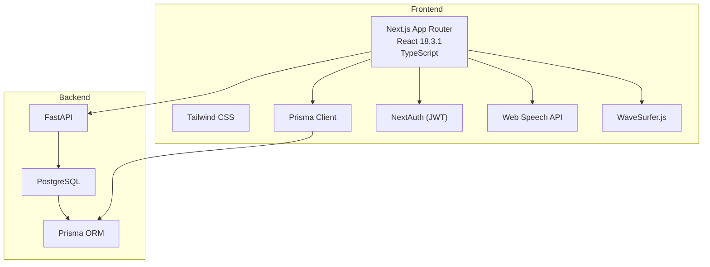
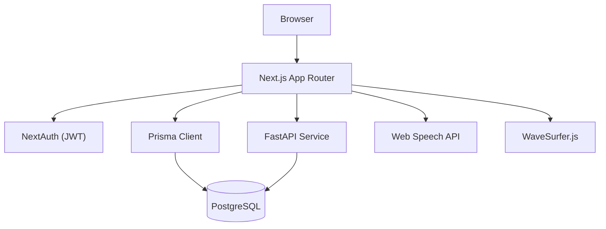
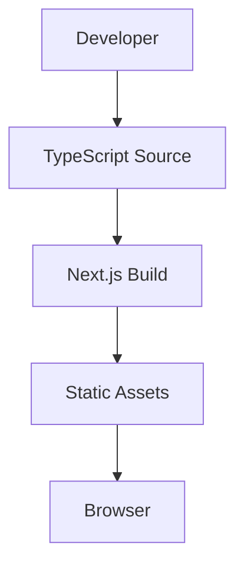
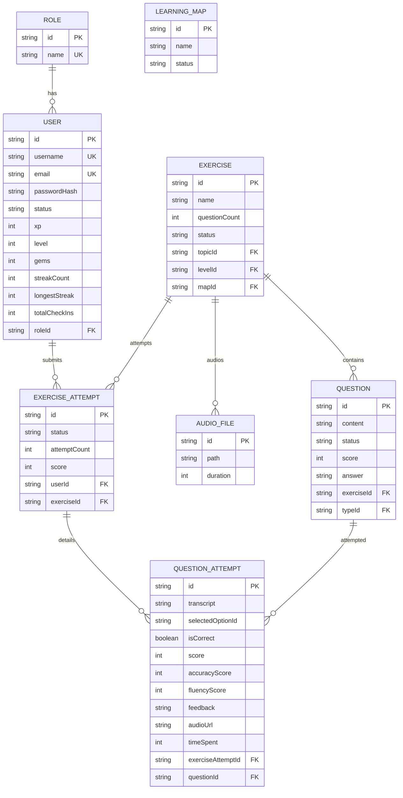
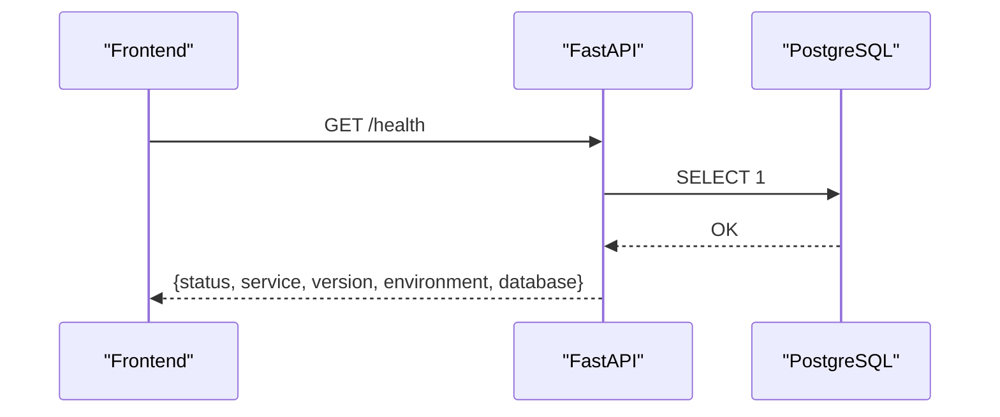
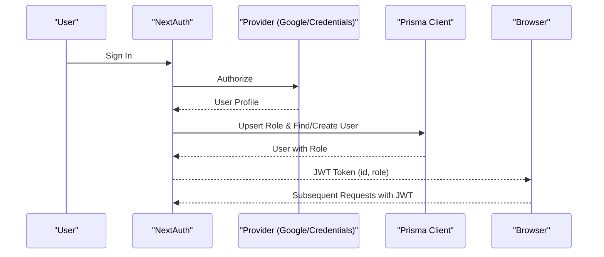
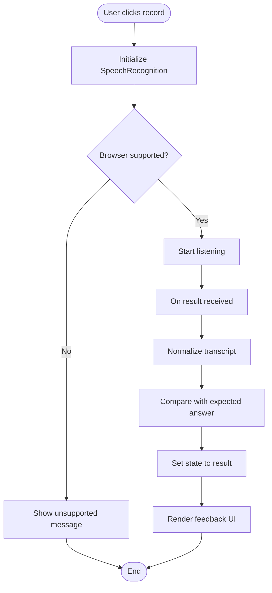
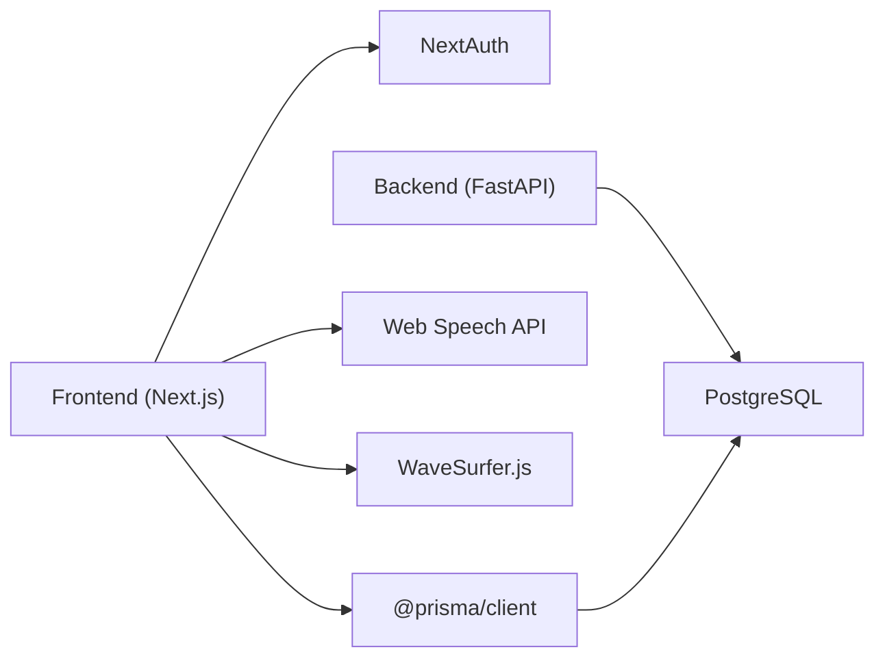

# Technology Stack Overview

<cite>
**Referenced Files in This Document**
- [package.json](file://english_pronunciation_app/frontend/package.json)
- [next.config.mjs](file://english_pronunciation_app/frontend/next.config.mjs)
- [tsconfig.json](file://english_pronunciation_app/frontend/tsconfig.json)
- [postcss.config.mjs](file://english_pronunciation_app/frontend/postcss.config.mjs)
- [schema.prisma](file://english_pronunciation_app/frontend/prisma/schema.prisma)
- [main.py](file://english_pronunciation_app/backend/app/main.py)
- [config.py](file://english_pronunciation_app/backend/app/core/config.py)
- [database.py](file://english_pronunciation_app/backend/app/core/database.py)
- [auth.config.ts](file://english_pronunciation_app/frontend/src/lib/auth.config.ts)
- [auth.ts](file://english_pronunciation_app/frontend/src/lib/auth.ts)
- [useSpeechRecognition.ts](file://english_pronunciation_app/frontend/src/hooks/useSpeechRecognition.ts)
- [RecordButton.tsx](file://english_pronunciation_app/frontend/src/components/audio/RecordButton.tsx)
- [AI_SKILLS_INVENTORY.md](file://PLAN/05_AI_Skills/AI_SKILLS_INVENTORY.md)
- [SKILL_USAGE_BY_PHASE.md](file://PLAN/05_AI_Skills/SKILL_USAGE_BY_PHASE.md)
</cite>

## Table of Contents
1. [Introduction](#introduction)
2. [Project Structure](#project-structure)
3. [Core Components](#core-components)
4. [Architecture Overview](#architecture-overview)
5. [Detailed Component Analysis](#detailed-component-analysis)
6. [Dependency Analysis](#dependency-analysis)
7. [Performance Considerations](#performance-considerations)
8. [Troubleshooting Guide](#troubleshooting-guide)
9. [Conclusion](#conclusion)

## Introduction
This document provides a comprehensive technology stack overview for the Web_HoTroPhatAmEN pronunciation learning application. It covers the frontend (Next.js 16.2.7, TypeScript, Tailwind CSS, React 18.3.1), backend (FastAPI Python), database (PostgreSQL via Prisma ORM), AI/ML components for speech analysis, audio processing (WaveSurfer.js), authentication (NextAuth), and deployment/build tooling. It also outlines the development workflow, testing, and CI considerations, along with rationale for technology choices tailored to an English pronunciation learning platform.

## Project Structure
The project follows a clear separation of concerns:
- Frontend: Next.js App Router-based React application with TypeScript, Tailwind CSS, and Prisma client
- Backend: Minimal FastAPI service for health checks and CORS configuration
- Database: PostgreSQL schema defined via Prisma
- AI/ML and Speech: Web Speech API integration for speech recognition and WaveSurfer.js for waveform visualization
- Authentication: NextAuth with JWT strategy and provider support (Credentials and Google OAuth)
- Planning and AI skills: Agent skill inventory and phase-based skill usage guide

**Diagram sources**
- [package.json:17-26](file://english_pronunciation_app/frontend/package.json#L17-L26)
- [main.py:10-22](file://english_pronunciation_app/backend/app/main.py#L10-L22)
- [schema.prisma:1-8](file://english_pronunciation_app/frontend/prisma/schema.prisma#L1-L8)

**Section sources**
- [package.json:1-45](file://english_pronunciation_app/frontend/package.json#L1-L45)
- [next.config.mjs:1-5](file://english_pronunciation_app/frontend/next.config.mjs#L1-L5)
- [tsconfig.json:1-42](file://english_pronunciation_app/frontend/tsconfig.json#L1-L42)
- [postcss.config.mjs:1-10](file://english_pronunciation_app/frontend/postcss.config.mjs#L1-L10)
- [schema.prisma:1-501](file://english_pronunciation_app/frontend/prisma/schema.prisma#L1-L501)
- [main.py:1-43](file://english_pronunciation_app/backend/app/main.py#L1-L43)

## Core Components
- Frontend framework and build:
  - Next.js 16.2.7 with App Router for routing and SSR/SSG
  - React 18.3.1 for UI components
  - TypeScript 6.x for type safety
  - Tailwind CSS 4.3.0 with PostCSS for styling
- State and persistence:
  - Prisma Client 6.19.3 for database operations
  - PostgreSQL 16+ via Prisma schema
- Speech and audio:
  - Web Speech API for speech recognition
  - WaveSurfer.js 7.12.7 for waveform visualization
- Authentication:
  - NextAuth 5.0.0-beta.31 with JWT session strategy
  - Providers: Credentials and Google OAuth
- Backend:
  - FastAPI minimal service with CORS middleware and health endpoint

**Section sources**
- [package.json:17-39](file://english_pronunciation_app/frontend/package.json#L17-L39)
- [tsconfig.json:24-28](file://english_pronunciation_app/frontend/tsconfig.json#L24-L28)
- [postcss.config.mjs:1-10](file://english_pronunciation_app/frontend/postcss.config.mjs#L1-L10)
- [schema.prisma:1-8](file://english_pronunciation_app/frontend/prisma/schema.prisma#L1-L8)
- [auth.ts:76-151](file://english_pronunciation_app/frontend/src/lib/auth.ts#L76-L151)
- [main.py:10-22](file://english_pronunciation_app/backend/app/main.py#L10-L22)

## Architecture Overview
The system architecture centers around a React-based frontend that communicates with a minimal FastAPI backend. Data persistence is handled by PostgreSQL accessed through Prisma. Speech recognition is performed client-side using the Web Speech API, with optional waveform visualization via WaveSurfer.js. Authentication is managed by NextAuth with JWT tokens stored in the browser.

**Diagram sources**
- [auth.ts:76-151](file://english_pronunciation_app/frontend/src/lib/auth.ts#L76-L151)
- [schema.prisma:1-8](file://english_pronunciation_app/frontend/prisma/schema.prisma#L1-L8)
- [main.py:10-22](file://english_pronunciation_app/backend/app/main.py#L10-L22)
- [useSpeechRecognition.ts:15-111](file://english_pronunciation_app/frontend/src/hooks/useSpeechRecognition.ts#L15-L111)
- [RecordButton.tsx:10-130](file://english_pronunciation_app/frontend/src/components/audio/RecordButton.tsx#L10-L130)

## Detailed Component Analysis

### Frontend Stack: Next.js, React, TypeScript, Tailwind CSS
- Next.js App Router:
  - Uses App Router conventions for pages and API routes
  - Path aliasing configured via tsconfig paths
- React 18.3.1:
  - Client components with hooks for state and effects
- TypeScript 6.x:
  - Strict compiler options, ESNext target, and bundler module resolution
- Tailwind CSS 4.3.0:
  - PostCSS pipeline with Tailwind and autoprefixer
  - Utility-first styling for rapid UI iteration

**Diagram sources**
- [tsconfig.json:19-23](file://english_pronunciation_app/frontend/tsconfig.json#L19-L23)
- [next.config.mjs:1-5](file://english_pronunciation_app/frontend/next.config.mjs#L1-L5)
- [postcss.config.mjs:1-10](file://english_pronunciation_app/frontend/postcss.config.mjs#L1-L10)

**Section sources**
- [next.config.mjs:1-5](file://english_pronunciation_app/frontend/next.config.mjs#L1-L5)
- [tsconfig.json:1-42](file://english_pronunciation_app/frontend/tsconfig.json#L1-L42)
- [postcss.config.mjs:1-10](file://english_pronunciation_app/frontend/postcss.config.mjs#L1-L10)

### Database Layer: PostgreSQL with Prisma ORM
- Prisma schema defines comprehensive domain models for users, roles, gamification, exercises, phonemes, sound groups, word items, minimal pairs, sentences, questions, attempts, and leaderboards
- PostgreSQL provider configured with DATABASE_URL environment variable
- Client generation for type-safe database operations

**Diagram sources**
- [schema.prisma:14-59](file://english_pronunciation_app/frontend/prisma/schema.prisma#L14-L59)
- [schema.prisma:157-195](file://english_pronunciation_app/frontend/prisma/schema.prisma#L157-L195)
- [schema.prisma:210-227](file://english_pronunciation_app/frontend/prisma/schema.prisma#L210-L227)
- [schema.prisma:420-453](file://english_pronunciation_app/frontend/prisma/schema.prisma#L420-L453)

**Section sources**
- [schema.prisma:1-501](file://english_pronunciation_app/frontend/prisma/schema.prisma#L1-L501)

### Backend Architecture: FastAPI Python
- Minimal FastAPI service with CORS enabled for local development origins
- Health endpoint reports service status, version, environment, and database connectivity
- Database utilities provide connection checking and session management

**Diagram sources**
- [main.py:34-42](file://english_pronunciation_app/backend/app/main.py#L34-L42)
- [database.py:31-50](file://english_pronunciation_app/backend/app/core/database.py#L31-L50)

**Section sources**
- [main.py:1-43](file://english_pronunciation_app/backend/app/main.py#L1-L43)
- [config.py:9-34](file://english_pronunciation_app/backend/app/core/config.py#L9-L34)
- [database.py:1-51](file://english_pronunciation_app/backend/app/core/database.py#L1-L51)

### Authentication System: NextAuth with JWT
- NextAuth configuration supports:
  - Credentials provider for email/password login
  - Google OAuth provider (conditional based on environment)
- Session strategy: JWT with custom token/session callbacks
- User normalization and unique username generation for OAuth users
- Role propagation via JWT claims

**Diagram sources**
- [auth.ts:76-151](file://english_pronunciation_app/frontend/src/lib/auth.ts#L76-L151)
- [auth.config.ts:3-24](file://english_pronunciation_app/frontend/src/lib/auth.config.ts#L3-L24)

**Section sources**
- [auth.ts:1-151](file://english_pronunciation_app/frontend/src/lib/auth.ts#L1-L151)
- [auth.config.ts:1-25](file://english_pronunciation_app/frontend/src/lib/auth.config.ts#L1-L25)

### Speech Recognition and Audio Processing
- Web Speech API integration:
  - Hook encapsulates recognition lifecycle and normalization
  - Supports browser-specific SpeechRecognition implementations
- UI component for recording:
  - Animated recording button with state-driven styling
  - Accessible live regions for screen reader announcements
- WaveSurfer.js:
  - Used for waveform visualization in audio exercises
  - Complements speech recognition feedback loops

**Diagram sources**
- [useSpeechRecognition.ts:15-111](file://english_pronunciation_app/frontend/src/hooks/useSpeechRecognition.ts#L15-L111)
- [RecordButton.tsx:10-130](file://english_pronunciation_app/frontend/src/components/audio/RecordButton.tsx#L10-L130)

**Section sources**
- [useSpeechRecognition.ts:1-111](file://english_pronunciation_app/frontend/src/hooks/useSpeechRecognition.ts#L1-L111)
- [RecordButton.tsx:1-130](file://english_pronunciation_app/frontend/src/components/audio/RecordButton.tsx#L1-L130)

### AI/ML and Planning Support
- Agent skill inventory and phase-based skill usage guide:
  - Architect-mode as a prerequisite for all changes
  - Specialized skills for PostgreSQL, Next.js, Web Speech API, gamification, testing, and deployment
  - Structured guidance for pronunciation pedagogy and question bank curation

**Section sources**
- [AI_SKILLS_INVENTORY.md:1-42](file://PLAN/05_AI_Skills/AI_SKILLS_INVENTORY.md#L1-L42)
- [SKILL_USAGE_BY_PHASE.md:1-180](file://PLAN/05_AI_Skills/SKILL_USAGE_BY_PHASE.md#L1-L180)

## Dependency Analysis
- Frontend dependencies:
  - Next.js, React, and React DOM for rendering
  - NextAuth for authentication
  - Prisma Client for database operations
  - WaveSurfer.js for audio visualization
  - Tailwind CSS and PostCSS for styling
- Backend dependencies:
  - FastAPI for minimal API surface
  - SQLAlchemy for database sessions and connection checks
- Internal coupling:
  - Frontend Prisma client connects to backend-managed PostgreSQL
  - NextAuth JWT tokens carry user identity and role to backend APIs

**Diagram sources**
- [package.json:17-39](file://english_pronunciation_app/frontend/package.json#L17-L39)
- [main.py:10-22](file://english_pronunciation_app/backend/app/main.py#L10-L22)
- [schema.prisma:1-8](file://english_pronunciation_app/frontend/prisma/schema.prisma#L1-L8)

**Section sources**
- [package.json:17-39](file://english_pronunciation_app/frontend/package.json#L17-L39)
- [main.py:10-22](file://english_pronunciation_app/backend/app/main.py#L10-L22)

## Performance Considerations
- Frontend:
  - Use Next.js static generation and caching for non-sensitive pages
  - Lazy load heavy components (e.g., WaveSurfer.js) to reduce initial bundle size
  - Minimize re-renders by leveraging React.memo and stable hook references
- Backend:
  - Keep FastAPI minimal; offload heavy computation to external services or scheduled jobs
  - Use database connection pooling and proper indexing as schema grows
- Speech:
  - Limit continuous recognition and interim results to reduce overhead
  - Debounce or throttle feedback UI updates during processing

## Troubleshooting Guide
- Authentication:
  - Verify provider configuration and environment variables for Google OAuth
  - Ensure JWT callbacks populate user ID and role consistently
- Database:
  - Confirm DATABASE_URL is set and reachable
  - Use health endpoint to validate database connectivity
- Speech:
  - Check browser support for SpeechRecognition
  - Validate CORS settings if speech features fail behind proxies
- Build and Styles:
  - Ensure Tailwind and PostCSS configurations are present
  - Resolve TypeScript strict mode errors early in development

**Section sources**
- [auth.ts:76-151](file://english_pronunciation_app/frontend/src/lib/auth.ts#L76-L151)
- [main.py:34-42](file://english_pronunciation_app/backend/app/main.py#L34-L42)
- [useSpeechRecognition.ts:25-41](file://english_pronunciation_app/frontend/src/hooks/useSpeechRecognition.ts#L25-L41)
- [postcss.config.mjs:1-10](file://english_pronunciation_app/frontend/postcss.config.mjs#L1-L10)
- [tsconfig.json:8-18](file://english_pronunciation_app/frontend/tsconfig.json#L8-L18)

## Conclusion
The Web_HoTroPhatAmEN stack combines a modern React frontend (Next.js, TypeScript, Tailwind CSS) with a pragmatic FastAPI backend and a robust PostgreSQL data layer via Prisma. Speech recognition and audio visualization are integrated client-side using Web Speech API and WaveSurfer.js, while NextAuth manages secure, provider-backed authentication with JWT. The agent skill inventory and phase-based planning ensure disciplined development and future extensibility for AI/ML enhancements in pronunciation scoring and feedback.