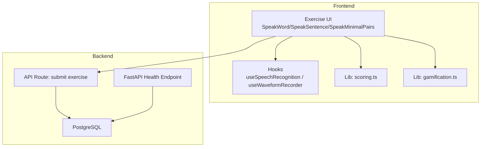
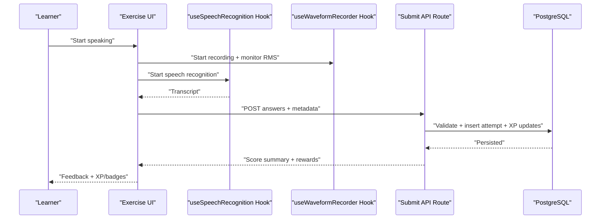
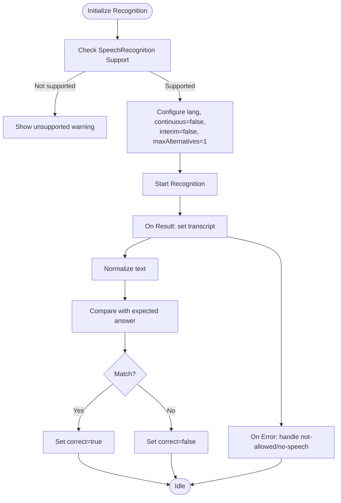
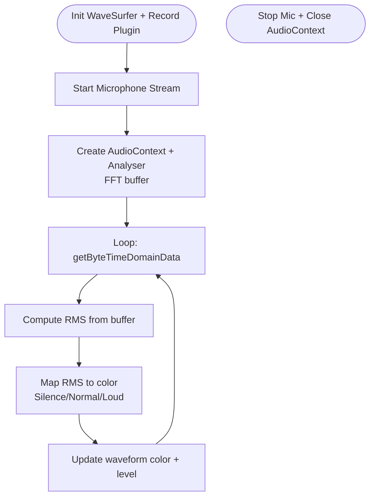
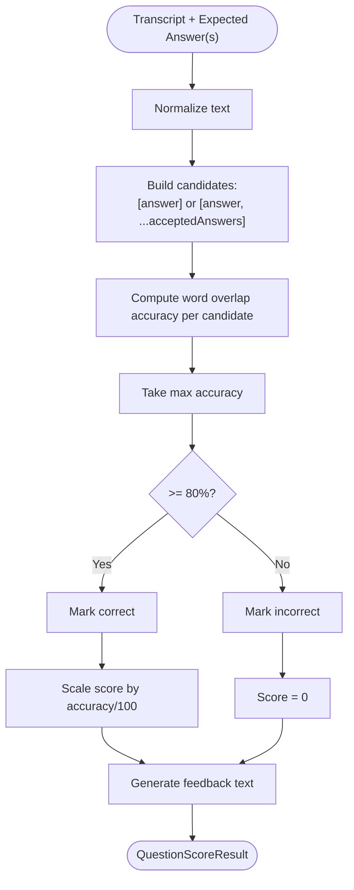
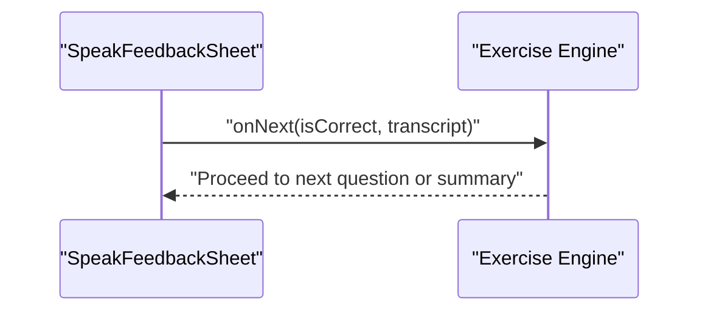
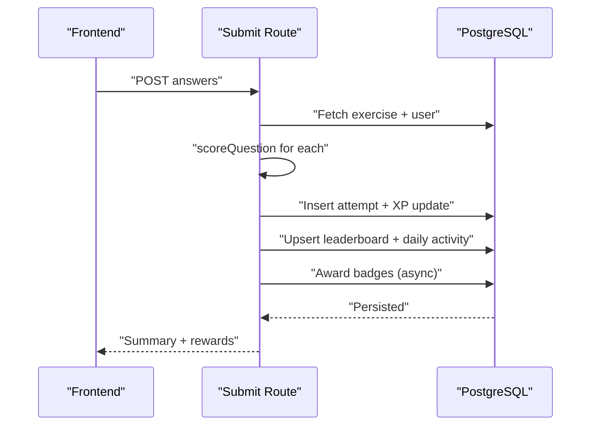
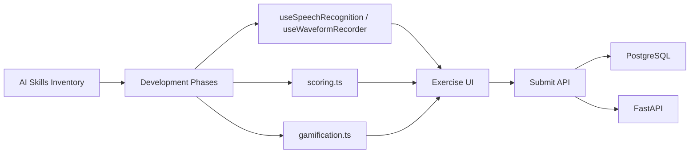

# AI and Machine Learning Research

<cite>
**Referenced Files in This Document**
- [SKILL.md](file://english_pronunciation_app/.agents/skills/web_speech_api_expert/SKILL.md)
- [AI_SKILLS_INVENTORY.md](file://PLAN/05_AI_Skills/AI_SKILLS_INVENTORY.md)
- [SKILL_USAGE_BY_PHASE.md](file://PLAN/05_AI_Skills/SKILL_USAGE_BY_PHASE.md)
- [HANDOFF_FOR_NEXT_AI.md](file://HANDOFF_FOR_NEXT_AI.md)
- [useSpeechRecognition.ts](file://english_pronunciation_app/frontend/src/hooks/useSpeechRecognition.ts)
- [useWaveformRecorder.ts](file://english_pronunciation_app/frontend/src/hooks/useWaveformRecorder.ts)
- [scoring.ts](file://english_pronunciation_app/frontend/src/lib/scoring.ts)
- [gamification.ts](file://english_pronunciation_app/frontend/src/lib/gamification.ts)
- [SpeakWordQuestion.tsx](file://english_pronunciation_app/frontend/src/app/exercises/[id]/SpeakWordQuestion.tsx)
- [SpeakSentenceQuestion.tsx](file://english_pronunciation_app/frontend/src/app/exercises/[id]/SpeakSentenceQuestion.tsx)
- [SpeakMinimalPairsQuestion.tsx](file://english_pronunciation_app/frontend/src/app/exercises/[id]/SpeakMinimalPairsQuestion.tsx)
- [route.ts](file://english_pronunciation_app/frontend/src/app/api/exercises/submit/route.ts)
- [main.py](file://english_pronunciation_app/backend/app/main.py)
- [DE_CUONG_DO_AN.md](file://PLAN/00_Project_Context/DE_CUONG_DO_AN.md)
</cite>

## Table of Contents
1. [Introduction](#introduction)
2. [Project Structure](#project-structure)
3. [Core Components](#core-components)
4. [Architecture Overview](#architecture-overview)
5. [Detailed Component Analysis](#detailed-component-analysis)
6. [Dependency Analysis](#dependency-analysis)
7. [Performance Considerations](#performance-considerations)
8. [Troubleshooting Guide](#troubleshooting-guide)
9. [Conclusion](#conclusion)
10. [Appendices](#appendices)

## Introduction
This document presents the AI and machine learning research foundations of the pronunciation assessment system. It explains how speech recognition, real-time audio processing, and pronunciation evaluation are implemented, along with the gamification and adaptive assessment mechanisms. It also outlines research methodologies for accuracy, confidence scoring, and error detection, and discusses ethical considerations and fairness in pronunciation assessment.

## Project Structure
The system integrates:
- Frontend exercises and UI components for speech tasks
- Real-time audio capture and visualization
- Speech recognition via Web Speech API
- Pronunciation scoring and feedback
- Backend API for submission, scoring, and gamification
- Database-backed analytics and leaderboards

**Diagram sources**
- [SpeakWordQuestion.tsx:57-221](file://english_pronunciation_app/frontend/src/app/exercises/[id]/SpeakWordQuestion.tsx#L57-L221)
- [SpeakSentenceQuestion.tsx:48-224](file://english_pronunciation_app/frontend/src/app/exercises/[id]/SpeakSentenceQuestion.tsx#L48-L224)
- [SpeakMinimalPairsQuestion.tsx:83-257](file://english_pronunciation_app/frontend/src/app/exercises/[id]/SpeakMinimalPairsQuestion.tsx#L83-L257)
- [useSpeechRecognition.ts:15-110](file://english_pronunciation_app/frontend/src/hooks/useSpeechRecognition.ts#L15-L110)
- [useWaveformRecorder.ts:29-139](file://english_pronunciation_app/frontend/src/hooks/useWaveformRecorder.ts#L29-L139)
- [scoring.ts:191-227](file://english_pronunciation_app/frontend/src/lib/scoring.ts#L191-L227)
- [gamification.ts:195-234](file://english_pronunciation_app/frontend/src/lib/gamification.ts#L195-L234)
- [route.ts:47-331](file://english_pronunciation_app/frontend/src/app/api/exercises/submit/route.ts#L47-L331)
- [main.py:10-42](file://english_pronunciation_app/backend/app/main.py#L10-L42)

**Section sources**
- [HANDOFF_FOR_NEXT_AI.md:169-198](file://HANDOFF_FOR_NEXT_AI.md#L169-L198)
- [DE_CUONG_DO_AN.md:57-73](file://PLAN/00_Project_Context/DE_CUONG_DO_AN.md#L57-L73)

## Core Components
- Web Speech API integration for speech-to-text in the browser
- Real-time audio visualization and dynamic feedback via Web Audio and WaveSurfer
- Pronunciation scoring with word overlap accuracy and multi-answer support
- Gamification scoring, XP, streaks, and badges
- Backend API for secure, validated exercise submission and analytics

Key implementation references:
- Web Speech API expert guidance: [SKILL.md:1-14](file://english_pronunciation_app/.agents/skills/web_speech_api_expert/SKILL.md#L1-L14)
- AI skills inventory and usage: [AI_SKILLS_INVENTORY.md:1-42](file://PLAN/05_AI_Skills/AI_SKILLS_INVENTORY.md#L1-L42), [SKILL_USAGE_BY_PHASE.md:1-180](file://PLAN/05_AI_Skills/SKILL_USAGE_BY_PHASE.md#L1-L180)
- Speech recognition hook: [useSpeechRecognition.ts:15-110](file://english_pronunciation_app/frontend/src/hooks/useSpeechRecognition.ts#L15-L110)
- Waveform recorder and dynamic feedback: [useWaveformRecorder.ts:29-139](file://english_pronunciation_app/frontend/src/hooks/useWaveformRecorder.ts#L29-L139)
- Scoring logic: [scoring.ts:191-227](file://english_pronunciation_app/frontend/src/lib/scoring.ts#L191-L227)
- Gamification logic: [gamification.ts:195-234](file://english_pronunciation_app/frontend/src/lib/gamification.ts#L195-L234)
- Submission API: [route.ts:47-331](file://english_pronunciation_app/frontend/src/app/api/exercises/submit/route.ts#L47-L331)
- Backend health endpoint: [main.py:10-42](file://english_pronunciation_app/backend/app/main.py#L10-L42)

**Section sources**
- [SKILL.md:1-14](file://english_pronunciation_app/.agents/skills/web_speech_api_expert/SKILL.md#L1-L14)
- [AI_SKILLS_INVENTORY.md:1-42](file://PLAN/05_AI_Skills/AI_SKILLS_INVENTORY.md#L1-L42)
- [SKILL_USAGE_BY_PHASE.md:1-180](file://PLAN/05_AI_Skills/SKILL_USAGE_BY_PHASE.md#L1-L180)
- [useSpeechRecognition.ts:15-110](file://english_pronunciation_app/frontend/src/hooks/useSpeechRecognition.ts#L15-L110)
- [useWaveformRecorder.ts:29-139](file://english_pronunciation_app/frontend/src/hooks/useWaveformRecorder.ts#L29-L139)
- [scoring.ts:191-227](file://english_pronunciation_app/frontend/src/lib/scoring.ts#L191-L227)
- [gamification.ts:195-234](file://english_pronunciation_app/frontend/src/lib/gamification.ts#L195-L234)
- [route.ts:47-331](file://english_pronunciation_app/frontend/src/app/api/exercises/submit/route.ts#L47-L331)
- [main.py:10-42](file://english_pronunciation_app/backend/app/main.py#L10-L42)

## Architecture Overview
The pronunciation assessment pipeline runs primarily in the browser for privacy and latency, with server-side validation and persistence.

**Diagram sources**
- [SpeakWordQuestion.tsx:88-111](file://english_pronunciation_app/frontend/src/app/exercises/[id]/SpeakWordQuestion.tsx#L88-L111)
- [SpeakSentenceQuestion.tsx:84-104](file://english_pronunciation_app/frontend/src/app/exercises/[id]/SpeakSentenceQuestion.tsx#L84-L104)
- [SpeakMinimalPairsQuestion.tsx:106-148](file://english_pronunciation_app/frontend/src/app/exercises/[id]/SpeakMinimalPairsQuestion.tsx#L106-L148)
- [useSpeechRecognition.ts:50-84](file://english_pronunciation_app/frontend/src/hooks/useSpeechRecognition.ts#L50-L84)
- [useWaveformRecorder.ts:99-123](file://english_pronunciation_app/frontend/src/hooks/useWaveformRecorder.ts#L99-L123)
- [route.ts:182-274](file://english_pronunciation_app/frontend/src/app/api/exercises/submit/route.ts#L182-L274)

## Detailed Component Analysis

### Web Speech API Integration
- Browser-based speech recognition with graceful fallback and permission handling
- Normalization of transcripts prior to comparison
- UI states for listening, processing, and error conditions

**Diagram sources**
- [useSpeechRecognition.ts:25-84](file://english_pronunciation_app/frontend/src/hooks/useSpeechRecognition.ts#L25-L84)
- [SpeakWordQuestion.tsx:88-103](file://english_pronunciation_app/frontend/src/app/exercises/[id]/SpeakWordQuestion.tsx#L88-L103)
- [SpeakSentenceQuestion.tsx:84-96](file://english_pronunciation_app/frontend/src/app/exercises/[id]/SpeakSentenceQuestion.tsx#L84-L96)
- [SpeakMinimalPairsQuestion.tsx:106-134](file://english_pronunciation_app/frontend/src/app/exercises/[id]/SpeakMinimalPairsQuestion.tsx#L106-L134)

**Section sources**
- [SKILL.md:3-13](file://english_pronunciation_app/.agents/skills/web_speech_api_expert/SKILL.md#L3-L13)
- [useSpeechRecognition.ts:15-110](file://english_pronunciation_app/frontend/src/hooks/useSpeechRecognition.ts#L15-L110)
- [SpeakWordQuestion.tsx:88-111](file://english_pronunciation_app/frontend/src/app/exercises/[id]/SpeakWordQuestion.tsx#L88-L111)
- [SpeakSentenceQuestion.tsx:84-104](file://english_pronunciation_app/frontend/src/app/exercises/[id]/SpeakSentenceQuestion.tsx#L84-L104)
- [SpeakMinimalPairsQuestion.tsx:106-148](file://english_pronunciation_app/frontend/src/app/exercises/[id]/SpeakMinimalPairsQuestion.tsx#L106-L148)

### Real-Time Audio Processing and Voice Quality Assessment
- WaveSurfer-based waveform rendering with scrolling
- Web Audio RMS monitoring for dynamic feedback (quiet, normal, loud)
- Clearing old waveform buffers to avoid artifacts

**Diagram sources**
- [useWaveformRecorder.ts:38-87](file://english_pronunciation_app/frontend/src/hooks/useWaveformRecorder.ts#L38-L87)
- [useWaveformRecorder.ts:114-136](file://english_pronunciation_app/frontend/src/hooks/useWaveformRecorder.ts#L114-L136)

**Section sources**
- [useWaveformRecorder.ts:29-139](file://english_pronunciation_app/frontend/src/hooks/useWaveformRecorder.ts#L29-L139)

### Pronunciation Evaluation Algorithms
- Word overlap accuracy for spoken sentences (multi-answer support)
- Exact match for IPA and single-answer contexts
- Confidence thresholds and feedback messages

**Diagram sources**
- [scoring.ts:108-131](file://english_pronunciation_app/frontend/src/lib/scoring.ts#L108-L131)
- [SpeakSentenceQuestion.tsx:69-82](file://english_pronunciation_app/frontend/src/app/exercises/[id]/SpeakSentenceQuestion.tsx#L69-L82)

**Section sources**
- [scoring.ts:108-131](file://english_pronunciation_app/frontend/src/lib/scoring.ts#L108-L131)
- [SpeakSentenceQuestion.tsx:69-82](file://english_pronunciation_app/frontend/src/app/exercises/[id]/SpeakSentenceQuestion.tsx#L69-L82)

### Automated Feedback Generation and Adaptive Assessment
- Immediate feedback sheets after speaking tasks
- Retry and replay mechanisms
- Exercise completion thresholds and ratings

**Diagram sources**
- [SpeakWordQuestion.tsx:209-217](file://english_pronunciation_app/frontend/src/app/exercises/[id]/SpeakWordQuestion.tsx#L209-L217)
- [SpeakSentenceQuestion.tsx:203-220](file://english_pronunciation_app/frontend/src/app/exercises/[id]/SpeakSentenceQuestion.tsx#L203-L220)
- [SpeakMinimalPairsQuestion.tsx:233-252](file://english_pronunciation_app/frontend/src/app/exercises/[id]/SpeakMinimalPairsQuestion.tsx#L233-L252)

**Section sources**
- [SpeakWordQuestion.tsx:209-217](file://english_pronunciation_app/frontend/src/app/exercises/[id]/SpeakWordQuestion.tsx#L209-L217)
- [SpeakSentenceQuestion.tsx:203-220](file://english_pronunciation_app/frontend/src/app/exercises/[id]/SpeakSentenceQuestion.tsx#L203-L220)
- [SpeakMinimalPairsQuestion.tsx:233-252](file://english_pronunciation_app/frontend/src/app/exercises/[id]/SpeakMinimalPairsQuestion.tsx#L233-L252)

### Backend Validation, Scoring, and Rewards
- Secure submission with session validation
- Transactional writes for consistency
- XP, level, streak, leaderboard, and badge updates

**Diagram sources**
- [route.ts:47-331](file://english_pronunciation_app/frontend/src/app/api/exercises/submit/route.ts#L47-L331)
- [scoring.ts:191-227](file://english_pronunciation_app/frontend/src/lib/scoring.ts#L191-L227)
- [gamification.ts:195-234](file://english_pronunciation_app/frontend/src/lib/gamification.ts#L195-L234)

**Section sources**
- [route.ts:47-331](file://english_pronunciation_app/frontend/src/app/api/exercises/submit/route.ts#L47-L331)
- [scoring.ts:191-227](file://english_pronunciation_app/frontend/src/lib/scoring.ts#L191-L227)
- [gamification.ts:195-234](file://english_pronunciation_app/frontend/src/lib/gamification.ts#L195-L234)

## Dependency Analysis
- AI skills inventory and usage guide ensures proper ordering of development phases and domain-specific expertise
- Frontend hooks depend on browser APIs; backend depends on database transactions and external libraries
- Submission API orchestrates scoring and gamification logic

**Diagram sources**
- [AI_SKILLS_INVENTORY.md:1-42](file://PLAN/05_AI_Skills/AI_SKILLS_INVENTORY.md#L1-L42)
- [SKILL_USAGE_BY_PHASE.md:1-180](file://PLAN/05_AI_Skills/SKILL_USAGE_BY_PHASE.md#L1-L180)
- [useSpeechRecognition.ts:15-110](file://english_pronunciation_app/frontend/src/hooks/useSpeechRecognition.ts#L15-L110)
- [useWaveformRecorder.ts:29-139](file://english_pronunciation_app/frontend/src/hooks/useWaveformRecorder.ts#L29-L139)
- [scoring.ts:191-227](file://english_pronunciation_app/frontend/src/lib/scoring.ts#L191-L227)
- [gamification.ts:195-234](file://english_pronunciation_app/frontend/src/lib/gamification.ts#L195-L234)
- [route.ts:47-331](file://english_pronunciation_app/frontend/src/app/api/exercises/submit/route.ts#L47-L331)
- [main.py:10-42](file://english_pronunciation_app/backend/app/main.py#L10-L42)

**Section sources**
- [AI_SKILLS_INVENTORY.md:1-42](file://PLAN/05_AI_Skills/AI_SKILLS_INVENTORY.md#L1-L42)
- [SKILL_USAGE_BY_PHASE.md:1-180](file://PLAN/05_AI_Skills/SKILL_USAGE_BY_PHASE.md#L1-L180)

## Performance Considerations
- Client-side speech recognition reduces server load and latency; ensure robust fallback messaging
- Real-time audio processing uses requestAnimationFrame and analyser nodes—keep FFT size balanced for responsiveness
- Scoring uses efficient tokenization and set-based comparisons; avoid repeated normalization overhead
- Backend uses transactions to maintain consistency under concurrent submissions

[No sources needed since this section provides general guidance]

## Troubleshooting Guide
Common issues and resolutions:
- Unsupported browser: detect SpeechRecognition constructor and show friendly warnings
- Microphone permissions blocked: distinguish “not-allowed” errors and guide users to enable permissions
- No speech detected: prompt clearer articulation and retry
- Database schema changes: regenerate Prisma client and restart dev server

**Section sources**
- [SKILL.md:6-9](file://english_pronunciation_app/.agents/skills/web_speech_api_expert/SKILL.md#L6-L9)
- [SpeakWordQuestion.tsx:94-101](file://english_pronunciation_app/frontend/src/app/exercises/[id]/SpeakWordQuestion.tsx#L94-L101)
- [SpeakSentenceQuestion.tsx:90-96](file://english_pronunciation_app/frontend/src/app/exercises/[id]/SpeakSentenceQuestion.tsx#L90-L96)
- [SpeakMinimalPairsQuestion.tsx:124-133](file://english_pronunciation_app/frontend/src/app/exercises/[id]/SpeakMinimalPairsQuestion.tsx#L124-L133)
- [HANDOFF_FOR_NEXT_AI.md:283-294](file://HANDOFF_FOR_NEXT_AI.md#L283-L294)

## Conclusion
The system combines browser-based speech recognition and real-time audio analysis with robust backend validation and gamification. The pronunciation evaluation leverages word overlap accuracy and multi-answer support, while the submission pipeline ensures secure, consistent scoring and reward distribution. Ethical considerations around bias and fairness are addressed through inclusive design, explicit fallbacks, and transparent feedback.

[No sources needed since this section summarizes without analyzing specific files]

## Appendices

### AI Skills Inventory and Usage
- Core skills include accessibility, gamification design, IPA pedagogy, Next.js router, PostgreSQL, project quality gate, question bank curation, and Web Speech API
- Recommended order for development phases emphasizes clean architecture and domain expertise

**Section sources**
- [AI_SKILLS_INVENTORY.md:1-42](file://PLAN/05_AI_Skills/AI_SKILLS_INVENTORY.md#L1-L42)
- [SKILL_USAGE_BY_PHASE.md:1-180](file://PLAN/05_AI_Skills/SKILL_USAGE_BY_PHASE.md#L1-L180)

### Backend Health and Environment
- Minimal FastAPI service exposes health and environment info
- CORS configured for cross-origin requests

**Section sources**
- [main.py:10-42](file://english_pronunciation_app/backend/app/main.py#L10-L42)