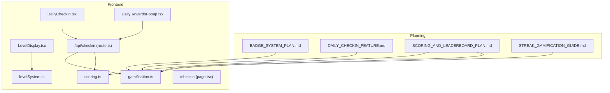
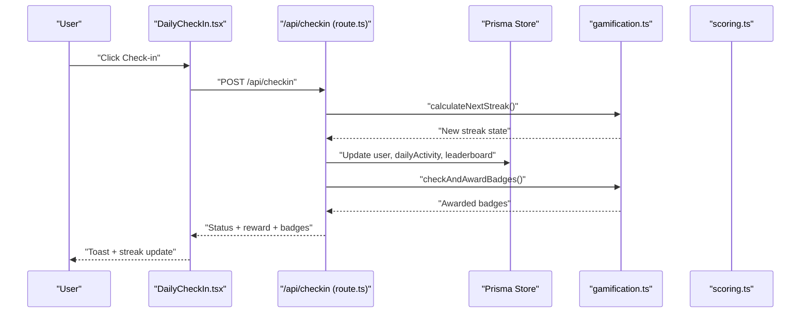
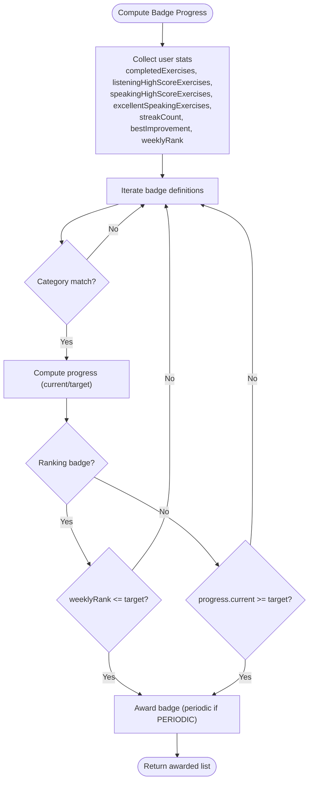
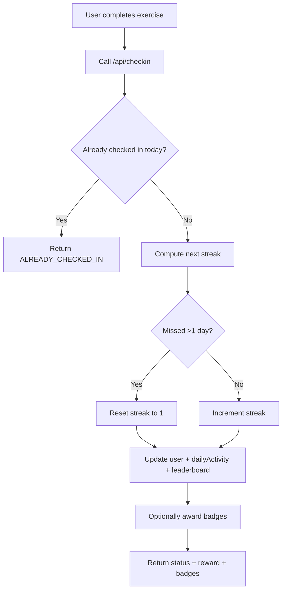
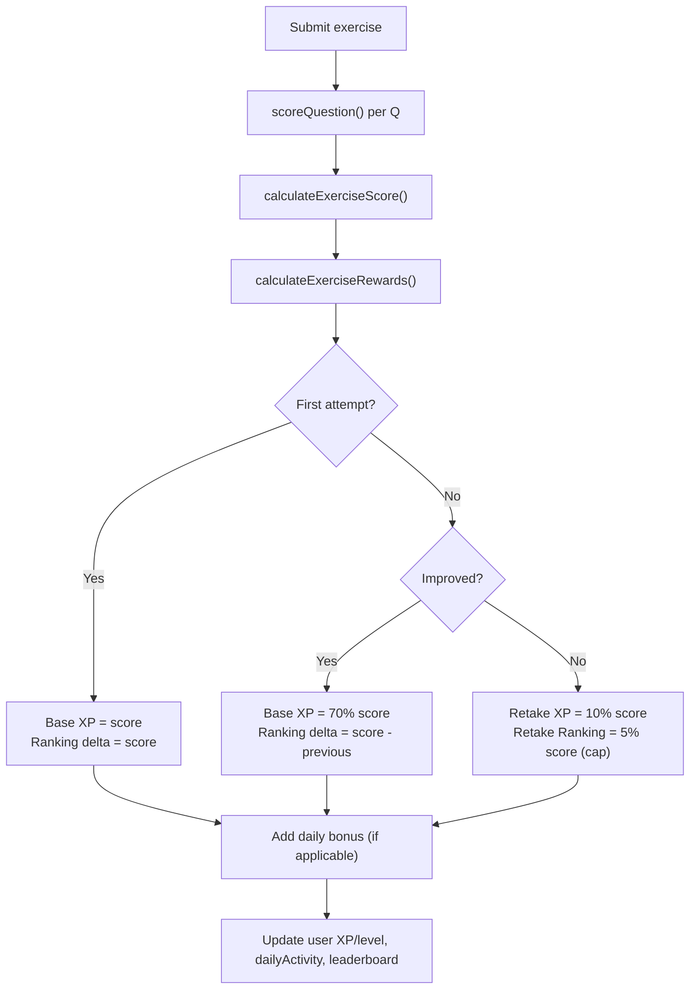
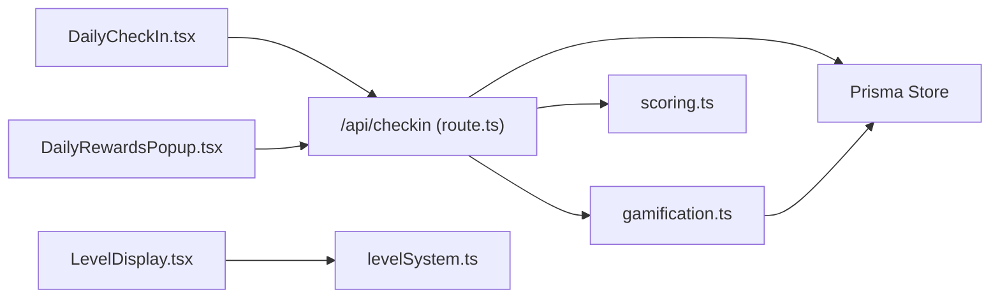

# Gamification and Behavioral Research

<cite>
**Referenced Files in This Document**
- [BADGE_SYSTEM_PLAN.md](file://PLAN/04_Features/BADGE_SYSTEM_PLAN.md)
- [DAILY_CHECKIN_FEATURE.md](file://PLAN/04_Features/DAILY_CHECKIN_FEATURE.md)
- [SCORING_AND_LEADERBOARD_PLAN.md](file://PLAN/04_Features/SCORING_AND_LEADERBOARD_PLAN.md)
- [STREAK_GAMIFICATION_GUIDE.md](file://PLAN/04_Features/STREAK_GAMIFICATION_GUIDE.md)
- [gamification.ts](file://english_pronunciation_app/frontend/src/lib/gamification.ts)
- [scoring.ts](file://english_pronunciation_app/frontend/src/lib/scoring.ts)
- [levelSystem.ts](file://english_pronunciation_app/frontend/src/lib/levelSystem.ts)
- [DailyCheckIn.tsx](file://english_pronunciation_app/frontend/src/components/gamification/DailyCheckIn.tsx)
- [DailyRewardsPopup.tsx](file://english_pronunciation_app/frontend/src/components/gamification/DailyRewardsPopup.tsx)
- [LevelDisplay.tsx](file://english_pronunciation_app/frontend/src/components/gamification/LevelDisplay.tsx)
- [route.ts](file://english_pronunciation_app/frontend/src/app/api/checkin/route.ts)
- [page.tsx](file://english_pronunciation_app/frontend/src/app/checkin/page.tsx)
</cite>

## Table of Contents
1. [Introduction](#introduction)
2. [Project Structure](#project-structure)
3. [Core Components](#core-components)
4. [Architecture Overview](#architecture-overview)
5. [Detailed Component Analysis](#detailed-component-analysis)
6. [Dependency Analysis](#dependency-analysis)
7. [Performance Considerations](#performance-considerations)
8. [Troubleshooting Guide](#troubleshooting-guide)
9. [Conclusion](#conclusion)
10. [Appendices](#appendices)

## Introduction
This document synthesizes the behavioral psychology foundations and gamification implementation for motivation and engagement in language learning. It connects operant conditioning, self-determination theory, and flow theory to the repository’s systems for variable reward schedules, progress monitoring, social comparison, achievements, streaks, and intrinsic motivation. It also covers behavioral economics (loss aversion, commitment devices), habit formation, streak psychology, and social proof, alongside accessibility and inclusive design.

## Project Structure
The gamification stack spans planning documents and frontend/backend implementation:
- Planning documents define badge categories, scoring, leaderboards, and streak mechanics.
- Frontend components implement daily check-in, streak display, and level progression.
- Backend APIs orchestrate streak updates, XP/level changes, leaderboard increments, and badge checks.
- Shared libraries encapsulate scoring, gamification math, and level metadata.

**Diagram sources**
- [BADGE_SYSTEM_PLAN.md:1-156](file://PLAN/04_Features/BADGE_SYSTEM_PLAN.md#L1-L156)
- [DAILY_CHECKIN_FEATURE.md:1-371](file://PLAN/04_Features/DAILY_CHECKIN_FEATURE.md#L1-L371)
- [SCORING_AND_LEADERBOARD_PLAN.md:1-280](file://PLAN/04_Features/SCORING_AND_LEADERBOARD_PLAN.md#L1-L280)
- [STREAK_GAMIFICATION_GUIDE.md:1-569](file://PLAN/04_Features/STREAK_GAMIFICATION_GUIDE.md#L1-L569)
- [DailyCheckIn.tsx:1-234](file://english_pronunciation_app/frontend/src/components/gamification/DailyCheckIn.tsx#L1-L234)
- [DailyRewardsPopup.tsx:1-239](file://english_pronunciation_app/frontend/src/components/gamification/DailyRewardsPopup.tsx#L1-L239)
- [LevelDisplay.tsx:1-98](file://english_pronunciation_app/frontend/src/components/gamification/LevelDisplay.tsx#L1-L98)
- [scoring.ts:1-227](file://english_pronunciation_app/frontend/src/lib/scoring.ts#L1-L227)
- [gamification.ts:1-575](file://english_pronunciation_app/frontend/src/lib/gamification.ts#L1-L575)
- [levelSystem.ts:1-133](file://english_pronunciation_app/frontend/src/lib/levelSystem.ts#L1-L133)
- [route.ts:1-216](file://english_pronunciation_app/frontend/src/app/api/checkin/route.ts#L1-L216)
- [page.tsx:1-146](file://english_pronunciation_app/frontend/src/app/checkin/page.tsx#L1-L146)

**Section sources**
- [BADGE_SYSTEM_PLAN.md:1-156](file://PLAN/04_Features/BADGE_SYSTEM_PLAN.md#L1-L156)
- [DAILY_CHECKIN_FEATURE.md:1-371](file://PLAN/04_Features/DAILY_CHECKIN_FEATURE.md#L1-L371)
- [SCORING_AND_LEADERBOARD_PLAN.md:1-280](file://PLAN/04_Features/SCORING_AND_LEADERBOARD_PLAN.md#L1-L280)
- [STREAK_GAMIFICATION_GUIDE.md:1-569](file://PLAN/04_Features/STREAK_GAMIFICATION_GUIDE.md#L1-L569)
- [DailyCheckIn.tsx:1-234](file://english_pronunciation_app/frontend/src/components/gamification/DailyCheckIn.tsx#L1-L234)
- [DailyRewardsPopup.tsx:1-239](file://english_pronunciation_app/frontend/src/components/gamification/DailyRewardsPopup.tsx#L1-L239)
- [LevelDisplay.tsx:1-98](file://english_pronunciation_app/frontend/src/components/gamification/LevelDisplay.tsx#L1-L98)
- [scoring.ts:1-227](file://english_pronunciation_app/frontend/src/lib/scoring.ts#L1-L227)
- [gamification.ts:1-575](file://english_pronunciation_app/frontend/src/lib/gamification.ts#L1-L575)
- [levelSystem.ts:1-133](file://english_pronunciation_app/frontend/src/lib/levelSystem.ts#L1-L133)
- [route.ts:1-216](file://english_pronunciation_app/frontend/src/app/api/checkin/route.ts#L1-L216)
- [page.tsx:1-146](file://english_pronunciation_app/frontend/src/app/checkin/page.tsx#L1-L146)

## Core Components
- Achievement and Badge System: Defines badge categories (progress, skill, streak, improvement, ranking), conditions, and awarding logic.
- Streak and Daily Check-in: Automatic streak computation, weekly reward schedule, milestone badges, and passive UX.
- Scoring and Leaderboard: Exercise scoring, XP computation, daily bonuses, and ranking deltas with anti-farm controls.
- Level Progression: Level calculation from XP/lessons and visual progress display.
- Social Comparison and Milestones: Leaderboard periods (weekly/monthly), ranking badges, and milestone displays.

**Section sources**
- [BADGE_SYSTEM_PLAN.md:10-176](file://PLAN/04_Features/BADGE_SYSTEM_PLAN.md#L10-L176)
- [DAILY_CHECKIN_FEATURE.md:13-104](file://PLAN/04_Features/DAILY_CHECKIN_FEATURE.md#L13-L104)
- [SCORING_AND_LEADERBOARD_PLAN.md:11-280](file://PLAN/04_Features/SCORING_AND_LEADERBOARD_PLAN.md#L11-L280)
- [STREAK_GAMIFICATION_GUIDE.md:20-222](file://PLAN/04_Features/STREAK_GAMIFICATION_GUIDE.md#L20-L222)
- [gamification.ts:65-176](file://english_pronunciation_app/frontend/src/lib/gamification.ts#L65-L176)
- [gamification.ts:490-531](file://english_pronunciation_app/frontend/src/lib/gamification.ts#L490-L531)
- [scoring.ts:191-227](file://english_pronunciation_app/frontend/src/lib/scoring.ts#L191-L227)
- [levelSystem.ts:77-99](file://english_pronunciation_app/frontend/src/lib/levelSystem.ts#L77-L99)

## Architecture Overview
The gamification pipeline integrates frontend UX, backend APIs, and shared libraries:
- Frontend components trigger check-in and display streaks, levels, and rewards.
- Backend APIs validate sessions, compute streaks, update XP/levels, leaderboard scores, and award badges.
- Libraries encapsulate scoring formulas, XP-to-level conversion, and badge progress computation.

**Diagram sources**
- [DailyCheckIn.tsx:106-161](file://english_pronunciation_app/frontend/src/components/gamification/DailyCheckIn.tsx#L106-L161)
- [route.ts:79-215](file://english_pronunciation_app/frontend/src/app/api/checkin/route.ts#L79-L215)
- [gamification.ts:553-574](file://english_pronunciation_app/frontend/src/lib/gamification.ts#L553-L574)
- [gamification.ts:490-531](file://english_pronunciation_app/frontend/src/lib/gamification.ts#L490-L531)

**Section sources**
- [route.ts:33-77](file://english_pronunciation_app/frontend/src/app/api/checkin/route.ts#L33-L77)
- [route.ts:79-215](file://english_pronunciation_app/frontend/src/app/api/checkin/route.ts#L79-L215)
- [DailyCheckIn.tsx:69-104](file://english_pronunciation_app/frontend/src/components/gamification/DailyCheckIn.tsx#L69-L104)

## Detailed Component Analysis

### Behavioral Psychology Foundations and Applications
- Operant Conditioning: Variable-interval and variable-ratio reinforcement via daily check-in rewards and streak-based bonuses encourage repeated engagement without fixed schedules.
- Self-Determination Theory: Autonomy support (passive streak growth), competence (XP/level, badges), and relatedness (leaderboard, milestones) are embedded.
- Flow Theory: Task–skill balance maintained by adaptive difficulty and immediate feedback loops; XP and streaks act as extrinsic scaffolding toward intrinsic engagement.

These principles underpin:
- Variable reward schedules: Increasing daily rewards up to a weekly milestone.
- Progress monitoring: XP, level, streak, and badge visualizations.
- Social comparison: Weekly/monthly leaderboards and ranking badges.
- Intrinsic motivation: Mastery goals (improvement badges), autonomy-aligned streak mechanics, and meaningful feedback.

[No sources needed since this section provides conceptual synthesis]

### Achievement System and Milestone-Based Progression
- Badge Categories and Conditions:
  - Progress: First exercise, 3 exercises, 10 exercises.
  - Skill: High scores in listening/speaking, excellence threshold.
  - Streak: 3/7/14 consecutive days.
  - Improvement: Comeback with score delta ≥ 20.
  - Ranking: Weekly top 10.
- Awarding Logic:
  - Compute user stats (completed exercises, listening/speaking counts, best improvements, weekly rank).
  - Compare against badge targets and categories.
  - Upsert badge records with optional periodic validity.

**Diagram sources**
- [gamification.ts:380-488](file://english_pronunciation_app/frontend/src/lib/gamification.ts#L380-L488)
- [gamification.ts:328-378](file://english_pronunciation_app/frontend/src/lib/gamification.ts#L328-L378)
- [gamification.ts:490-531](file://english_pronunciation_app/frontend/src/lib/gamification.ts#L490-L531)
- [BADGE_SYSTEM_PLAN.md:37-176](file://PLAN/04_Features/BADGE_SYSTEM_PLAN.md#L37-L176)

**Section sources**
- [BADGE_SYSTEM_PLAN.md:10-176](file://PLAN/04_Features/BADGE_SYSTEM_PLAN.md#L10-L176)
- [gamification.ts:380-488](file://english_pronunciation_app/frontend/src/lib/gamification.ts#L380-L488)
- [gamification.ts:490-531](file://english_pronunciation_app/frontend/src/lib/gamification.ts#L490-L531)

### Streak System, Habit Formation, and Streak Psychology
- Automatic streak computation based on last check-in date and local day boundaries.
- Weekly reward progression (increasing coins) and milestone badges (3/7/14 days).
- Streak freeze mechanism as a commitment device to mitigate loss aversion.
- Passive UX: automatic check-in triggers after exercise completion; daily rewards popup on first open.

**Diagram sources**
- [STREAK_GAMIFICATION_GUIDE.md:167-192](file://PLAN/04_Features/STREAK_GAMIFICATION_GUIDE.md#L167-L192)
- [route.ts:79-215](file://english_pronunciation_app/frontend/src/app/api/checkin/route.ts#L79-L215)
- [gamification.ts:553-574](file://english_pronunciation_app/frontend/src/lib/gamification.ts#L553-L574)

**Section sources**
- [DAILY_CHECKIN_FEATURE.md:13-104](file://PLAN/04_Features/DAILY_CHECKIN_FEATURE.md#L13-L104)
- [STREAK_GAMIFICATION_GUIDE.md:196-222](file://PLAN/04_Features/STREAK_GAMIFICATION_GUIDE.md#L196-L222)
- [route.ts:79-215](file://english_pronunciation_app/frontend/src/app/api/checkin/route.ts#L79-L215)
- [gamification.ts:553-574](file://english_pronunciation_app/frontend/src/lib/gamification.ts#L553-L574)

### Scoring, XP, and Leaderboard Mechanics
- Exercise scoring:
  - Multiple-choice and voice tasks with normalized accuracy scoring.
  - Word overlap accuracy for speech tasks.
- XP computation:
  - Base XP equals exercise score.
  - Retake XP and ranking delta based on improvement vs. first attempt.
  - Daily bonus XP and ranking bonus capped by thresholds.
- Leaderboard:
  - Weekly and monthly periods with upsert logic.
  - Anti-farm rules limit retake leaderboard gains and cap daily bonus.

**Diagram sources**
- [scoring.ts:191-227](file://english_pronunciation_app/frontend/src/lib/scoring.ts#L191-L227)
- [gamification.ts:195-234](file://english_pronunciation_app/frontend/src/lib/gamification.ts#L195-L234)
- [SCORING_AND_LEADERBOARD_PLAN.md:26-190](file://PLAN/04_Features/SCORING_AND_LEADERBOARD_PLAN.md#L26-L190)

**Section sources**
- [scoring.ts:191-227](file://english_pronunciation_app/frontend/src/lib/scoring.ts#L191-L227)
- [gamification.ts:186-234](file://english_pronunciation_app/frontend/src/lib/gamification.ts#L186-L234)
- [SCORING_AND_LEADERBOARD_PLAN.md:26-190](file://PLAN/04_Features/SCORING_AND_LEADERBOARD_PLAN.md#L26-L190)

### Social Comparison and Social Proof
- Weekly and monthly leaderboards with period-aware upsert.
- Ranking badges for weekly top placement.
- Public leaderboard pages and weekly ranking display in UI.

**Section sources**
- [SCORING_AND_LEADERBOARD_PLAN.md:132-151](file://PLAN/04_Features/SCORING_AND_LEADERBOARD_PLAN.md#L132-L151)
- [gamification.ts:236-244](file://english_pronunciation_app/frontend/src/lib/gamification.ts#L236-L244)

### Accessibility and Inclusive Design
- WCAG-compliant components: keyboard navigation, focus management, ARIA labels, color contrast, and screen-reader-friendly messaging.
- Progressive disclosure, clear status messages, and animations for engagement without barriers.
- Consistent color coding and readable typography across widgets.

**Section sources**
- [DAILY_CHECKIN_FEATURE.md:154-161](file://PLAN/04_Features/DAILY_CHECKIN_FEATURE.md#L154-L161)
- [DailyCheckIn.tsx:178-187](file://english_pronunciation_app/frontend/src/components/gamification/DailyCheckIn.tsx#L178-L187)

## Dependency Analysis
Key dependencies and coupling:
- Frontend components depend on backend API endpoints for check-in and status.
- Backend depends on shared gamification library for streak computation, XP/level, and badge logic.
- Scoring library is reused by backend to compute exercise outcomes and XP deltas.
- Level display component consumes level metadata from the level system.

**Diagram sources**
- [DailyCheckIn.tsx:1-234](file://english_pronunciation_app/frontend/src/components/gamification/DailyCheckIn.tsx#L1-L234)
- [DailyRewardsPopup.tsx:1-239](file://english_pronunciation_app/frontend/src/components/gamification/DailyRewardsPopup.tsx#L1-L239)
- [route.ts:1-216](file://english_pronunciation_app/frontend/src/app/api/checkin/route.ts#L1-L216)
- [gamification.ts:1-575](file://english_pronunciation_app/frontend/src/lib/gamification.ts#L1-L575)
- [scoring.ts:1-227](file://english_pronunciation_app/frontend/src/lib/scoring.ts#L1-L227)
- [levelSystem.ts:1-133](file://english_pronunciation_app/frontend/src/lib/levelSystem.ts#L1-L133)

**Section sources**
- [route.ts:1-216](file://english_pronunciation_app/frontend/src/app/api/checkin/route.ts#L1-L216)
- [gamification.ts:1-575](file://english_pronunciation_app/frontend/src/lib/gamification.ts#L1-L575)

## Performance Considerations
- Optimize leaderboard queries by limiting top-N and using period-aware keys.
- Batch streak and XP updates in transactions to reduce write contention.
- Cache frequently accessed badge definitions and level metadata.
- Debounce UI updates for streak and XP to avoid excessive re-renders.

[No sources needed since this section provides general guidance]

## Troubleshooting Guide
Common issues and remedies:
- Duplicate check-in errors: Ensure “already checked in” logic prevents double claims.
- Streak reset anomalies: Verify timezone normalization and local-day boundary calculations.
- Leaderboard inflation: Enforce anti-farm caps and daily limits for retake leaderboard gains.
- Badge awarding gaps: Confirm badge progress thresholds and category filters.

**Section sources**
- [route.ts:111-116](file://english_pronunciation_app/frontend/src/app/api/checkin/route.ts#L111-L116)
- [gamification.ts:553-574](file://english_pronunciation_app/frontend/src/lib/gamification.ts#L553-L574)
- [SCORING_AND_LEADERBOARD_PLAN.md:153-190](file://PLAN/04_Features/SCORING_AND_LEADERBOARD_PLAN.md#L153-L190)

## Conclusion
The gamification stack blends behavioral science with practical engineering: variable rewards, streak psychology, mastery and competence scaffolds, and social comparison. The frontend provides passive, accessible engagement while the backend enforces fairness and scalability. Together, they support sustained motivation and long-term habit formation in language learning.

[No sources needed since this section summarizes without analyzing specific files]

## Appendices

### Behavioral Economics and Commitment Devices
- Loss Aversion: Streak resets and streak freeze items leverage fear of losing progress.
- Commitment Devices: Streak freeze purchases and daily check-in mechanics anchor future behavior.

**Section sources**
- [STREAK_GAMIFICATION_GUIDE.md:533-552](file://PLAN/04_Features/STREAK_GAMIFICATION_GUIDE.md#L533-L552)
- [gamification.ts:533-552](file://english_pronunciation_app/frontend/src/lib/gamification.ts#L533-L552)

### Practical Implementation Notes
- Use period-aware leaderboard targets and enforce daily caps for leaderboard stability.
- Keep badge definitions centralized and versioned to support iterative design.
- Provide clear UI affordances for streak continuation and milestone awareness.

**Section sources**
- [SCORING_AND_LEADERBOARD_PLAN.md:236-244](file://PLAN/04_Features/SCORING_AND_LEADERBOARD_PLAN.md#L236-L244)
- [BADGE_SYSTEM_PLAN.md:122-134](file://PLAN/04_Features/BADGE_SYSTEM_PLAN.md#L122-L134)