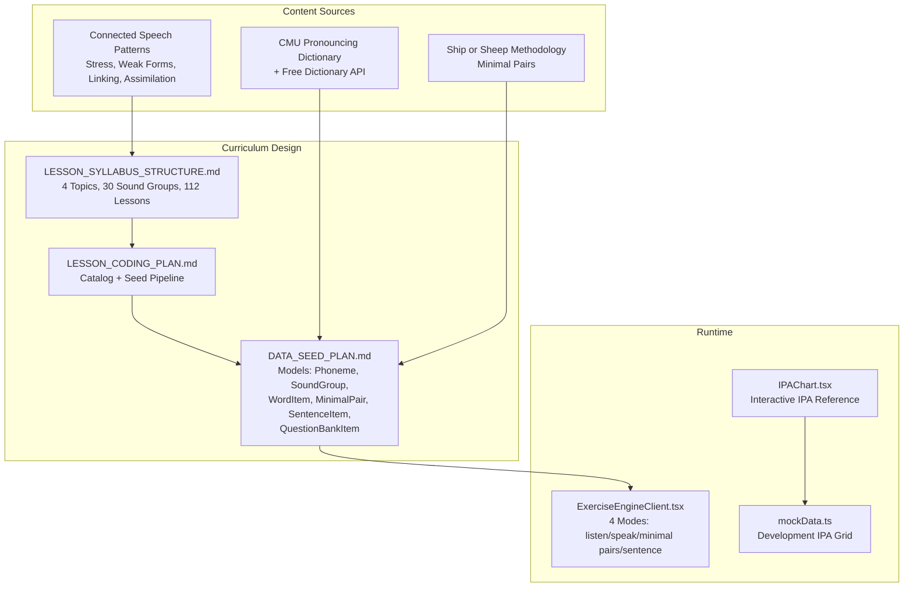
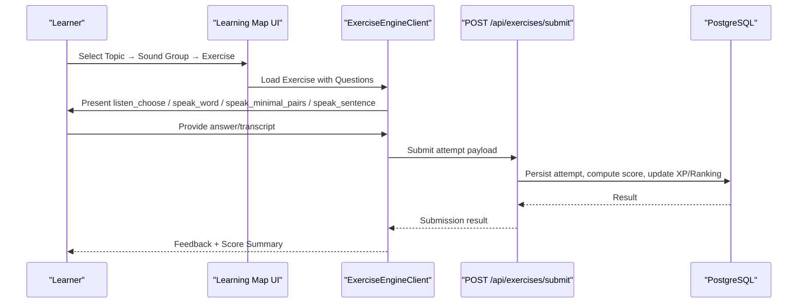
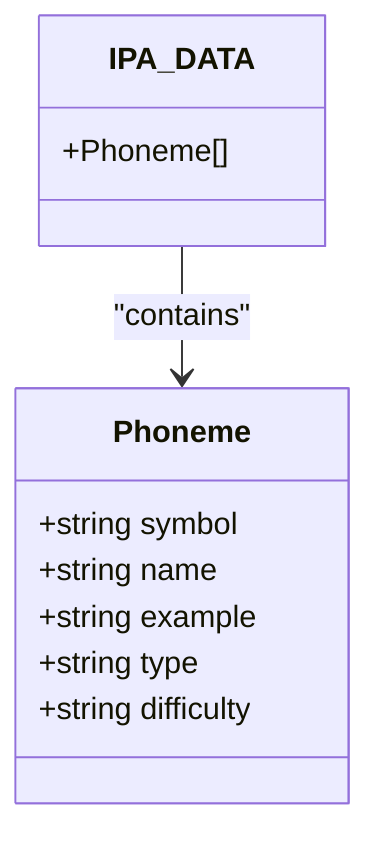
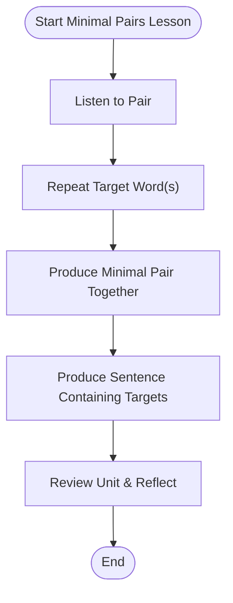
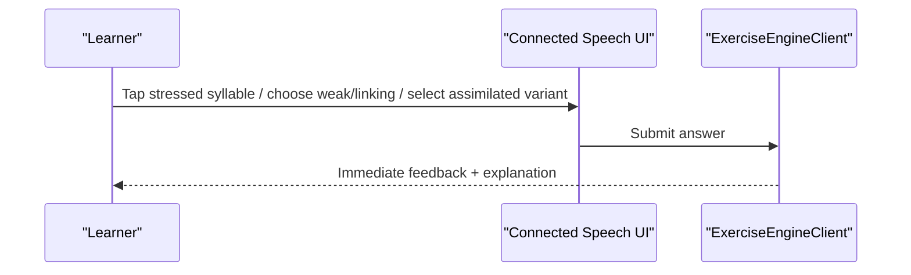
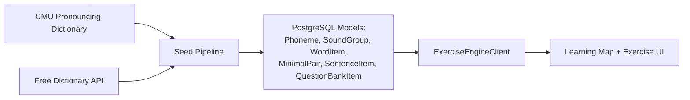

# Linguistic and Phonetic Research

<cite>
**Referenced Files in This Document**
- [DATA_SEED_PLAN.md](file://PLAN/02_Database_And_Data/DATA_SEED_PLAN.md)
- [KH_DATA_BAI_TAP_IPA.md](file://PLAN/02_Database_And_Data/KH_DATA_BAI_TAP_IPA.md)
- [LESSON_SYLLABUS_STRUCTURE.md](file://PLAN/02_Database_And_Data/LESSON_SYLLABUS_STRUCTURE.md)
- [SHIP_OR_SHEEP_APPLICATION_NOTES.md](file://PLAN/02_Database_And_Data/SHIP_OR_SHEEP_APPLICATION_NOTES.md)
- [CAI_TIEN_LO_TRINH_IPA.md](file://PLAN/01_Roadmap/CAI_TIEN_LO_TRINH_IPA.md)
- [SKILL_USAGE_BY_PHASE.md](file://PLAN/05_AI_Skills/SKILL_USAGE_BY_PHASE.md)
- [04_PhuongPhapNghienCuu_DATA.md](file://WORD/Chuong1_TongQuan/04_PhuongPhapNghienCuu_DATA.md)
- [IPAChart.tsx](file://english_pronunciation_app/frontend/src/components/ipa/IPAChart.tsx)
- [mockData.ts](file://english_pronunciation_app/frontend/src/lib/mockData.ts)
- [ExerciseEngineClient.tsx](file://english_pronunciation_app/frontend/src/app/exercises/[id]/ExerciseEngineClient.tsx)
- [2026-06-19-sp3b-content-cd2-design.md](file://docs/superpowers/specs/2026-06-19-sp3b-content-cd2-design.md)
- [2026-06-19-sp3b-content-cd2.md](file://docs/superpowers/plans/2026-06-19-sp3b-content-cd2.md)
</cite>

## Table of Contents
1. [Introduction](#introduction)
2. [Project Structure](#project-structure)
3. [Core Components](#core-components)
4. [Architecture Overview](#architecture-overview)
5. [Detailed Component Analysis](#detailed-component-analysis)
6. [Dependency Analysis](#dependency-analysis)
7. [Performance Considerations](#performance-considerations)
8. [Troubleshooting Guide](#troubleshooting-guide)
9. [Conclusion](#conclusion)
10. [Appendices](#appendices)

## Introduction
This document presents the linguistic and phonetic research foundation of the pronunciation learning platform. It documents the International Phonetic Alphabet (IPA) integration, the 44 target phonemes organized into vowels, consonants, and diphthongs, and the pedagogical methodology grounded in minimal pairs and connected speech. It also outlines Vietnamese learners’ pronunciation challenges, the CMU Pronouncing Dictionary integration, and evidence-based instruction aligned with the “Ship or Sheep” framework. The document synthesizes curriculum design, assessment logic, and instructional scaffolding to support accurate phonetic acquisition.

## Project Structure
The project organizes IPA instruction around four learning themes and 30 sound groups, with each group generating four standardized exercise modes. Content is modeled in a relational schema and seeded via scripts that ensure quality gates, status tracking, and controlled activation.

**Diagram sources**
- [LESSON_SYLLABUS_STRUCTURE.md:1-198](file://PLAN/02_Database_And_Data/LESSON_SYLLABUS_STRUCTURE.md#L1-L198)
- [LESSON_CODING_PLAN.md:1-473](file://PLAN/02_Database_And_Data/LESSON_CODING_PLAN.md#L1-L473)
- [DATA_SEED_PLAN.md:1-418](file://PLAN/02_Database_And_Data/DATA_SEED_PLAN.md#L1-L418)
- [ExerciseEngineClient.tsx:323-645](file://english_pronunciation_app/frontend/src/app/exercises/[id]/ExerciseEngineClient.tsx#L323-L645)
- [IPAChart.tsx:1-111](file://english_pronunciation_app/frontend/src/components/ipa/IPAChart.tsx#L1-L111)
- [mockData.ts:1-50](file://english_pronunciation_app/frontend/src/lib/mockData.ts#L1-L50)

**Section sources**
- [LESSON_SYLLABUS_STRUCTURE.md:1-198](file://PLAN/02_Database_And_Data/LESSON_SYLLABUS_STRUCTURE.md#L1-L198)
- [LESSON_CODING_PLAN.md:1-473](file://PLAN/02_Database_And_Data/LESSON_CODING_PLAN.md#L1-L473)
- [DATA_SEED_PLAN.md:1-418](file://PLAN/02_Database_And_Data/DATA_SEED_PLAN.md#L1-L418)

## Core Components
- IPA inventory and categorization: The system targets 44 phonemes across vowels, consonants, and diphthongs, structured by front/back, high/low, tense/lax, and manner of articulation. See [LESSON_SYLLABUS_STRUCTURE.md:22-162](file://PLAN/02_Database_And_Data/LESSON_SYLLABUS_STRUCTURE.md#L22-L162).
- Minimal pairs methodology: Based on “Ship or Sheep,” the platform uses contrasting pairs to train discrimination and production. See [SHIP_OR_SHEEP_APPLICATION_NOTES.md:1-152](file://PLAN/02_Database_And_Data/SHIP_OR_SHEEP_APPLICATION_NOTES.md#L1-L152) and [KH_DATA_BAI_TAP_IPA.md:56-74](file://PLAN/02_Database_And_Data/KH_DATA_BAI_TAP_IPA.md#L56-L74).
- Connected speech: The platform introduces stress tapping, weak forms, linking, and assimilation after foundational phoneme mastery. See [LESSON_SYLLABUS_STRUCTURE.md:116-148](file://PLAN/02_Database_And_Data/LESSON_SYLLABUS_STRUCTURE.md#L116-L148).
- CMU Pronouncing Dictionary integration: Open-source dictionary and Free Dictionary API supply IPA and audio for seeding. See [2026-06-19-sp3b-content-cd2-design.md:41-57](file://docs/superpowers/specs/2026-06-19-sp3b-content-cd2-design.md#L41-L57) and [04_PhuongPhapNghienCuu_DATA.md:39-46](file://WORD/Chuong1_TongQuan/04_PhuongPhapNghienCuu_DATA.md#L39-L46).
- Pedagogical progression: Four-step scaffold—listen, recognize, produce word, produce minimal pair, produce sentence—mirrors the “Ship or Sheep” sequence. See [SHIP_OR_SHEEP_APPLICATION_NOTES.md:27-36](file://PLAN/02_Database_And_Data/SHIP_OR_SHEEP_APPLICATION_NOTES.md#L27-L36).

**Section sources**
- [LESSON_SYLLABUS_STRUCTURE.md:22-162](file://PLAN/02_Database_And_Data/LESSON_SYLLABUS_STRUCTURE.md#L22-L162)
- [SHIP_OR_SHEEP_APPLICATION_NOTES.md:1-152](file://PLAN/02_Database_And_Data/SHIP_OR_SHEEP_APPLICATION_NOTES.md#L1-L152)
- [KH_DATA_BAI_TAP_IPA.md:56-74](file://PLAN/02_Database_And_Data/KH_DATA_BAI_TAP_IPA.md#L56-L74)
- [2026-06-19-sp3b-content-cd2-design.md:41-57](file://docs/superpowers/specs/2026-06-19-sp3b-content-cd2-design.md#L41-L57)
- [04_PhuongPhapNghienCuu_DATA.md:39-46](file://WORD/Chuong1_TongQuan/04_PhuongPhapNghienCuu_DATA.md#L39-L46)

## Architecture Overview
The platform integrates curriculum design, content modeling, and runtime assessment. The exercise engine renders four standardized modes, while the learning map organizes 30 sound groups across four topics.

**Diagram sources**
- [ExerciseEngineClient.tsx:367-397](file://english_pronunciation_app/frontend/src/app/exercises/[id]/ExerciseEngineClient.tsx#L367-L397)
- [LESSON_CODING_PLAN.md:52-68](file://PLAN/02_Database_And_Data/LESSON_CODING_PLAN.md#L52-L68)

**Section sources**
- [ExerciseEngineClient.tsx:323-645](file://english_pronunciation_app/frontend/src/app/exercises/[id]/ExerciseEngineClient.tsx#L323-L645)
- [LESSON_CODING_PLAN.md:52-68](file://PLAN/02_Database_And_Data/LESSON_CODING_PLAN.md#L52-L68)

## Detailed Component Analysis

### IPA Inventory and Classification
- Vowels: Monophthongs grouped by front/back and high/low tongue position, plus schwa. Diphthongs grouped by movement direction and ending. See [LESSON_SYLLABUS_STRUCTURE.md:26-46](file://PLAN/02_Database_And_Data/LESSON_SYLLABUS_STRUCTURE.md#L26-L46).
- Consonants: Five phonological tiers (plosives, fricatives, affricates, nasals, approximants) with bilabial, alveolar, velar, labiodental, dental, post-alveolar, glottal, and palatal distributions. See [LESSON_SYLLABUS_STRUCTURE.md:50-91](file://PLAN/02_Database_And_Data/LESSON_SYLLABUS_STRUCTURE.md#L50-L91).
- Target sounds for Vietnamese learners: Front vowels (/iː/, /ɪ/, /e/, /æ/), central vowels (/ɑː/, /ʌ/, /ə/), back vowels (/ɒ/, /ɔː/, /ʊ/, /uː/, /ɜː/), and difficult phonemes for Vietnamese speakers such as /θ/ /ð/, /l/ /r/, /ŋ/, /w/ /j/. See [LESSON_SYLLABUS_STRUCTURE.md:95-112](file://PLAN/02_Database_And_Data/LESSON_SYLLABUS_STRUCTURE.md#L95-L112).

**Diagram sources**
- [mockData.ts:3-9](file://english_pronunciation_app/frontend/src/lib/mockData.ts#L3-L9)
- [mockData.ts:11-49](file://english_pronunciation_app/frontend/src/lib/mockData.ts#L11-L49)

**Section sources**
- [LESSON_SYLLABUS_STRUCTURE.md:22-162](file://PLAN/02_Database_And_Data/LESSON_SYLLABUS_STRUCTURE.md#L22-L162)
- [mockData.ts:1-50](file://english_pronunciation_app/frontend/src/lib/mockData.ts#L1-L50)

### Minimal Pairs Methodology and “Ship or Sheep”
- The methodology emphasizes contrastive pairs to develop perception-production mapping. Examples include /iː/ vs /ɪ/ (ship/sheep), /e/ vs /æ/ (bed/bad), and /ʊ/ vs /uː/ (full/fool). See [DATA_SEED_PLAN.md:317-349](file://PLAN/02_Database_And_Data/DATA_SEED_PLAN.md#L317-L349) and [SHIP_OR_SHEEP_APPLICATION_NOTES.md:82-104](file://PLAN/02_Database_And_Data/SHIP_OR_SHEEP_APPLICATION_NOTES.md#L82-L104).
- The exercise engine supports minimal pairs mode and three-stage listening tasks (reveal word, skeleton fill-in, audio-only). See [ExerciseEngineClient.tsx:182-304](file://english_pronunciation_app/frontend/src/app/exercises/[id]/ExerciseEngineClient.tsx#L182-L304).

**Diagram sources**
- [SHIP_OR_SHEEP_APPLICATION_NOTES.md:27-36](file://PLAN/02_Database_And_Data/SHIP_OR_SHEEP_APPLICATION_NOTES.md#L27-L36)
- [ExerciseEngineClient.tsx:588-590](file://english_pronunciation_app/frontend/src/app/exercises/[id]/ExerciseEngineClient.tsx#L588-L590)

**Section sources**
- [DATA_SEED_PLAN.md:317-349](file://PLAN/02_Database_And_Data/DATA_SEED_PLAN.md#L317-L349)
- [SHIP_OR_SHEEP_APPLICATION_NOTES.md:27-36](file://PLAN/02_Database_And_Data/SHIP_OR_SHEEP_APPLICATION_NOTES.md#L27-L36)
- [ExerciseEngineClient.tsx:182-304](file://english_pronunciation_app/frontend/src/app/exercises/[id]/ExerciseEngineClient.tsx#L182-L304)

### Connected Speech Patterns
- Word stress tapping and sentence stress recognition.
- Weak forms (function words reduced to schwa).
- Linking rules for consonant-to-vowel and consonant-to-consonant boundaries.
- Assimilation and elision in natural speech.
See [LESSON_SYLLABUS_STRUCTURE.md:116-148](file://PLAN/02_Database_And_Data/LESSON_SYLLABUS_STRUCTURE.md#L116-L148) and [ExerciseEngineClient.tsx:592-630](file://english_pronunciation_app/frontend/src/app/exercises/[id]/ExerciseEngineClient.tsx#L592-L630).

**Diagram sources**
- [ExerciseEngineClient.tsx:592-630](file://english_pronunciation_app/frontend/src/app/exercises/[id]/ExerciseEngineClient.tsx#L592-L630)
- [LESSON_SYLLABUS_STRUCTURE.md:116-148](file://PLAN/02_Database_And_Data/LESSON_SYLLABUS_STRUCTURE.md#L116-L148)

**Section sources**
- [LESSON_SYLLABUS_STRUCTURE.md:116-148](file://PLAN/02_Database_And_Data/LESSON_SYLLABUS_STRUCTURE.md#L116-L148)
- [ExerciseEngineClient.tsx:592-630](file://english_pronunciation_app/frontend/src/app/exercises/[id]/ExerciseEngineClient.tsx#L592-L630)

### CMU Pronouncing Dictionary Integration
- Open dictionary supplies pronunciations; Free Dictionary API provides verified IPA and audio URLs. Local caching and fallbacks ensure robustness. See [2026-06-19-sp3b-content-cd2-design.md:41-57](file://docs/superpowers/specs/2026-06-19-sp3b-content-cd2-design.md#L41-L57) and [04_PhuongPhapNghienCuu_DATA.md:39-46](file://WORD/Chuong1_TongQuan/04_PhuongPhapNghienCuu_DATA.md#L39-L46).

**Section sources**
- [2026-06-19-sp3b-content-cd2-design.md:41-57](file://docs/superpowers/specs/2026-06-19-sp3b-content-cd2-design.md#L41-L57)
- [04_PhuongPhapNghienCuu_DATA.md:39-46](file://WORD/Chuong1_TongQuan/04_PhuongPhapNghienCuu_DATA.md#L39-L46)

### Pedagogical Implications and Assessment Logic
- Evidence-based progression: scaffolded listening, recognition, production of single words, minimal pairs, and sentences. See [SHIP_OR_SHEEP_APPLICATION_NOTES.md:27-36](file://PLAN/02_Database_And_Data/SHIP_OR_SHEEP_APPLICATION_NOTES.md#L27-L36).
- Assessment modes:
  - Multiple choice (listen-choose) with normalized answer matching.
  - Voice mode for word and sentence production with transcript scoring.
  - Specialized modes for stress, weak forms, linking, and assimilation.
- Quality gates and status controls prevent activation of incomplete content. See [DATA_SEED_PLAN.md:44-56](file://PLAN/02_Database_And_Data/DATA_SEED_PLAN.md#L44-L56).

**Section sources**
- [SHIP_OR_SHEEP_APPLICATION_NOTES.md:27-36](file://PLAN/02_Database_And_Data/SHIP_OR_SHEEP_APPLICATION_NOTES.md#L27-L36)
- [DATA_SEED_PLAN.md:44-56](file://PLAN/02_Database_And_Data/DATA_SEED_PLAN.md#L44-L56)
- [ExerciseEngineClient.tsx:103-133](file://english_pronunciation_app/frontend/src/app/exercises/[id]/ExerciseEngineClient.tsx#L103-L133)

## Dependency Analysis
The system’s curriculum design depends on content modeling and seed pipelines, which in turn rely on external dictionaries and APIs. The runtime engine depends on the exercise catalog and question bank.

**Diagram sources**
- [2026-06-19-sp3b-content-cd2-design.md:41-57](file://docs/superpowers/specs/2026-06-19-sp3b-content-cd2-design.md#L41-L57)
- [DATA_SEED_PLAN.md:98-108](file://PLAN/02_Database_And_Data/DATA_SEED_PLAN.md#L98-L108)
- [ExerciseEngineClient.tsx:323-645](file://english_pronunciation_app/frontend/src/app/exercises/[id]/ExerciseEngineClient.tsx#L323-L645)

**Section sources**
- [2026-06-19-sp3b-content-cd2-design.md:41-57](file://docs/superpowers/specs/2026-06-19-sp3b-content-cd2-design.md#L41-L57)
- [DATA_SEED_PLAN.md:98-108](file://PLAN/02_Database_And_Data/DATA_SEED_PLAN.md#L98-L108)
- [ExerciseEngineClient.tsx:323-645](file://english_pronunciation_app/frontend/src/app/exercises/[id]/ExerciseEngineClient.tsx#L323-L645)

## Performance Considerations
- Audio loading: Preload short delays for autoplay; handle play failures gracefully. See [ExerciseEngineClient.tsx:147-163](file://english_pronunciation_app/frontend/src/app/exercises/[id]/ExerciseEngineClient.tsx#L147-L163).
- Normalized answer matching reduces noise in transcript scoring. See [ExerciseEngineClient.tsx:103-109](file://english_pronunciation_app/frontend/src/app/exercises/[id]/ExerciseEngineClient.tsx#L103-L109).
- Local fallbacks for audio mitigate external API unreliability. See [DATA_SEED_PLAN.md:75-96](file://PLAN/02_Database_And_Data/DATA_SEED_PLAN.md#L75-L96).

**Section sources**
- [ExerciseEngineClient.tsx:147-163](file://english_pronunciation_app/frontend/src/app/exercises/[id]/ExerciseEngineClient.tsx#L147-L163)
- [ExerciseEngineClient.tsx:103-109](file://english_pronunciation_app/frontend/src/app/exercises/[id]/ExerciseEngineClient.tsx#L103-L109)
- [DATA_SEED_PLAN.md:75-96](file://PLAN/02_Database_And_Data/DATA_SEED_PLAN.md#L75-L96)

## Troubleshooting Guide
- Missing audio in listen-choose: Items marked NEEDS_REVIEW or DRAFT should not activate until reviewed. See [DATA_SEED_PLAN.md:259-266](file://PLAN/02_Database_And_Data/DATA_SEED_PLAN.md#L259-L266).
- IPA mismatch: If returned IPA does not match target, item should not auto-activate; manual review required. See [DATA_SEED_PLAN.md:267-275](file://PLAN/02_Database_And_Data/DATA_SEED_PLAN.md#L267-L275).
- Randomization fairness: Balanced distribution of target phonemes per exercise; exclude draft/needs-review items. See [DATA_SEED_PLAN.md:237-246](file://PLAN/02_Database_And_Data/DATA_SEED_PLAN.md#L237-L246).
- Exercise engine submission errors: Validate payload and handle network failures; surface user-friendly messages. See [ExerciseEngineClient.tsx:367-397](file://english_pronunciation_app/frontend/src/app/exercises/[id]/ExerciseEngineClient.tsx#L367-L397).

**Section sources**
- [DATA_SEED_PLAN.md:237-246](file://PLAN/02_Database_And_Data/DATA_SEED_PLAN.md#L237-L246)
- [DATA_SEED_PLAN.md:259-266](file://PLAN/02_Database_And_Data/DATA_SEED_PLAN.md#L259-L266)
- [DATA_SEED_PLAN.md:267-275](file://PLAN/02_Database_And_Data/DATA_SEED_PLAN.md#L267-L275)
- [ExerciseEngineClient.tsx:367-397](file://english_pronunciation_app/frontend/src/app/exercises/[id]/ExerciseEngineClient.tsx#L367-L397)

## Conclusion
The platform integrates a rigorous IPA foundation with “Ship or Sheep” minimal pairs methodology and connected speech instruction. The curriculum is structured across 30 sound groups and four topics, with a standardized four-mode assessment pipeline. External resources (CMU dictionary, Free Dictionary API) inform content seeding, while internal quality gates ensure reliable activation. The exercise engine supports diverse production and recognition tasks, with clear pathways for feedback and progression.

## Appendices

### Vietnamese Learners’ Pronunciation Challenges
- Front vowels: /iː/ vs /ɪ/, /e/ vs /æ/—common substitutions due to Vietnamese phonology. See [LESSON_SYLLABUS_STRUCTURE.md:95-112](file://PLAN/02_Database_And_Data/LESSON_SYLLABUS_STRUCTURE.md#L95-L112).
- Back vowels: /ɒ/ vs /ɔː/, /ʊ/ vs /uː/, /ɜː/—length and rounding contrasts difficult for Vietnamese speakers. See [LESSON_SYLLABUS_STRUCTURE.md:95-112](file://PLAN/02_Database_And_Data/LESSON_SYLLABUS_STRUCTURE.md#L95-L112).
- Consonants: /θ/ /ð/ (dental fricatives), /l/ /r/ (liquids), /ŋ/ (velar nasal), /w/ /j/ (glides) absent or mispronounced in Vietnamese. See [LESSON_SYLLABUS_STRUCTURE.md:50-91](file://PLAN/02_Database_And_Data/LESSON_SYLLABUS_STRUCTURE.md#L50-L91).

**Section sources**
- [LESSON_SYLLABUS_STRUCTURE.md:50-112](file://PLAN/02_Database_And_Data/LESSON_SYLLABUS_STRUCTURE.md#L50-L112)

### Pedagogical Methodology and Instructional Design
- Scaffolded progression: listen → recognize → produce word → minimal pairs → sentence. See [SHIP_OR_SHEEP_APPLICATION_NOTES.md:27-36](file://PLAN/02_Database_And_Data/SHIP_OR_SHEEP_APPLICATION_NOTES.md#L27-L36).
- Three-stage listening: word → skeleton fill-in → audio-only. See [ExerciseEngineClient.tsx:194-259](file://english_pronunciation_app/frontend/src/app/exercises/[id]/ExerciseEngineClient.tsx#L194-L259).
- Connected speech: stress, weak forms, linking, and assimilation introduced after foundational phoneme mastery. See [LESSON_SYLLABUS_STRUCTURE.md:116-148](file://PLAN/02_Database_And_Data/LESSON_SYLLABUS_STRUCTURE.md#L116-L148).

**Section sources**
- [SHIP_OR_SHEEP_APPLICATION_NOTES.md:27-36](file://PLAN/02_Database_And_Data/SHIP_OR_SHEEP_APPLICATION_NOTES.md#L27-L36)
- [ExerciseEngineClient.tsx:194-259](file://english_pronunciation_app/frontend/src/app/exercises/[id]/ExerciseEngineClient.tsx#L194-L259)
- [LESSON_SYLLABUS_STRUCTURE.md:116-148](file://PLAN/02_Database_And_Data/LESSON_SYLLABUS_STRUCTURE.md#L116-L148)