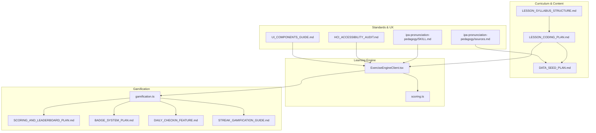
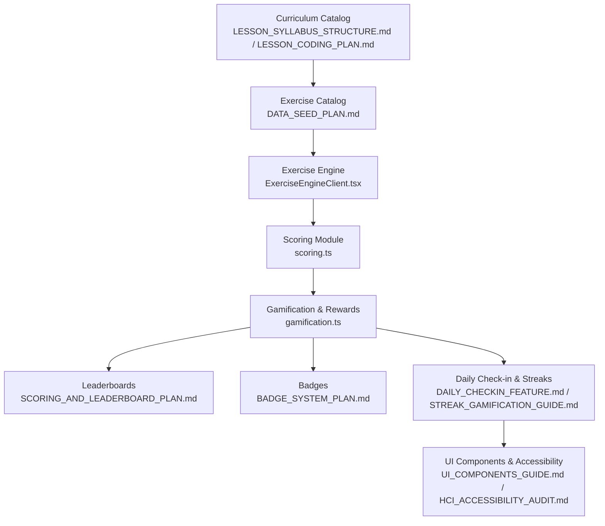
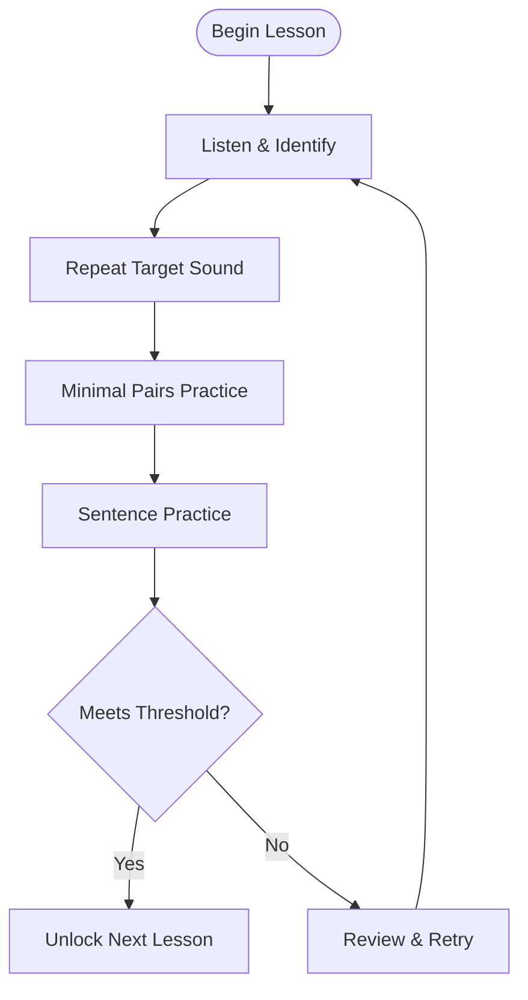
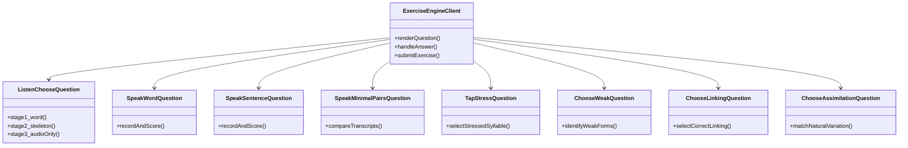
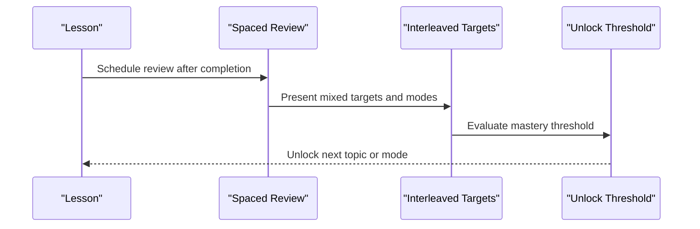
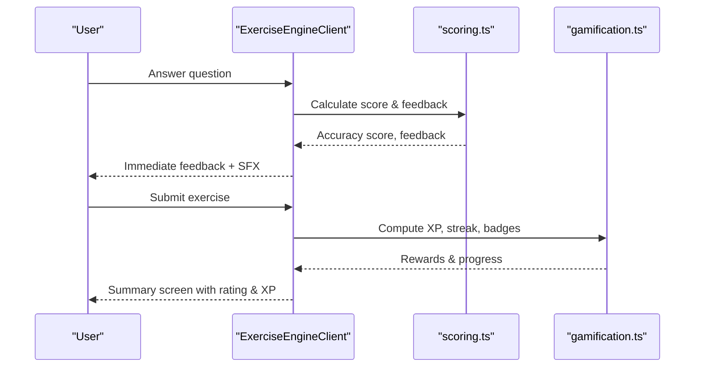
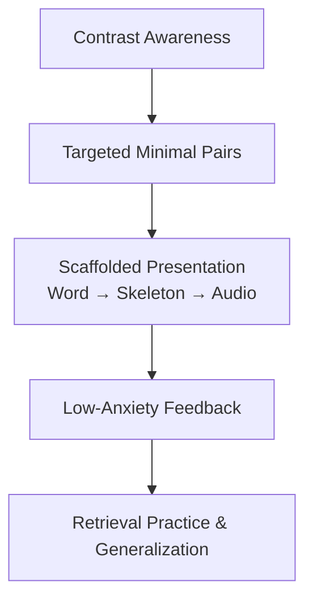
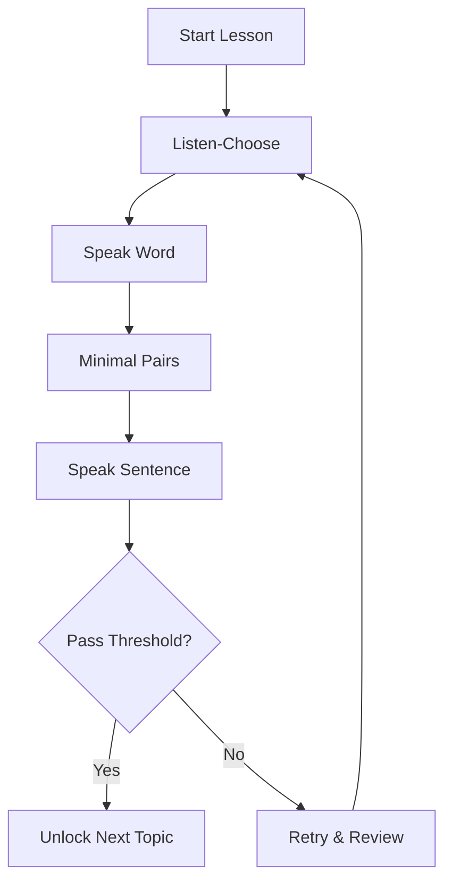
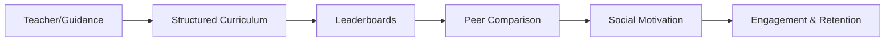
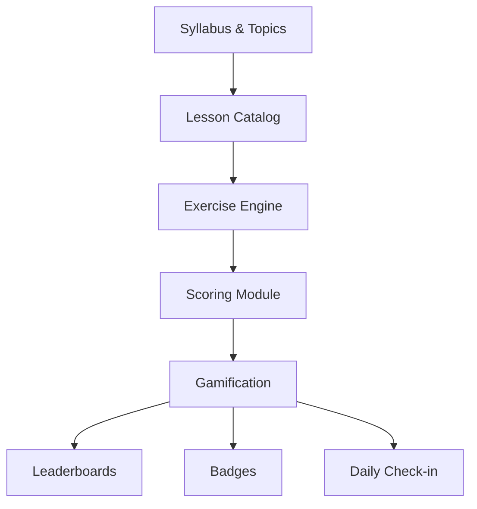

# Pedagogical Approaches and Methodologies

<cite>
**Referenced Files in This Document**
- [CURRENT_PROJECT_CONTEXT.md](file://PLAN/00_Project_Context/CURRENT_PROJECT_CONTEXT.md)
- [DE_CUONG_DO_AN.md](file://PLAN/00_Project_Context/DE_CUONG_DO_AN.md)
- [LESSON_SYLLABUS_STRUCTURE.md](file://PLAN/02_Database_And_Data/LESSON_SYLLABUS_STRUCTURE.md)
- [LESSON_CODING_PLAN.md](file://PLAN/02_Database_And_Data/LESSON_CODING_PLAN.md)
- [DATA_SEED_PLAN.md](file://PLAN/02_Database_And_Data/DATA_SEED_PLAN.md)
- [CAI_TIEN_LO_TRINH_IPA.md](file://PLAN/01_Roadmap/CAI_TIEN_LO_TRINH_IPA.md)
- [SCORING_AND_LEADERBOARD_PLAN.md](file://PLAN/04_Features/SCORING_AND_LEADERBOARD_PLAN.md)
- [BADGE_SYSTEM_PLAN.md](file://PLAN/04_Features/BADGE_SYSTEM_PLAN.md)
- [DAILY_CHECKIN_FEATURE.md](file://PLAN/04_Features/DAILY_CHECKIN_FEATURE.md)
- [STREAK_GAMIFICATION_GUIDE.md](file://PLAN/04_Features/STREAK_GAMIFICATION_GUIDE.md)
- [ipa-pronunciation-pedagogy/SKILL.md](file://english_pronunciation_app/.agents/skills/ipa-pronunciation-pedagogy/SKILL.md)
- [ipa-pronunciation-pedagogy/sources.md](file://english_pronunciation_app/.agents/skills/ipa-pronunciation-pedagogy/references/sources.md)
- [scoring.ts](file://english_pronunciation_app/frontend/src/lib/scoring.ts)
- [gamification.ts](file://english_pronunciation_app/frontend/src/lib/gamification.ts)
- [ExerciseEngineClient.tsx](file://english_pronunciation_app/frontend/src/app/exercises/[id]/ExerciseEngineClient.tsx)
- [HCI_ACCESSIBILITY_AUDIT.md](file://PLAN/03_UI_UX/HCI_ACCESSIBILITY_AUDIT.md)
- [UI_COMPONENTS_GUIDE.md](file://PLAN/03_UI_UX/UI_COMPONENTS_GUIDE.md)
</cite>

## Table of Contents
1. [Introduction](#introduction)
2. [Project Structure](#project-structure)
3. [Core Components](#core-components)
4. [Architecture Overview](#architecture-overview)
5. [Detailed Component Analysis](#detailed-component-analysis)
6. [Dependency Analysis](#dependency-analysis)
7. [Performance Considerations](#performance-considerations)
8. [Troubleshooting Guide](#troubleshooting-guide)
9. [Conclusion](#conclusion)
10. [Appendices](#appendices)

## Introduction
This document synthesizes the pedagogical foundations, instructional design, and learning science embedded in the pronunciation learning platform. It documents the structured IPA-based syllabus, lesson progression from simple to complex sounds, multi-modal learning pathways, spaced repetition and interleaving strategies, formative assessment, gamification, and adaptive instruction. Evidence-based frameworks such as the Ship or Sheep minimal-pair methodology, cognitive load theory, and second language acquisition insights inform the platform’s design.

## Project Structure
The platform integrates:
- A standards-aligned IPA-focused curriculum with four topics and 30 sound groups
- Four-question modes per lesson (listen-choose, speak-word, speak-minimal-pairs, speak-sentence)
- Specialized modes for stress, weak forms, linking, and assimilation
- A robust scoring and gamification system supporting XP, streaks, badges, and leaderboards
- Accessibility-first UI components and progressive disclosure of feedback

**Diagram sources**
- [LESSON_SYLLABUS_STRUCTURE.md:1-198](file://PLAN/02_Database_And_Data/LESSON_SYLLABUS_STRUCTURE.md#L1-L198)
- [LESSON_CODING_PLAN.md:1-473](file://PLAN/02_Database_And_Data/LESSON_CODING_PLAN.md#L1-L473)
- [DATA_SEED_PLAN.md:1-418](file://PLAN/02_Database_And_Data/DATA_SEED_PLAN.md#L1-L418)
- [ExerciseEngineClient.tsx:1-645](file://english_pronunciation_app/frontend/src/app/exercises/[id]/ExerciseEngineClient.tsx#L1-L645)
- [scoring.ts:1-227](file://english_pronunciation_app/frontend/src/lib/scoring.ts#L1-L227)
- [gamification.ts:1-575](file://english_pronunciation_app/frontend/src/lib/gamification.ts#L1-L575)
- [SCORING_AND_LEADERBOARD_PLAN.md:1-280](file://PLAN/04_Features/SCORING_AND_LEADERBOARD_PLAN.md#L1-L280)
- [BADGE_SYSTEM_PLAN.md:1-156](file://PLAN/04_Features/BADGE_SYSTEM_PLAN.md#L1-L156)
- [DAILY_CHECKIN_FEATURE.md:1-371](file://PLAN/04_Features/DAILY_CHECKIN_FEATURE.md#L1-L371)
- [STREAK_GAMIFICATION_GUIDE.md:1-569](file://PLAN/04_Features/STREAK_GAMIFICATION_GUIDE.md#L1-L569)
- [ipa-pronunciation-pedagogy/SKILL.md:1-56](file://english_pronunciation_app/.agents/skills/ipa-pronunciation-pedagogy/SKILL.md#L1-L56)
- [ipa-pronunciation-pedagogy/sources.md:1-23](file://english_pronunciation_app/.agents/skills/ipa-pronunciation-pedagogy/references/sources.md#L1-L23)
- [HCI_ACCESSIBILITY_AUDIT.md:1-388](file://PLAN/03_UI_UX/HCI_ACCESSIBILITY_AUDIT.md#L1-L388)
- [UI_COMPONENTS_GUIDE.md:1-381](file://PLAN/03_UI_UX/UI_COMPONENTS_GUIDE.md#L1-L381)

**Section sources**
- [CURRENT_PROJECT_CONTEXT.md:1-178](file://PLAN/00_Project_Context/CURRENT_PROJECT_CONTEXT.md#L1-L178)
- [DE_CUONG_DO_AN.md:1-120](file://PLAN/00_Project_Context/DE_CUONG_DO_AN.md#L1-L120)

## Core Components
- Structured IPA Syllabus: Four topics, 30 sound groups, 112 lessons with standardized modes
- Lesson Modes: Listen-choose, Speak (word/minimal-pairs/sentence), plus specialized modes for stress/linking/weak forms/assimilation
- Scoring & Feedback: Normalized transcript matching, accuracy scores, immediate feedback, and in-exercise praise
- Gamification: XP, streaks, daily check-in, badges, leaderboards, and daily quests
- Accessibility & UX: WCAG-compliant components, keyboard navigation, reduced motion support, and progressive disclosure

**Section sources**
- [LESSON_SYLLABUS_STRUCTURE.md:1-198](file://PLAN/02_Database_And_Data/LESSON_SYLLABUS_STRUCTURE.md#L1-L198)
- [LESSON_CODING_PLAN.md:1-473](file://PLAN/02_Database_And_Data/LESSON_CODING_PLAN.md#L1-L473)
- [scoring.ts:1-227](file://english_pronunciation_app/frontend/src/lib/scoring.ts#L1-L227)
- [gamification.ts:1-575](file://english_pronunciation_app/frontend/src/lib/gamification.ts#L1-L575)
- [HCI_ACCESSIBILITY_AUDIT.md:1-388](file://PLAN/03_UI_UX/HCI_ACCESSIBILITY_AUDIT.md#L1-L388)

## Architecture Overview
The learning architecture couples curriculum design with an exercise engine and a gamified feedback loop. Curriculum content informs the exercise catalog; the engine renders questions and collects responses; scoring and gamification compute XP, streaks, and badges; leaderboards and daily quests sustain engagement.

**Diagram sources**
- [LESSON_SYLLABUS_STRUCTURE.md:1-198](file://PLAN/02_Database_And_Data/LESSON_SYLLABUS_STRUCTURE.md#L1-L198)
- [LESSON_CODING_PLAN.md:1-473](file://PLAN/02_Database_And_Data/LESSON_CODING_PLAN.md#L1-L473)
- [DATA_SEED_PLAN.md:1-418](file://PLAN/02_Database_And_Data/DATA_SEED_PLAN.md#L1-L418)
- [ExerciseEngineClient.tsx:1-645](file://english_pronunciation_app/frontend/src/app/exercises/[id]/ExerciseEngineClient.tsx#L1-L645)
- [scoring.ts:1-227](file://english_pronunciation_app/frontend/src/lib/scoring.ts#L1-L227)
- [gamification.ts:1-575](file://english_pronunciation_app/frontend/src/lib/gamification.ts#L1-L575)
- [SCORING_AND_LEADERBOARD_PLAN.md:1-280](file://PLAN/04_Features/SCORING_AND_LEADERBOARD_PLAN.md#L1-L280)
- [BADGE_SYSTEM_PLAN.md:1-156](file://PLAN/04_Features/BADGE_SYSTEM_PLAN.md#L1-L156)
- [DAILY_CHECKIN_FEATURE.md:1-371](file://PLAN/04_Features/DAILY_CHECKIN_FEATURE.md#L1-L371)
- [STREAK_GAMIFICATION_GUIDE.md:1-569](file://PLAN/04_Features/STREAK_GAMIFICATION_GUIDE.md#L1-L569)
- [UI_COMPONENTS_GUIDE.md:1-381](file://PLAN/03_UI_UX/UI_COMPONENTS_GUIDE.md#L1-L381)
- [HCI_ACCESSIBILITY_AUDIT.md:1-388](file://PLAN/03_UI_UX/HCI_ACCESSIBILITY_AUDIT.md#L1-L388)

## Detailed Component Analysis

### Structured Syllabus and Lesson Progression
- Four topics: monophthongs, diphthongs, consonants (five phonetic tiers), and connected speech (stress, weak forms, linking, assimilation)
- 30 sound groups × 4 modes = 120+ questions; 112 lessons with targeted content and unlocking thresholds
- Progressive sequence: receptive (listen-choose) → productive (speak-word/minimal-pairs/sentence)
- Minimal pairs scaffold difficult contrasts; sentence mode integrates multiple targets

**Diagram sources**
- [LESSON_SYLLABUS_STRUCTURE.md:1-198](file://PLAN/02_Database_And_Data/LESSON_SYLLABUS_STRUCTURE.md#L1-L198)
- [LESSON_CODING_PLAN.md:1-473](file://PLAN/02_Database_And_Data/LESSON_CODING_PLAN.md#L1-L473)

**Section sources**
- [LESSON_SYLLABUS_STRUCTURE.md:1-198](file://PLAN/02_Database_And_Data/LESSON_SYLLABUS_STRUCTURE.md#L1-L198)
- [LESSON_CODING_PLAN.md:1-473](file://PLAN/02_Database_And_Data/LESSON_CODING_PLAN.md#L1-L473)

### Multi-Modal Learning Approach
- Auditory: listen-choose with phoneme identification stages; sentence mode with speech synthesis
- Visual: IPA chart, skeleton prompts, contrast highlighting, waveform feedback
- Kinesthetic: speaking tasks with immediate audio playback and retry; tapping stress positions

**Diagram sources**
- [ExerciseEngineClient.tsx:1-645](file://english_pronunciation_app/frontend/src/app/exercises/[id]/ExerciseEngineClient.tsx#L1-L645)

**Section sources**
- [ExerciseEngineClient.tsx:1-645](file://english_pronunciation_app/frontend/src/app/exercises/[id]/ExerciseEngineClient.tsx#L1-L645)

### Spaced Repetition and Interleaved Practice
- Spaced repetition: revisit lessons after initial mastery; use minimal pairs to strengthen discrimination
- Interleaved practice: mix phoneme targets within lessons; vary question types (listen-choose, speak-word, minimal pairs, sentence)
- Adaptive sequencing: unlock next topic after achieving thresholds; integrate connected-speech modes after foundational contrasts

**Diagram sources**
- [LESSON_SYLLABUS_STRUCTURE.md:1-198](file://PLAN/02_Database_And_Data/LESSON_SYLLABUS_STRUCTURE.md#L1-L198)
- [LESSON_CODING_PLAN.md:1-473](file://PLAN/02_Database_And_Data/LESSON_CODING_PLAN.md#L1-L473)

**Section sources**
- [LESSON_SYLLABUS_STRUCTURE.md:1-198](file://PLAN/02_Database_And_Data/LESSON_SYLLABUS_STRUCTURE.md#L1-L198)
- [LESSON_CODING_PLAN.md:1-473](file://PLAN/02_Database_And_Data/LESSON_CODING_PLAN.md#L1-L473)

### Formative Assessment and Immediate Feedback
- Scoring: normalized transcript matching, accuracy scores, and question-level feedback
- In-exercise feedback: SFX, shake animations, color-coded responses, and praise pop-ups
- Post-submission summary: exercise score, rating, XP deltas, streak updates, and badge checks

**Diagram sources**
- [scoring.ts:1-227](file://english_pronunciation_app/frontend/src/lib/scoring.ts#L1-L227)
- [gamification.ts:1-575](file://english_pronunciation_app/frontend/src/lib/gamification.ts#L1-L575)
- [ExerciseEngineClient.tsx:1-645](file://english_pronunciation_app/frontend/src/app/exercises/[id]/ExerciseEngineClient.tsx#L1-L645)

**Section sources**
- [scoring.ts:1-227](file://english_pronunciation_app/frontend/src/lib/scoring.ts#L1-L227)
- [gamification.ts:1-575](file://english_pronunciation_app/frontend/src/lib/gamification.ts#L1-L575)
- [ExerciseEngineClient.tsx:1-645](file://english_pronunciation_app/frontend/src/app/exercises/[id]/ExerciseEngineClient.tsx#L1-L645)

### Evidence-Based Learning Theories and Cognitive Load
- Ship or Sheep minimal pairs: targeted contrast training to reduce confusion among similar vowels and consonants
- Cognitive load theory: scaffolded presentation (word → skeleton → audio-only), balanced workload, and multimodal cues
- Second language acquisition: focus on phonemic awareness, meaningful practice, and low-anxiety feedback loops

**Diagram sources**
- [CAI_TIEN_LO_TRINH_IPA.md:1-7](file://PLAN/01_Roadmap/CAI_TIEN_LO_TRINH_IPA.md#L1-L7)
- [ipa-pronunciation-pedagogy/SKILL.md:1-56](file://english_pronunciation_app/.agents/skills/ipa-pronunciation-pedagogy/SKILL.md#L1-L56)

**Section sources**
- [CAI_TIEN_LO_TRINH_IPA.md:1-7](file://PLAN/01_Roadmap/CAI_TIEN_LO_TRINH_IPA.md#L1-L7)
- [ipa-pronunciation-pedagogy/SKILL.md:1-56](file://english_pronunciation_app/.agents/skills/ipa-pronunciation-pedagogy/SKILL.md#L1-L56)
- [ipa-pronunciation-pedagogy/sources.md:1-23](file://english_pronunciation_app/.agents/skills/ipa-pronunciation-pedagogy/references/sources.md#L1-L23)

### Adaptive Learning and Competency-Based Progression
- Competency thresholds: unlock next topic after meeting pass criteria; no XP-based gating
- Personalized instruction: speak modes adapt to word vs sentence targets; minimal pairs adjust difficulty
- Daily quests and streaks personalize motivation and practice volume

**Diagram sources**
- [SCORING_AND_LEADERBOARD_PLAN.md:1-280](file://PLAN/04_Features/SCORING_AND_LEADERBOARD_PLAN.md#L1-L280)
- [LESSON_SYLLABUS_STRUCTURE.md:1-198](file://PLAN/02_Database_And_Data/LESSON_SYLLABUS_STRUCTURE.md#L1-L198)

**Section sources**
- [SCORING_AND_LEADERBOARD_PLAN.md:1-280](file://PLAN/04_Features/SCORING_AND_LEADERBOARD_PLAN.md#L1-L280)
- [LESSON_SYLLABUS_STRUCTURE.md:1-198](file://PLAN/02_Database_And_Data/LESSON_SYLLABUS_STRUCTURE.md#L1-L198)

### Teacher-Guided Model, Peer Interaction, and Collaborative Learning
- Teacher-guided model: structured syllabus, clear unlock conditions, and curated minimal pairs
- Peer interaction: weekly and monthly leaderboards, streak visibility, and social sharing potential
- Collaborative learning: streak challenges and seasonal events planned for future phases

**Diagram sources**
- [SCORING_AND_LEADERBOARD_PLAN.md:1-280](file://PLAN/04_Features/SCORING_AND_LEADERBOARD_PLAN.md#L1-L280)
- [DAILY_CHECKIN_FEATURE.md:1-371](file://PLAN/04_Features/DAILY_CHECKIN_FEATURE.md#L1-L371)
- [STREAK_GAMIFICATION_GUIDE.md:1-569](file://PLAN/04_Features/STREAK_GAMIFICATION_GUIDE.md#L1-L569)

**Section sources**
- [SCORING_AND_LEADERBOARD_PLAN.md:1-280](file://PLAN/04_Features/SCORING_AND_LEADERBOARD_PLAN.md#L1-L280)
- [DAILY_CHECKIN_FEATURE.md:1-371](file://PLAN/04_Features/DAILY_CHECKIN_FEATURE.md#L1-L371)
- [STREAK_GAMIFICATION_GUIDE.md:1-569](file://PLAN/04_Features/STREAK_GAMIFICATION_GUIDE.md#L1-L569)

## Dependency Analysis
The platform’s pedagogy depends on coherent alignment between curriculum design, exercise rendering, scoring, and gamification.

**Diagram sources**
- [LESSON_SYLLABUS_STRUCTURE.md:1-198](file://PLAN/02_Database_And_Data/LESSON_SYLLABUS_STRUCTURE.md#L1-L198)
- [LESSON_CODING_PLAN.md:1-473](file://PLAN/02_Database_And_Data/LESSON_CODING_PLAN.md#L1-L473)
- [ExerciseEngineClient.tsx:1-645](file://english_pronunciation_app/frontend/src/app/exercises/[id]/ExerciseEngineClient.tsx#L1-L645)
- [scoring.ts:1-227](file://english_pronunciation_app/frontend/src/lib/scoring.ts#L1-L227)
- [gamification.ts:1-575](file://english_pronunciation_app/frontend/src/lib/gamification.ts#L1-L575)

**Section sources**
- [CURRENT_PROJECT_CONTEXT.md:1-178](file://PLAN/00_Project_Context/CURRENT_PROJECT_CONTEXT.md#L1-L178)

## Performance Considerations
- Minimize cognitive load by progressively revealing prompts and avoiding extraneous modalities
- Optimize audio playback and speech recognition latency; leverage browser Web Speech API
- Maintain responsive UI transitions and animations for feedback without blocking interactions
- Ensure leaderboard queries are indexed and paginated for scalability

## Troubleshooting Guide
Common issues and resolutions:
- Missing unlock conditions: verify threshold logic and topic ordering in the learning map
- Inconsistent XP calculations: align XP computation with scoring and gamification modules
- Accessibility gaps: address missing ARIA attributes, skip links, and semantic landmarks
- Leaderboard anomalies: validate daily bonus caps and retake scoring limits

**Section sources**
- [HCI_ACCESSIBILITY_AUDIT.md:1-388](file://PLAN/03_UI_UX/HCI_ACCESSIBILITY_AUDIT.md#L1-L388)
- [gamification.ts:1-575](file://english_pronunciation_app/frontend/src/lib/gamification.ts#L1-L575)
- [SCORING_AND_LEADERBOARD_PLAN.md:1-280](file://PLAN/04_Features/SCORING_AND_LEADERBOARD_PLAN.md#L1-L280)

## Conclusion
The platform blends rigorous IPA pedagogy with modern learning science and gamification. Its structured syllabus, multi-modal exercises, spaced repetition, and adaptive progression support measurable gains in pronunciation accuracy. The evidence-based design, accessibility-first UI, and scalable architecture position the platform for effective, inclusive, and motivating pronunciation learning.

## Appendices
- Pedagogy references and sources for IPA and pronunciation teaching
- UI component guidelines and accessibility checklist
- Scoring rubrics and badge definitions

**Section sources**
- [ipa-pronunciation-pedagogy/sources.md:1-23](file://english_pronunciation_app/.agents/skills/ipa-pronunciation-pedagogy/references/sources.md#L1-L23)
- [UI_COMPONENTS_GUIDE.md:1-381](file://PLAN/03_UI_UX/UI_COMPONENTS_GUIDE.md#L1-L381)
- [BADGE_SYSTEM_PLAN.md:1-156](file://PLAN/04_Features/BADGE_SYSTEM_PLAN.md#L1-L156)