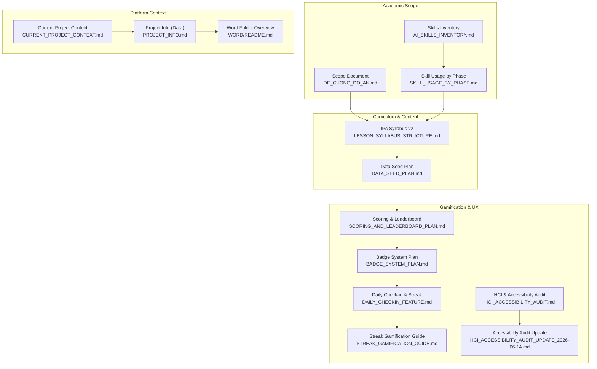
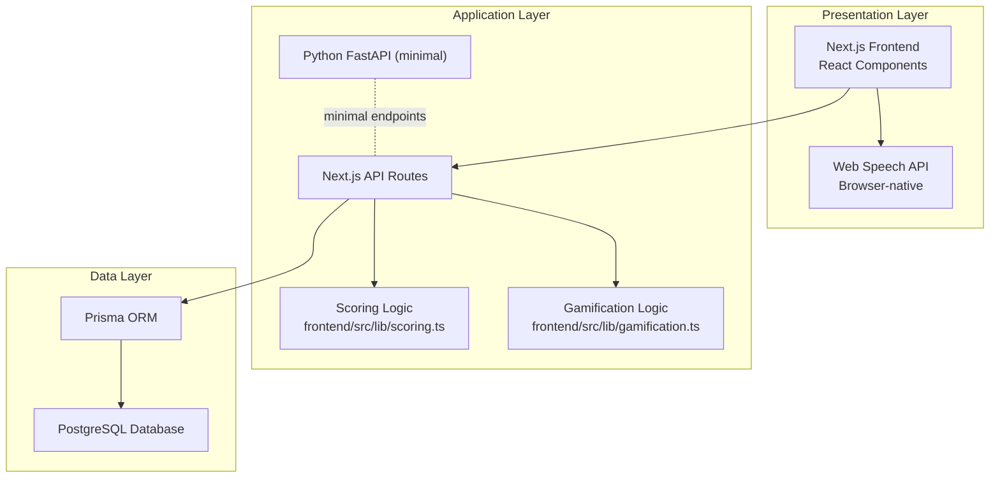
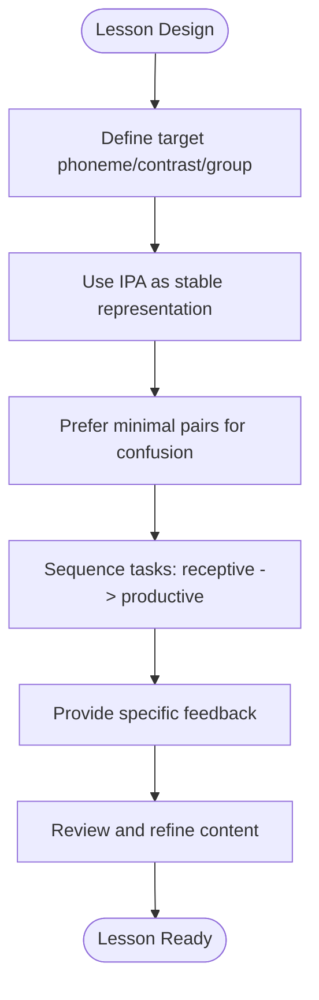
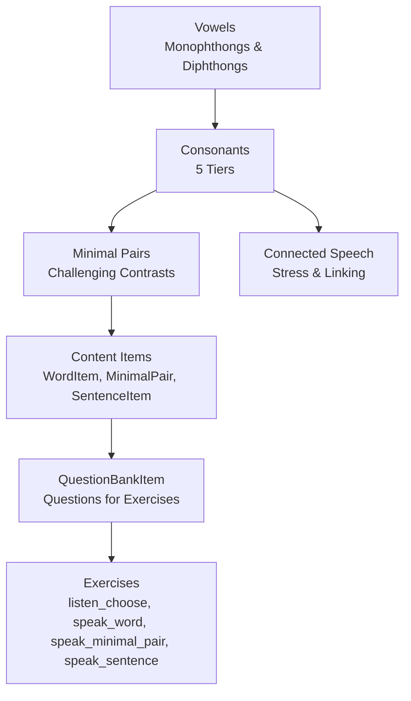
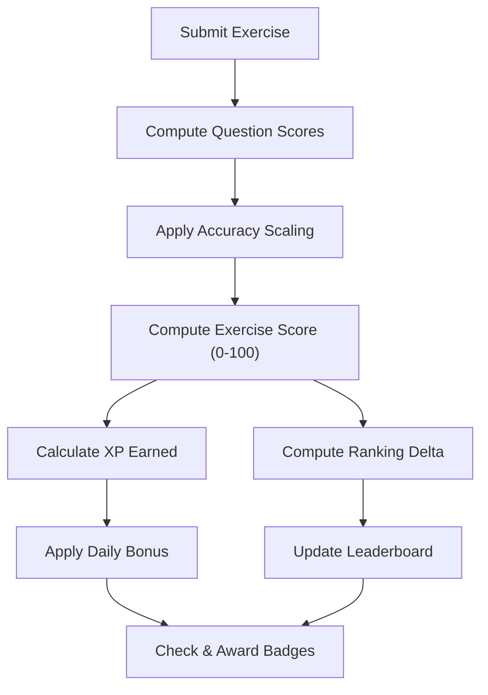
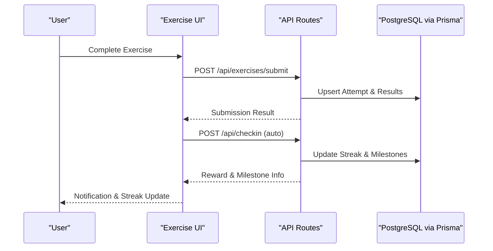
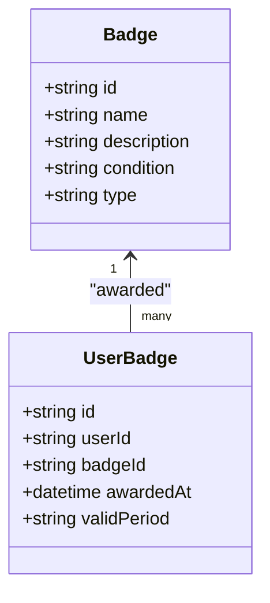
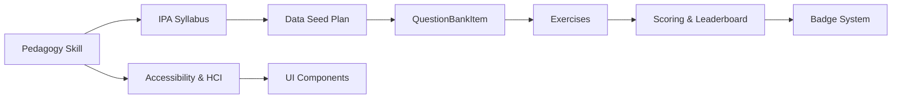

# Research and Academic Content

<cite>
**Referenced Files in This Document**
- [CURRENT_PROJECT_CONTEXT.md](file://PLAN/00_Project_Context/CURRENT_PROJECT_CONTEXT.md)
- [DE_CUONG_DO_AN.md](file://PLAN/00_Project_Context/DE_CUONG_DO_AN.md)
- [README.md](file://WORD/README.md)
- [PROJECT_INFO.md](file://WORD/PROJECT_INFO.md)
- [AI_SKILLS_INVENTORY.md](file://PLAN/05_AI_Skills/AI_SKILLS_INVENTORY.md)
- [SKILL_USAGE_BY_PHASE.md](file://PLAN/05_AI_Skills/SKILL_USAGE_BY_PHASE.md)
- [ipa-pronunciation-pedagogy/SKILL.md](file://english_pronunciation_app/.agents/skills/ipa-pronunciation-pedagogy/SKILL.md)
- [ipa-pronunciation-pedagogy/sources.md](file://english_pronunciation_app/.agents/skills/ipa-pronunciation-pedagogy/references/sources.md)
- [DATA_SEED_PLAN.md](file://PLAN/02_Database_And_Data/DATA_SEED_PLAN.md)
- [LESSON_SYLLABUS_STRUCTURE.md](file://PLAN/02_Database_And_Data/LESSON_SYLLABUS_STRUCTURE.md)
- [BADGE_SYSTEM_PLAN.md](file://PLAN/04_Features/BADGE_SYSTEM_PLAN.md)
- [SCORING_AND_LEADERBOARD_PLAN.md](file://PLAN/04_Features/SCORING_AND_LEADERBOARD_PLAN.md)
- [DAILY_CHECKIN_FEATURE.md](file://PLAN/04_Features/DAILY_CHECKIN_FEATURE.md)
- [STREAK_GAMIFICATION_GUIDE.md](file://PLAN/04_Features/STREAK_GAMIFICATION_GUIDE.md)
- [HCI_ACCESSIBILITY_AUDIT.md](file://PLAN/03_UI_UX/HCI_ACCESSIBILITY_AUDIT.md)
- [HCI_ACCESSIBILITY_AUDIT_UPDATE_2026-06-14.md](file://PLAN/03_UI_UX/HCI_ACCESSIBILITY_AUDIT_UPDATE_2026-06-14.md)
</cite>

## Table of Contents
1. [Introduction](#introduction)
2. [Project Structure](#project-structure)
3. [Core Components](#core-components)
4. [Architecture Overview](#architecture-overview)
5. [Detailed Component Analysis](#detailed-component-analysis)
6. [Dependency Analysis](#dependency-analysis)
7. [Performance Considerations](#performance-considerations)
8. [Troubleshooting Guide](#troubleshooting-guide)
9. [Conclusion](#conclusion)
10. [Appendices](#appendices)

## Introduction
This document synthesizes the research foundation and academic components underpinning the pronunciation learning platform. It documents the linguistic research basis grounded in the International Phonetic Alphabet (IPA), phonetic analysis methodologies, and pedagogical approaches aligned with evidence-based learning. It also explains the gamification research, motivation theories, and behavioral psychology integration, and outlines the AI skills inventory, language learning phases, and adaptive learning algorithms embedded in the system. Finally, it provides guidance for educators, researchers, and language learning professionals.

## Project Structure
The project is organized around a clear research-driven roadmap and a modular academic framework:
- Academic scope and objectives are defined in the project’s official scope document.
- The current project context consolidates the evolving system state, technology stack, and feature implementations.
- The academic inventory and skill usage matrix define how research and pedagogy are integrated across development phases.
- The syllabus and data seed plan formalize the IPA-based curriculum and content pipeline.
- Gamification and HCI accessibility artifacts ground the learning experience in motivation theory and inclusive design.

**Diagram sources**
- [DE_CUONG_DO_AN.md:1-120](file://PLAN/00_Project_Context/DE_CUONG_DO_AN.md#L1-L120)
- [AI_SKILLS_INVENTORY.md:1-42](file://PLAN/05_AI_Skills/AI_SKILLS_INVENTORY.md#L1-L42)
- [SKILL_USAGE_BY_PHASE.md:1-180](file://PLAN/05_AI_Skills/SKILL_USAGE_BY_PHASE.md#L1-L180)
- [LESSON_SYLLABUS_STRUCTURE.md:1-198](file://PLAN/02_Database_And_Data/LESSON_SYLLABUS_STRUCTURE.md#L1-L198)
- [DATA_SEED_PLAN.md:1-418](file://PLAN/02_Database_And_Data/DATA_SEED_PLAN.md#L1-L418)
- [BADGE_SYSTEM_PLAN.md:1-156](file://PLAN/04_Features/BADGE_SYSTEM_PLAN.md#L1-L156)
- [SCORING_AND_LEADERBOARD_PLAN.md:1-280](file://PLAN/04_Features/SCORING_AND_LEADERBOARD_PLAN.md#L1-L280)
- [DAILY_CHECKIN_FEATURE.md:1-371](file://PLAN/04_Features/DAILY_CHECKIN_FEATURE.md#L1-L371)
- [STREAK_GAMIFICATION_GUIDE.md:1-569](file://PLAN/04_Features/STREAK_GAMIFICATION_GUIDE.md#L1-L569)
- [HCI_ACCESSIBILITY_AUDIT.md:1-388](file://PLAN/03_UI_UX/HCI_ACCESSIBILITY_AUDIT.md#L1-L388)
- [HCI_ACCESSIBILITY_AUDIT_UPDATE_2026-06-14.md:1-24](file://PLAN/03_UI_UX/HCI_ACCESSIBILITY_AUDIT_UPDATE_2026-06-14.md#L1-L24)
- [CURRENT_PROJECT_CONTEXT.md:1-178](file://PLAN/00_Project_Context/CURRENT_PROJECT_CONTEXT.md#L1-L178)
- [PROJECT_INFO.md:1-776](file://WORD/PROJECT_INFO.md#L1-L776)
- [WORD/README.md:1-73](file://WORD/README.md#L1-L73)

**Section sources**
- [DE_CUONG_DO_AN.md:1-120](file://PLAN/00_Project_Context/DE_CUONG_DO_AN.md#L1-L120)
- [CURRENT_PROJECT_CONTEXT.md:1-178](file://PLAN/00_Project_Context/CURRENT_PROJECT_CONTEXT.md#L1-L178)
- [PROJECT_INFO.md:1-776](file://WORD/PROJECT_INFO.md#L1-L776)
- [WORD/README.md:1-73](file://WORD/README.md#L1-L73)

## Core Components
This section outlines the research-backed components that form the academic backbone of the platform.

- IPA-based phonetic curriculum: The syllabus defines four topics—vowels, consonants, minimal pairs, and connected speech—structured to align with phonetic categories and pedagogical progression.
- Pedagogical design rules: The IPA pronunciation pedagogy skill prescribes how to sequence lessons, choose exercises, and provide feedback grounded in evidence-based practices for Vietnamese learners.
- Data seed pipeline: The data seed plan establishes a structured, reviewable content lifecycle for IPA, audio, minimal pairs, and sentence items, ensuring quality and traceability.
- Gamification and motivation: The scoring and leaderboard plan, daily check-in, and streak gamification integrate motivation theories and behavioral psychology to sustain engagement.
- Accessibility and HCI: The accessibility audit and updates ensure inclusive design aligned with WCAG and HCI best practices.

**Section sources**
- [LESSON_SYLLABUS_STRUCTURE.md:1-198](file://PLAN/02_Database_And_Data/LESSON_SYLLABUS_STRUCTURE.md#L1-L198)
- [ipa-pronunciation-pedagogy/SKILL.md:1-56](file://english_pronunciation_app/.agents/skills/ipa-pronunciation-pedagogy/SKILL.md#L1-L56)
- [DATA_SEED_PLAN.md:1-418](file://PLAN/02_Database_And_Data/DATA_SEED_PLAN.md#L1-L418)
- [SCORING_AND_LEADERBOARD_PLAN.md:1-280](file://PLAN/04_Features/SCORING_AND_LEADERBOARD_PLAN.md#L1-L280)
- [DAILY_CHECKIN_FEATURE.md:1-371](file://PLAN/04_Features/DAILY_CHECKIN_FEATURE.md#L1-L371)
- [STREAK_GAMIFICATION_GUIDE.md:1-569](file://PLAN/04_Features/STREAK_GAMIFICATION_GUIDE.md#L1-L569)
- [HCI_ACCESSIBILITY_AUDIT.md:1-388](file://PLAN/03_UI_UX/HCI_ACCESSIBILITY_AUDIT.md#L1-L388)
- [HCI_ACCESSIBILITY_AUDIT_UPDATE_2026-06-14.md:1-24](file://PLAN/03_UI_UX/HCI_ACCESSIBILITY_AUDIT_UPDATE_2026-06-14.md#L1-L24)

## Architecture Overview
The platform integrates academic rigor with practical engineering. The architecture separates presentation, application, and data layers while embedding gamification and accessibility standards.

**Diagram sources**
- [CURRENT_PROJECT_CONTEXT.md:33-40](file://PLAN/00_Project_Context/CURRENT_PROJECT_CONTEXT.md#L33-L40)
- [PROJECT_INFO.md:263-295](file://WORD/PROJECT_INFO.md#L263-L295)

**Section sources**
- [CURRENT_PROJECT_CONTEXT.md:33-40](file://PLAN/00_Project_Context/CURRENT_PROJECT_CONTEXT.md#L33-L40)
- [PROJECT_INFO.md:263-295](file://WORD/PROJECT_INFO.md#L263-L295)

## Detailed Component Analysis

### IPA Pronunciation Pedagogy
The pedagogy skill defines how to design lessons and exercises centered on the IPA, with a focus on Vietnamese learners’ typical challenges. It emphasizes:
- Starting from a specific phonetic target (single phoneme, contrast, or sound group)
- Using IPA as a stable representation while avoiding premature technical labeling
- Employing minimal pairs for confusing contrasts
- Maintaining one-lesson focus and progressing from receptive to productive tasks
- Providing specific, actionable feedback and marking likely mistakes

**Diagram sources**
- [ipa-pronunciation-pedagogy/SKILL.md:18-56](file://english_pronunciation_app/.agents/skills/ipa-pronunciation-pedagogy/SKILL.md#L18-L56)

**Section sources**
- [ipa-pronunciation-pedagogy/SKILL.md:1-56](file://english_pronunciation_app/.agents/skills/ipa-pronunciation-pedagogy/SKILL.md#L1-L56)

### IPA Syllabus and Content Pipeline
The syllabus organizes the curriculum into four topics with explicit grouping and progression:
- Vowels: monophthongs and diphthongs
- Consonants: five phonetic tiers
- Minimal Pairs: challenging contrasts
- Connected Speech: stress, weak forms, linking, assimilation, and elision

The data seed plan governs content creation, review, and activation, ensuring quality and traceability.

**Diagram sources**
- [LESSON_SYLLABUS_STRUCTURE.md:22-162](file://PLAN/02_Database_And_Data/LESSON_SYLLABUS_STRUCTURE.md#L22-L162)
- [DATA_SEED_PLAN.md:100-206](file://PLAN/02_Database_And_Data/DATA_SEED_PLAN.md#L100-L206)

**Section sources**
- [LESSON_SYLLABUS_STRUCTURE.md:1-198](file://PLAN/02_Database_And_Data/LESSON_SYLLABUS_STRUCTURE.md#L1-L198)
- [DATA_SEED_PLAN.md:1-418](file://PLAN/02_Database_And_Data/DATA_SEED_PLAN.md#L1-L418)

### Scoring, XP, and Leaderboard Mechanics
The scoring and leaderboard plan separates XP (for long-term motivation) from Ranking Score (for periodic competition). It includes:
- Base scores and accuracy-based scaling for speaking tasks
- Daily bonuses to encourage frequency
- Retake policies to prevent farming while rewarding improvement
- Clear thresholds for badges and milestones

**Diagram sources**
- [SCORING_AND_LEADERBOARD_PLAN.md:26-131](file://PLAN/04_Features/SCORING_AND_LEADERBOARD_PLAN.md#L26-L131)

**Section sources**
- [SCORING_AND_LEADERBOARD_PLAN.md:1-280](file://PLAN/04_Features/SCORING_AND_LEADERBOARD_PLAN.md#L1-L280)

### Daily Check-in and Streak Gamification
The daily check-in and streak system automate habit formation:
- Automatic streak increments upon exercise completion
- Weekly reward schedule with increasing rewards
- Milestone badges for sustained streaks
- Optimistic UI updates with robust error handling

**Diagram sources**
- [STREAK_GAMIFICATION_GUIDE.md:167-193](file://PLAN/04_Features/STREAK_GAMIFICATION_GUIDE.md#L167-L193)
- [DAILY_CHECKIN_FEATURE.md:164-222](file://PLAN/04_Features/DAILY_CHECKIN_FEATURE.md#L164-L222)

**Section sources**
- [DAILY_CHECKIN_FEATURE.md:1-371](file://PLAN/04_Features/DAILY_CHECKIN_FEATURE.md#L1-L371)
- [STREAK_GAMIFICATION_GUIDE.md:1-569](file://PLAN/04_Features/STREAK_GAMIFICATION_GUIDE.md#L1-L569)

### Badge System and Motivation Theory
The badge system aligns with achievement theory and self-determination:
- Progress badges for completing content
- Skill badges for performance thresholds
- Streak badges for consistency
- Improvement and ranking badges for growth and competition

**Diagram sources**
- [BADGE_SYSTEM_PLAN.md:31-36](file://PLAN/04_Features/BADGE_SYSTEM_PLAN.md#L31-L36)

**Section sources**
- [BADGE_SYSTEM_PLAN.md:1-156](file://PLAN/04_Features/BADGE_SYSTEM_PLAN.md#L1-L156)

### Accessibility and HCI
The accessibility audit and subsequent updates demonstrate a commitment to inclusive design:
- Implementation of skip links, ARIA landmarks, and proper focus management
- Semantic markup improvements and mobile navigation enhancements
- Ongoing refinement of keyboard navigation and screen reader compatibility

**Section sources**
- [HCI_ACCESSIBILITY_AUDIT.md:1-388](file://PLAN/03_UI_UX/HCI_ACCESSIBILITY_AUDIT.md#L1-L388)
- [HCI_ACCESSIBILITY_AUDIT_UPDATE_2026-06-14.md:1-24](file://PLAN/03_UI_UX/HCI_ACCESSIBILITY_AUDIT_UPDATE_2026-06-14.md#L1-L24)

## Dependency Analysis
The academic and technical components depend on each other in a layered manner:
- Pedagogy informs syllabus design and content creation.
- The syllabus drives the data seed plan and question bank structure.
- Scoring and gamification depend on the content pipeline and user progress.
- Accessibility and HCI influence UI design and user experience.

**Diagram sources**
- [ipa-pronunciation-pedagogy/SKILL.md:1-56](file://english_pronunciation_app/.agents/skills/ipa-pronunciation-pedagogy/SKILL.md#L1-L56)
- [LESSON_SYLLABUS_STRUCTURE.md:1-198](file://PLAN/02_Database_And_Data/LESSON_SYLLABUS_STRUCTURE.md#L1-L198)
- [DATA_SEED_PLAN.md:1-418](file://PLAN/02_Database_And_Data/DATA_SEED_PLAN.md#L1-L418)
- [SCORING_AND_LEADERBOARD_PLAN.md:1-280](file://PLAN/04_Features/SCORING_AND_LEADERBOARD_PLAN.md#L1-L280)
- [BADGE_SYSTEM_PLAN.md:1-156](file://PLAN/04_Features/BADGE_SYSTEM_PLAN.md#L1-L156)
- [HCI_ACCESSIBILITY_AUDIT.md:1-388](file://PLAN/03_UI_UX/HCI_ACCESSIBILITY_AUDIT.md#L1-L388)

**Section sources**
- [SKILL_USAGE_BY_PHASE.md:1-180](file://PLAN/05_AI_Skills/SKILL_USAGE_BY_PHASE.md#L1-L180)
- [AI_SKILLS_INVENTORY.md:1-42](file://PLAN/05_AI_Skills/AI_SKILLS_INVENTORY.md#L1-L42)

## Performance Considerations
- Scoring and gamification logic reside in the frontend for responsiveness; ensure efficient computation and caching where appropriate.
- Accessibility improvements reduce cognitive load and improve task completion rates.
- Leaderboard updates should be optimized to minimize database writes during frequent submissions.
- Audio delivery relies on local caching to maintain reliability and reduce external dependencies.

[No sources needed since this section provides general guidance]

## Troubleshooting Guide
Common issues and resolutions:
- Streak logic inconsistencies: Verify timezone handling and date comparisons; ensure UTC-based calculations.
- Daily bonus caps: Enforce daily limits to prevent spamming and maintain fairness.
- Accessibility regressions: Regularly audit components for ARIA attributes, focus management, and semantic markup.
- Content readiness: Use the review status workflow to prevent activation of items lacking audio or IPA verification.

**Section sources**
- [STREAK_GAMIFICATION_GUIDE.md:504-554](file://PLAN/04_Features/STREAK_GAMIFICATION_GUIDE.md#L504-L554)
- [SCORING_AND_LEADERBOARD_PLAN.md:153-190](file://PLAN/04_Features/SCORING_AND_LEADERBOARD_PLAN.md#L153-L190)
- [HCI_ACCESSIBILITY_AUDIT.md:297-322](file://PLAN/03_UI_UX/HCI_ACCESSIBILITY_AUDIT.md#L297-L322)
- [DATA_SEED_PLAN.md:313-317](file://PLAN/02_Database_And_Data/DATA_SEED_PLAN.md#L313-L317)

## Conclusion
The platform integrates rigorous linguistic research with practical pedagogy and motivation science. The IPA-centered curriculum, structured content pipeline, adaptive scoring, and gamification mechanisms collectively support effective pronunciation learning. Accessibility and HCI practices ensure inclusivity. Together, these components provide a solid foundation for educators, researchers, and practitioners to evaluate, adapt, and scale the system.

[No sources needed since this section summarizes without analyzing specific files]

## Appendices

### Academic Literature and Methodology References
- IPA reference and teaching resources are curated to anchor content decisions.
- Motivation and gamification references inform the design of XP, streaks, and badges.

**Section sources**
- [ipa-pronunciation-pedagogy/sources.md:1-23](file://english_pronunciation_app/.agents/skills/ipa-pronunciation-pedagogy/references/sources.md#L1-L23)
- [PROJECT_INFO.md:343-361](file://WORD/PROJECT_INFO.md#L343-L361)