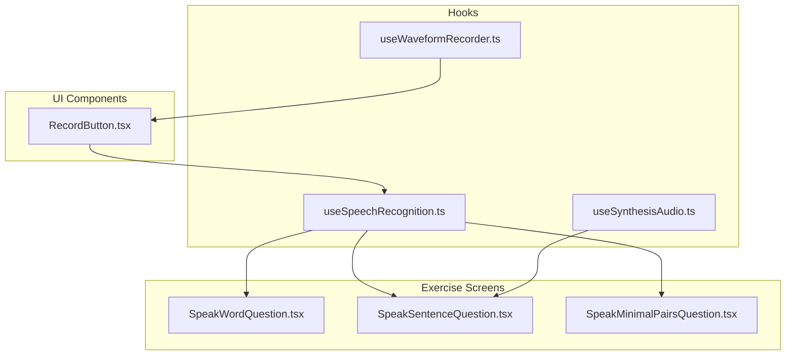
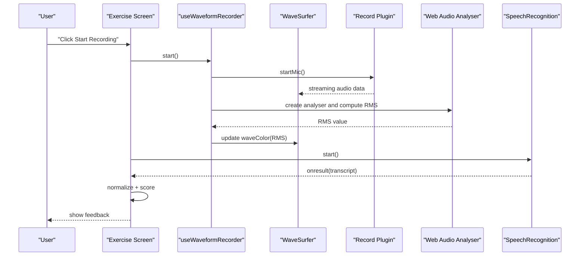
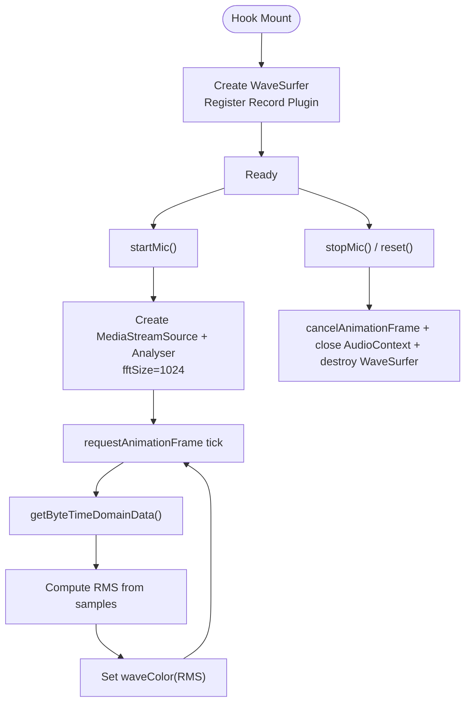
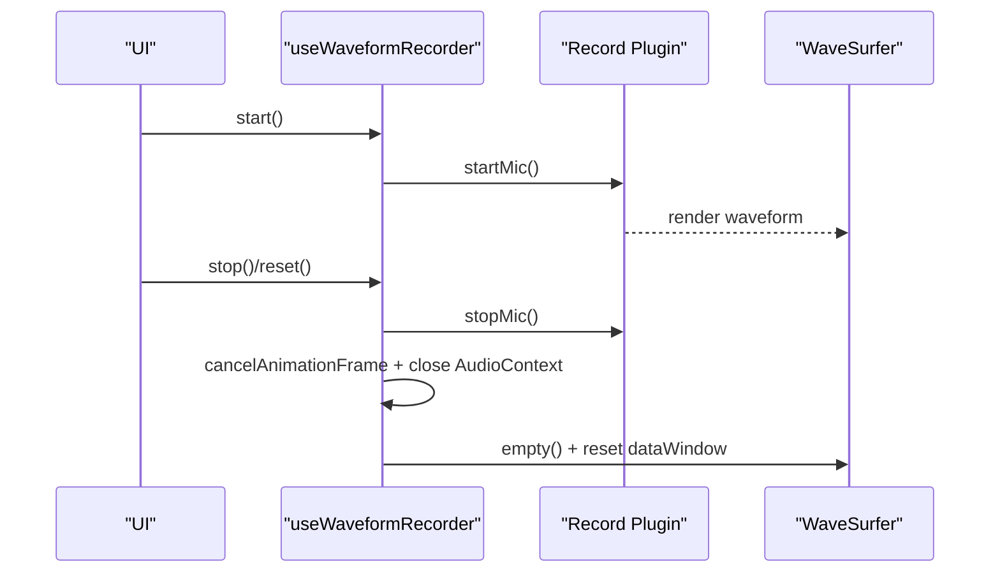
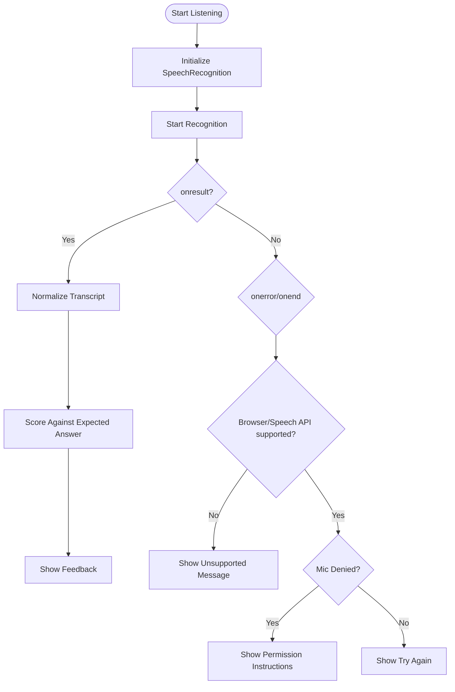
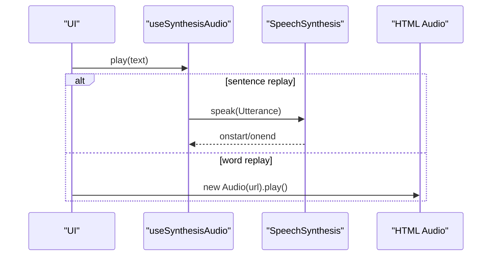
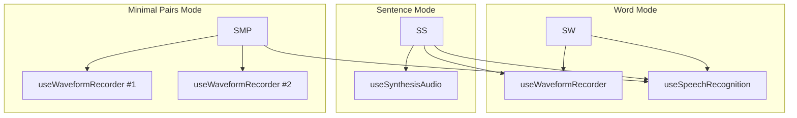
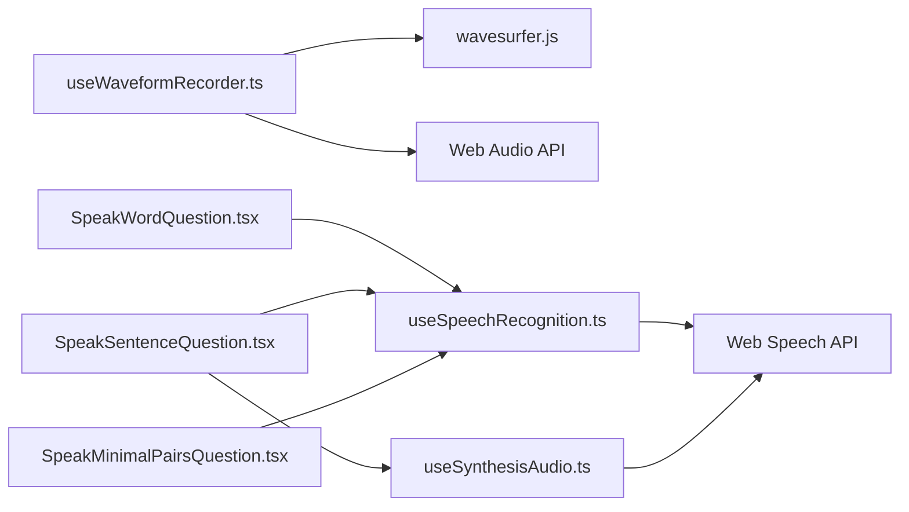

# Audio Processing Pipeline

<cite>
**Referenced Files in This Document**
- [useWaveformRecorder.ts](file://english_pronunciation_app/frontend/src/hooks/useWaveformRecorder.ts)
- [RecordButton.tsx](file://english_pronunciation_app/frontend/src/components/audio/RecordButton.tsx)
- [useSpeechRecognition.ts](file://english_pronunciation_app/frontend/src/hooks/useSpeechRecognition.ts)
- [useSynthesisAudio.ts](file://english_pronunciation_app/frontend/src/app/exercises/[id]/useSynthesisAudio.ts)
- [SpeakWordQuestion.tsx](file://english_pronunciation_app/frontend/src/app/exercises/[id]/SpeakWordQuestion.tsx)
- [SpeakSentenceQuestion.tsx](file://english_pronunciation_app/frontend/src/app/exercises/[id]/SpeakSentenceQuestion.tsx)
- [SpeakMinimalPairsQuestion.tsx](file://english_pronunciation_app/frontend/src/app/exercises/[id]/SpeakMinimalPairsQuestion.tsx)
- [useWaveformRecorder.test.ts](file://english_pronunciation_app/frontend/src/hooks/__tests__/useWaveformRecorder.test.ts)
- [package-lock.json](file://english_pronunciation_app/frontend/package-lock.json)
</cite>

## Table of Contents
1. [Introduction](#introduction)
2. [Project Structure](#project-structure)
3. [Core Components](#core-components)
4. [Architecture Overview](#architecture-overview)
5. [Detailed Component Analysis](#detailed-component-analysis)
6. [Dependency Analysis](#dependency-analysis)
7. [Performance Considerations](#performance-considerations)
8. [Troubleshooting Guide](#troubleshooting-guide)
9. [Conclusion](#conclusion)
10. [Appendices](#appendices)

## Introduction
This document describes the audio processing pipeline for pronunciation practice and assessment. It covers:
- WaveSurfer.js integration for real-time waveform visualization during microphone recording
- Real-time audio level monitoring using the Web Audio API
- Speech recognition workflow for pronunciation evaluation
- Audio replay mechanisms using Web Speech API synthesis and HTML Audio elements
- Practical guidance for noise reduction, normalization, and format conversion
- Performance optimization, memory management, and cross-browser compatibility
- Examples of waveform analysis for pronunciation assessment and audio quality metrics

## Project Structure
The audio pipeline spans React hooks, UI components, and exercise screens:
- Hook for waveform recording and level monitoring
- Speech recognition hook for transcribing spoken answers
- Exercise screens for word, sentence, and minimal pairs tasks
- Utility hook for speech synthesis playback
- A record button component integrating speech recognition

**Diagram sources**
- [useWaveformRecorder.ts:1-140](file://english_pronunciation_app/frontend/src/hooks/useWaveformRecorder.ts#L1-L140)
- [useSpeechRecognition.ts:1-111](file://english_pronunciation_app/frontend/src/hooks/useSpeechRecognition.ts#L1-L111)
- [useSynthesisAudio.ts:1-36](file://english_pronunciation_app/frontend/src/app/exercises/[id]/useSynthesisAudio.ts#L1-L36)
- [RecordButton.tsx:1-130](file://english_pronunciation_app/frontend/src/components/audio/RecordButton.tsx#L1-L130)
- [SpeakWordQuestion.tsx:1-222](file://english_pronunciation_app/frontend/src/app/exercises/[id]/SpeakWordQuestion.tsx#L1-L222)
- [SpeakSentenceQuestion.tsx:1-225](file://english_pronunciation_app/frontend/src/app/exercises/[id]/SpeakSentenceQuestion.tsx#L1-L225)
- [SpeakMinimalPairsQuestion.tsx:1-258](file://english_pronunciation_app/frontend/src/app/exercises/[id]/SpeakMinimalPairsQuestion.tsx#L1-L258)

**Section sources**
- [useWaveformRecorder.ts:1-140](file://english_pronunciation_app/frontend/src/hooks/useWaveformRecorder.ts#L1-L140)
- [useSpeechRecognition.ts:1-111](file://english_pronunciation_app/frontend/src/hooks/useSpeechRecognition.ts#L1-L111)
- [useSynthesisAudio.ts:1-36](file://english_pronunciation_app/frontend/src/app/exercises/[id]/useSynthesisAudio.ts#L1-L36)
- [RecordButton.tsx:1-130](file://english_pronunciation_app/frontend/src/components/audio/RecordButton.tsx#L1-L130)
- [SpeakWordQuestion.tsx:1-222](file://english_pronunciation_app/frontend/src/app/exercises/[id]/SpeakWordQuestion.tsx#L1-L222)
- [SpeakSentenceQuestion.tsx:1-225](file://english_pronunciation_app/frontend/src/app/exercises/[id]/SpeakSentenceQuestion.tsx#L1-L225)
- [SpeakMinimalPairsQuestion.tsx:1-258](file://english_pronunciation_app/frontend/src/app/exercises/[id]/SpeakMinimalPairsQuestion.tsx#L1-L258)

## Core Components
- useWaveformRecorder: Initializes WaveSurfer with the Record plugin, manages lifecycle, starts/stops microphone, monitors RMS amplitude for dynamic feedback, and clears waveform buffers properly.
- useSpeechRecognition: Wraps browser SpeechRecognition APIs, normalizes text, and emits transcription results for scoring.
- useSynthesisAudio: Provides speech synthesis playback for sentence-level tasks.
- Exercise screens: Orchestrate recording, scoring, and feedback presentation for word, sentence, and minimal pairs modes.
- RecordButton: Integrates speech recognition with visual and accessibility feedback.

Key behaviors:
- Real-time waveform rendering with scrolling enabled and recorded audio rendering disabled for performance.
- RMS-based dynamic coloring of the waveform to indicate silence, normal, and loud levels.
- Proper cleanup of animation frames, audio contexts, and WaveSurfer instances to prevent leaks.

**Section sources**
- [useWaveformRecorder.ts:1-140](file://english_pronunciation_app/frontend/src/hooks/useWaveformRecorder.ts#L1-L140)
- [useSpeechRecognition.ts:1-111](file://english_pronunciation_app/frontend/src/hooks/useSpeechRecognition.ts#L1-L111)
- [useSynthesisAudio.ts:1-36](file://english_pronunciation_app/frontend/src/app/exercises/[id]/useSynthesisAudio.ts#L1-L36)
- [RecordButton.tsx:1-130](file://english_pronunciation_app/frontend/src/components/audio/RecordButton.tsx#L1-L130)
- [SpeakWordQuestion.tsx:1-222](file://english_pronunciation_app/frontend/src/app/exercises/[id]/SpeakWordQuestion.tsx#L1-L222)
- [SpeakSentenceQuestion.tsx:1-225](file://english_pronunciation_app/frontend/src/app/exercises/[id]/SpeakSentenceQuestion.tsx#L1-L225)
- [SpeakMinimalPairsQuestion.tsx:1-258](file://english_pronunciation_app/frontend/src/app/exercises/[id]/SpeakMinimalPairsQuestion.tsx#L1-L258)

## Architecture Overview
The pipeline integrates three subsystems:
- Visualization: WaveSurfer with Record plugin renders a scrolling waveform while recording.
- Audio analysis: Web Audio API analyser computes RMS amplitude per frame for dynamic feedback.
- Recognition: Browser SpeechRecognition transcribes speech; results are normalized and scored.

**Diagram sources**
- [useWaveformRecorder.ts:99-112](file://english_pronunciation_app/frontend/src/hooks/useWaveformRecorder.ts#L99-L112)
- [SpeakSentenceQuestion.tsx:84-104](file://english_pronunciation_app/frontend/src/app/exercises/[id]/SpeakSentenceQuestion.tsx#L84-L104)
- [SpeakWordQuestion.tsx:88-111](file://english_pronunciation_app/frontend/src/app/exercises/[id]/SpeakWordQuestion.tsx#L88-L111)
- [SpeakMinimalPairsQuestion.tsx:106-148](file://english_pronunciation_app/frontend/src/app/exercises/[id]/SpeakMinimalPairsQuestion.tsx#L106-L148)

## Detailed Component Analysis

### WaveSurfer Integration and Real-Time Rendering
- Initialization: Creates WaveSurfer inside a DOM container with compact bar-style waveform rendering.
- Plugin registration: Uses the Record plugin with scrolling waveform enabled and recorded audio rendering disabled to reduce memory overhead.
- Lifecycle: Destroys WaveSurfer and cancels animation frames on unmount; closes AudioContext to release resources.
- Dynamic feedback: Computes RMS amplitude from time-domain samples and updates waveform color thresholds for silence, normal, and loud levels.

**Diagram sources**
- [useWaveformRecorder.ts:38-87](file://english_pronunciation_app/frontend/src/hooks/useWaveformRecorder.ts#L38-L87)
- [useWaveformRecorder.ts:99-136](file://english_pronunciation_app/frontend/src/hooks/useWaveformRecorder.ts#L99-L136)

**Section sources**
- [useWaveformRecorder.ts:1-140](file://english_pronunciation_app/frontend/src/hooks/useWaveformRecorder.ts#L1-L140)

### Audio Recording Workflow: Microphone to Processed Data
- Device access: Requests microphone permission and starts the Record plugin.
- Streaming: Renders a scrolling waveform in real time without storing full audio buffers.
- Post-recording: Stops microphone, cancels animation frames, closes AudioContext, and resets waveform state.
- Clearing old data: Empties WaveSurfer canvas and resets the plugin’s internal dataWindow to avoid stale waveform artifacts on retries.

**Diagram sources**
- [useWaveformRecorder.ts:99-136](file://english_pronunciation_app/frontend/src/hooks/useWaveformRecorder.ts#L99-L136)

**Section sources**
- [useWaveformRecorder.ts:89-97](file://english_pronunciation_app/frontend/src/hooks/useWaveformRecorder.ts#L89-L97)
- [useWaveformRecorder.ts:104-112](file://english_pronunciation_app/frontend/src/hooks/useWaveformRecorder.ts#L104-L112)

### Speech Recognition and Pronunciation Scoring
- SpeechRecognition initialization: Detects browser support and configures continuous, interimResults, and maxAlternatives.
- Transcription: Normalizes text (lowercase, trim, strip punctuation) for comparison against expected answers.
- Scoring: Word-level exact match; sentence-level uses word overlap accuracy computed elsewhere in the codebase.
- Error handling: Distinguishes unsupported browsers, blocked microphone, and no-speech conditions.

**Diagram sources**
- [useSpeechRecognition.ts:25-84](file://english_pronunciation_app/frontend/src/hooks/useSpeechRecognition.ts#L25-L84)
- [SpeakSentenceQuestion.tsx:71-82](file://english_pronunciation_app/frontend/src/app/exercises/[id]/SpeakSentenceQuestion.tsx#L71-L82)
- [SpeakWordQuestion.tsx:79-86](file://english_pronunciation_app/frontend/src/app/exercises/[id]/SpeakWordQuestion.tsx#L79-L86)

**Section sources**
- [useSpeechRecognition.ts:1-111](file://english_pronunciation_app/frontend/src/hooks/useSpeechRecognition.ts#L1-L111)
- [SpeakSentenceQuestion.tsx:71-82](file://english_pronunciation_app/frontend/src/app/exercises/[id]/SpeakSentenceQuestion.tsx#L71-L82)
- [SpeakWordQuestion.tsx:79-86](file://english_pronunciation_app/frontend/src/app/exercises/[id]/SpeakWordQuestion.tsx#L79-L86)

### Audio Replay Mechanisms
- Sentence-level: Uses speechSynthesis to synthesize and play the correct answer with voice selection.
- Word-level: Uses HTML Audio element to play pre-recorded audio URLs.

**Diagram sources**
- [useSynthesisAudio.ts:13-22](file://english_pronunciation_app/frontend/src/app/exercises/[id]/useSynthesisAudio.ts#L13-L22)
- [SpeakSentenceQuestion.tsx:29-38](file://english_pronunciation_app/frontend/src/app/exercises/[id]/SpeakSentenceQuestion.tsx#L29-L38)
- [SpeakWordQuestion.tsx:34-46](file://english_pronunciation_app/frontend/src/app/exercises/[id]/SpeakWordQuestion.tsx#L34-L46)

**Section sources**
- [useSynthesisAudio.ts:1-36](file://english_pronunciation_app/frontend/src/app/exercises/[id]/useSynthesisAudio.ts#L1-L36)
- [SpeakSentenceQuestion.tsx:29-38](file://english_pronunciation_app/frontend/src/app/exercises/[id]/SpeakSentenceQuestion.tsx#L29-L38)
- [SpeakWordQuestion.tsx:34-46](file://english_pronunciation_app/frontend/src/app/exercises/[id]/SpeakWordQuestion.tsx#L34-L46)

### Exercise Modes and Waveform Feedback
- Word mode: Displays masked word, optional IPA, audio replay, and waveform during recording with dynamic hint text based on RMS level.
- Sentence mode: Similar structure with longer recording windows and synthesis-based replay.
- Minimal pairs mode: Two simultaneous recorders with mutual exclusivity (only one records at a time), individual waveform containers, and combined feedback.

**Diagram sources**
- [SpeakWordQuestion.tsx:57-113](file://english_pronunciation_app/frontend/src/app/exercises/[id]/SpeakWordQuestion.tsx#L57-L113)
- [SpeakSentenceQuestion.tsx:48-106](file://english_pronunciation_app/frontend/src/app/exercises/[id]/SpeakSentenceQuestion.tsx#L48-L106)
- [SpeakMinimalPairsQuestion.tsx:83-148](file://english_pronunciation_app/frontend/src/app/exercises/[id]/SpeakMinimalPairsQuestion.tsx#L83-L148)

**Section sources**
- [SpeakWordQuestion.tsx:1-222](file://english_pronunciation_app/frontend/src/app/exercises/[id]/SpeakWordQuestion.tsx#L1-L222)
- [SpeakSentenceQuestion.tsx:1-225](file://english_pronunciation_app/frontend/src/app/exercises/[id]/SpeakSentenceQuestion.tsx#L1-L225)
- [SpeakMinimalPairsQuestion.tsx:1-258](file://english_pronunciation_app/frontend/src/app/exercises/[id]/SpeakMinimalPairsQuestion.tsx#L1-L258)

## Dependency Analysis
External libraries and browser APIs:
- wavesurfer.js: Core waveform rendering and recording plugin
- Web Audio API: Real-time audio analysis for RMS computation
- Web Speech API: Speech-to-text transcription
- HTML Audio: Playback of pre-recorded audio clips

**Diagram sources**
- [useWaveformRecorder.ts:4-5](file://english_pronunciation_app/frontend/src/hooks/useWaveformRecorder.ts#L4-L5)
- [useSpeechRecognition.ts:6-11](file://english_pronunciation_app/frontend/src/hooks/useSpeechRecognition.ts#L6-L11)
- [useSynthesisAudio.ts:14-22](file://english_pronunciation_app/frontend/src/app/exercises/[id]/useSynthesisAudio.ts#L14-L22)
- [SpeakWordQuestion.tsx:4-5](file://english_pronunciation_app/frontend/src/app/exercises/[id]/SpeakWordQuestion.tsx#L4-L5)
- [SpeakSentenceQuestion.tsx:4-7](file://english_pronunciation_app/frontend/src/app/exercises/[id]/SpeakSentenceQuestion.tsx#L4-L7)
- [SpeakMinimalPairsQuestion.tsx](file://english_pronunciation_app/frontend/src/app/exercises/[id]/SpeakMinimalPairsQuestion.tsx#L5)

**Section sources**
- [package-lock.json:2976-2982](file://english_pronunciation_app/frontend/package-lock.json#L2976-L2982)

## Performance Considerations
- Memory optimization
  - Disable rendered recorded audio in the Record plugin to avoid storing full buffers.
  - Clear WaveSurfer canvas and reset plugin’s internal dataWindow to prevent stale waveform artifacts on retries.
  - Close AudioContext and cancel animation frames on unmount to prevent leaks.
- CPU and battery
  - Keep analyser fftSize moderate (1024) to balance responsiveness and cost.
  - Use requestAnimationFrame loops judiciously; stop them when not recording.
- Real-time rendering
  - Use compact barWidth and barGap for dense but lightweight waveform bars.
  - Enable scrolling waveform to keep the viewport small and responsive.

[No sources needed since this section provides general guidance]

## Troubleshooting Guide
Common issues and remedies:
- Microphone access denied
  - Detect specific errors and guide users to enable microphone permissions in the browser settings.
- Browser lacks SpeechRecognition support
  - Provide fallback messaging and recommend supported browsers.
- No speech detected
  - Offer retry prompts and suggest speaking louder or more clearly.
- Stale waveform after retry
  - Ensure both WaveSurfer empty() and plugin dataWindow reset are executed.

**Section sources**
- [SpeakSentenceQuestion.tsx:90-96](file://english_pronunciation_app/frontend/src/app/exercises/[id]/SpeakSentenceQuestion.tsx#L90-L96)
- [SpeakWordQuestion.tsx:94-101](file://english_pronunciation_app/frontend/src/app/exercises/[id]/SpeakWordQuestion.tsx#L94-L101)
- [SpeakMinimalPairsQuestion.tsx:124-133](file://english_pronunciation_app/frontend/src/app/exercises/[id]/SpeakMinimalPairsQuestion.tsx#L124-L133)
- [useWaveformRecorder.ts:89-97](file://english_pronunciation_app/frontend/src/hooks/useWaveformRecorder.ts#L89-L97)

## Conclusion
The audio processing pipeline combines WaveSurfer for real-time waveform visualization, Web Audio for RMS-based dynamic feedback, and browser SpeechRecognition for pronunciation assessment. The exercise screens coordinate recording, scoring, and feedback, while hooks manage lifecycle and resource cleanup. By focusing on memory-efficient rendering, proper teardown, and robust error handling, the system delivers responsive and accessible pronunciation practice.

[No sources needed since this section summarizes without analyzing specific files]

## Appendices

### Audio Quality Metrics and Pronunciation Assessment
- RMS amplitude thresholds inform immediate feedback on volume levels.
- Text normalization and scoring strategies differ by mode:
  - Word mode: exact normalized match.
  - Sentence mode: word overlap accuracy threshold.
  - Minimal pairs mode: separate checks per word followed by combined pass/fail.

**Section sources**
- [useWaveformRecorder.ts:17-27](file://english_pronunciation_app/frontend/src/hooks/useWaveformRecorder.ts#L17-L27)
- [SpeakSentenceQuestion.tsx:71-82](file://english_pronunciation_app/frontend/src/app/exercises/[id]/SpeakSentenceQuestion.tsx#L71-L82)
- [SpeakWordQuestion.tsx:79-86](file://english_pronunciation_app/frontend/src/app/exercises/[id]/SpeakWordQuestion.tsx#L79-L86)
- [SpeakMinimalPairsQuestion.tsx:150-157](file://english_pronunciation_app/frontend/src/app/exercises/[id]/SpeakMinimalPairsQuestion.tsx#L150-L157)

### Cross-Browser Compatibility Notes
- SpeechRecognition availability varies; detect and handle absence gracefully.
- Prefer modern browsers with strong Web Speech API support.
- Provide clear user guidance for enabling microphone permissions.

**Section sources**
- [useSpeechRecognition.ts:25-41](file://english_pronunciation_app/frontend/src/hooks/useSpeechRecognition.ts#L25-L41)
- [SpeakSentenceQuestion.tsx:58-63](file://english_pronunciation_app/frontend/src/app/exercises/[id]/SpeakSentenceQuestion.tsx#L58-L63)
- [SpeakWordQuestion.tsx:68-73](file://english_pronunciation_app/frontend/src/app/exercises/[id]/SpeakWordQuestion.tsx#L68-L73)
- [SpeakMinimalPairsQuestion.tsx:95-101](file://english_pronunciation_app/frontend/src/app/exercises/[id]/SpeakMinimalPairsQuestion.tsx#L95-L101)

### Testing Guidance
- Unit tests validate RMS-to-color mapping for dynamic feedback.
- Integrate end-to-end tests covering recording lifecycle, transcription, and scoring.

**Section sources**
- [useWaveformRecorder.test.ts:1-16](file://english_pronunciation_app/frontend/src/hooks/__tests__/useWaveformRecorder.test.ts#L1-L16)