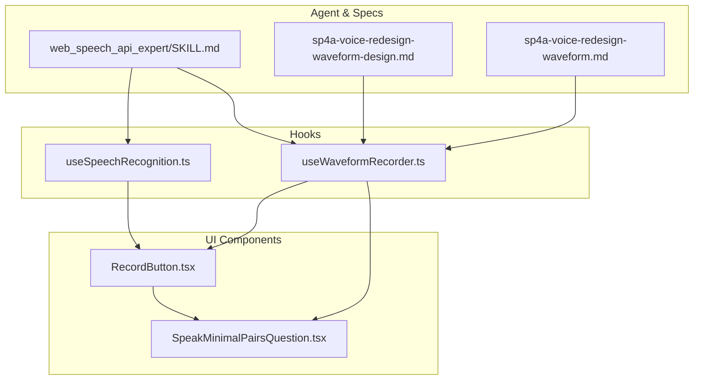
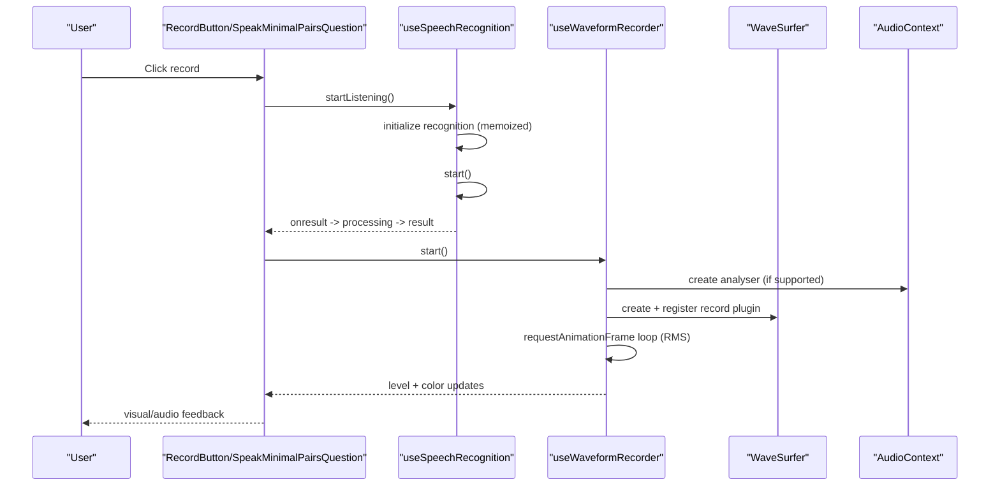
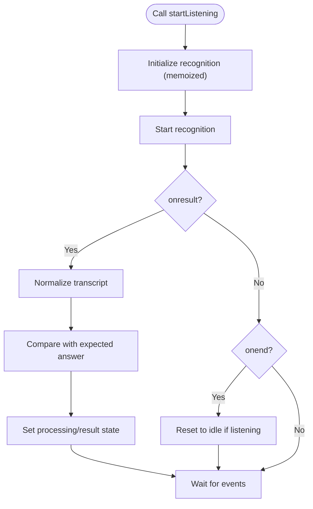
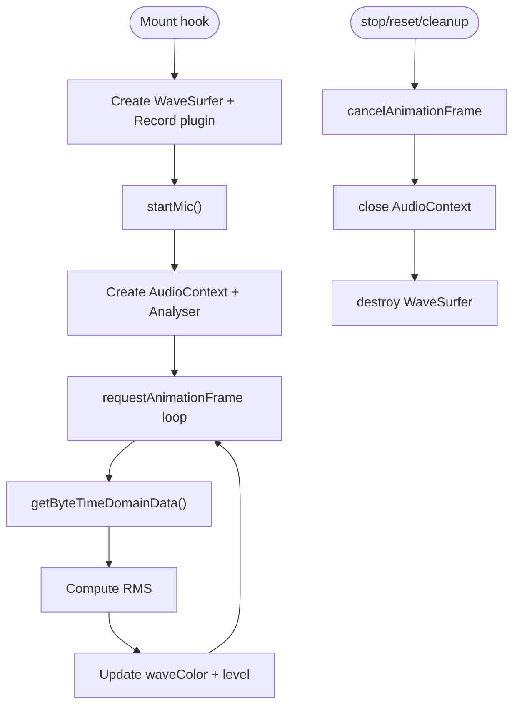
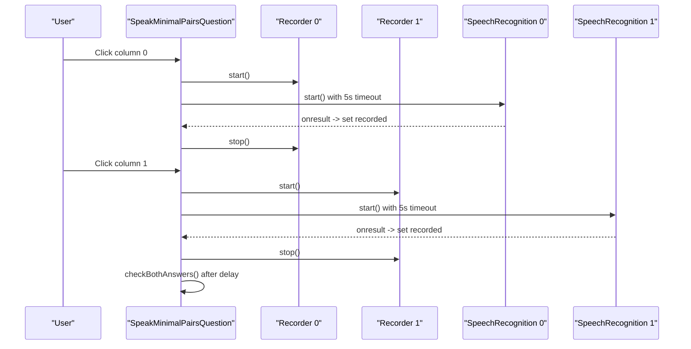
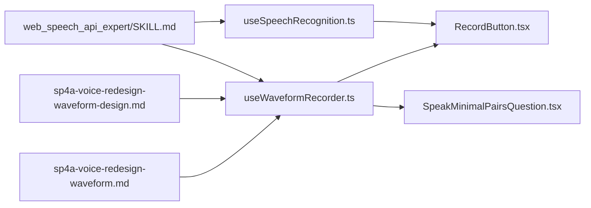

# Performance Optimization

<cite>
**Referenced Files in This Document**
- [useSpeechRecognition.ts](file://english_pronunciation_app/frontend/src/hooks/useSpeechRecognition.ts)
- [useWaveformRecorder.ts](file://english_pronunciation_app/frontend/src/hooks/useWaveformRecorder.ts)
- [RecordButton.tsx](file://english_pronunciation_app/frontend/src/components/audio/RecordButton.tsx)
- [SpeakMinimalPairsQuestion.tsx](file://english_pronunciation_app/frontend/src/app/exercises/[id]/SpeakMinimalPairsQuestion.tsx)
- [SKILL.md](file://english_pronunciation_app/.agents/skills/web_speech_api_expert/14)
- [2026-06-19-sp4a-voice-redesign-waveform-design.md](file://docs/superpowers/specs/2026-06-19-sp4a-voice-redesign-waveform-design.md)
- [2026-06-19-sp4a-voice-redesign-waveform.md](file://docs/superpowers/plans/2026-06-19-sp4a-voice-redesign-waveform.md)
- [CURRENT_SYSTEM_STATUS.md](file://PLAN/_Archive/CURRENT_SYSTEM_STATUS.md)
- [2026-06-18-sp1-in-exercise-feedback.md](file://docs/2026-06-18-sp1-in-exercise-feedback.md)
- [.gitignore](file://english_pronunciation_app/.gitignore)
</cite>

## Table of Contents
1. [Introduction](#introduction)
2. [Project Structure](#project-structure)
3. [Core Components](#core-components)
4. [Architecture Overview](#architecture-overview)
5. [Detailed Component Analysis](#detailed-component-analysis)
6. [Dependency Analysis](#dependency-analysis)
7. [Performance Considerations](#performance-considerations)
8. [Troubleshooting Guide](#troubleshooting-guide)
9. [Conclusion](#conclusion)
10. [Appendices](#appendices)

## Introduction
This document focuses on performance optimization and resource management for speech recognition and audio processing in the application. It covers:
- Memory optimization for audio processing and waveform rendering
- Efficient state management for speech recognition hooks
- Browser-specific optimizations and graceful fallbacks
- Throttling mechanisms for continuous speech processing
- Battery usage considerations for mobile devices
- Network optimization for AI-assisted speech analysis
- Caching strategies for audio data
- Graceful degradation for low-performance devices
- Best practices for maintaining responsive UI during intensive audio operations

## Project Structure
The speech and audio pipeline centers around reusable React hooks and exercise components:
- Hooks encapsulate Web Speech API and Web Audio API logic
- Exercise components orchestrate UI, state transitions, and user feedback
- Design specs and implementation plans define performance-sensitive behaviors and edge-case handling

**Diagram sources**
- [useSpeechRecognition.ts:1-111](file://english_pronunciation_app/frontend/src/hooks/useSpeechRecognition.ts#L1-L111)
- [useWaveformRecorder.ts:1-140](file://english_pronunciation_app/frontend/src/hooks/useWaveformRecorder.ts#L1-L140)
- [RecordButton.tsx:1-130](file://english_pronunciation_app/frontend/src/components/audio/RecordButton.tsx#L1-L130)
- [SpeakMinimalPairsQuestion.tsx:1-258](file://english_pronunciation_app/frontend/src/app/exercises/[id]/SpeakMinimalPairsQuestion.tsx#L1-L258)
- [SKILL.md:1-14](file://english_pronunciation_app/.agents/skills/web_speech_api_expert/SKILL.md#L1-L14)
- [2026-06-19-sp4a-voice-redesign-waveform-design.md:1-178](file://docs/superpowers/specs/2026-06-19-sp4a-voice-redesign-waveform-design.md#L1-L178)
- [2026-06-19-sp4a-voice-redesign-waveform.md:1-1155](file://docs/superpowers/plans/2026-06-19-sp4a-voice-redesign-waveform.md#L1-L1155)

**Section sources**
- [useSpeechRecognition.ts:1-111](file://english_pronunciation_app/frontend/src/hooks/useSpeechRecognition.ts#L1-L111)
- [useWaveformRecorder.ts:1-140](file://english_pronunciation_app/frontend/src/hooks/useWaveformRecorder.ts#L1-L140)
- [RecordButton.tsx:1-130](file://english_pronunciation_app/frontend/src/components/audio/RecordButton.tsx#L1-L130)
- [SpeakMinimalPairsQuestion.tsx:1-258](file://english_pronunciation_app/frontend/src/app/exercises/[id]/SpeakMinimalPairsQuestion.tsx#L1-L258)
- [2026-06-19-sp4a-voice-redesign-waveform-design.md:1-178](file://docs/superpowers/specs/2026-06-19-sp4a-voice-redesign-waveform-design.md#L1-L178)
- [2026-06-19-sp4a-voice-redesign-waveform.md:1-1155](file://docs/superpowers/plans/2026-06-19-sp4a-voice-redesign-waveform.md#L1-L1155)

## Core Components
- useSpeechRecognition: Manages SpeechRecognition lifecycle, normalization, and state transitions. It memoizes the recognition instance to avoid repeated creation and ensures proper cleanup on unmount.
- useWaveformRecorder: Integrates wavesurfer.js with the record plugin and Web Audio AnalyserNode to render live waveform and provide dynamic feedback via color changes based on RMS amplitude. It manages AudioContext lifecycle and cancels animation frames on cleanup.
- RecordButton: Bridges the hook state to UI actions and accessibility attributes, providing clear feedback for assistive technologies.
- SpeakMinimalPairsQuestion: Demonstrates coordinated use of two recorders and SpeechRecognition instances, with throttled timeouts and mutual exclusion of simultaneous recordings.

Key performance patterns:
- Memoization of SpeechRecognition instances
- Controlled lifecycle of AudioContext and analyser loops
- Conditional rendering and visibility to minimize DOM overhead
- Graceful fallbacks for unsupported browsers and permissions

**Section sources**
- [useSpeechRecognition.ts:1-111](file://english_pronunciation_app/frontend/src/hooks/useSpeechRecognition.ts#L1-L111)
- [useWaveformRecorder.ts:1-140](file://english_pronunciation_app/frontend/src/hooks/useWaveformRecorder.ts#L1-L140)
- [RecordButton.tsx:1-130](file://english_pronunciation_app/frontend/src/components/audio/RecordButton.tsx#L1-L130)
- [SpeakMinimalPairsQuestion.tsx:1-258](file://english_pronunciation_app/frontend/src/app/exercises/[id]/SpeakMinimalPairsQuestion.tsx#L1-L258)

## Architecture Overview
The system separates concerns across hooks, components, and agent/spec guidance:
- Hooks encapsulate platform APIs and compute-intensive tasks
- Components manage UI state and user interactions
- Agent skills define browser compatibility and fallback strategies
- Design/specs outline dynamic feedback and performance trade-offs

**Diagram sources**
- [useSpeechRecognition.ts:1-111](file://english_pronunciation_app/frontend/src/hooks/useSpeechRecognition.ts#L1-L111)
- [useWaveformRecorder.ts:1-140](file://english_pronunciation_app/frontend/src/hooks/useWaveformRecorder.ts#L1-L140)
- [RecordButton.tsx:1-130](file://english_pronunciation_app/frontend/src/components/audio/RecordButton.tsx#L1-L130)
- [SpeakMinimalPairsQuestion.tsx:1-258](file://english_pronunciation_app/frontend/src/app/exercises/[id]/SpeakMinimalPairsQuestion.tsx#L1-L258)

## Detailed Component Analysis

### useSpeechRecognition Hook
- Purpose: Encapsulates SpeechRecognition initialization, event handling, and normalization logic
- Memory optimization:
  - Memoizes the recognition instance to prevent recreation
  - Uses controlled state transitions to avoid unnecessary renders
- Throttling and timeouts:
  - Applies short timeouts for single-result recognition to limit processing time
- Error handling:
  - Normalizes errors and surfaces user-friendly messages
- Accessibility:
  - Provides live regions for screen readers

**Diagram sources**
- [useSpeechRecognition.ts:1-111](file://english_pronunciation_app/frontend/src/hooks/useSpeechRecognition.ts#L1-L111)

**Section sources**
- [useSpeechRecognition.ts:1-111](file://english_pronunciation_app/frontend/src/hooks/useSpeechRecognition.ts#L1-L111)

### useWaveformRecorder Hook
- Purpose: Manages wavesurfer.js + record plugin + AnalyserNode for live waveform and dynamic feedback
- Memory optimization:
  - Cancels animation frames and closes AudioContext on cleanup
  - Resets internal buffers to prevent stale data accumulation
- Dynamic feedback:
  - Computes RMS from time-domain samples and updates waveform color accordingly
- Edge cases:
  - Graceful degradation when AudioContext is unavailable
  - Mutual exclusion of simultaneous mic streams in multi-recorder scenarios

**Diagram sources**
- [useWaveformRecorder.ts:1-140](file://english_pronunciation_app/frontend/src/hooks/useWaveformRecorder.ts#L1-L140)

**Section sources**
- [useWaveformRecorder.ts:1-140](file://english_pronunciation_app/frontend/src/hooks/useWaveformRecorder.ts#L1-L140)
- [2026-06-19-sp4a-voice-redesign-waveform-design.md:29-57](file://docs/superpowers/specs/2026-06-19-sp4a-voice-redesign-waveform-design.md#L29-L57)

### RecordButton Component
- Purpose: Bridges hook state to UI actions and accessibility
- Performance considerations:
  - Uses disabled states to prevent redundant operations
  - Renders only necessary elements based on state
  - Provides live regions for assistive tech

**Section sources**
- [RecordButton.tsx:1-130](file://english_pronunciation_app/frontend/src/components/audio/RecordButton.tsx#L1-L130)

### SpeakMinimalPairsQuestion Component
- Purpose: Coordinates dual-recorder and dual-SpeechRecognition flows
- Performance considerations:
  - Mutual exclusion of simultaneous recordings
  - Reset between trials to avoid waveform overlap
  - Short timeouts for recognition to bound processing time
- Edge cases:
  - Permission-denied handling with actionable guidance
  - Graceful fallback when SpeechRecognition is unsupported

**Diagram sources**
- [SpeakMinimalPairsQuestion.tsx:1-258](file://english_pronunciation_app/frontend/src/app/exercises/[id]/SpeakMinimalPairsQuestion.tsx#L1-L258)

**Section sources**
- [SpeakMinimalPairsQuestion.tsx:1-258](file://english_pronunciation_app/frontend/src/app/exercises/[id]/SpeakMinimalPairsQuestion.tsx#L1-L258)

## Dependency Analysis
- Hook-to-hook dependencies:
  - RecordButton depends on useSpeechRecognition
  - Exercise components depend on useWaveformRecorder
- External dependencies:
  - wavesurfer.js and record plugin for waveform rendering
  - Web Audio API for real-time audio analysis
  - Web Speech API for speech recognition
- Agent/spec guidance:
  - Browser compatibility and fallback strategies
  - Dynamic feedback thresholds and performance risks

**Diagram sources**
- [useSpeechRecognition.ts:1-111](file://english_pronunciation_app/frontend/src/hooks/useSpeechRecognition.ts#L1-L111)
- [useWaveformRecorder.ts:1-140](file://english_pronunciation_app/frontend/src/hooks/useWaveformRecorder.ts#L1-L140)
- [RecordButton.tsx:1-130](file://english_pronunciation_app/frontend/src/components/audio/RecordButton.tsx#L1-L130)
- [SpeakMinimalPairsQuestion.tsx:1-258](file://english_pronunciation_app/frontend/src/app/exercises/[id]/SpeakMinimalPairsQuestion.tsx#L1-L258)
- [SKILL.md:1-14](file://english_pronunciation_app/.agents/skills/web_speech_api_expert/SKILL.md#L1-L14)
- [2026-06-19-sp4a-voice-redesign-waveform-design.md:1-178](file://docs/superpowers/specs/2026-06-19-sp4a-voice-redesign-waveform-design.md#L1-L178)
- [2026-06-19-sp4a-voice-redesign-waveform.md:1-1155](file://docs/superpowers/plans/2026-06-19-sp4a-voice-redesign-waveform.md#L1-L1155)

**Section sources**
- [useSpeechRecognition.ts:1-111](file://english_pronunciation_app/frontend/src/hooks/useSpeechRecognition.ts#L1-L111)
- [useWaveformRecorder.ts:1-140](file://english_pronunciation_app/frontend/src/hooks/useWaveformRecorder.ts#L1-L140)
- [RecordButton.tsx:1-130](file://english_pronunciation_app/frontend/src/components/audio/RecordButton.tsx#L1-L130)
- [SpeakMinimalPairsQuestion.tsx:1-258](file://english_pronunciation_app/frontend/src/app/exercises/[id]/SpeakMinimalPairsQuestion.tsx#L1-L258)
- [SKILL.md:1-14](file://english_pronunciation_app/.agents/skills/web_speech_api_expert/SKILL.md#L1-L14)
- [2026-06-19-sp4a-voice-redesign-waveform-design.md:1-178](file://docs/superpowers/specs/2026-06-19-sp4a-voice-redesign-waveform-design.md#L1-L178)
- [2026-06-19-sp4a-voice-redesign-waveform.md:1-1155](file://docs/superpowers/plans/2026-06-19-sp4a-voice-redesign-waveform.md#L1-L1155)

## Performance Considerations
- Memory optimization
  - Cancel animation frames and close AudioContext on cleanup to prevent leaks
  - Reset internal buffers (e.g., record plugin dataWindow) to avoid stale data
  - Reuse SpeechRecognition instances via memoization
- State management
  - Use controlled state transitions to minimize re-renders
  - Disable UI controls during processing to avoid redundant operations
- Browser-specific optimizations
  - Detect and gracefully handle unsupported browsers
  - Provide actionable fallbacks (e.g., typing mode) when SpeechRecognition is unavailable
- Throttling and timeouts
  - Apply bounded timeouts for recognition to limit processing duration
  - Avoid simultaneous mic streams; coordinate recorder lifecycles
- Battery usage (mobile)
  - Reduce analyser sampling rate or decimate frames if needed
  - Minimize long-lived animation loops; pause when inactive
- Network optimization
  - Keep speech recognition client-side; send only normalized transcripts
  - Cache audio assets locally and avoid repeated downloads
- UI responsiveness
  - Render only visible elements; hide waveform containers when idle
  - Use lightweight visual feedback (e.g., color changes) instead of heavy animations

[No sources needed since this section provides general guidance]

## Troubleshooting Guide
Common issues and resolutions:
- Microphone permission blocked
  - Detect denial and guide users to enable microphone in site settings
  - Provide fallback to SpeechRecognition-only mode
- AudioContext not supported
  - Gracefully degrade to static waveform or disable dynamic feedback
- Simultaneous mic streams
  - Enforce mutual exclusion; stop other recorder before starting a new one
- Long processing delays
  - Apply timeouts and short recognition windows
  - Debounce UI interactions during processing

**Section sources**
- [SpeakMinimalPairsQuestion.tsx:124-133](file://english_pronunciation_app/frontend/src/app/exercises/[id]/SpeakMinimalPairsQuestion.tsx#L124-L133)
- [2026-06-19-sp4a-voice-redesign-waveform-design.md:160-165](file://docs/superpowers/specs/2026-06-19-sp4a-voice-redesign-waveform-design.md#L160-L165)
- [CURRENT_SYSTEM_STATUS.md:794-804](file://PLAN/_Archive/CURRENT_SYSTEM_STATUS.md#L794-L804)

## Conclusion
By centralizing audio processing in dedicated hooks, bounding processing durations, and implementing robust fallbacks, the system achieves responsive performance across diverse browsers and devices. The design emphasizes memory safety, controlled state transitions, and user-centric feedback to maintain a smooth experience during intensive audio operations.

[No sources needed since this section summarizes without analyzing specific files]

## Appendices

### Performance Profiling and Bottleneck Identification
- Use browser devtools to profile:
  - CPU usage during recognition and analyser loops
  - Memory growth during extended sessions
  - Rendering cost of waveform updates
- Identify bottlenecks:
  - Excessive requestAnimationFrame calls
  - Unbounded timeouts or timers
  - Multiple concurrent mic streams
- Optimization patterns:
  - Decimate analyser updates (e.g., every N ms)
  - Use debounced UI updates
  - Release resources promptly on unmount

[No sources needed since this section provides general guidance]

### Network Optimization for AI-Assisted Speech Analysis
- Keep client-side processing for speech recognition
- Send only normalized transcripts to backend
- Cache audio assets locally to reduce network requests

**Section sources**
- [SKILL.md:11-13](file://english_pronunciation_app/.agents/skills/web_speech_api_expert/SKILL.md#L11-L13)
- [.gitignore:1-2](file://english_pronunciation_app/.gitignore#L1-L2)

### Caching Strategies for Audio Data
- Store audio files under public directory and reference via URLs
- Validate asset presence during seeding and verification steps
- Avoid committing generated audio to version control

**Section sources**
- [.gitignore:1-2](file://english_pronunciation_app/.gitignore#L1-L2)
- [2026-06-18-sp1-in-exercise-feedback.md:86-112](file://docs/2026-06-18-sp1-in-exercise-feedback.md#L86-L112)

### Graceful Degradation for Low-Performance Devices
- Detect unsupported features and present clear alternatives
- Reduce visual effects for users who prefer reduced motion
- Provide shorter recognition windows and simpler UI layouts

**Section sources**
- [2026-06-19-sp4a-voice-redesign-waveform-design.md:160-165](file://docs/superpowers/specs/2026-06-19-sp4a-voice-redesign-waveform-design.md#L160-L165)
- [2026-06-18-sp1-in-exercise-feedback.md:4-7](file://docs/2026-06-18-sp1-in-exercise-feedback.md#L4-L7)