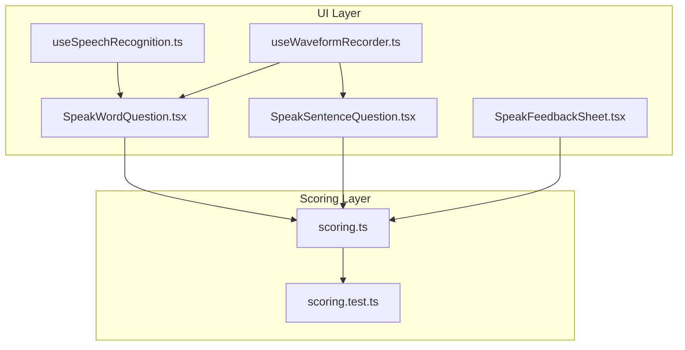
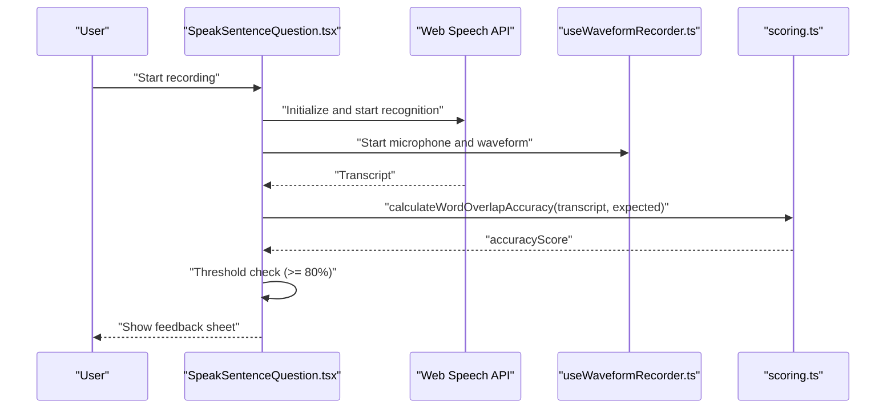
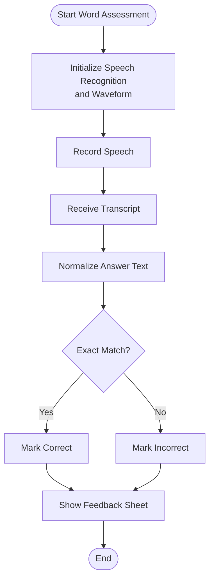
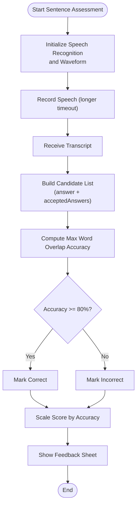
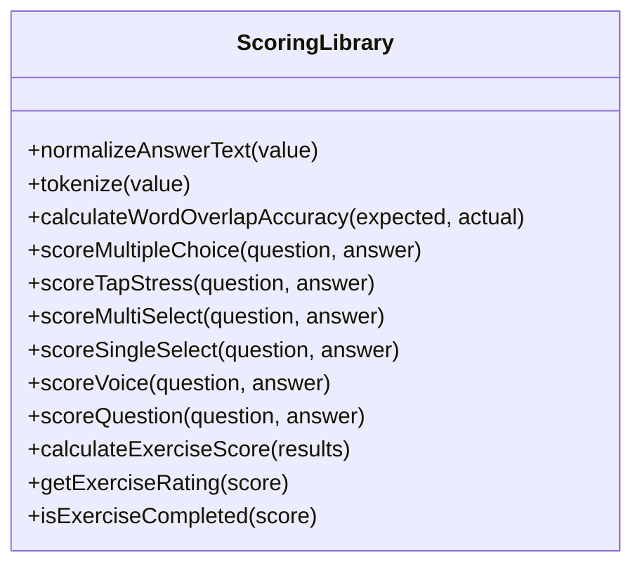
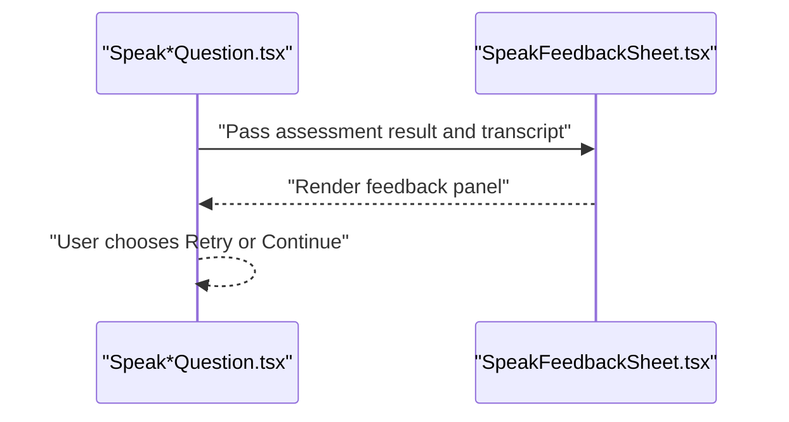
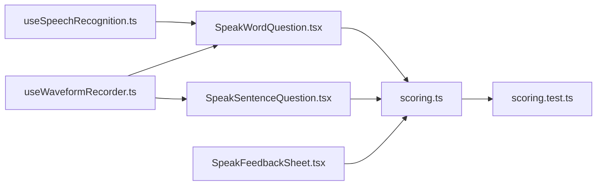

# Pronunciation Assessment Algorithm

<cite>
**Referenced Files in This Document**
- [scoring.ts](file://english_pronunciation_app/frontend/src/lib/scoring.ts)
- [scoring.test.ts](file://english_pronunciation_app/frontend/src/lib/__tests__/scoring.test.ts)
- [SpeakWordQuestion.tsx](file://english_pronunciation_app/frontend/src/app/exercises/[id]/SpeakWordQuestion.tsx)
- [SpeakSentenceQuestion.tsx](file://english_pronunciation_app/frontend/src/app/exercises/[id]/SpeakSentenceQuestion.tsx)
- [SpeakFeedbackSheet.tsx](file://english_pronunciation_app/frontend/src/app/exercises/[id]/SpeakFeedbackSheet.tsx)
- [useSpeechRecognition.ts](file://english_pronunciation_app/frontend/src/hooks/useSpeechRecognition.ts)
- [useWaveformRecorder.ts](file://english_pronunciation_app/frontend/src/hooks/useWaveformRecorder.ts)
</cite>

## Table of Contents
1. [Introduction](#introduction)
2. [Project Structure](#project-structure)
3. [Core Components](#core-components)
4. [Architecture Overview](#architecture-overview)
5. [Detailed Component Analysis](#detailed-component-analysis)
6. [Dependency Analysis](#dependency-analysis)
7. [Performance Considerations](#performance-considerations)
8. [Troubleshooting Guide](#troubleshooting-guide)
9. [Conclusion](#conclusion)
10. [Appendices](#appendices)

## Introduction
This document explains the pronunciation assessment algorithm and accuracy scoring system used in the application. It focuses on how user speech is compared against expected answers, including phonetic matching, timing analysis, and prosody evaluation. It also documents scoring criteria for different exercise types (word vs sentence), partial credit systems, threshold calculations for correctness determination, examples of assessment workflows, scoring rubrics, and feedback generation. Finally, it addresses algorithmic considerations such as tolerance ranges, accent accommodation, and adaptive difficulty scaling, along with integration with backend AI services and fallback mechanisms for local processing.

## Project Structure
The pronunciation assessment spans three layers:
- Frontend UI and interaction:
  - SpeakWordQuestion and SpeakSentenceQuestion orchestrate recording and feedback.
  - SpeakFeedbackSheet displays contextual feedback after assessment.
  - useSpeechRecognition and useWaveformRecorder provide speech capture and real-time audio level feedback.
- Scoring library:
  - scoring.ts defines normalization, word overlap accuracy, and scoring functions for multiple question types.
  - scoring.test.ts validates behavior for IPA, word, and multi-answer modes.

**Diagram sources**
- [SpeakWordQuestion.tsx:1-222](file://english_pronunciation_app/frontend/src/app/exercises/[id]/SpeakWordQuestion.tsx#L1-L222)
- [SpeakSentenceQuestion.tsx:1-225](file://english_pronunciation_app/frontend/src/app/exercises/[id]/SpeakSentenceQuestion.tsx#L1-L225)
- [SpeakFeedbackSheet.tsx:1-96](file://english_pronunciation_app/frontend/src/app/exercises/[id]/SpeakFeedbackSheet.tsx#L1-L96)
- [useSpeechRecognition.ts:1-111](file://english_pronunciation_app/frontend/src/hooks/useSpeechRecognition.ts#L1-L111)
- [useWaveformRecorder.ts:1-140](file://english_pronunciation_app/frontend/src/hooks/useWaveformRecorder.ts#L1-L140)
- [scoring.ts:1-227](file://english_pronunciation_app/frontend/src/lib/scoring.ts#L1-L227)
- [scoring.test.ts:1-292](file://english_pronunciation_app/frontend/src/lib/__tests__/scoring.test.ts#L1-L292)

**Section sources**
- [SpeakWordQuestion.tsx:1-222](file://english_pronunciation_app/frontend/src/app/exercises/[id]/SpeakWordQuestion.tsx#L1-L222)
- [SpeakSentenceQuestion.tsx:1-225](file://english_pronunciation_app/frontend/src/app/exercises/[id]/SpeakSentenceQuestion.tsx#L1-L225)
- [SpeakFeedbackSheet.tsx:1-96](file://english_pronunciation_app/frontend/src/app/exercises/[id]/SpeakFeedbackSheet.tsx#L1-L96)
- [useSpeechRecognition.ts:1-111](file://english_pronunciation_app/frontend/src/hooks/useSpeechRecognition.ts#L1-L111)
- [useWaveformRecorder.ts:1-140](file://english_pronunciation_app/frontend/src/hooks/useWaveformRecorder.ts#L1-L140)
- [scoring.ts:1-227](file://english_pronunciation_app/frontend/src/lib/scoring.ts#L1-L227)
- [scoring.test.ts:1-292](file://english_pronunciation_app/frontend/src/lib/__tests__/scoring.test.ts#L1-L292)

## Core Components
- Word overlap accuracy:
  - Normalization strips punctuation, converts to lowercase, and collapses whitespace.
  - Tokenization splits normalized strings into words.
  - Overlap computes the proportion of expected tokens matched in order, allowing reuse per token.
- Voice scoring:
  - For sentence-type questions, supports multi-answer acceptance via candidate expansion.
  - Threshold-based correctness and scaled score calculation.
- Question scoring dispatcher:
  - Routes to specialized scorers by question type ID.
- Exercise-level aggregation:
  - Computes raw score, maximum possible score, percentage, and pass/fail rating.

Key behaviors validated by tests:
- IPA exact matching versus normalized word matching.
- Multi-answer support for sentence transcription.
- Rating thresholds and completion criteria.

**Section sources**
- [scoring.ts:40-131](file://english_pronunciation_app/frontend/src/lib/scoring.ts#L40-L131)
- [scoring.ts:191-201](file://english_pronunciation_app/frontend/src/lib/scoring.ts#L191-L201)
- [scoring.ts:203-227](file://english_pronunciation_app/frontend/src/lib/scoring.ts#L203-L227)
- [scoring.test.ts:29-83](file://english_pronunciation_app/frontend/src/lib/__tests__/scoring.test.ts#L29-L83)
- [scoring.test.ts:121-200](file://english_pronunciation_app/frontend/src/lib/__tests__/scoring.test.ts#L121-L200)
- [scoring.test.ts:261-291](file://english_pronunciation_app/frontend/src/lib/__tests__/scoring.test.ts#L261-L291)

## Architecture Overview
The assessment pipeline integrates UI controls, speech capture, and scoring logic.

**Diagram sources**
- [SpeakSentenceQuestion.tsx:84-104](file://english_pronunciation_app/frontend/src/app/exercises/[id]/SpeakSentenceQuestion.tsx#L84-L104)
- [SpeakSentenceQuestion.tsx:69-82](file://english_pronunciation_app/frontend/src/app/exercises/[id]/SpeakSentenceQuestion.tsx#L69-L82)
- [useWaveformRecorder.ts:99-123](file://english_pronunciation_app/frontend/src/hooks/useWaveformRecorder.ts#L99-L123)
- [scoring.ts:52-72](file://english_pronunciation_app/frontend/src/lib/scoring.ts#L52-L72)

## Detailed Component Analysis

### Word-Level Assessment Workflow
- UI collects speech via Web Speech API and renders real-time waveform with volume hints.
- Transcript is normalized and compared to the expected answer.
- Decision is binary: exact normalized match determines correctness.

**Diagram sources**
- [SpeakWordQuestion.tsx:88-111](file://english_pronunciation_app/frontend/src/app/exercises/[id]/SpeakWordQuestion.tsx#L88-L111)
- [SpeakWordQuestion.tsx:79-86](file://english_pronunciation_app/frontend/src/app/exercises/[id]/SpeakWordQuestion.tsx#L79-L86)
- [scoring.ts:40-46](file://english_pronunciation_app/frontend/src/lib/scoring.ts#L40-L46)

**Section sources**
- [SpeakWordQuestion.tsx:57-111](file://english_pronunciation_app/frontend/src/app/exercises/[id]/SpeakWordQuestion.tsx#L57-L111)
- [scoring.ts:40-46](file://english_pronunciation_app/frontend/src/lib/scoring.ts#L40-L46)

### Sentence-Level Assessment Workflow
- UI supports optional sentence reveal and synthesized playback.
- Transcript undergoes word overlap accuracy computation against single or multiple accepted answers.
- Threshold-based correctness and scaled score calculation.

**Diagram sources**
- [SpeakSentenceQuestion.tsx:84-104](file://english_pronunciation_app/frontend/src/app/exercises/[id]/SpeakSentenceQuestion.tsx#L84-L104)
- [SpeakSentenceQuestion.tsx:69-82](file://english_pronunciation_app/frontend/src/app/exercises/[id]/SpeakSentenceQuestion.tsx#L69-L82)
- [scoring.ts:108-131](file://english_pronunciation_app/frontend/src/lib/scoring.ts#L108-L131)
- [scoring.ts:52-72](file://english_pronunciation_app/frontend/src/lib/scoring.ts#L52-L72)

**Section sources**
- [SpeakSentenceQuestion.tsx:48-104](file://english_pronunciation_app/frontend/src/app/exercises/[id]/SpeakSentenceQuestion.tsx#L48-L104)
- [scoring.ts:108-131](file://english_pronunciation_app/frontend/src/lib/scoring.ts#L108-L131)

### Scoring Library Internals
- Normalization and tokenization define the matching basis.
- Word overlap counts matched tokens while accounting for reuse.
- Specialized scorers handle multiple-choice, tap-stress, multi-select, and single-select variants.
- Voice scorer computes accuracy and applies a pass threshold.

**Diagram sources**
- [scoring.ts:40-227](file://english_pronunciation_app/frontend/src/lib/scoring.ts#L40-L227)

**Section sources**
- [scoring.ts:40-131](file://english_pronunciation_app/frontend/src/lib/scoring.ts#L40-L131)
- [scoring.ts:191-201](file://english_pronunciation_app/frontend/src/lib/scoring.ts#L191-L201)
- [scoring.ts:203-227](file://english_pronunciation_app/frontend/src/lib/scoring.ts#L203-L227)

### Feedback Generation
- Feedback sheet overlays contextual messages and actions.
- Correct/incorrect styling and replay controls guide next steps.

**Diagram sources**
- [SpeakFeedbackSheet.tsx:18-95](file://english_pronunciation_app/frontend/src/app/exercises/[id]/SpeakFeedbackSheet.tsx#L18-L95)
- [SpeakWordQuestion.tsx:208-217](file://english_pronunciation_app/frontend/src/app/exercises/[id]/SpeakWordQuestion.tsx#L208-L217)
- [SpeakSentenceQuestion.tsx:202-221](file://english_pronunciation_app/frontend/src/app/exercises/[id]/SpeakSentenceQuestion.tsx#L202-L221)

**Section sources**
- [SpeakFeedbackSheet.tsx:18-95](file://english_pronunciation_app/frontend/src/app/exercises/[id]/SpeakFeedbackSheet.tsx#L18-L95)
- [SpeakWordQuestion.tsx:208-217](file://english_pronunciation_app/frontend/src/app/exercises/[id]/SpeakWordQuestion.tsx#L208-L217)
- [SpeakSentenceQuestion.tsx:202-221](file://english_pronunciation_app/frontend/src/app/exercises/[id]/SpeakSentenceQuestion.tsx#L202-L221)

## Dependency Analysis
- UI components depend on scoring utilities for accuracy computation.
- Waveform and speech recognition hooks provide runtime feedback and capture.
- Tests validate scoring logic and edge cases.

**Diagram sources**
- [SpeakWordQuestion.tsx:1-222](file://english_pronunciation_app/frontend/src/app/exercises/[id]/SpeakWordQuestion.tsx#L1-L222)
- [SpeakSentenceQuestion.tsx:1-225](file://english_pronunciation_app/frontend/src/app/exercises/[id]/SpeakSentenceQuestion.tsx#L1-L225)
- [SpeakFeedbackSheet.tsx:1-96](file://english_pronunciation_app/frontend/src/app/exercises/[id]/SpeakFeedbackSheet.tsx#L1-L96)
- [useSpeechRecognition.ts:1-111](file://english_pronunciation_app/frontend/src/hooks/useSpeechRecognition.ts#L1-L111)
- [useWaveformRecorder.ts:1-140](file://english_pronunciation_app/frontend/src/hooks/useWaveformRecorder.ts#L1-L140)
- [scoring.ts:1-227](file://english_pronunciation_app/frontend/src/lib/scoring.ts#L1-L227)
- [scoring.test.ts:1-292](file://english_pronunciation_app/frontend/src/lib/__tests__/scoring.test.ts#L1-L292)

**Section sources**
- [scoring.test.ts:121-200](file://english_pronunciation_app/frontend/src/lib/__tests__/scoring.test.ts#L121-L200)
- [scoring.test.ts:261-291](file://english_pronunciation_app/frontend/src/lib/__tests__/scoring.test.ts#L261-L291)

## Performance Considerations
- Word overlap accuracy runs in O(n*m) worst-case due to token matching; acceptable for typical short sentences and words.
- Real-time waveform rendering uses requestAnimationFrame and analyser updates; keep FFT size moderate to balance responsiveness and CPU usage.
- Speech recognition timeouts differ by exercise type to accommodate sentence length.
- Consider caching normalized forms for repeated checks during retries.

## Troubleshooting Guide
Common issues and resolutions:
- Browser speech API unsupported:
  - UI displays a warning and suggests supported browsers.
- Microphone permission denied:
  - UI distinguishes denial from no-speech errors and guides users to enable permissions.
- No audio detected:
  - UI prompts to speak louder or check device connectivity.
- Waveform artifacts on retry:
  - Ensure waveform and plugin buffers are cleared before restarting recording.

Operational checks:
- Verify thresholds and normalization logic in scoring tests.
- Confirm candidate expansion for multi-answer sentences.

**Section sources**
- [SpeakWordQuestion.tsx:156-206](file://english_pronunciation_app/frontend/src/app/exercises/[id]/SpeakWordQuestion.tsx#L156-L206)
- [SpeakSentenceQuestion.tsx:180-200](file://english_pronunciation_app/frontend/src/app/exercises/[id]/SpeakSentenceQuestion.tsx#L180-L200)
- [useWaveformRecorder.ts:93-97](file://english_pronunciation_app/frontend/src/hooks/useWaveformRecorder.ts#L93-L97)
- [scoring.test.ts:121-200](file://english_pronunciation_app/frontend/src/lib/__tests__/scoring.test.ts#L121-L200)
- [scoring.test.ts:261-291](file://english_pronunciation_app/frontend/src/lib/__tests__/scoring.test.ts#L261-L291)

## Conclusion
The pronunciation assessment combines robust local speech capture with a precise word overlap accuracy metric and threshold-based scoring. The system accommodates IPA and word modes, supports multi-answer sentence variations, and provides immediate, actionable feedback. While current logic emphasizes lexical overlap, future enhancements could incorporate phonetic alignment, prosody metrics, and adaptive difficulty scaling to improve accuracy and learner engagement.

## Appendices

### Scoring Rubric and Thresholds
- Word-level correctness: exact normalized match.
- Sentence-level correctness: accuracy ≥ 80%; score scaled by accuracy percentage.
- Exercise rating thresholds:
  - Excellent: ≥ 90%
  - Good: ≥ 80%
  - Pass: ≥ 70%
  - Needs Practice: < 70%
- Completion threshold: ≥ 70%

**Section sources**
- [scoring.ts:108-131](file://english_pronunciation_app/frontend/src/lib/scoring.ts#L108-L131)
- [scoring.ts:217-226](file://english_pronunciation_app/frontend/src/lib/scoring.ts#L217-L226)
- [scoring.test.ts:85-110](file://english_pronunciation_app/frontend/src/lib/__tests__/scoring.test.ts#L85-L110)
- [scoring.test.ts:112-119](file://english_pronunciation_app/frontend/src/lib/__tests__/scoring.test.ts#L112-L119)

### Phonetic Matching and Accent Accommodation
- Current logic relies on textual normalization and word overlap; it does not perform phonetic alignment.
- IPA questions use exact string matching to preserve diacritical marks.
- To accommodate accents, consider expanding acceptedAnswers with phonetically equivalent variants or integrating backend phonetic analysis APIs.

**Section sources**
- [scoring.ts:88-92](file://english_pronunciation_app/frontend/src/lib/scoring.ts#L88-L92)
- [scoring.test.ts:121-145](file://english_pronunciation_app/frontend/src/lib/__tests__/scoring.test.ts#L121-L145)

### Prosody Evaluation and Timing Analysis
- Prosody (stress, rhythm, intonation) is not currently evaluated in the scoring logic.
- Timing analysis is implicit via recording duration and waveform RMS for volume feedback but not for prosodic metrics.
- Future work can integrate prosody scoring and align timing windows for syllable-level feedback.

**Section sources**
- [useWaveformRecorder.ts:10-27](file://english_pronunciation_app/frontend/src/hooks/useWaveformRecorder.ts#L10-L27)
- [SpeakSentenceQuestion.tsx:69-82](file://english_pronunciation_app/frontend/src/app/exercises/[id]/SpeakSentenceQuestion.tsx#L69-L82)

### Backend AI Services and Fallback Mechanisms
- Local processing uses Web Speech API and custom scoring.
- Fallbacks:
  - If speech recognition is unavailable, UI informs users and suggests supported browsers.
  - If microphone access fails, UI guides users to grant permissions.
- Backend enhancement opportunities:
  - Integrate cloud speech-to-text with phonetic output for improved accuracy.
  - Add AI-powered prosody analysis and personalized difficulty scaling based on learner history.

**Section sources**
- [SpeakWordQuestion.tsx:88-111](file://english_pronunciation_app/frontend/src/app/exercises/[id]/SpeakWordQuestion.tsx#L88-L111)
- [SpeakSentenceQuestion.tsx:84-104](file://english_pronunciation_app/frontend/src/app/exercises/[id]/SpeakSentenceQuestion.tsx#L84-L104)
- [useSpeechRecognition.ts:25-41](file://english_pronunciation_app/frontend/src/hooks/useSpeechRecognition.ts#L25-L41)