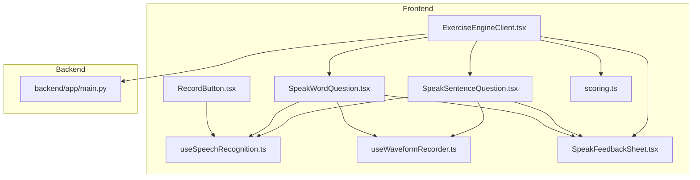
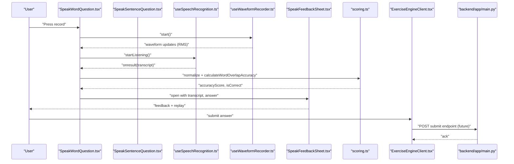
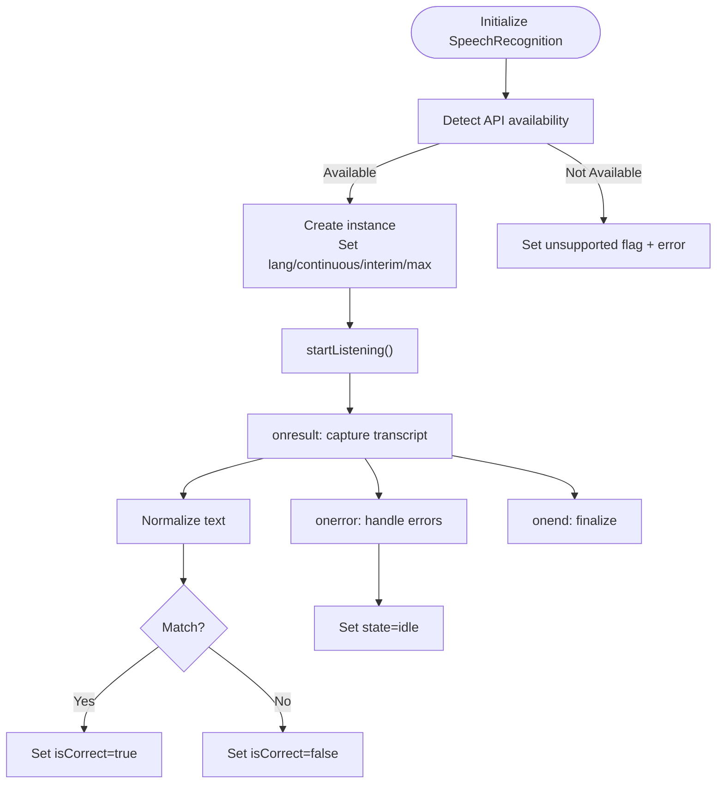
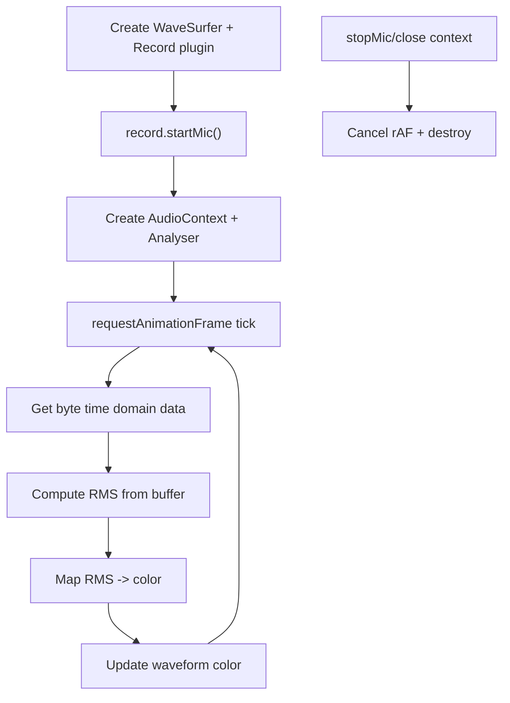
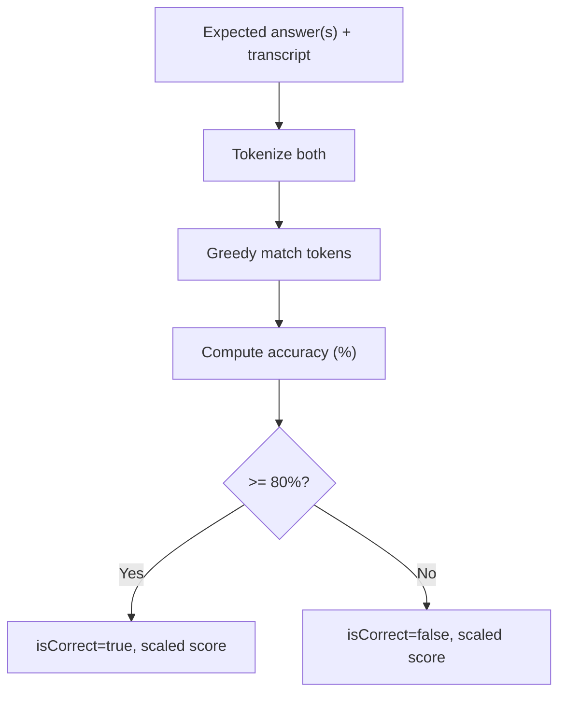
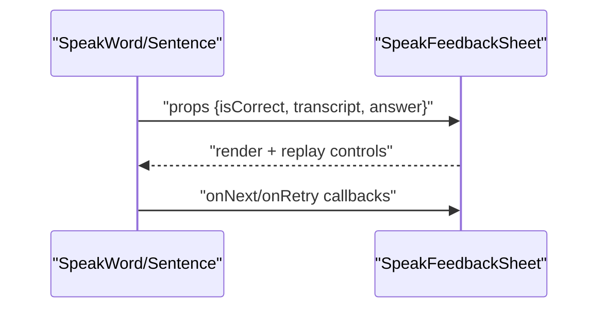
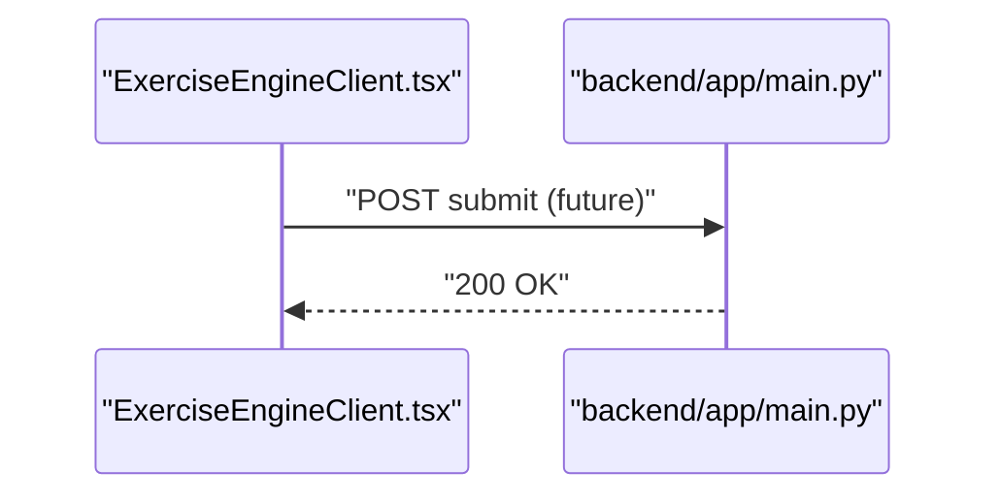
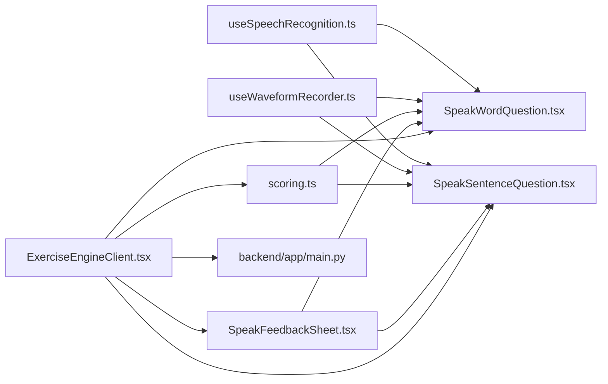

# Speech Recognition System

<cite>
**Referenced Files in This Document**
- [useSpeechRecognition.ts](file://english_pronunciation_app/frontend/src/hooks/useSpeechRecognition.ts)
- [useWaveformRecorder.ts](file://english_pronunciation_app/frontend/src/hooks/useWaveformRecorder.ts)
- [RecordButton.tsx](file://english_pronunciation_app/frontend/src/components/audio/RecordButton.tsx)
- [SpeakWordQuestion.tsx](file://english_pronunciation_app/frontend/src/app/exercises/[id]/SpeakWordQuestion.tsx)
- [SpeakSentenceQuestion.tsx](file://english_pronunciation_app/frontend/src/app/exercises/[id]/SpeakSentenceQuestion.tsx)
- [SpeakFeedbackSheet.tsx](file://english_pronunciation_app/frontend/src/app/exercises/[id]/SpeakFeedbackSheet.tsx)
- [scoring.ts](file://english_pronunciation_app/frontend/src/lib/scoring.ts)
- [ExerciseEngineClient.tsx](file://english_pronunciation_app/frontend/src/app/exercises/[id]/ExerciseEngineClient.tsx)
- [main.py](file://english_ppronunciation_app/backend/app/main.py)
- [SKILL.md](file://english_pronunciation_app/.agents/skills/web_speech_api_expert/SKILL.md)
</cite>

## Table of Contents
1. [Introduction](#introduction)
2. [Project Structure](#project-structure)
3. [Core Components](#core-components)
4. [Architecture Overview](#architecture-overview)
5. [Detailed Component Analysis](#detailed-component-analysis)
6. [Dependency Analysis](#dependency-analysis)
7. [Performance Considerations](#performance-considerations)
8. [Troubleshooting Guide](#troubleshooting-guide)
9. [Conclusion](#conclusion)
10. [Appendices](#appendices)

## Introduction
This document explains the speech recognition and pronunciation assessment system built with the Web Speech API and client-side audio visualization. It covers:
- Web Speech API integration for speech-to-text
- Audio recording and real-time waveform visualization
- Pronunciation scoring via word-overlap accuracy and feedback generation
- Relationship with backend services and data submission
- Browser compatibility, permissions, and performance optimization
- Configuration options and integration with the exercise system

## Project Structure
The system spans frontend React components and hooks, a scoring library, and a minimal backend service:
- Hooks: speech recognition and waveform recording
- UI: per-question screens for speaking tasks and a shared feedback sheet
- Scoring: normalization and accuracy calculation
- Backend: CORS-enabled minimal API for future integrations

**Diagram sources**
- [useSpeechRecognition.ts:1-111](file://english_pronunciation_app/frontend/src/hooks/useSpeechRecognition.ts#L1-L111)
- [useWaveformRecorder.ts:1-140](file://english_pronunciation_app/frontend/src/hooks/useWaveformRecorder.ts#L1-L140)
- [RecordButton.tsx:1-130](file://english_pronunciation_app/frontend/src/components/audio/RecordButton.tsx#L1-L130)
- [SpeakWordQuestion.tsx:1-222](file://english_pronunciation_app/frontend/src/app/exercises/[id]/SpeakWordQuestion.tsx#L1-L222)
- [SpeakSentenceQuestion.tsx:1-225](file://english_pronunciation_app/frontend/src/app/exercises/[id]/SpeakSentenceQuestion.tsx#L1-L225)
- [SpeakFeedbackSheet.tsx:1-96](file://english_pronunciation_app/frontend/src/app/exercises/[id]/SpeakFeedbackSheet.tsx#L1-L96)
- [scoring.ts:1-227](file://english_pronunciation_app/frontend/src/lib/scoring.ts#L1-L227)
- [ExerciseEngineClient.tsx:1-200](file://english_pronunciation_app/frontend/src/app/exercises/[id]/ExerciseEngineClient.tsx#L1-L200)
- [main.py:1-43](file://english_pronunciation_app/backend/app/main.py#L1-L43)

**Section sources**
- [useSpeechRecognition.ts:1-111](file://english_pronunciation_app/frontend/src/hooks/useSpeechRecognition.ts#L1-L111)
- [useWaveformRecorder.ts:1-140](file://english_pronunciation_app/frontend/src/hooks/useWaveformRecorder.ts#L1-L140)
- [RecordButton.tsx:1-130](file://english_pronunciation_app/frontend/src/components/audio/RecordButton.tsx#L1-L130)
- [SpeakWordQuestion.tsx:1-222](file://english_pronunciation_app/frontend/src/app/exercises/[id]/SpeakWordQuestion.tsx#L1-L222)
- [SpeakSentenceQuestion.tsx:1-225](file://english_pronunciation_app/frontend/src/app/exercises/[id]/SpeakSentenceQuestion.tsx#L1-L225)
- [SpeakFeedbackSheet.tsx:1-96](file://english_pronunciation_app/frontend/src/app/exercises/[id]/SpeakFeedbackSheet.tsx#L1-L96)
- [scoring.ts:1-227](file://english_pronunciation_app/frontend/src/lib/scoring.ts#L1-L227)
- [ExerciseEngineClient.tsx:1-200](file://english_pronunciation_app/frontend/src/app/exercises/[id]/ExerciseEngineClient.tsx#L1-L200)
- [main.py:1-43](file://english_pronunciation_app/backend/app/main.py#L1-L43)

## Core Components
- Web Speech API hook: Provides lifecycle, state, and results for speech recognition with normalization and error handling.
- Waveform recorder hook: Manages microphone access, real-time RMS-based visualization, and clearing buffers.
- Question screens: Orchestrate recording, scoring, and feedback presentation for word and sentence tasks.
- Scoring library: Implements word-overlap accuracy and multi-answer support.
- Feedback sheet: Persistent bottom sheet for correctness and replay controls.
- Backend service: Minimal CORS-enabled API ready for future integrations.

**Section sources**
- [useSpeechRecognition.ts:13-111](file://english_pronunciation_app/frontend/src/hooks/useSpeechRecognition.ts#L13-L111)
- [useWaveformRecorder.ts:29-140](file://english_pronunciation_app/frontend/src/hooks/useWaveformRecorder.ts#L29-L140)
- [SpeakWordQuestion.tsx:57-222](file://english_pronunciation_app/frontend/src/app/exercises/[id]/SpeakWordQuestion.tsx#L57-L222)
- [SpeakSentenceQuestion.tsx:48-225](file://english_pronunciation_app/frontend/src/app/exercises/[id]/SpeakSentenceQuestion.tsx#L48-L225)
- [SpeakFeedbackSheet.tsx:15-96](file://english_pronunciation_app/frontend/src/app/exercises/[id]/SpeakFeedbackSheet.tsx#L15-L96)
- [scoring.ts:108-131](file://english_pronunciation_app/frontend/src/lib/scoring.ts#L108-L131)
- [main.py:10-43](file://english_pronunciation_app/backend/app/main.py#L10-L43)

## Architecture Overview
End-to-end flow:
- User initiates recording via UI buttons
- Microphone stream is captured and analyzed for real-time loudness
- SpeechRecognition captures the spoken text
- Transcript is normalized and scored against expected answers
- Feedback sheet displays correctness and optional replay
- Results are prepared for submission to backend (via ExerciseEngineClient)

**Diagram sources**
- [SpeakWordQuestion.tsx:88-111](file://english_pronunciation_app/frontend/src/app/exercises/[id]/SpeakWordQuestion.tsx#L88-L111)
- [SpeakSentenceQuestion.tsx:84-104](file://english_pronunciation_app/frontend/src/app/exercises/[id]/SpeakSentenceQuestion.tsx#L84-L104)
- [useSpeechRecognition.ts:50-84](file://english_pronunciation_app/frontend/src/hooks/useSpeechRecognition.ts#L50-L84)
- [useWaveformRecorder.ts:99-123](file://english_pronunciation_app/frontend/src/hooks/useWaveformRecorder.ts#L99-L123)
- [scoring.ts:108-131](file://english_pronunciation_app/frontend/src/lib/scoring.ts#L108-L131)
- [SpeakFeedbackSheet.tsx:18-96](file://english_pronunciation_app/frontend/src/app/exercises/[id]/SpeakFeedbackSheet.tsx#L18-L96)
- [ExerciseEngineClient.tsx:323-350](file://english_pronunciation_app/frontend/src/app/exercises/[id]/ExerciseEngineClient.tsx#L323-L350)
- [main.py:25-42](file://english_pronunciation_app/backend/app/main.py#L25-L42)

## Detailed Component Analysis

### Web Speech API Integration
- Feature detection and initialization with fallback to prefixed constructor
- Configuration: language, continuous, interim results, alternatives
- Event handling: result, error, end; state transitions
- Normalization pipeline for comparison with expected answers

**Diagram sources**
- [useSpeechRecognition.ts:25-84](file://english_pronunciation_app/frontend/src/hooks/useSpeechRecognition.ts#L25-L84)
- [SpeakWordQuestion.tsx:88-111](file://english_pronunciation_app/frontend/src/app/exercises/[id]/SpeakWordQuestion.tsx#L88-L111)
- [SpeakSentenceQuestion.tsx:84-104](file://english_pronunciation_app/frontend/src/app/exercises/[id]/SpeakSentenceQuestion.tsx#L84-L104)

**Section sources**
- [useSpeechRecognition.ts:13-111](file://english_pronunciation_app/frontend/src/hooks/useSpeechRecognition.ts#L13-L111)
- [SKILL.md:1-14](file://english_pronunciation_app/.agents/skills/web_speech_api_expert/SKILL.md#L1-L14)

### Audio Recording and Real-Time Visualization
- Initializes WaveSurfer and Record plugin
- Starts microphone and computes RMS amplitude per frame
- Updates waveform color based on loudness thresholds
- Clears buffers properly to avoid stale data on retries

**Diagram sources**
- [useWaveformRecorder.ts:38-87](file://english_pronunciation_app/frontend/src/hooks/useWaveformRecorder.ts#L38-L87)
- [useWaveformRecorder.ts:99-123](file://english_pronunciation_app/frontend/src/hooks/useWaveformRecorder.ts#L99-L123)

**Section sources**
- [useWaveformRecorder.ts:29-140](file://english_pronunciation_app/frontend/src/hooks/useWaveformRecorder.ts#L29-L140)

### Pronunciation Assessment and Accuracy Scoring
- Word overlap accuracy: tokenizes and counts matched tokens
- Multi-answer support: compares against base answer and accepted variants
- Threshold-based correctness and scaled score computation
- Pedagogical feedback messages

**Diagram sources**
- [scoring.ts:52-72](file://english_pronunciation_app/frontend/src/lib/scoring.ts#L52-L72)
- [scoring.ts:108-131](file://english_pronunciation_app/frontend/src/lib/scoring.ts#L108-L131)

**Section sources**
- [scoring.ts:108-131](file://english_pronunciation_app/frontend/src/lib/scoring.ts#L108-L131)

### Feedback Generation and Presentation
- Persistent bottom sheet overlays correctness, transcript, and answer
- Replay controls for audio samples
- Navigation to next question or retry

**Diagram sources**
- [SpeakFeedbackSheet.tsx:18-96](file://english_pronunciation_app/frontend/src/app/exercises/[id]/SpeakFeedbackSheet.tsx#L18-L96)
- [SpeakWordQuestion.tsx:208-217](file://english_pronunciation_app/frontend/src/app/exercises/[id]/SpeakWordQuestion.tsx#L208-L217)
- [SpeakSentenceQuestion.tsx:202-220](file://english_pronunciation_app/frontend/src/app/exercises/[id]/SpeakSentenceQuestion.tsx#L202-L220)

**Section sources**
- [SpeakFeedbackSheet.tsx:15-96](file://english_pronunciation_app/frontend/src/app/exercises/[id]/SpeakFeedbackSheet.tsx#L15-L96)

### Backend Integration and Data Transmission
- Backend exposes a minimal API with CORS enabled
- Exercise engine orchestrates submission and scoring
- Future extension point for sending transcripts and metadata

**Diagram sources**
- [ExerciseEngineClient.tsx:323-350](file://english_pronunciation_app/frontend/src/app/exercises/[id]/ExerciseEngineClient.tsx#L323-L350)
- [main.py:25-42](file://english_pronunciation_app/backend/app/main.py#L25-L42)

**Section sources**
- [main.py:10-43](file://english_pronunciation_app/backend/app/main.py#L10-L43)
- [ExerciseEngineClient.tsx:323-350](file://english_pronunciation_app/frontend/src/app/exercises/[id]/ExerciseEngineClient.tsx#L323-L350)

## Dependency Analysis
- UI components depend on hooks for speech and audio
- Scoring depends on normalization utilities
- Exercise engine composes questions and manages state transitions
- Backend provides CORS-enabled endpoints for future integrations

**Diagram sources**
- [useSpeechRecognition.ts:13-111](file://english_pronunciation_app/frontend/src/hooks/useSpeechRecognition.ts#L13-L111)
- [useWaveformRecorder.ts:29-140](file://english_pronunciation_app/frontend/src/hooks/useWaveformRecorder.ts#L29-L140)
- [SpeakWordQuestion.tsx:57-222](file://english_pronunciation_app/frontend/src/app/exercises/[id]/SpeakWordQuestion.tsx#L57-L222)
- [SpeakSentenceQuestion.tsx:48-225](file://english_pronunciation_app/frontend/src/app/exercises/[id]/SpeakSentenceQuestion.tsx#L48-L225)
- [SpeakFeedbackSheet.tsx:15-96](file://english_pronunciation_app/frontend/src/app/exercises/[id]/SpeakFeedbackSheet.tsx#L15-L96)
- [scoring.ts:108-131](file://english_pronunciation_app/frontend/src/lib/scoring.ts#L108-L131)
- [ExerciseEngineClient.tsx:1-200](file://english_pronunciation_app/frontend/src/app/exercises/[id]/ExerciseEngineClient.tsx#L1-L200)
- [main.py:10-43](file://english_pronunciation_app/backend/app/main.py#L10-L43)

**Section sources**
- [useSpeechRecognition.ts:13-111](file://english_pronunciation_app/frontend/src/hooks/useSpeechRecognition.ts#L13-L111)
- [useWaveformRecorder.ts:29-140](file://english_pronunciation_app/frontend/src/hooks/useWaveformRecorder.ts#L29-L140)
- [SpeakWordQuestion.tsx:57-222](file://english_pronunciation_app/frontend/src/app/exercises/[id]/SpeakWordQuestion.tsx#L57-L222)
- [SpeakSentenceQuestion.tsx:48-225](file://english_pronunciation_app/frontend/src/app/exercises/[id]/SpeakSentenceQuestion.tsx#L48-L225)
- [SpeakFeedbackSheet.tsx:15-96](file://english_pronunciation_app/frontend/src/app/exercises/[id]/SpeakFeedbackSheet.tsx#L15-L96)
- [scoring.ts:108-131](file://english_pronunciation_app/frontend/src/lib/scoring.ts#L108-L131)
- [ExerciseEngineClient.tsx:1-200](file://english_pronunciation_app/frontend/src/app/exercises/[id]/ExerciseEngineClient.tsx#L1-L200)
- [main.py:10-43](file://english_pronunciation_app/backend/app/main.py#L10-L43)

## Performance Considerations
- Minimize DOM work during animation frames; keep waveform rendering lightweight
- Cancel requestAnimationFrame and close AudioContext on unmount to prevent leaks
- Avoid multiple simultaneous microphone streams; coordinate recording state
- Defer heavy processing until after recognition completes
- Use normalized text comparisons to reduce false positives and improve responsiveness

[No sources needed since this section provides general guidance]

## Troubleshooting Guide
Common issues and resolutions:
- Browser compatibility: Web Speech API requires Chrome/Edge; detect and inform users
- Microphone permissions: Handle not-allowed/service-not-allowed; guide users to enable permissions
- No-speech timeouts: Ensure proper onend handling and idle state restoration
- Stale waveform artifacts: Clear both canvas and internal plugin buffers on reset/retry

**Section sources**
- [useSpeechRecognition.ts:25-41](file://english_pronunciation_app/frontend/src/hooks/useSpeechRecognition.ts#L25-L41)
- [SpeakWordQuestion.tsx:94-103](file://english_pronunciation_app/frontend/src/app/exercises/[id]/SpeakWordQuestion.tsx#L94-L103)
- [SpeakSentenceQuestion.tsx:90-96](file://english_pronunciation_app/frontend/src/app/exercises/[id]/SpeakSentenceQuestion.tsx#L90-L96)
- [useWaveformRecorder.ts:93-97](file://english_pronunciation_app/frontend/src/hooks/useWaveformRecorder.ts#L93-L97)

## Conclusion
The system combines Web Speech API for transcription, real-time audio visualization, and robust scoring to deliver an accessible pronunciation assessment experience. Its modular architecture supports easy extension to backend services and improved feedback loops.

[No sources needed since this section summarizes without analyzing specific files]

## Appendices

### Configuration Options and Integration Notes
- SpeechRecognition parameters:
  - Language: en-US
  - Continuous: disabled
  - Interim results: disabled
  - Max alternatives: 1
- Scoring threshold: 80% word overlap accuracy for correctness
- Integration with exercise system:
  - ExerciseEngineClient orchestrates question progression and submission
  - Feedback sheet persists and provides replay controls

**Section sources**
- [useSpeechRecognition.ts:33-38](file://english_pronunciation_app/frontend/src/hooks/useSpeechRecognition.ts#L33-L38)
- [SpeakSentenceQuestion.tsx:71-82](file://english_pronunciation_app/frontend/src/app/exercises/[id]/SpeakSentenceQuestion.tsx#L71-L82)
- [ExerciseEngineClient.tsx:323-350](file://english_pronunciation_app/frontend/src/app/exercises/[id]/ExerciseEngineClient.tsx#L323-L350)