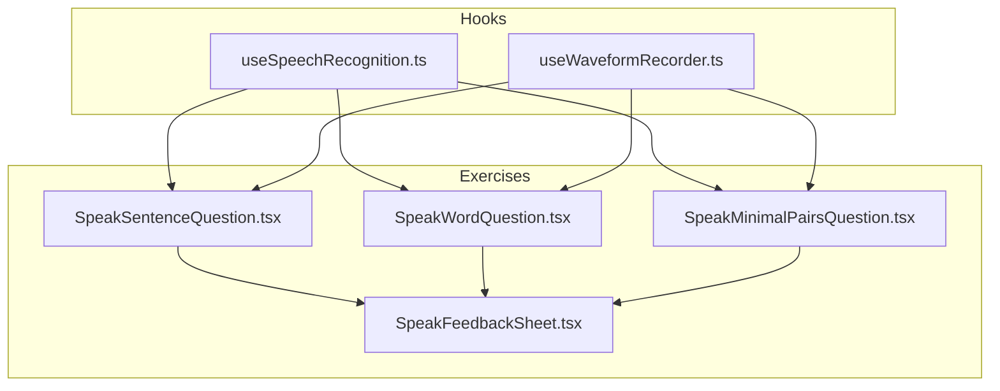
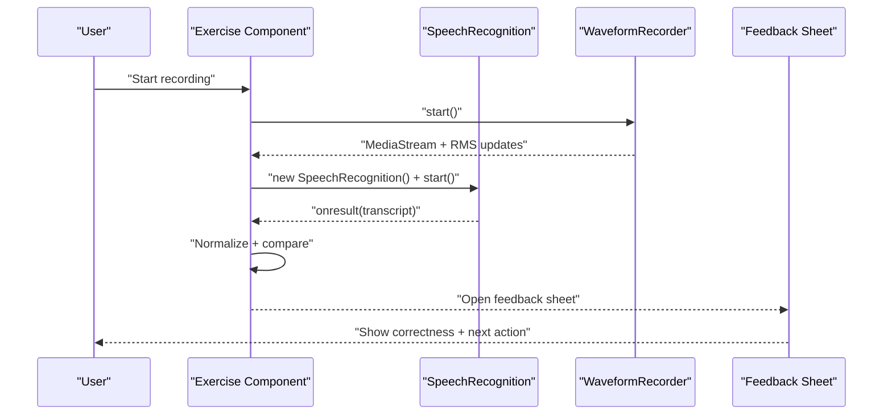
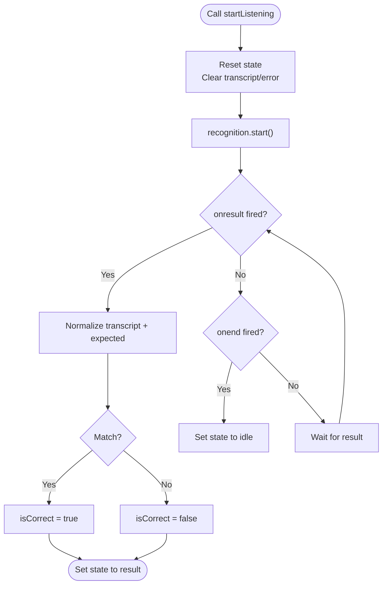
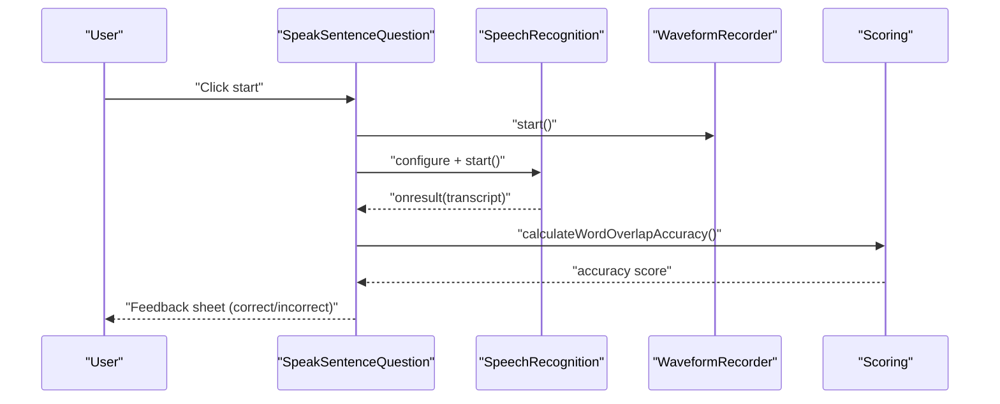
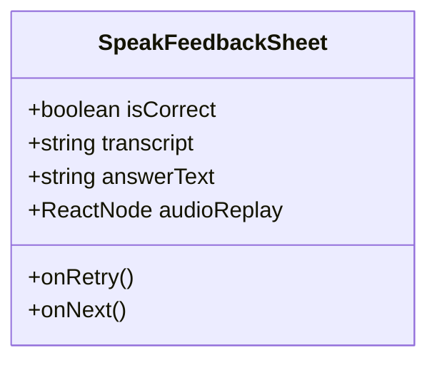
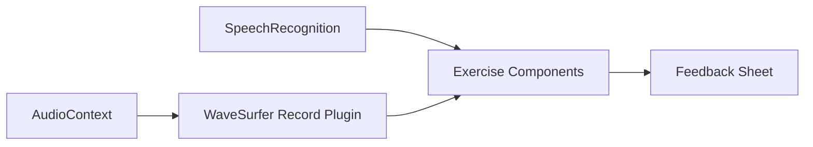

# Web Speech API Integration

<cite>
**Referenced Files in This Document**
- [useSpeechRecognition.ts](file://english_pronunciation_app/frontend/src/hooks/useSpeechRecognition.ts)
- [useWaveformRecorder.ts](file://english_pronunciation_app/frontend/src/hooks/useWaveformRecorder.ts)
- [SpeakSentenceQuestion.tsx](file://english_pronunciation_app/frontend/src/app/exercises/[id]/SpeakSentenceQuestion.tsx)
- [SpeakWordQuestion.tsx](file://english_pronunciation_app/frontend/src/app/exercises/[id]/SpeakWordQuestion.tsx)
- [SpeakMinimalPairsQuestion.tsx](file://english_pronunciation_app/frontend/src/app/exercises/[id]/SpeakMinimalPairsQuestion.tsx)
- [SpeakFeedbackSheet.tsx](file://english_pronunciation_app/frontend/src/app/exercises/[id]/SpeakFeedbackSheet.tsx)
- [web_speech_api_expert/SKILL.md](file://english_pronunciation_app/.agents/skills/web_speech_api_expert/SKILL.md)
- [package.json](file://english_pronunciation_app/frontend/package.json)
</cite>

## Table of Contents
1. [Introduction](#introduction)
2. [Project Structure](#project-structure)
3. [Core Components](#core-components)
4. [Architecture Overview](#architecture-overview)
5. [Detailed Component Analysis](#detailed-component-analysis)
6. [Dependency Analysis](#dependency-analysis)
7. [Performance Considerations](#performance-considerations)
8. [Troubleshooting Guide](#troubleshooting-guide)
9. [Conclusion](#conclusion)

## Introduction
This document explains the Web Speech API integration for pronunciation learning exercises. It covers browser-based speech recognition, microphone permissions handling, cross-browser compatibility, SpeechRecognition usage patterns, event handling, real-time transcription processing, and practical troubleshooting. It also documents the shared hook and exercise-specific components that implement speech-driven feedback.

## Project Structure
The Web Speech API integration spans a reusable React hook and several exercise components:
- Hook: useSpeechRecognition encapsulates SpeechRecognition lifecycle and normalization.
- Recorder: useWaveformRecorder integrates microphone access and dynamic waveform visualization.
- Exercises: SpeakSentenceQuestion, SpeakWordQuestion, and SpeakMinimalPairsQuestion orchestrate recording, transcription, and feedback.
- Feedback: SpeakFeedbackSheet presents correctness and next steps.

**Diagram sources**
- [useSpeechRecognition.ts:15-110](file://english_pronunciation_app/frontend/src/hooks/useSpeechRecognition.ts#L15-L110)
- [useWaveformRecorder.ts:29-139](file://english_pronunciation_app/frontend/src/hooks/useWaveformRecorder.ts#L29-L139)
- [SpeakSentenceQuestion.tsx:48-224](file://english_pronunciation_app/frontend/src/app/exercises/[id]/SpeakSentenceQuestion.tsx#L48-L224)
- [SpeakWordQuestion.tsx:57-221](file://english_pronunciation_app/frontend/src/app/exercises/[id]/SpeakWordQuestion.tsx#L57-L221)
- [SpeakMinimalPairsQuestion.tsx:83-257](file://english_pronunciation_app/frontend/src/app/exercises/[id]/SpeakMinimalPairsQuestion.tsx#L83-L257)
- [SpeakFeedbackSheet.tsx:18-95](file://english_pronunciation_app/frontend/src/app/exercises/[id]/SpeakFeedbackSheet.tsx#L18-L95)

**Section sources**
- [useSpeechRecognition.ts:15-110](file://english_pronunciation_app/frontend/src/hooks/useSpeechRecognition.ts#L15-L110)
- [useWaveformRecorder.ts:29-139](file://english_pronunciation_app/frontend/src/hooks/useWaveformRecorder.ts#L29-L139)
- [SpeakSentenceQuestion.tsx:48-224](file://english_pronunciation_app/frontend/src/app/exercises/[id]/SpeakSentenceQuestion.tsx#L48-L224)
- [SpeakWordQuestion.tsx:57-221](file://english_pronunciation_app/frontend/src/app/exercises/[id]/SpeakWordQuestion.tsx#L57-L221)
- [SpeakMinimalPairsQuestion.tsx:83-257](file://english_pronunciation_app/frontend/src/app/exercises/[id]/SpeakMinimalPairsQuestion.tsx#L83-L257)
- [SpeakFeedbackSheet.tsx:18-95](file://english_pronunciation_app/frontend/src/app/exercises/[id]/SpeakFeedbackSheet.tsx#L18-L95)

## Core Components
- useSpeechRecognition
  - Purpose: Initialize SpeechRecognition, manage state transitions, handle events, and normalize transcriptions for comparison against expected answers.
  - Key behaviors:
    - Capability detection via window.SpeechRecognition or window.webkitSpeechRecognition.
    - Configuration: language set to en-US, continuous=false, interimResults=false, maxAlternatives=1.
    - Event handlers: onresult, onerror, onend.
    - Normalization: lowercased, trimmed, punctuation removed.
    - Exposed actions: startListening, stopListening, reset.
  - State model: idle → listening → processing → result/error.
- useWaveformRecorder
  - Purpose: Manage microphone access, render real-time waveform, and provide dynamic feedback levels.
  - Key behaviors:
    - Uses wavesurfer.js with the record plugin.
    - AudioContext-based RMS calculation for dynamic color feedback.
    - Methods: start, stop, reset; refs for DOM container.
  - Levels: silence, normal, loud.

**Section sources**
- [useSpeechRecognition.ts:15-110](file://english_pronunciation_app/frontend/src/hooks/useSpeechRecognition.ts#L15-L110)
- [useWaveformRecorder.ts:29-139](file://english_pronunciation_app/frontend/src/hooks/useWaveformRecorder.ts#L29-L139)

## Architecture Overview
The system combines two complementary browser APIs:
- Web Speech API for speech-to-text.
- Web Audio API (via AudioContext and analyser) for real-time audio level visualization.

**Diagram sources**
- [SpeakSentenceQuestion.tsx:84-104](file://english_pronunciation_app/frontend/src/app/exercises/[id]/SpeakSentenceQuestion.tsx#L84-L104)
- [SpeakWordQuestion.tsx:88-111](file://english_pronunciation_app/frontend/src/app/exercises/[id]/SpeakWordQuestion.tsx#L88-L111)
- [SpeakMinimalPairsQuestion.tsx:106-148](file://english_pronunciation_app/frontend/src/app/exercises/[id]/SpeakMinimalPairsQuestion.tsx#L106-L148)
- [useWaveformRecorder.ts:99-123](file://english_pronunciation_app/frontend/src/hooks/useWaveformRecorder.ts#L99-L123)
- [SpeakFeedbackSheet.tsx:18-95](file://english_pronunciation_app/frontend/src/app/exercises/[id]/SpeakFeedbackSheet.tsx#L18-L95)

## Detailed Component Analysis

### useSpeechRecognition Hook
- Capability detection and initialization:
  - Checks for window.SpeechRecognition or window.webkitSpeechRecognition.
  - Creates a SpeechRecognition instance configured for single-result recognition in en-US.
- Event handling:
  - onresult: sets processing state, captures transcript, normalizes, compares to expected answer, sets result state.
  - onerror: resets to idle and surfaces error message.
  - onend: ensures idle state if recognition ended while listening.
- Actions:
  - startListening: clears prior state, starts recognition, wires event handlers.
  - stopListening: stops recognition if currently listening.
  - reset: clears state for reuse.

**Diagram sources**
- [useSpeechRecognition.ts:50-84](file://english_pronunciation_app/frontend/src/hooks/useSpeechRecognition.ts#L50-L84)

**Section sources**
- [useSpeechRecognition.ts:15-110](file://english_pronunciation_app/frontend/src/hooks/useSpeechRecognition.ts#L15-L110)

### Exercise Components Using Speech Recognition
- SpeakSentenceQuestion
  - Initializes SpeechRecognition with en-US, disables continuous and interim results.
  - Handles onresult by capturing transcript and invoking accuracy scoring.
  - Handles onerror to detect microphone denial and surface actionable messages.
  - Provides a stop button during recording and a persistent feedback sheet after processing.
- SpeakWordQuestion
  - Mirrors sentence flow with word-level normalization and retry logic.
  - Presents masked word UI with toggle to reveal answer.
- SpeakMinimalPairsQuestion
  - Dual-column recording with independent state per column.
  - Starts recording for one column, stops simultaneous recording on the other column to avoid conflicts.
  - Uses a short timeout to stop recognition automatically.

**Diagram sources**
- [SpeakSentenceQuestion.tsx:84-104](file://english_pronunciation_app/frontend/src/app/exercises/[id]/SpeakSentenceQuestion.tsx#L84-L104)
- [SpeakSentenceQuestion.tsx:71-82](file://english_pronunciation_app/frontend/src/app/exercises/[id]/SpeakSentenceQuestion.tsx#L71-L82)
- [SpeakWordQuestion.tsx:88-111](file://english_pronunciation_app/frontend/src/app/exercises/[id]/SpeakWordQuestion.tsx#L88-L111)
- [SpeakMinimalPairsQuestion.tsx:106-148](file://english_pronunciation_app/frontend/src/app/exercises/[id]/SpeakMinimalPairsQuestion.tsx#L106-L148)

**Section sources**
- [SpeakSentenceQuestion.tsx:48-224](file://english_pronunciation_app/frontend/src/app/exercises/[id]/SpeakSentenceQuestion.tsx#L48-L224)
- [SpeakWordQuestion.tsx:57-221](file://english_pronunciation_app/frontend/src/app/exercises/[id]/SpeakWordQuestion.tsx#L57-L221)
- [SpeakMinimalPairsQuestion.tsx:83-257](file://english_pronunciation_app/frontend/src/app/exercises/[id]/SpeakMinimalPairsQuestion.tsx#L83-L257)

### Feedback Presentation
- SpeakFeedbackSheet
  - Slides up as a persistent bottom sheet with correctness indication.
  - Shows user transcript, expected answer (when incorrect), optional replay controls, and navigation actions.

**Diagram sources**
- [SpeakFeedbackSheet.tsx:18-95](file://english_pronunciation_app/frontend/src/app/exercises/[id]/SpeakFeedbackSheet.tsx#L18-L95)

**Section sources**
- [SpeakFeedbackSheet.tsx:18-95](file://english_pronunciation_app/frontend/src/app/exercises/[id]/SpeakFeedbackSheet.tsx#L18-L95)

## Dependency Analysis
- Browser APIs
  - window.SpeechRecognition or window.webkitSpeechRecognition for speech recognition.
  - window.AudioContext or webkitAudioContext for audio analysis.
  - MediaRecorder/MediaStream for microphone capture.
- Third-party libraries
  - wavesurfer.js with record plugin for waveform rendering and recording control.

**Diagram sources**
- [useSpeechRecognition.ts:27-41](file://english_pronunciation_app/frontend/src/hooks/useSpeechRecognition.ts#L27-L41)
- [useWaveformRecorder.ts:62-87](file://english_pronunciation_app/frontend/src/hooks/useWaveformRecorder.ts#L62-L87)
- [package.json:25](file://english_pronunciation_app/frontend/package.json#L25)

**Section sources**
- [package.json:17-26](file://english_pronunciation_app/frontend/package.json#L17-L26)
- [useSpeechRecognition.ts:27-41](file://english_pronunciation_app/frontend/src/hooks/useSpeechRecognition.ts#L27-L41)
- [useWaveformRecorder.ts:62-87](file://english_pronunciation_app/frontend/src/hooks/useWaveformRecorder.ts#L62-L87)

## Performance Considerations
- Short recognition windows
  - Sentence recording uses a longer timeout; word/minimal pairs use shorter timeouts to reduce latency and resource usage.
- Single result mode
  - Setting continuous=false and interimResults=false reduces overhead and improves responsiveness.
- Real-time audio visualization
  - RMS sampling runs at animation frame intervals; keep FFT size reasonable to balance fidelity and CPU usage.
- Cleanup
  - Cancel animation frames and close AudioContext on stop/reset to prevent leaks.

**Section sources**
- [SpeakSentenceQuestion.tsx:102](file://english_pronunciation_app/frontend/src/app/exercises/[id]/SpeakSentenceQuestion.tsx#L102)
- [SpeakWordQuestion.tsx:109](file://english_pronunciation_app/frontend/src/app/exercises/[id]/SpeakWordQuestion.tsx#L109)
- [SpeakMinimalPairsQuestion.tsx:142](file://english_pronunciation_app/frontend/src/app/exercises/[id]/SpeakMinimalPairsQuestion.tsx#L142)
- [useSpeechRecognition.ts:34-37](file://english_pronunciation_app/frontend/src/hooks/useSpeechRecognition.ts#L34-L37)
- [useWaveformRecorder.ts:86-87](file://english_pronunciation_app/frontend/src/hooks/useWaveformRecorder.ts#L86-L87)
- [useWaveformRecorder.ts:118-136](file://english_pronunciation_app/frontend/src/hooks/useWaveformRecorder.ts#L118-L136)

## Troubleshooting Guide
- Unsupported browser
  - Symptom: Immediate error UI indicating lack of support.
  - Action: Recommend Chrome/Edge; display friendly message and disable speech controls.
  - Evidence: Capability checks and error UI rendering in components.
- Microphone permission blocked
  - Symptom: Error message indicating “not-allowed” or “service-not-allowed”.
  - Action: Provide step-by-step instructions to enable microphone in site settings; offer retry.
  - Evidence: Error handling branches and user-facing messages.
- No speech detected
  - Symptom: “No speech” error; UI suggests speaking louder and more clearly.
  - Action: Verify microphone hardware and environment; prompt retry.
- Simultaneous recording conflicts
  - Symptom: Interference between dual-column recordings.
  - Action: Stop the other column’s recorder before starting a new one; ensure only one recording at a time.
- Cross-browser compatibility
  - Notes: Prefer window.SpeechRecognition; fall back to window.webkitSpeechRecognition. Some browsers require HTTPS and user gesture to initiate microphone access.

**Section sources**
- [SpeakSentenceQuestion.tsx:180-200](file://english_pronunciation_app/frontend/src/app/exercises/[id]/SpeakSentenceQuestion.tsx#L180-L200)
- [SpeakWordQuestion.tsx:186-206](file://english_pronunciation_app/frontend/src/app/exercises/[id]/SpeakWordQuestion.tsx#L186-L206)
- [SpeakMinimalPairsQuestion.tsx:124-133](file://english_pronunciation_app/frontend/src/app/exercises/[id]/SpeakMinimalPairsQuestion.tsx#L124-L133)
- [web_speech_api_expert/SKILL.md:6-9](file://english_pronunciation_app/.agents/skills/web_speech_api_expert/SKILL.md#L6-L9)

## Conclusion
The pronunciation learning system integrates Web Speech API with robust state management, real-time audio visualization, and user-friendly error handling. The shared hook and exercise components provide a consistent, cross-browser–aware experience with clear fallbacks and actionable guidance for users encountering permission or compatibility issues.