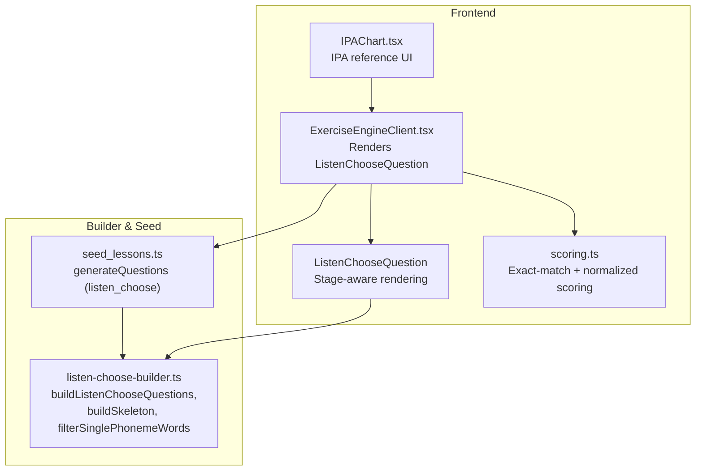
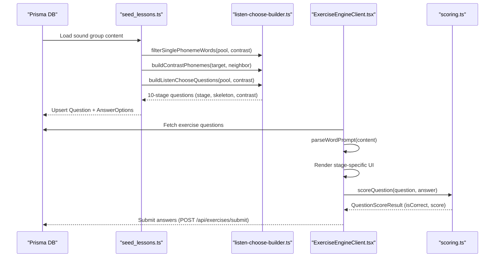
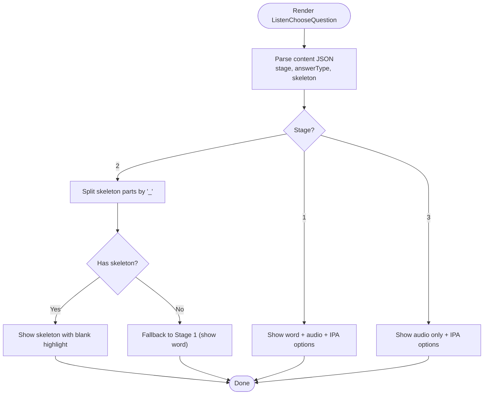
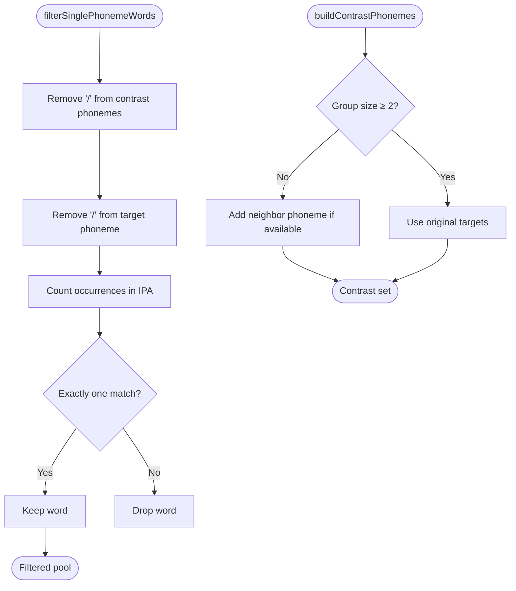
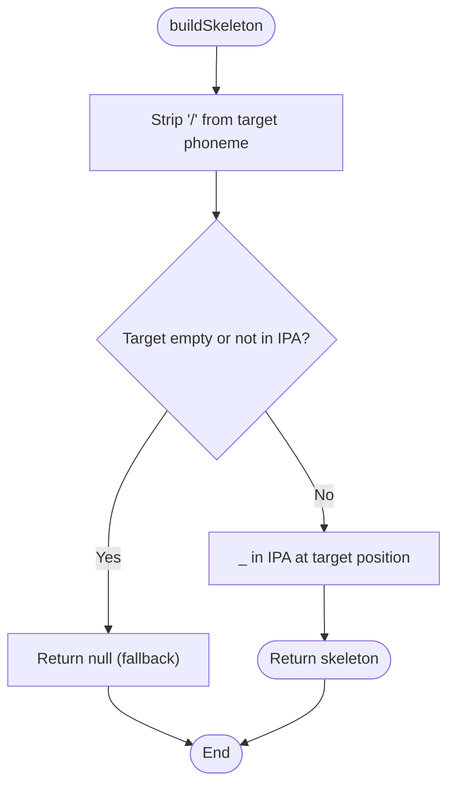
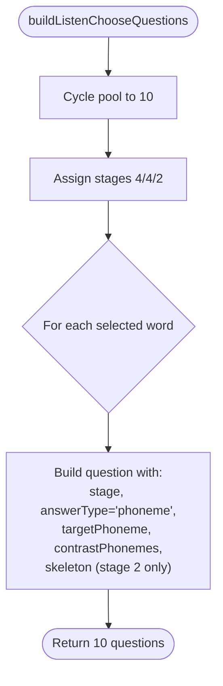
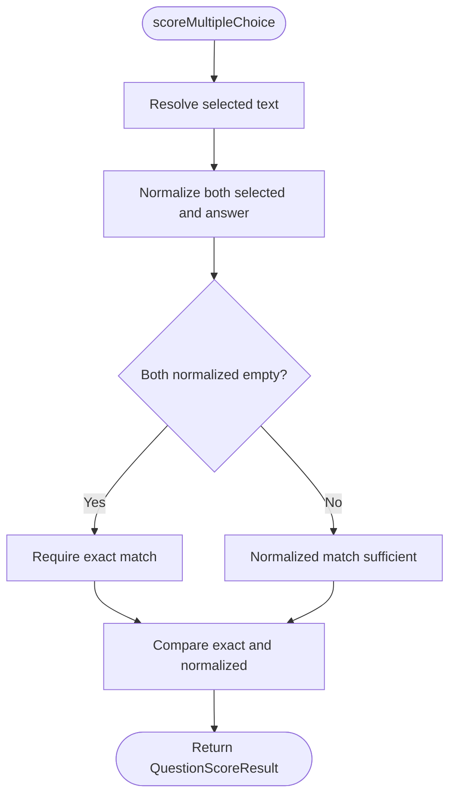
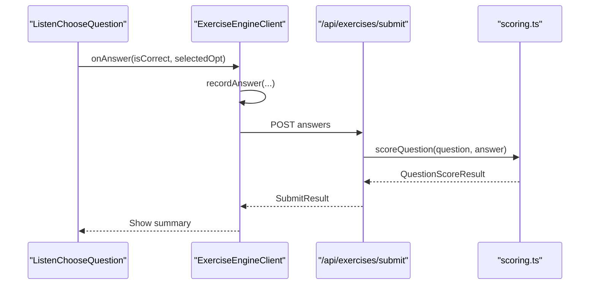
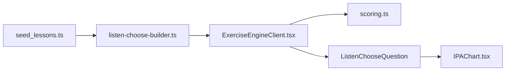

# Advanced Speech Recognition Features

<cite>
**Referenced Files in This Document**
- [2026-06-18-listen-choose-3stage-phoneme-id-design.md](file://docs/superpowers/specs/2026-06-18-listen-choose-3stage-phoneme-id-design.md)
- [listen-choose-builder.ts](file://english_pronunciation_app/frontend/prisma/listen-choose-builder.ts)
- [listen-choose-builder.test.ts](file://english_pronunciation_app/frontend/src/lib/__tests__/listen-choose-builder.test.ts)
- [ExerciseEngineClient.tsx](file://english_pronunciation_app/frontend/src/app/exercises/[id]/ExerciseEngineClient.tsx)
- [scoring.ts](file://english_pronunciation_app/frontend/src/lib/scoring.ts)
- [seed_lessons.ts](file://english_pronunciation_app/frontend/prisma/seed_lessons.ts)
- [IPAChart.tsx](file://english_pronunciation_app/frontend/src/components/ipa/IPAChart.tsx)
</cite>

## Table of Contents
1. [Introduction](#introduction)
2. [Project Structure](#project-structure)
3. [Core Components](#core-components)
4. [Architecture Overview](#architecture-overview)
5. [Detailed Component Analysis](#detailed-component-analysis)
6. [Dependency Analysis](#dependency-analysis)
7. [Performance Considerations](#performance-considerations)
8. [Troubleshooting Guide](#troubleshooting-guide)
9. [Conclusion](#conclusion)

## Introduction
This document describes the advanced three-stage phoneme identification system designed to progressively challenge learners’ listening skills. The system transforms the original “listen-choose” mode into a structured, adaptive exercise that:
- Starts with visible word and audio cues, then hides the word while revealing an IPA skeleton (missing target phoneme), and finally progresses to pure audio recognition.
- Uses a phoneme-focused scoring mechanism that preserves exact IPA matches while maintaining normalized matching for word-based modes.
- Integrates a robust seed pipeline to generate 10-question exercises with deterministic stage distribution and skeleton construction.

The system is implemented across the frontend exercise engine, a dedicated builder module, and the backend scoring service, ensuring correctness, testability, and maintainability.

## Project Structure
The three-stage phoneme identification spans several modules:
- Frontend exercise engine renders questions and manages user interactions.
- A builder module generates stage-aware questions with skeleton construction and contrast phoneme sets.
- A seed pipeline orchestrates question generation and ensures deterministic content distribution.
- A scoring module enforces exact-match semantics for phoneme answers and normalized matching for words.

**Diagram sources**
- [ExerciseEngineClient.tsx:323-644](file://english_pronunciation_app/frontend/src/app/exercises/[id]/ExerciseEngineClient.tsx#L323-L644)
- [listen-choose-builder.ts:110-133](file://english_pronunciation_app/frontend/prisma/listen-choose-builder.ts#L110-L133)
- [seed_lessons.ts:795-1314](file://english_pronunciation_app/frontend/prisma/seed_lessons.ts#L795-L1314)
- [scoring.ts:74-106](file://english_pronunciation_app/frontend/src/lib/scoring.ts#L74-L106)
- [IPAChart.tsx:1-111](file://english_pronunciation_app/frontend/src/components/ipa/IPAChart.tsx#L1-L111)

**Section sources**
- [2026-06-18-listen-choose-3stage-phoneme-id-design.md:1-156](file://docs/superpowers/specs/2026-06-18-listen-choose-3stage-phoneme-id-design.md#L1-L156)
- [listen-choose-builder.ts:1-134](file://english_pronunciation_app/frontend/prisma/listen-choose-builder.ts#L1-L134)
- [ExerciseEngineClient.tsx:182-304](file://english_pronunciation_app/frontend/src/app/exercises/[id]/ExerciseEngineClient.tsx#L182-L304)
- [scoring.ts:74-106](file://english_pronunciation_app/frontend/src/lib/scoring.ts#L74-L106)
- [seed_lessons.ts:795-1314](file://english_pronunciation_app/frontend/prisma/seed_lessons.ts#L795-L1314)
- [IPAChart.tsx:1-111](file://english_pronunciation_app/frontend/src/components/ipa/IPAChart.tsx#L1-L111)

## Core Components
- Three-stage rendering pipeline:
  - Stage 1: Displays the target word and audio, with IPA options for contrast.
  - Stage 2: Hides the word and shows an IPA skeleton with a blank for the target phoneme; fallback to Stage 1 if skeleton construction fails.
  - Stage 3: Audio-only with IPA options.
- Phoneme filtering and contrast construction:
  - Filters candidate words to ensure only one contrast phoneme appears in the IPA.
  - Builds contrast sets with either the original target set (2–3 phonemes) or augments single-phoneme groups with a neighbor group’s phoneme.
- Skeleton building:
  - Replaces the target phoneme substring inside the IPA with a placeholder to form the skeleton.
- Exact-match scoring for phonemes:
  - Enforces exact string equality for IPA answers; falls back to normalized matching only when both sides retain content after normalization.
- Seed orchestration:
  - Generates 10-question exercises per sound group with deterministic stage split (4/4/2) and cycles pools smaller than 10.

**Section sources**
- [2026-06-18-listen-choose-3stage-phoneme-id-design.md:31-60](file://docs/superpowers/specs/2026-06-18-listen-choose-3stage-phoneme-id-design.md#L31-L60)
- [listen-choose-builder.ts:37-41](file://english_pronunciation_app/frontend/prisma/listen-choose-builder.ts#L37-L41)
- [listen-choose-builder.ts:50-66](file://english_pronunciation_app/frontend/prisma/listen-choose-builder.ts#L50-L66)
- [listen-choose-builder.ts:72-81](file://english_pronunciation_app/frontend/prisma/listen-choose-builder.ts#L72-L81)
- [listen-choose-builder.ts:110-133](file://english_pronunciation_app/frontend/prisma/listen-choose-builder.ts#L110-L133)
- [ExerciseEngineClient.tsx:194-232](file://english_pronunciation_app/frontend/src/app/exercises/[id]/ExerciseEngineClient.tsx#L194-L232)
- [scoring.ts:80-93](file://english_pronunciation_app/frontend/src/lib/scoring.ts#L80-L93)

## Architecture Overview
The system integrates data generation, rendering, and scoring into a cohesive pipeline:
- Seed pipeline creates QuestionBankItems and generates exercises with content JSON containing stage, target phoneme, contrast phonemes, and skeleton.
- Exercise engine parses content JSON and renders the appropriate stage UI.
- Scoring service evaluates answers with exact-match semantics for phonemes and normalized matching for words.

**Diagram sources**
- [seed_lessons.ts:795-1314](file://english_pronunciation_app/frontend/prisma/seed_lessons.ts#L795-L1314)
- [listen-choose-builder.ts:50-66](file://english_pronunciation_app/frontend/prisma/listen-choose-builder.ts#L50-L66)
- [listen-choose-builder.ts:72-81](file://english_pronunciation_app/frontend/prisma/listen-choose-builder.ts#L72-L81)
- [listen-choose-builder.ts:110-133](file://english_pronunciation_app/frontend/prisma/listen-choose-builder.ts#L110-L133)
- [ExerciseEngineClient.tsx:111-133](file://english_pronunciation_app/frontend/src/app/exercises/[id]/ExerciseEngineClient.tsx#L111-L133)
- [ExerciseEngineClient.tsx:367-397](file://english_pronunciation_app/frontend/src/app/exercises/[id]/ExerciseEngineClient.tsx#L367-L397)
- [scoring.ts:191-201](file://english_pronunciation_app/frontend/src/lib/scoring.ts#L191-L201)

## Detailed Component Analysis

### Three-Stage Rendering Logic
The exercise engine reads stage metadata from content JSON and renders:
- Stage 1: Word display and IPA options.
- Stage 2: Skeleton-based IPA with a highlighted blank; if skeleton computation fails, falls back to Stage 1.
- Stage 3: Audio-only with IPA options.

**Diagram sources**
- [ExerciseEngineClient.tsx:194-257](file://english_pronunciation_app/frontend/src/app/exercises/[id]/ExerciseEngineClient.tsx#L194-L257)

**Section sources**
- [ExerciseEngineClient.tsx:182-304](file://english_pronunciation_app/frontend/src/app/exercises/[id]/ExerciseEngineClient.tsx#L182-L304)
- [2026-06-18-listen-choose-3stage-phoneme-id-design.md:61-96](file://docs/superpowers/specs/2026-06-18-listen-choose-3stage-phoneme-id-design.md#L61-L96)

### Phoneme Filtering and Contrast Construction
The builder filters words to ensure only one contrast phoneme appears in the IPA and constructs contrast sets:
- Single-phoneme groups are augmented with a neighbor group’s phoneme to yield a two-option contrast.
- Multi-phoneme groups keep their original targets.

**Diagram sources**
- [listen-choose-builder.ts:50-66](file://english_pronunciation_app/frontend/prisma/listen-choose-builder.ts#L50-L66)
- [listen-choose-builder.ts:72-81](file://english_pronunciation_app/frontend/prisma/listen-choose-builder.ts#L72-L81)

**Section sources**
- [listen-choose-builder.ts:50-66](file://english_pronunciation_app/frontend/prisma/listen-choose-builder.ts#L50-L66)
- [listen-choose-builder.ts:72-81](file://english_pronunciation_app/frontend/prisma/listen-choose-builder.ts#L72-L81)
- [2026-06-18-listen-choose-3stage-phoneme-id-design.md:56-58](file://docs/superpowers/specs/2026-06-18-listen-choose-3stage-phoneme-id-design.md#L56-L58)

### Skeleton Building Mechanism
Skeleton construction replaces the target phoneme substring inside the IPA with a placeholder. If the target is not found, the system falls back to Stage 1 rendering.

**Diagram sources**
- [listen-choose-builder.ts:37-41](file://english_pronunciation_app/frontend/prisma/listen-choose-builder.ts#L37-L41)

**Section sources**
- [listen-choose-builder.ts:37-41](file://english_pronunciation_app/frontend/prisma/listen-choose-builder.ts#L37-L41)
- [2026-06-18-listen-choose-3stage-phoneme-id-design.md:58-59](file://docs/superpowers/specs/2026-06-18-listen-choose-3stage-phoneme-id-design.md#L58-L59)

### Stage-Based Question Generation
The builder composes 10 questions with:
- Deterministic stage split: indices 0–3 stage 1, 4–7 stage 2, 8–9 stage 3.
- Pool cycling for small pools; skeleton inclusion only for stage 2.

**Diagram sources**
- [listen-choose-builder.ts:86-92](file://english_pronunciation_app/frontend/prisma/listen-choose-builder.ts#L86-L92)
- [listen-choose-builder.ts:97-104](file://english_pronunciation_app/frontend/prisma/listen-choose-builder.ts#L97-L104)
- [listen-choose-builder.ts:118-132](file://english_pronunciation_app/frontend/prisma/listen-choose-builder.ts#L118-L132)

**Section sources**
- [listen-choose-builder.ts:86-92](file://english_pronunciation_app/frontend/prisma/listen-choose-builder.ts#L86-L92)
- [listen-choose-builder.ts:97-104](file://english_pronunciation_app/frontend/prisma/listen-choose-builder.ts#L97-L104)
- [listen-choose-builder.ts:118-132](file://english_pronunciation_app/frontend/prisma/listen-choose-builder.ts#L118-L132)
- [2026-06-18-listen-choose-3stage-phoneme-id-design.md:57-59](file://docs/superpowers/specs/2026-06-18-listen-choose-3stage-phoneme-id-design.md#L57-L59)

### Exact-Match Scoring for IPA vs Normalized Matching for Words
The scoring logic enforces:
- Exact string match for IPA answers to avoid normalization stripping non-ASCII IPA characters.
- Normalized matching for word answers to support tolerant evaluation of textual responses.

**Diagram sources**
- [scoring.ts:80-93](file://english_pronunciation_app/frontend/src/lib/scoring.ts#L80-L93)

**Section sources**
- [scoring.ts:74-106](file://english_pronunciation_app/frontend/src/lib/scoring.ts#L74-L106)
- [2026-06-18-listen-choose-3stage-phoneme-id-design.md:97-114](file://docs/superpowers/specs/2026-06-18-listen-choose-3stage-phoneme-id-design.md#L97-L114)

### Specialized Exercise Engine Integration
The engine:
- Parses content JSON to extract stage, answer type, skeleton, and contrast phonemes.
- Renders stage-specific UI and applies exact-match logic during answer evaluation.
- Submits answers via a dedicated endpoint and displays results.

**Diagram sources**
- [ExerciseEngineClient.tsx:416-477](file://english_pronunciation_app/frontend/src/app/exercises/[id]/ExerciseEngineClient.tsx#L416-L477)
- [ExerciseEngineClient.tsx:367-397](file://english_pronunciation_app/frontend/src/app/exercises/[id]/ExerciseEngineClient.tsx#L367-L397)
- [scoring.ts:191-201](file://english_pronunciation_app/frontend/src/lib/scoring.ts#L191-L201)

**Section sources**
- [ExerciseEngineClient.tsx:111-133](file://english_pronunciation_app/frontend/src/app/exercises/[id]/ExerciseEngineClient.tsx#L111-L133)
- [ExerciseEngineClient.tsx:226-228](file://english_pronunciation_app/frontend/src/app/exercises/[id]/ExerciseEngineClient.tsx#L226-L228)
- [ExerciseEngineClient.tsx:367-397](file://english_pronunciation_app/frontend/src/app/exercises/[id]/ExerciseEngineClient.tsx#L367-L397)

### IPA Reference UI
The IPA chart component provides a reference interface for learners to explore phonemes and practice pronunciation, complementing the listening exercise.

**Section sources**
- [IPAChart.tsx:1-111](file://english_pronunciation_app/frontend/src/components/ipa/IPAChart.tsx#L1-L111)

## Dependency Analysis
Key dependencies and interactions:
- ExerciseEngineClient depends on content JSON fields (stage, answerType, skeleton, contrastPhonemes) to render stages.
- Scoring depends on question type and answer content to decide exact-match vs normalized matching.
- Seed pipeline depends on builder functions to construct questions deterministically.

**Diagram sources**
- [seed_lessons.ts:795-1314](file://english_pronunciation_app/frontend/prisma/seed_lessons.ts#L795-L1314)
- [listen-choose-builder.ts:110-133](file://english_pronunciation_app/frontend/prisma/listen-choose-builder.ts#L110-L133)
- [ExerciseEngineClient.tsx:182-304](file://english_pronunciation_app/frontend/src/app/exercises/[id]/ExerciseEngineClient.tsx#L182-L304)
- [scoring.ts:74-106](file://english_pronunciation_app/frontend/src/lib/scoring.ts#L74-L106)
- [IPAChart.tsx:1-111](file://english_pronunciation_app/frontend/src/components/ipa/IPAChart.tsx#L1-L111)

**Section sources**
- [seed_lessons.ts:795-1314](file://english_pronunciation_app/frontend/prisma/seed_lessons.ts#L795-L1314)
- [listen-choose-builder.ts:110-133](file://english_pronunciation_app/frontend/prisma/listen-choose-builder.ts#L110-L133)
- [ExerciseEngineClient.tsx:182-304](file://english_pronunciation_app/frontend/src/app/exercises/[id]/ExerciseEngineClient.tsx#L182-L304)
- [scoring.ts:74-106](file://english_pronunciation_app/frontend/src/lib/scoring.ts#L74-L106)

## Performance Considerations
- Deterministic stage assignment and pool cycling ensure predictable load balancing and consistent exercise composition.
- Skeleton computation is O(n) per question, with minimal overhead due to short IPA strings.
- Normalized matching avoids expensive regex operations by short-circuiting when both sides are empty (exact-match branch).
- Autoplay delay reduces browser autoplay restrictions and improves UX consistency.

[No sources needed since this section provides general guidance]

## Troubleshooting Guide
Common issues and resolutions:
- Skeleton fallback to Stage 1:
  - Occurs when the target phoneme is not found in the IPA. Verify IPA data and target phoneme alignment.
- Empty contrast sets or insufficient pool:
  - For multi-phoneme groups, ensure the filtered pool contains at least 10 items; otherwise, expect cycling behavior.
- Scoring anomalies for IPA:
  - Exact-match branch prevents normalization from stripping IPA characters. Confirm answerType is set to phoneme and content remains intact.
- Audio playback failures:
  - Autoplay may be blocked; ensure user gesture triggers playback and handle errors gracefully.

**Section sources**
- [listen-choose-builder.ts:37-41](file://english_pronunciation_app/frontend/prisma/listen-choose-builder.ts#L37-L41)
- [listen-choose-builder.ts:97-104](file://english_pronunciation_app/frontend/prisma/listen-choose-builder.ts#L97-L104)
- [scoring.ts:80-93](file://english_pronunciation_app/frontend/src/lib/scoring.ts#L80-L93)
- [ExerciseEngineClient.tsx:215-224](file://english_pronunciation_app/frontend/src/app/exercises/[id]/ExerciseEngineClient.tsx#L215-L224)

## Conclusion
The three-stage phoneme identification system delivers a structured, adaptive learning path that progressively challenges auditory discrimination. By combining precise skeleton construction, robust phoneme filtering, and strict exact-match scoring for IPA, the system ensures accurate assessment of phoneme recognition while preserving usability for word-based modes. The modular design enables reliable testing, deterministic content generation, and seamless integration with the broader exercise framework.