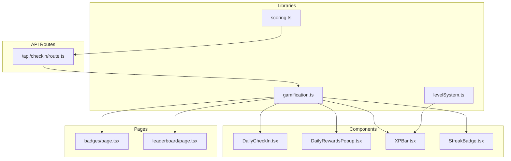
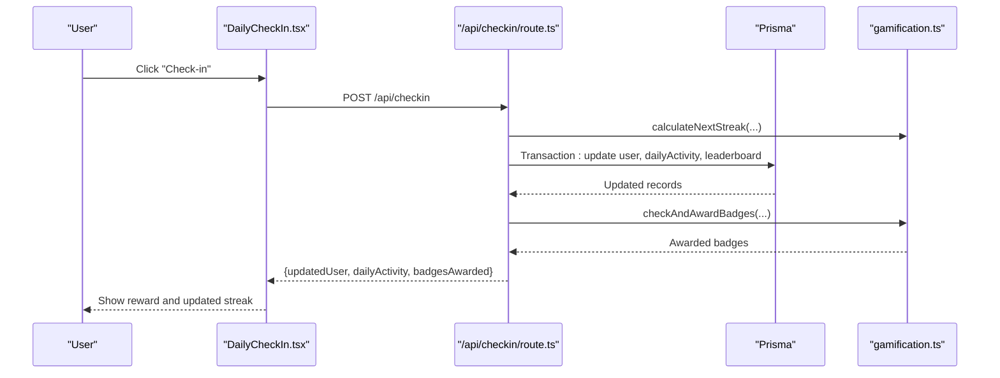
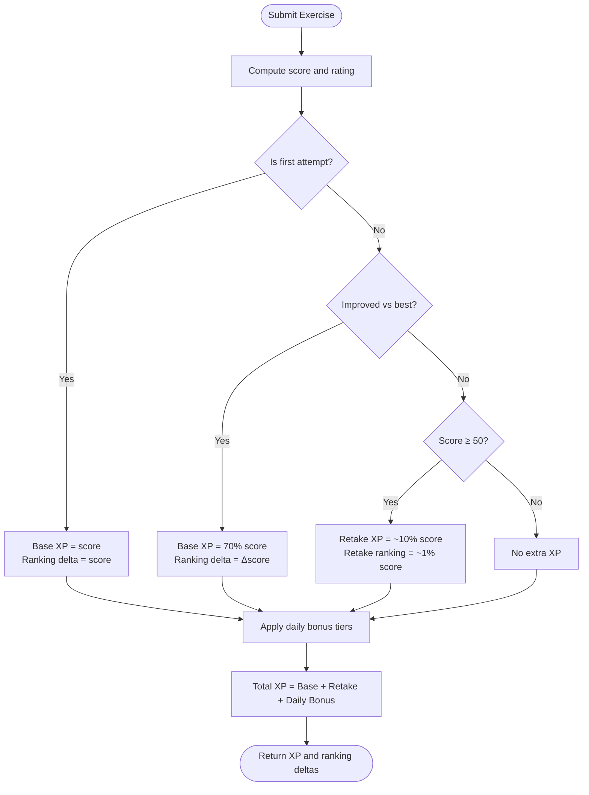
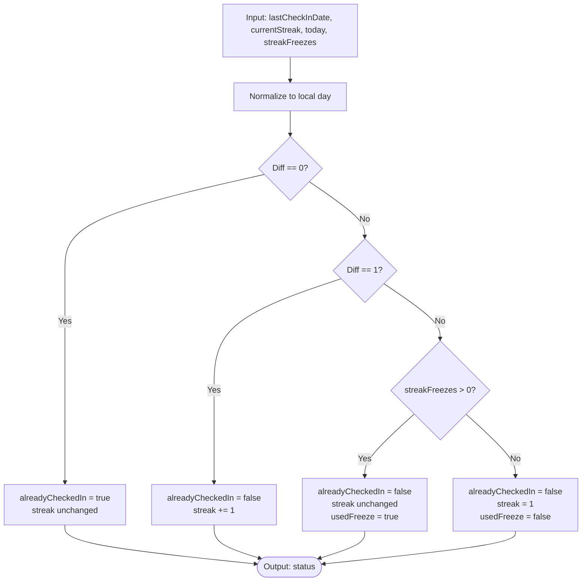
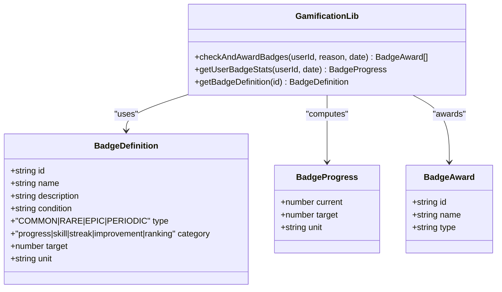
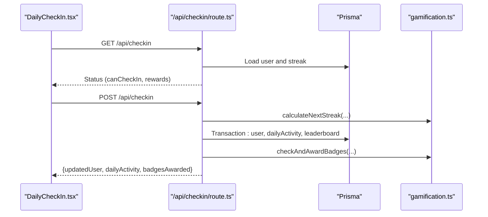
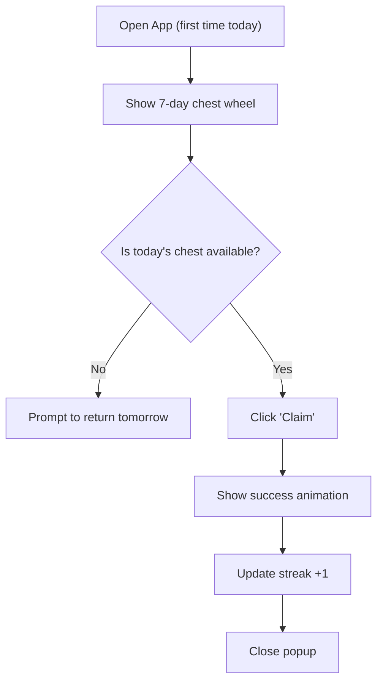
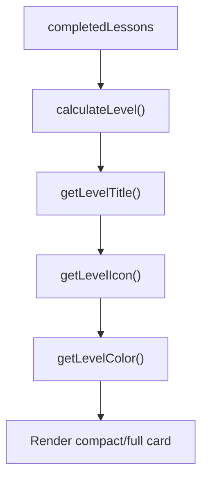
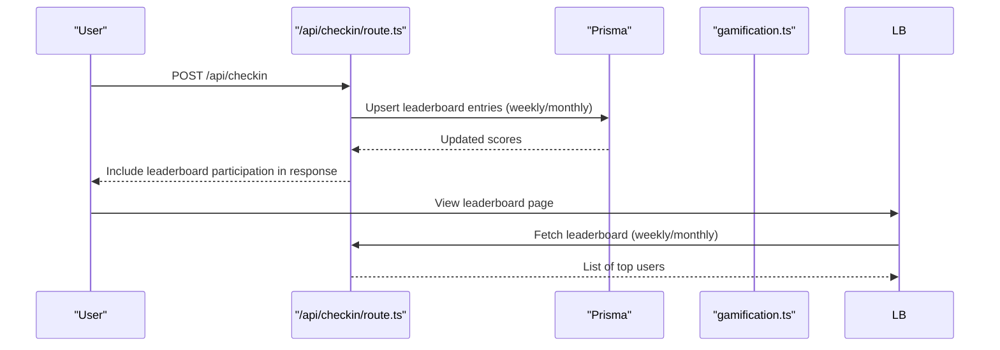
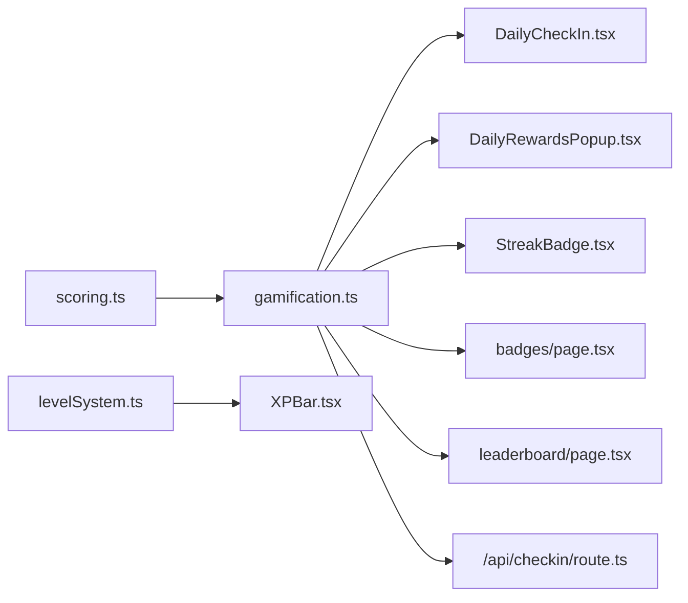

# Enhanced Gamification Elements

<cite>
**Referenced Files in This Document**
- [gamification.ts](file://english_pronunciation_app/frontend/src/lib/gamification.ts)
- [scoring.ts](file://english_pronunciation_app/frontend/src/lib/scoring.ts)
- [levelSystem.ts](file://english_pronunciation_app/frontend/src/lib/levelSystem.ts)
- [DailyCheckIn.tsx](file://english_pronunciation_app/frontend/src/components/gamification/DailyCheckIn.tsx)
- [DailyRewardsPopup.tsx](file://english_pronunciation_app/frontend/src/components/gamification/DailyRewardsPopup.tsx)
- [XPBar.tsx](file://english_pronunciation_app/frontend/src/components/gamification/XPBar.tsx)
- [StreakBadge.tsx](file://english_pronunciation_app/frontend/src/components/gamification/StreakBadge.tsx)
- [route.ts](file://english_pronunciation_app/frontend/src/app/api/checkin/route.ts)
- [page.tsx](file://english_pronunciation_app/frontend/src/app/badges/page.tsx)
- [page.tsx](file://english_pronunciation_app/frontend/src/app/leaderboard/page.tsx)
- [BADGE_SYSTEM_PLAN.md](file://PLAN/04_Features/BADGE_SYSTEM_PLAN.md)
- [DAILY_CHECKIN_FEATURE.md](file://PLAN/04_Features/DAILY_CHECKIN_FEATURE.md)
</cite>

## Table of Contents
1. [Introduction](#introduction)
2. [Project Structure](#project-structure)
3. [Core Components](#core-components)
4. [Architecture Overview](#architecture-overview)
5. [Detailed Component Analysis](#detailed-component-analysis)
6. [Dependency Analysis](#dependency-analysis)
7. [Performance Considerations](#performance-considerations)
8. [Troubleshooting Guide](#troubleshooting-guide)
9. [Conclusion](#conclusion)
10. [Appendices](#appendices)

## Introduction
This document describes the enhanced gamification system with three core elements:
- Advanced XP calculation algorithms that reward first attempts, improvements, and daily check-ins
- Streak tracking mechanisms with freeze mechanics and weekly/monthly leaderboard participation
- Achievement badge systems with progress-based triggers and periodic validity

It also documents the integration of daily check-in features, reward popup systems, and level progression displays. The gamification engine architecture, XP accumulation strategies, and social comparison features via leaderboards are explained, along with implementation details for streak persistence, reward threshold management, and personalized gamification paths. Finally, it outlines the psychological principles underpinning the design and user engagement optimization techniques.

## Project Structure
The gamification system spans frontend libraries, UI components, API routes, and planning documents:
- Libraries define scoring, XP, level progression, and badge logic
- UI components render daily check-in, streak badges, XP bars, and reward popups
- API routes orchestrate transactional updates to user stats, streaks, XP, and leaderboards
- Planning documents specify badge categories, types, and behavioral triggers

**Diagram sources**
- [gamification.ts:1-575](file://english_pronunciation_app/frontend/src/lib/gamification.ts#L1-L575)
- [scoring.ts:1-227](file://english_pronunciation_app/frontend/src/lib/scoring.ts#L1-L227)
- [levelSystem.ts:1-133](file://english_pronunciation_app/frontend/src/lib/levelSystem.ts#L1-L133)
- [DailyCheckIn.tsx:1-234](file://english_pronunciation_app/frontend/src/components/gamification/DailyCheckIn.tsx#L1-L234)
- [DailyRewardsPopup.tsx:1-239](file://english_pronunciation_app/frontend/src/components/gamification/DailyRewardsPopup.tsx#L1-L239)
- [XPBar.tsx:1-50](file://english_pronunciation_app/frontend/src/components/gamification/XPBar.tsx#L1-L50)
- [StreakBadge.tsx:1-63](file://english_pronunciation_app/frontend/src/components/gamification/StreakBadge.tsx#L1-L63)
- [page.tsx:1-253](file://english_pronunciation_app/frontend/src/app/badges/page.tsx#L1-L253)
- [page.tsx:1-224](file://english_pronunciation_app/frontend/src/app/leaderboard/page.tsx#L1-L224)
- [route.ts:1-216](file://english_pronunciation_app/frontend/src/app/api/checkin/route.ts#L1-L216)

**Section sources**
- [gamification.ts:1-575](file://english_pronunciation_app/frontend/src/lib/gamification.ts#L1-L575)
- [scoring.ts:1-227](file://english_pronunciation_app/frontend/src/lib/scoring.ts#L1-L227)
- [levelSystem.ts:1-133](file://english_pronunciation_app/frontend/src/lib/levelSystem.ts#L1-L133)
- [DailyCheckIn.tsx:1-234](file://english_pronunciation_app/frontend/src/components/gamification/DailyCheckIn.tsx#L1-L234)
- [DailyRewardsPopup.tsx:1-239](file://english_pronunciation_app/frontend/src/components/gamification/DailyRewardsPopup.tsx#L1-L239)
- [XPBar.tsx:1-50](file://english_pronunciation_app/frontend/src/components/gamification/XPBar.tsx#L1-L50)
- [StreakBadge.tsx:1-63](file://english_pronunciation_app/frontend/src/components/gamification/StreakBadge.tsx#L1-L63)
- [route.ts:1-216](file://english_pronunciation_app/frontend/src/app/api/checkin/route.ts#L1-L216)
- [page.tsx:1-253](file://english_pronunciation_app/frontend/src/app/badges/page.tsx#L1-L253)
- [page.tsx:1-224](file://english_pronunciation_app/frontend/src/app/leaderboard/page.tsx#L1-L224)
- [BADGE_SYSTEM_PLAN.md:1-156](file://PLAN/04_Features/BADGE_SYSTEM_PLAN.md#L1-L156)
- [DAILY_CHECKIN_FEATURE.md:1-371](file://PLAN/04_Features/DAILY_CHECKIN_FEATURE.md#L1-L371)

## Core Components
- XP Calculation Engine
  - First attempt: full score-based XP
  - Improved attempts: scaled XP plus ranking delta
  - Retakes above pass threshold: small XP and minimal ranking contribution
  - Daily bonus tiers based on exercises completed in the day
- Streak Tracking
  - Compute next streak considering last check-in, local day boundaries, and freeze usage
  - Persist streak count, longest streak, and total check-ins
- Achievement Badge System
  - Define badge categories and types (common, rare, epic, periodic)
  - Compute progress from user stats and award badges upon meeting conditions
  - Support periodic validity for ranking badges
- Daily Check-in and Rewards
  - Frontend widget and API endpoint for check-in with transactional updates
  - Popup reward display for daily streak chests
- Level Progression Display
  - Calculate level from XP and render compact/full progress cards
- Leaderboards
  - Weekly and monthly leaderboard participation via ranking scores
  - Public leaderboard page with user stats and badges

**Section sources**
- [gamification.ts:53-575](file://english_pronunciation_app/frontend/src/lib/gamification.ts#L53-L575)
- [scoring.ts:191-227](file://english_pronunciation_app/frontend/src/lib/scoring.ts#L191-L227)
- [DailyCheckIn.tsx:1-234](file://english_pronunciation_app/frontend/src/components/gamification/DailyCheckIn.tsx#L1-L234)
- [DailyRewardsPopup.tsx:1-239](file://english_pronunciation_app/frontend/src/components/gamification/DailyRewardsPopup.tsx#L1-L239)
- [XPBar.tsx:1-50](file://english_pronunciation_app/frontend/src/components/gamification/XPBar.tsx#L1-L50)
- [StreakBadge.tsx:1-63](file://english_pronunciation_app/frontend/src/components/gamification/StreakBadge.tsx#L1-L63)
- [route.ts:33-216](file://english_pronunciation_app/frontend/src/app/api/checkin/route.ts#L33-L216)
- [page.tsx:1-224](file://english_pronunciation_app/frontend/src/app/leaderboard/page.tsx#L1-L224)
- [BADGE_SYSTEM_PLAN.md:1-156](file://PLAN/04_Features/BADGE_SYSTEM_PLAN.md#L1-L156)

## Architecture Overview
The gamification engine integrates frontend components with backend APIs to maintain state and deliver rewards. The flow below maps actual source files and their interactions.

**Diagram sources**
- [DailyCheckIn.tsx:106-161](file://english_pronunciation_app/frontend/src/components/gamification/DailyCheckIn.tsx#L106-L161)
- [route.ts:79-215](file://english_pronunciation_app/frontend/src/app/api/checkin/route.ts#L79-L215)
- [gamification.ts:553-575](file://english_pronunciation_app/frontend/src/lib/gamification.ts#L553-L575)
- [gamification.ts:490-531](file://english_pronunciation_app/frontend/src/lib/gamification.ts#L490-L531)

## Detailed Component Analysis

### XP Calculation Engine
The XP engine computes rewards per exercise submission and daily check-in:
- First attempt: XP equals raw score; ranking delta equals score
- Improved attempts: 70% of score; ranking delta equals score minus best
- Retakes ≥ 50: small XP and minimal ranking contribution
- Daily bonus: tiered XP and ranking based on completed exercises in the day
- Level progression: derived from cumulative XP using a square-root formula

**Diagram sources**
- [gamification.ts:195-234](file://english_pronunciation_app/frontend/src/lib/gamification.ts#L195-L234)
- [scoring.ts:203-227](file://english_pronunciation_app/frontend/src/lib/scoring.ts#L203-L227)

**Section sources**
- [gamification.ts:186-234](file://english_pronunciation_app/frontend/src/lib/gamification.ts#L186-L234)
- [scoring.ts:191-227](file://english_pronunciation_app/frontend/src/lib/scoring.ts#L191-L227)

### Streak Tracking and Persistence
Streak computation considers local day boundaries and freeze usage:
- If no prior check-in: start streak at 1
- If already checked in today: keep streak
- If next day: increment streak
- If gap > 1 day: reset to 1 unless freezes are available
- If freeze used: keep streak but decrement freeze count

**Diagram sources**
- [gamification.ts:553-575](file://english_pronunciation_app/frontend/src/lib/gamification.ts#L553-L575)

**Section sources**
- [gamification.ts:553-575](file://english_pronunciation_app/frontend/src/lib/gamification.ts#L553-L575)
- [route.ts:109-131](file://english_pronunciation_app/frontend/src/app/api/checkin/route.ts#L109-L131)

### Achievement Badge System
Badge definitions enumerate categories and targets. Progress is computed from user stats and badges are awarded once per badge per user, with optional periodic validity.

**Diagram sources**
- [gamification.ts:42-51](file://english_pronunciation_app/frontend/src/lib/gamification.ts#L42-L51)
- [gamification.ts:328-378](file://english_pronunciation_app/frontend/src/lib/gamification.ts#L328-L378)
- [gamification.ts:490-531](file://english_pronunciation_app/frontend/src/lib/gamification.ts#L490-L531)

**Section sources**
- [gamification.ts:65-176](file://english_pronunciation_app/frontend/src/lib/gamification.ts#L65-L176)
- [gamification.ts:328-531](file://english_pronunciation_app/frontend/src/lib/gamification.ts#L328-L531)
- [BADGE_SYSTEM_PLAN.md:1-156](file://PLAN/04_Features/BADGE_SYSTEM_PLAN.md#L1-L156)

### Daily Check-in Workflow
The daily check-in component fetches status, renders streak visuals, and submits check-in via an API endpoint that performs a transactional update of XP, streaks, leaderboard participation, and badge checks.

**Diagram sources**
- [DailyCheckIn.tsx:69-161](file://english_pronunciation_app/frontend/src/components/gamification/DailyCheckIn.tsx#L69-L161)
- [route.ts:33-215](file://english_pronunciation_app/frontend/src/app/api/checkin/route.ts#L33-L215)
- [gamification.ts:553-575](file://english_pronunciation_app/frontend/src/lib/gamification.ts#L553-L575)
- [gamification.ts:490-531](file://english_pronunciation_app/frontend/src/lib/gamification.ts#L490-L531)

**Section sources**
- [DailyCheckIn.tsx:1-234](file://english_pronunciation_app/frontend/src/components/gamification/DailyCheckIn.tsx#L1-L234)
- [route.ts:1-216](file://english_pronunciation_app/frontend/src/app/api/checkin/route.ts#L1-L216)

### Reward Popup System
The reward popup displays a weekly chest wheel with increasing daily rewards and a claim flow that animates success and updates streak counters.

**Diagram sources**
- [DailyRewardsPopup.tsx:31-174](file://english_pronunciation_app/frontend/src/components/gamification/DailyRewardsPopup.tsx#L31-L174)
- [DailyRewardsPopup.tsx:176-239](file://english_pronunciation_app/frontend/src/components/gamification/DailyRewardsPopup.tsx#L176-L239)

**Section sources**
- [DailyRewardsPopup.tsx:1-239](file://english_pronunciation_app/frontend/src/components/gamification/DailyRewardsPopup.tsx#L1-L239)

### Level Progression Display
The level display component calculates level, title, icon, and progress percentage, rendering either compact or full card views.

**Diagram sources**
- [levelSystem.ts:20-99](file://english_pronunciation_app/frontend/src/lib/levelSystem.ts#L20-L99)

**Section sources**
- [levelSystem.ts:1-133](file://english_pronunciation_app/frontend/src/lib/levelSystem.ts#L1-L133)
- [XPBar.tsx:1-50](file://english_pronunciation_app/frontend/src/components/gamification/XPBar.tsx#L1-L50)

### Social Comparison and Leaderboards
Leaderboard participation is integrated into daily check-in and exercise submissions. Users gain ranking scores that contribute to weekly and monthly leaderboards.

**Diagram sources**
- [route.ts:162-181](file://english_pronunciation_app/frontend/src/app/api/checkin/route.ts#L162-L181)
- [page.tsx:66-100](file://english_pronunciation_app/frontend/src/app/leaderboard/page.tsx#L66-L100)
- [gamification.ts:236-244](file://english_pronunciation_app/frontend/src/lib/gamification.ts#L236-L244)

**Section sources**
- [route.ts:162-181](file://english_pronunciation_app/frontend/src/app/api/checkin/route.ts#L162-L181)
- [page.tsx:1-224](file://english_pronunciation_app/frontend/src/app/leaderboard/page.tsx#L1-L224)
- [gamification.ts:236-244](file://english_pronunciation_app/frontend/src/lib/gamification.ts#L236-L244)

## Dependency Analysis
The gamification system exhibits cohesive internal dependencies:
- Libraries depend on shared scoring and period utilities
- Components depend on library functions for XP, badges, and streaks
- API routes depend on library functions for calculations and badge checks
- Pages depend on components and library functions for rendering and fetching data

**Diagram sources**
- [scoring.ts:1-227](file://english_pronunciation_app/frontend/src/lib/scoring.ts#L1-L227)
- [levelSystem.ts:1-133](file://english_pronunciation_app/frontend/src/lib/levelSystem.ts#L1-L133)
- [gamification.ts:1-575](file://english_pronunciation_app/frontend/src/lib/gamification.ts#L1-L575)
- [DailyCheckIn.tsx:1-234](file://english_pronunciation_app/frontend/src/components/gamification/DailyCheckIn.tsx#L1-L234)
- [DailyRewardsPopup.tsx:1-239](file://english_pronunciation_app/frontend/src/components/gamification/DailyRewardsPopup.tsx#L1-L239)
- [StreakBadge.tsx:1-63](file://english_pronunciation_app/frontend/src/components/gamification/StreakBadge.tsx#L1-L63)
- [XPBar.tsx:1-50](file://english_pronunciation_app/frontend/src/components/gamification/XPBar.tsx#L1-L50)
- [page.tsx:1-253](file://english_pronunciation_app/frontend/src/app/badges/page.tsx#L1-L253)
- [page.tsx:1-224](file://english_pronunciation_app/frontend/src/app/leaderboard/page.tsx#L1-L224)
- [route.ts:1-216](file://english_pronunciation_app/frontend/src/app/api/checkin/route.ts#L1-L216)

**Section sources**
- [gamification.ts:1-575](file://english_pronunciation_app/frontend/src/lib/gamification.ts#L1-L575)
- [scoring.ts:1-227](file://english_pronunciation_app/frontend/src/lib/scoring.ts#L1-L227)
- [levelSystem.ts:1-133](file://english_pronunciation_app/frontend/src/lib/levelSystem.ts#L1-L133)
- [DailyCheckIn.tsx:1-234](file://english_pronunciation_app/frontend/src/components/gamification/DailyCheckIn.tsx#L1-L234)
- [DailyRewardsPopup.tsx:1-239](file://english_pronunciation_app/frontend/src/components/gamification/DailyRewardsPopup.tsx#L1-L239)
- [StreakBadge.tsx:1-63](file://english_pronunciation_app/frontend/src/components/gamification/StreakBadge.tsx#L1-L63)
- [XPBar.tsx:1-50](file://english_pronunciation_app/frontend/src/components/gamification/XPBar.tsx#L1-L50)
- [page.tsx:1-253](file://english_pronunciation_app/frontend/src/app/badges/page.tsx#L1-L253)
- [page.tsx:1-224](file://english_pronunciation_app/frontend/src/app/leaderboard/page.tsx#L1-L224)
- [route.ts:1-216](file://english_pronunciation_app/frontend/src/app/api/checkin/route.ts#L1-L216)

## Performance Considerations
- Transactional writes: The backend consolidates XP, streak, daily activity, leaderboard, and badge checks into a single transaction to minimize contention and ensure atomicity.
- Asynchronous badge checks: Badge evaluation runs after write completion to avoid blocking the primary flow.
- Efficient queries: Badge statistics aggregation uses a single pass over attempts and leverages map-based best scores to reduce complexity.
- UI responsiveness: Frontend components debounce network requests and use loading states to prevent redundant calls.

[No sources needed since this section provides general guidance]

## Troubleshooting Guide
Common issues and resolutions:
- Authentication failures during check-in
  - Ensure the user is logged in; the API requires an authenticated session.
- Already checked-in today
  - The API returns a conflict when attempting to check-in twice in the same day; disable the button accordingly.
- Network errors
  - Display user-friendly messages and retry logic in components; surface error codes from the API.
- Streak reset unexpectedly
  - Verify timezone normalization and local day boundaries; confirm freeze usage if applicable.
- Badge not appearing
  - Confirm badge conditions and periodic validity; ensure badge checks run after relevant actions.

**Section sources**
- [route.ts:33-77](file://english_pronunciation_app/frontend/src/app/api/checkin/route.ts#L33-L77)
- [DailyCheckIn.tsx:88-161](file://english_pronunciation_app/frontend/src/components/gamification/DailyCheckIn.tsx#L88-L161)
- [gamification.ts:490-531](file://english_pronunciation_app/frontend/src/lib/gamification.ts#L490-L531)

## Conclusion
The enhanced gamification system combines robust XP calculations, streak persistence with freeze mechanics, and a structured badge system to drive retention and engagement. The frontend-backend architecture ensures reliable state updates, while leaderboards foster healthy competition. Psychological design principles—such as variable rewards, loss aversion via streak resets, and progress visualization—are embedded to optimize long-term user involvement.

[No sources needed since this section summarizes without analyzing specific files]

## Appendices

### Psychological Principles and Engagement Techniques
- Variable reward schedules: Increasing daily rewards encourage consistent participation
- Loss aversion: Risk of losing streak motivates daily check-ins
- Mastery and progression: XP and level displays reinforce competence
- Social comparison: Leaderboards and badges promote aspiration
- Immediate feedback: Visual animations and popups reinforce positive behavior

[No sources needed since this section provides general guidance]