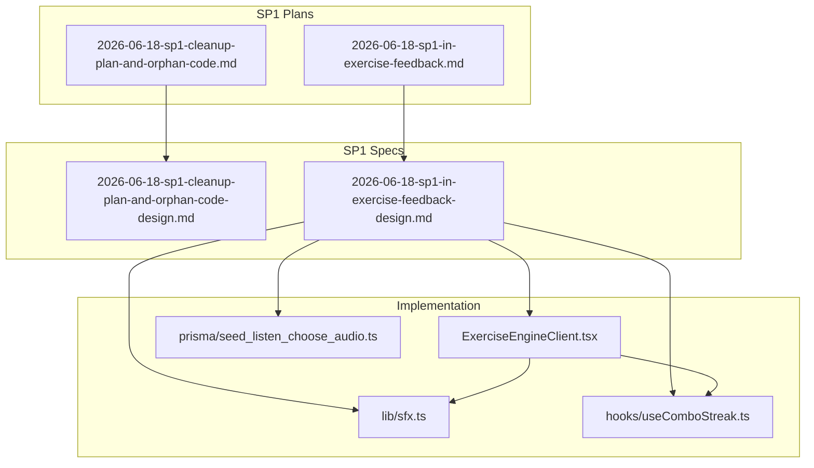
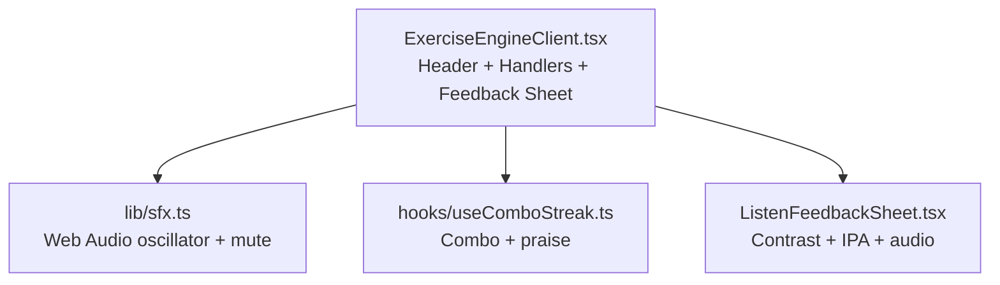
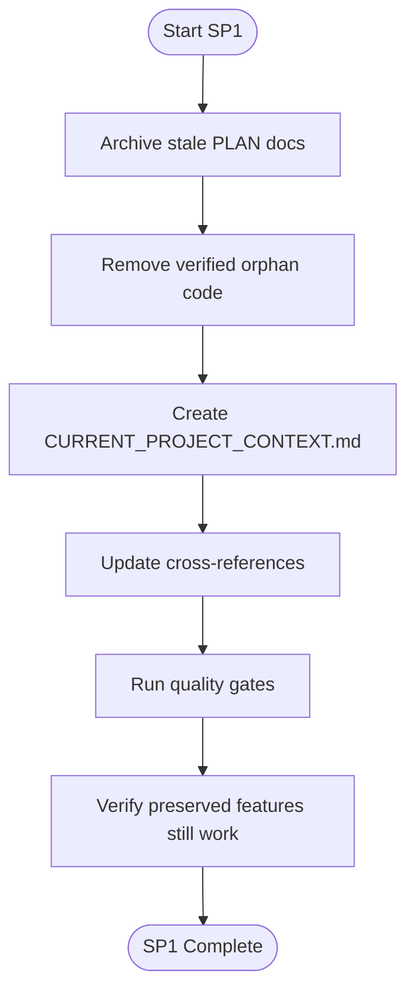
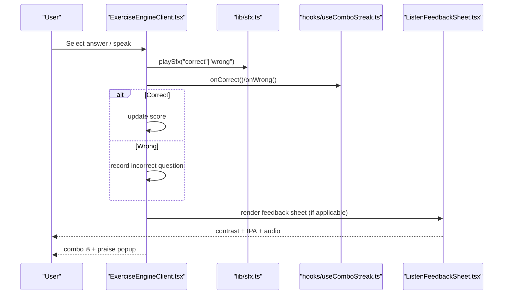
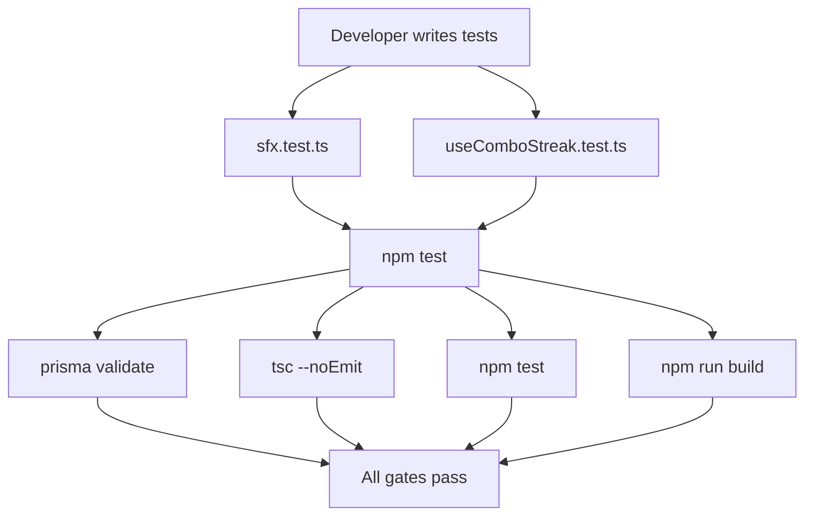
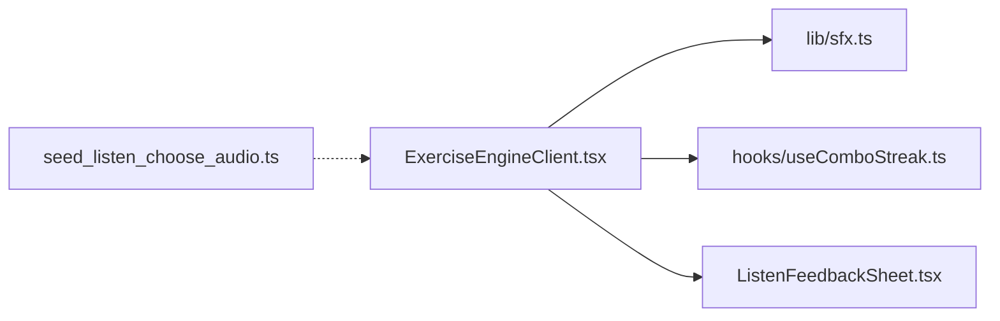

# Experimental and Research Features

<cite>
**Referenced Files in This Document**
- [2026-06-18-sp1-cleanup-plan-and-orphan-code.md](file://docs/superpowers/plans/2026-06-18-sp1-cleanup-plan-and-orphan-code.md)
- [2026-06-18-sp1-in-exercise-feedback.md](file://docs/superpowers/plans/2026-06-18-sp1-in-exercise-feedback.md)
- [2026-06-18-sp1-cleanup-plan-and-orphan-code-design.md](file://docs/superpowers/specs/2026-06-18-sp1-cleanup-plan-and-orphan-code-design.md)
- [2026-06-18-sp1-in-exercise-feedback-design.md](file://docs/superpowers/specs/2026-06-18-sp1-in-exercise-feedback-design.md)
- [sfx.ts](file://english_pronunciation_app/frontend/src/lib/sfx.ts)
- [useComboStreak.ts](file://english_pronunciation_app/frontend/src/hooks/useComboStreak.ts)
- [ExerciseEngineClient.tsx](file://english_pronunciation_app/frontend/src/app/exercises/[id]/ExerciseEngineClient.tsx)
- [seed_listen_choose_audio.ts](file://english_pronunciation_app/frontend/prisma/seed_listen_choose_audio.ts)
- [sfx.test.ts](file://english_pronunciation_app/frontend/src/lib/__tests__/sfx.test.ts)
- [useComboStreak.test.ts](file://english_pronunciation_app/frontend/src/hooks/__tests__/useComboStreak.test.ts)
- [useSpeechRecognition.ts](file://english_pronunciation_app/frontend/src/hooks/useSpeechRecognition.ts)
</cite>

## Table of Contents
1. [Introduction](#introduction)
2. [Project Structure](#project-structure)
3. [Core Components](#core-components)
4. [Architecture Overview](#architecture-overview)
5. [Detailed Component Analysis](#detailed-component-analysis)
6. [Dependency Analysis](#dependency-analysis)
7. [Performance Considerations](#performance-considerations)
8. [Troubleshooting Guide](#troubleshooting-guide)
9. [Conclusion](#conclusion)
10. [Appendices](#appendices)

## Introduction
This document covers the experimental features and research initiatives implemented under the SP1 initiative, focusing on:
- Code cleanup and orphan code elimination procedures
- In-exercise feedback systems (multimodal feedback during practice)
- Advanced feedback mechanisms and automated quality gates
- Experimental feature testing frameworks
- Research methodologies for speech assessment and feedback enhancement
- Feature experimentation pipelines and quality assurance processes
- Production stability controls including rollback and feature gating strategies

The SP1 effort establishes a reliable foundation for subsequent sub-projects (SP2–SP6) by cleaning stale documentation, removing unused code, and introducing robust, test-backed feedback infrastructure.

## Project Structure
The experimental work is organized around two primary SP1 deliverables:
- Cleanup and documentation consolidation (PLAN archival and orphan code removal)
- In-exercise feedback system (SFX, combo streaks, and feedback sheet)

**Diagram sources**
- [2026-06-18-sp1-cleanup-plan-and-orphan-code.md:1-410](file://docs/superpowers/plans/2026-06-18-sp1-cleanup-plan-and-orphan-code.md#L1-L410)
- [2026-06-18-sp1-in-exercise-feedback.md:1-857](file://docs/superpowers/plans/2026-06-18-sp1-in-exercise-feedback.md#L1-L857)
- [2026-06-18-sp1-cleanup-plan-and-orphan-code-design.md:1-121](file://docs/superpowers/specs/2026-06-18-sp1-cleanup-plan-and-orphan-code-design.md#L1-L121)
- [2026-06-18-sp1-in-exercise-feedback-design.md:1-196](file://docs/superpowers/specs/2026-06-18-sp1-in-exercise-feedback-design.md#L1-L196)
- [ExerciseEngineClient.tsx:1-645](file://english_pronunciation_app/frontend/src/app/exercises/[id]/ExerciseEngineClient.tsx#L1-L645)
- [sfx.ts:1-99](file://english_pronunciation_app/frontend/src/lib/sfx.ts#L1-L99)
- [useComboStreak.ts:1-75](file://english_pronunciation_app/frontend/src/hooks/useComboStreak.ts#L1-L75)
- [seed_listen_choose_audio.ts:1-85](file://english_pronunciation_app/frontend/prisma/seed_listen_choose_audio.ts#L1-L85)

**Section sources**
- [2026-06-18-sp1-cleanup-plan-and-orphan-code.md:1-410](file://docs/superpowers/plans/2026-06-18-sp1-cleanup-plan-and-orphan-code.md#L1-L410)
- [2026-06-18-sp1-in-exercise-feedback.md:1-857](file://docs/superpowers/plans/2026-06-18-sp1-in-exercise-feedback.md#L1-L857)

## Core Components
- Cleanup and documentation consolidation:
  - Archive stale PLAN documents into a dedicated archive folder
  - Remove verified orphan code files
  - Establish a single source of truth for current project context
  - Enforce quality gates to ensure no behavioral regression
- In-exercise feedback system:
  - Web Audio oscillator-based SFX module for immediate feedback
  - Combo streak hook for gamified motivation
  - Tabled feedback sheet for contrast-based listening tasks
  - Seed script to prepare contrast audio for listening questions
  - Unit tests for SFX and combo logic

Key outcomes:
- Reduced engine complexity by modularizing feedback concerns
- Improved accessibility compliance with reduced-motion support
- Enhanced user feedback fidelity for pronunciation exercises

**Section sources**
- [2026-06-18-sp1-cleanup-plan-and-orphan-code-design.md:1-121](file://docs/superpowers/specs/2026-06-18-sp1-cleanup-plan-and-orphan-code-design.md#L1-L121)
- [2026-06-18-sp1-in-exercise-feedback-design.md:1-196](file://docs/superpowers/specs/2026-06-18-sp1-in-exercise-feedback-design.md#L1-L196)

## Architecture Overview
The SP1 feedback architecture separates concerns into reusable modules integrated into the exercise engine. The engine orchestrates feedback delivery while modules encapsulate cross-cutting concerns.

**Diagram sources**
- [ExerciseEngineClient.tsx:1-645](file://english_pronunciation_app/frontend/src/app/exercises/[id]/ExerciseEngineClient.tsx#L1-L645)
- [sfx.ts:1-99](file://english_pronunciation_app/frontend/src/lib/sfx.ts#L1-L99)
- [useComboStreak.ts:1-75](file://english_pronunciation_app/frontend/src/hooks/useComboStreak.ts#L1-L75)

## Detailed Component Analysis

### Cleanup and Orphan Code Elimination
- Objective: Remove stale documentation and unused code to prevent misalignment between plans and implementation.
- Approach:
  - Archive PLAN documents into a historical archive folder with explanatory README
  - Verify orphan code by scanning imports and remove files with zero external references
  - Preserve running features (XP, streak, badges, leaderboard) and flagged known bugs for later fixes
  - Establish CURRENT_PROJECT_CONTEXT.md as the authoritative source of truth
- Quality gates:
  - Prisma schema validation
  - TypeScript compilation
  - Test suite execution
  - Build verification

**Diagram sources**
- [2026-06-18-sp1-cleanup-plan-and-orphan-code.md:1-410](file://docs/superpowers/plans/2026-06-18-sp1-cleanup-plan-and-orphan-code.md#L1-L410)
- [2026-06-18-sp1-cleanup-plan-and-orphan-code-design.md:1-121](file://docs/superpowers/specs/2026-06-18-sp1-cleanup-plan-and-orphan-code-design.md#L1-L121)

**Section sources**
- [2026-06-18-sp1-cleanup-plan-and-orphan-code.md:1-410](file://docs/superpowers/plans/2026-06-18-sp1-cleanup-plan-and-orphan-code.md#L1-L410)
- [2026-06-18-sp1-cleanup-plan-and-orphan-code-design.md:1-121](file://docs/superpowers/specs/2026-06-18-sp1-cleanup-plan-and-orphan-code-design.md#L1-L121)

### In-Exercise Feedback System
- Goals:
  - Immediate, accurate, and non-stressful feedback aligned with Nielsen and Cambridge SLA
  - Multimodal feedback: sensory (SFX + shake), cognitive (contrast + IPA + meaning), and gamified (combo + praise)
- Implementation:
  - SFX module: Web Audio API oscillator with tone envelopes, mute persistence, and reduced-motion compatibility
  - Combo streak hook: milestone-based combo rendering and randomized praise popups
  - Feedback sheet: contrast comparison and dual-audio playback for listening tasks
  - Seed script: bake contrast audio URLs into listening question content for immediate playback
  - Engine integration: header renders combo and mute controls; handlers trigger SFX and combo updates; feedback sheet replaces inline bottom sheet

**Diagram sources**
- [ExerciseEngineClient.tsx:416-467](file://english_pronunciation_app/frontend/src/app/exercises/[id]/ExerciseEngineClient.tsx#L416-L467)
- [sfx.ts:59-82](file://english_pronunciation_app/frontend/src/lib/sfx.ts#L59-L82)
- [useComboStreak.ts:24-36](file://english_pronunciation_app/frontend/src/hooks/useComboStreak.ts#L24-L36)
- [2026-06-18-sp1-in-exercise-feedback-design.md:80-109](file://docs/superpowers/specs/2026-06-18-sp1-in-exercise-feedback-design.md#L80-L109)

**Section sources**
- [2026-06-18-sp1-in-exercise-feedback.md:1-857](file://docs/superpowers/plans/2026-06-18-sp1-in-exercise-feedback.md#L1-L857)
- [2026-06-18-sp1-in-exercise-feedback-design.md:1-196](file://docs/superpowers/specs/2026-06-18-sp1-in-exercise-feedback-design.md#L1-L196)
- [ExerciseEngineClient.tsx:1-645](file://english_pronunciation_app/frontend/src/app/exercises/[id]/ExerciseEngineClient.tsx#L1-L645)
- [sfx.ts:1-99](file://english_pronunciation_app/frontend/src/lib/sfx.ts#L1-L99)
- [useComboStreak.ts:1-75](file://english_pronunciation_app/frontend/src/hooks/useComboStreak.ts#L1-L75)
- [seed_listen_choose_audio.ts:1-85](file://english_pronunciation_app/frontend/prisma/seed_listen_choose_audio.ts#L1-L85)

### Advanced Feedback Mechanisms and Automated Quality Checks
- SFX module:
  - Web Audio oscillator with fade-in/fade-out envelopes to avoid clicks
  - Mute toggled via localStorage with a dedicated hook
  - Reduced-motion guard ensures compliance without disabling sound
- Combo streak:
  - Milestone levels for visual feedback (≥3, ≥5, ≥7)
  - Randomized praise popups with short-lived visibility
  - Pure helper functions for deterministic testing
- Testing framework:
  - Node:test with localStorage mocks for SFX mute logic
  - Unit tests for combo milestone transitions and praise selection
- Quality gates:
  - Prisma schema validation
  - TypeScript compilation
  - Test execution
  - Build verification

**Diagram sources**
- [sfx.test.ts:1-34](file://english_pronunciation_app/frontend/src/lib/__tests__/sfx.test.ts#L1-L34)
- [useComboStreak.test.ts:1-51](file://english_pronunciation_app/frontend/src/hooks/__tests__/useComboStreak.test.ts#L1-L51)
- [2026-06-18-sp1-in-exercise-feedback-design.md:166-172](file://docs/superpowers/specs/2026-06-18-sp1-in-exercise-feedback-design.md#L166-L172)

**Section sources**
- [sfx.ts:1-99](file://english_pronunciation_app/frontend/src/lib/sfx.ts#L1-L99)
- [useComboStreak.ts:1-75](file://english_pronunciation_app/frontend/src/hooks/useComboStreak.ts#L1-L75)
- [sfx.test.ts:1-34](file://english_pronunciation_app/frontend/src/lib/__tests__/sfx.test.ts#L1-L34)
- [useComboStreak.test.ts:1-51](file://english_pronunciation_app/frontend/src/hooks/__tests__/useComboStreak.test.ts#L1-L51)
- [2026-06-18-sp1-in-exercise-feedback-design.md:166-172](file://docs/superpowers/specs/2026-06-18-sp1-in-exercise-feedback-design.md#L166-L172)

### Experimental Feature Testing Framework
- Test-first development for feedback modules:
  - SFX mute behavior tested in isolation
  - Combo milestone logic validated with deterministic assertions
- Smoke testing for integration:
  - Manual verification of feedback sheet rendering and audio playback
  - Shake animation applied to incorrect selections
- Idempotent seed scripts:
  - Contrast audio baking without re-fetching audio resources
  - Graceful handling when audio is unavailable

**Section sources**
- [2026-06-18-sp1-in-exercise-feedback-design.md:166-172](file://docs/superpowers/specs/2026-06-18-sp1-in-exercise-feedback-design.md#L166-L172)
- [seed_listen_choose_audio.ts:1-85](file://english_pronunciation_app/frontend/prisma/seed_listen_choose_audio.ts#L1-L85)

### Research Methodologies for Speech Assessment Improvement
- Current speech recognition pipeline:
  - Browser-based Web Speech API with normalization and matching heuristics
  - State machine tracks listening, processing, and result phases
  - Supports continuous and interim results configuration
- Research directions supported by SP1:
  - Accessibility and reduced-motion compatibility for feedback
  - Comparative evaluation of SFX and combo effects on engagement and accuracy
  - Seed-driven preparation of contrast audio for phoneme discrimination tasks
- Integration points:
  - Speech recognition hook complements SFX and combo for voice tasks
  - Future enhancements can leverage standardized scoring and leaderboards

**Section sources**
- [useSpeechRecognition.ts:1-111](file://english_pronunciation_app/frontend/src/hooks/useSpeechRecognition.ts#L1-L111)
- [2026-06-18-sp1-in-exercise-feedback-design.md:10-14](file://docs/superpowers/specs/2026-06-18-sp1-in-exercise-feedback-design.md#L10-L14)

### AI Integration Strategies and Adaptive Learning Algorithms
- AI skills inventory and phased usage:
  - Skills curated for architect-mode, deployment, testing, and domain expertise
  - Skill usage mapped to roadmap phases to guide agent-driven development
- SP1 alignment:
  - Ensures accurate project context for AI agents
  - Provides clean, test-backed modules for AI to reason about and extend
- Future integration:
  - AI prompts and skills can be refined as SP2–SP6 introduce new features
  - Quality gates and test coverage enable safe AI-assisted refactors

**Section sources**
- [2026-06-18-sp1-cleanup-plan-and-orphan-code-design.md:78-79](file://docs/superpowers/specs/2026-06-18-sp1-cleanup-plan-and-orphan-code-design.md#L78-L79)

### Feature Experimentation Pipelines and Innovation Lab Processes
- Modularization enables controlled experimentation:
  - SFX and combo modules can be toggled or modified independently
  - Feedback sheet decoupled from engine for rapid iteration
- Innovation lab processes:
  - Design-first approach with detailed specs
  - Implementation plans with task-by-task execution and checkpoints
  - Cross-reference updates and archive maintenance to preserve historical context
- Rollout readiness:
  - Quality gates enforce stability before declaring completion
  - Archive preserves prior designs for comparative analysis

**Section sources**
- [2026-06-18-sp1-in-exercise-feedback-design.md:33-44](file://docs/superpowers/specs/2026-06-18-sp1-in-exercise-feedback-design.md#L33-L44)
- [2026-06-18-sp1-in-exercise-feedback.md:1-857](file://docs/superpowers/plans/2026-06-18-sp1-in-exercise-feedback.md#L1-L857)

## Dependency Analysis
The feedback system exhibits low coupling and high cohesion:
- ExerciseEngineClient depends on SFX and combo modules for immediate feedback
- Feedback sheet is a separate component imported by the engine
- Seed script operates independently of runtime logic

**Diagram sources**
- [ExerciseEngineClient.tsx:1-645](file://english_pronunciation_app/frontend/src/app/exercises/[id]/ExerciseEngineClient.tsx#L1-L645)
- [sfx.ts:1-99](file://english_pronunciation_app/frontend/src/lib/sfx.ts#L1-L99)
- [useComboStreak.ts:1-75](file://english_pronunciation_app/frontend/src/hooks/useComboStreak.ts#L1-L75)
- [seed_listen_choose_audio.ts:1-85](file://english_pronunciation_app/frontend/prisma/seed_listen_choose_audio.ts#L1-L85)

**Section sources**
- [ExerciseEngineClient.tsx:1-645](file://english_pronunciation_app/frontend/src/app/exercises/[id]/ExerciseEngineClient.tsx#L1-L645)

## Performance Considerations
- SFX latency:
  - Web Audio oscillator initialized lazily on first user gesture to satisfy autoplay policies
  - Short fade-in/fade-out envelopes minimize perceived latency
- Rendering:
  - Combo milestones computed with constant-time helpers
  - Feedback sheet rendered conditionally to reduce DOM overhead
- Accessibility:
  - Reduced-motion guard disables animations while preserving sound feedback
- Seed script efficiency:
  - Idempotent upserts with minimal DB queries
  - No external API calls for audio resource fetching

[No sources needed since this section provides general guidance]

## Troubleshooting Guide
- SFX not playing:
  - Verify autoplay policy and user gesture requirement
  - Confirm AudioContext is resumed and not suspended
- Mute toggle not persisting:
  - Check localStorage availability and permissions
- Combo milestone not triggering praise:
  - Validate milestone thresholds and praise selection logic
- Feedback sheet not appearing:
  - Ensure correct question type and inline replacement with component
- Seed script errors:
  - Confirm question content parsing and WordItem lookup conditions

**Section sources**
- [sfx.ts:59-82](file://english_pronunciation_app/frontend/src/lib/sfx.ts#L59-L82)
- [useComboStreak.ts:16-36](file://english_pronunciation_app/frontend/src/hooks/useComboStreak.ts#L16-L36)
- [ExerciseEngineClient.tsx:633-641](file://english_pronunciation_app/frontend/src/app/exercises/[id]/ExerciseEngineClient.tsx#L633-L641)
- [seed_listen_choose_audio.ts:31-74](file://english_pronunciation_app/frontend/prisma/seed_listen_choose_audio.ts#L31-L74)

## Conclusion
SP1 establishes a robust foundation for experimental and research features by:
- Cleaning up stale documentation and removing orphan code
- Introducing modular, test-backed feedback infrastructure
- Enforcing quality gates to maintain production stability
- Preparing the ground for future enhancements in speech assessment, AI integration, and adaptive learning

These efforts balance innovation with reliability, ensuring that experimental features can be safely explored and iterated upon without compromising the user experience.

## Appendices
- Accessibility and reduced-motion compatibility are integrated into the feedback system
- Seed scripts and tests provide reproducible environments for experimentation
- Cross-reference updates and archives support historical analysis and decision-making

[No sources needed since this section summarizes without analyzing specific files]