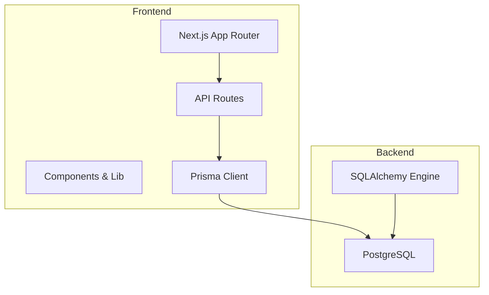
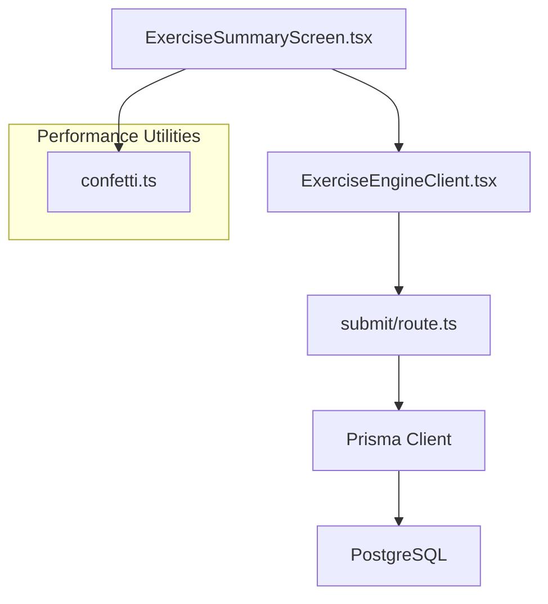
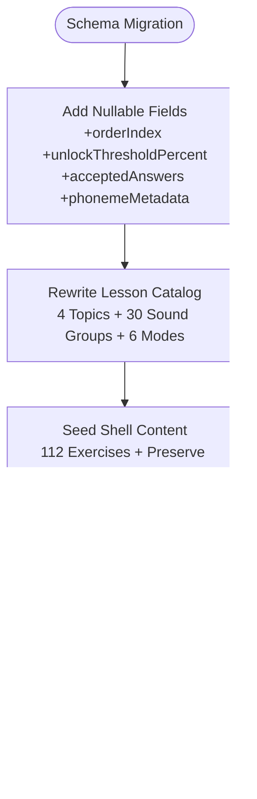
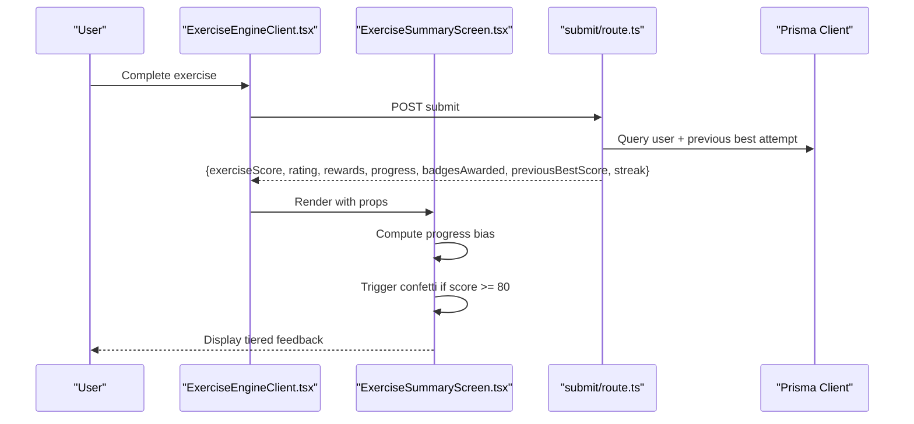
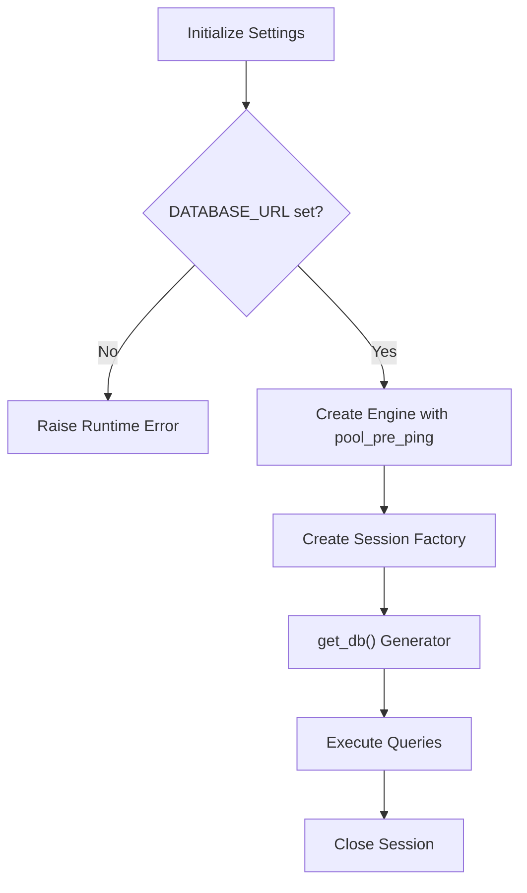
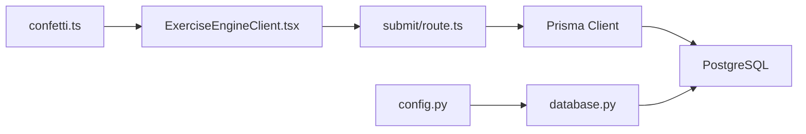
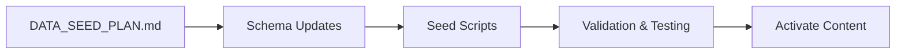

# Performance and Scalability Enhancements

<cite>
**Referenced Files in This Document**
- [2026-06-18-sp2-data-layer-v2.md](file://docs/superpowers/plans/2026-06-18-sp2-data-layer-v2.md)
- [2026-06-18-sp2-data-layer-v2-design.md](file://docs/superpowers/specs/2026-06-18-sp2-data-layer-v2-design.md)
- [2026-06-19-sp2-summary-redesign.md](file://docs/superpowers/plans/2026-06-19-sp2-summary-redesign.md)
- [2026-06-19-sp2-summary-redesign-design.md](file://docs/superpowers/specs/2026-06-19-sp2-summary-redesign-design.md)
- [schema.prisma](file://english_pronunciation_app/frontend/prisma/schema.prisma)
- [lesson-catalog.ts](file://english_pronunciation_app/frontend/prisma/lesson-catalog.ts)
- [seed_lessons.ts](file://english_pronunciation_app/frontend/prisma/seed_lessons.ts)
- [confetti.ts](file://english_pronunciation_app/frontend/src/lib/confetti.ts)
- [confetti.test.ts](file://english_pronunciation_app/frontend/src/lib/__tests__/confetti.test.ts)
- [ExerciseEngineClient.tsx](file://english_pronunciation_app/frontend/src/app/exercises/[id]/ExerciseEngineClient.tsx)
- [ExerciseSummaryScreen.tsx](file://english_pronunciation_app/frontend/src/app/exercises/[id]/ExerciseSummaryScreen.tsx)
- [submit.route.ts](file://english_pronunciation_app/frontend/src/app/api/exercises/submit/route.ts)
- [package.json](file://english_pronunciation_app/frontend/package.json)
- [next.config.mjs](file://english_pronunciation_app/frontend/next.config.mjs)
- [tsconfig.json](file://english_pronunciation_app/frontend/tsconfig.json)
- [database.py](file://english_pronunciation_app/backend/app/core/database.py)
- [config.py](file://english_pronunciation_app/backend/app/core/config.py)
- [DATA_SEED_PLAN.md](file://PLAN/02_Database_And_Data/DATA_SEED_PLAN.md)
</cite>

## Table of Contents
1. [Introduction](#introduction)
2. [Project Structure](#project-structure)
3. [Core Components](#core-components)
4. [Architecture Overview](#architecture-overview)
5. [Detailed Component Analysis](#detailed-component-analysis)
6. [Dependency Analysis](#dependency-analysis)
7. [Performance Considerations](#performance-considerations)
8. [Troubleshooting Guide](#troubleshooting-guide)
9. [Conclusion](#conclusion)
10. [Appendices](#appendices)

## Introduction
This document presents a comprehensive performance and scalability enhancement strategy for the English pronunciation learning platform. It focuses on three pillars:
- Data Layer v2 architecture enabling scalable content catalogs and unlock mechanics
- Summary redesign delivering improved user feedback and engagement with minimal performance overhead
- System-wide optimizations across database, frontend, and infrastructure

The enhancements leverage incremental schema migrations, modular frontend components, and pragmatic engineering practices to support future growth while maintaining stability during active development.

## Project Structure
The platform follows a dual-service architecture:
- Frontend Next.js application (React 18, TypeScript 6, Tailwind 4) with a modular component library and Prisma ORM
- Backend Python service (SQLAlchemy) for administrative and auxiliary operations

Key directories and responsibilities:
- Frontend: `english_pronunciation_app/frontend` — Next.js app, Prisma schema, exercise engine, UI components, and performance utilities
- Backend: `english_pronunciation_app/backend` — database connectivity, configuration, and health checks
- Plans and Specs: `docs/superpowers` — detailed implementation plans and designs for performance-focused initiatives

**Diagram sources**
- [ExerciseEngineClient.tsx](file://english_pronunciation_app/frontend/src/app/exercises/[id]/ExerciseEngineClient.tsx)
- [schema.prisma](file://english_pronunciation_app/frontend/prisma/schema.prisma)
- [database.py](file://english_pronunciation_app/backend/app/core/database.py)

**Section sources**
- [package.json](file://english_pronunciation_app/frontend/package.json)
- [next.config.mjs](file://english_pronunciation_app/frontend/next.config.mjs)
- [tsconfig.json](file://english_pronunciation_app/frontend/tsconfig.json)

## Core Components
This section outlines the performance-critical components and their roles in achieving scalability and responsiveness.

- Data Layer v2 (Schema + Catalog)
  - Adds seven nullable fields to existing models to enable unlock thresholds, multi-answer support, and stress-related phoneme metadata without breaking v1
  - Introduces a catalog-driven lesson generation pipeline ensuring deterministic content creation and testability
  - Implements seed scripts that generate shells for 112 lessons across four topics with six exercise modes

- Summary Redesign (End-of-Lesson Feedback)
  - Extracts the summary screen into a dedicated component with a three-tier layout optimized for engagement and retention
  - Integrates lightweight animations via a lazy-imported confetti wrapper respecting reduced-motion preferences
  - Exposes previous best score and streak metrics to drive progress bias and personalization

- Database Connectivity and Health Checks
  - Configurable SQLAlchemy engine with pre-ping pooling and centralized connection lifecycle management
  - Health check endpoint to validate database availability and readiness

**Section sources**
- [2026-06-18-sp2-data-layer-v2.md](file://docs/superpowers/plans/2026-06-18-sp2-data-layer-v2.md)
- [2026-06-18-sp2-data-layer-v2-design.md](file://docs/superpowers/specs/2026-06-18-sp2-data-layer-v2-design.md)
- [2026-06-19-sp2-summary-redesign.md](file://docs/superpowers/plans/2026-06-19-sp2-summary-redesign.md)
- [2026-06-19-sp2-summary-redesign-design.md](file://docs/superpowers/specs/2026-06-19-sp2-summary-redesign-design.md)
- [schema.prisma](file://english_pronunciation_app/frontend/prisma/schema.prisma)
- [lesson-catalog.ts](file://english_pronunciation_app/frontend/prisma/lesson-catalog.ts)
- [seed_lessons.ts](file://english_pronunciation_app/frontend/prisma/seed_lessons.ts)
- [confetti.ts](file://english_pronunciation_app/frontend/src/lib/confetti.ts)
- [ExerciseEngineClient.tsx](file://english_pronunciation_app/frontend/src/app/exercises/[id]/ExerciseEngineClient.tsx)
- [ExerciseSummaryScreen.tsx](file://english_pronunciation_app/frontend/src/app/exercises/[id]/ExerciseSummaryScreen.tsx)
- [database.py](file://english_pronunciation_app/backend/app/core/database.py)

## Architecture Overview
The system employs a layered architecture emphasizing modularity and separation of concerns:
- Presentation Layer: Next.js App Router pages and client components
- Domain Layer: Exercise engine orchestrating questions, scoring, and feedback
- Data Access Layer: Prisma ORM for schema evolution and seed-driven content generation
- Infrastructure Layer: PostgreSQL with SQLAlchemy-backed backend services

**Diagram sources**
- [ExerciseSummaryScreen.tsx](file://english_pronunciation_app/frontend/src/app/exercises/[id]/ExerciseSummaryScreen.tsx)
- [ExerciseEngineClient.tsx](file://english_pronunciation_app/frontend/src/app/exercises/[id]/ExerciseEngineClient.tsx)
- [submit.route.ts](file://english_pronunciation_app/frontend/src/app/api/exercises/submit/route.ts)
- [confetti.ts](file://english_pronunciation_app/frontend/src/lib/confetti.ts)
- [schema.prisma](file://english_pronunciation_app/frontend/prisma/schema.prisma)

## Detailed Component Analysis

### Data Layer v2: Schema Evolution and Catalog-Driven Generation
The v2 initiative extends the schema with seven nullable fields to support unlock thresholds, multi-answer acceptance, and stress-related phoneme metadata. The catalog serves as the single source of truth, enabling deterministic generation of exercises and robust testing without database dependencies.

Key implementation highlights:
- Schema additions: `orderIndex`, `unlockThresholdPercent` for topics; `acceptedAnswers` for questions and question bank items; phoneme metadata for stress and syllables
- Catalog-driven generation: 30 sound groups across four topics, six exercise modes, and 112 total lessons
- Seed pipeline: idempotent upserts, content preservation for five legacy groups, and shell generation for new content

**Diagram sources**
- [2026-06-18-sp2-data-layer-v2.md](file://docs/superpowers/plans/2026-06-18-sp2-data-layer-v2.md)
- [2026-06-18-sp2-data-layer-v2-design.md](file://docs/superpowers/specs/2026-06-18-sp2-data-layer-v2-design.md)
- [schema.prisma](file://english_pronunciation_app/frontend/prisma/schema.prisma)
- [lesson-catalog.ts](file://english_pronunciation_app/frontend/prisma/lesson-catalog.ts)
- [seed_lessons.ts](file://english_pronunciation_app/frontend/prisma/seed_lessons.ts)

**Section sources**
- [2026-06-18-sp2-data-layer-v2.md](file://docs/superpowers/plans/2026-06-18-sp2-data-layer-v2.md)
- [2026-06-18-sp2-data-layer-v2-design.md](file://docs/superpowers/specs/2026-06-18-sp2-data-layer-v2-design.md)
- [schema.prisma](file://english_pronunciation_app/frontend/prisma/schema.prisma)
- [lesson-catalog.ts](file://english_pronunciation_app/frontend/prisma/lesson-catalog.ts)
- [seed_lessons.ts](file://english_pronunciation_app/frontend/prisma/seed_lessons.ts)

### Summary Redesign: Engagement-Optimized Feedback Loop
The summary redesign transforms the post-exercise experience into a three-tier layout emphasizing positive reinforcement, progress bias, and actionable insights. It introduces a lightweight confetti effect triggered by high scores and integrates previous best score and streak metrics.

Key implementation highlights:
- Component extraction: Dedicated `ExerciseSummaryScreen.tsx` replaces inline rendering in the engine
- Animation wrapper: `confetti.ts` provides lazy-imported canvas-confetti with reduced-motion support
- API exposure: Previous best score and streak are returned read-only from the submission endpoint
- Client integration: Extended `SubmitResult` type and exported types enable safe prop passing

**Diagram sources**
- [ExerciseEngineClient.tsx](file://english_pronunciation_app/frontend/src/app/exercises/[id]/ExerciseEngineClient.tsx)
- [ExerciseSummaryScreen.tsx](file://english_pronunciation_app/frontend/src/app/exercises/[id]/ExerciseSummaryScreen.tsx)
- [submit.route.ts](file://english_pronunciation_app/frontend/src/app/api/exercises/submit/route.ts)
- [confetti.ts](file://english_pronunciation_app/frontend/src/lib/confetti.ts)

**Section sources**
- [2026-06-19-sp2-summary-redesign.md](file://docs/superpowers/plans/2026-06-19-sp2-summary-redesign.md)
- [2026-06-19-sp2-summary-redesign-design.md](file://docs/superpowers/specs/2026-06-19-sp2-summary-redesign-design.md)
- [ExerciseEngineClient.tsx](file://english_pronunciation_app/frontend/src/app/exercises/[id]/ExerciseEngineClient.tsx)
- [ExerciseSummaryScreen.tsx](file://english_pronunciation_app/frontend/src/app/exercises/[id]/ExerciseSummaryScreen.tsx)
- [submit.route.ts](file://english_pronunciation_app/frontend/src/app/api/exercises/submit/route.ts)
- [confetti.ts](file://english_pronunciation_app/frontend/src/lib/confetti.ts)

### Database Optimization Strategies
The backend employs SQLAlchemy with connection pooling and pre-ping to ensure reliable connectivity and efficient resource utilization. The configuration supports environment-based overrides and CORS policies suitable for development and staging environments.

Key implementation highlights:
- Centralized engine creation with optional initialization based on environment variables
- Session factory with proper lifecycle management and error handling
- Health check endpoint returning structured status messages for monitoring systems

**Diagram sources**
- [config.py](file://english_pronunciation_app/backend/app/core/config.py)
- [database.py](file://english_pronunciation_app/backend/app/core/database.py)

**Section sources**
- [config.py](file://english_pronunciation_app/backend/app/core/config.py)
- [database.py](file://english_pronunciation_app/backend/app/core/database.py)

### Frontend Performance Improvements
The frontend leverages Next.js 16 with App Router, TypeScript strict mode, and Tailwind for efficient styling. Performance enhancements include:
- Lazy loading: Animations are lazily imported to avoid unnecessary bundle weight
- Reduced-motion compliance: Animation wrapper respects user preferences
- Component decomposition: Large inline blocks are extracted into reusable components
- Strict type checking: Ensures correctness and reduces runtime errors

Bundle and build configuration:
- Next.js configuration remains minimal, allowing default optimizations
- TypeScript strict mode and incremental builds improve developer experience
- Canvas-confetti dependency added with appropriate types for animation support

**Section sources**
- [next.config.mjs](file://english_pronunciation_app/frontend/next.config.mjs)
- [tsconfig.json](file://english_pronunciation_app/frontend/tsconfig.json)
- [package.json](file://english_pronunciation_app/frontend/package.json)
- [confetti.ts](file://english_pronunciation_app/frontend/src/lib/confetti.ts)
- [ExerciseEngineClient.tsx](file://english_pronunciation_app/frontend/src/app/exercises/[id]/ExerciseEngineClient.tsx)

## Dependency Analysis
The system exhibits low coupling and high cohesion among modules:
- Frontend exercises depend on shared libraries (confetti, sfx) but remain isolated from backend concerns
- Prisma schema defines clear relationships between models, supporting scalable content management
- Backend services encapsulate database concerns behind a thin interface

**Diagram sources**
- [ExerciseEngineClient.tsx](file://english_pronunciation_app/frontend/src/app/exercises/[id]/ExerciseEngineClient.tsx)
- [submit.route.ts](file://english_pronunciation_app/frontend/src/app/api/exercises/submit/route.ts)
- [schema.prisma](file://english_pronunciation_app/frontend/prisma/schema.prisma)
- [database.py](file://english_pronunciation_app/backend/app/core/database.py)
- [config.py](file://english_pronunciation_app/backend/app/core/config.py)
- [confetti.ts](file://english_pronunciation_app/frontend/src/lib/confetti.ts)

**Section sources**
- [schema.prisma](file://english_pronunciation_app/frontend/prisma/schema.prisma)
- [ExerciseEngineClient.tsx](file://english_pronunciation_app/frontend/src/app/exercises/[id]/ExerciseEngineClient.tsx)
- [submit.route.ts](file://english_pronunciation_app/frontend/src/app/api/exercises/submit/route.ts)
- [database.py](file://english_pronunciation_app/backend/app/core/database.py)
- [config.py](file://english_pronunciation_app/backend/app/core/config.py)

## Performance Considerations
This section consolidates practical guidance derived from the implementation plans and codebase:

- Database optimization
  - Use `pool_pre_ping` to detect stale connections proactively
  - Keep migrations minimal and idempotent to reduce downtime during schema changes
  - Index frequently queried columns (e.g., topic unlock thresholds, user streak fields)

- Frontend optimization
  - Continue lazy-loading animations and heavy libraries to minimize initial payload
  - Maintain strict TypeScript settings to catch performance regressions early
  - Decompose large components to improve render locality and reduce unnecessary re-renders

- Load balancing and scalability
  - Scale horizontally by adding worker nodes behind a reverse proxy
  - Use connection pooling and circuit breakers to protect downstream services
  - Monitor database and API latency; implement rate limiting for sensitive endpoints

- Monitoring and observability
  - Implement health checks for database connectivity and API readiness
  - Track key metrics: exercise completion rates, average session duration, and error rates
  - Use analytics to measure engagement with feedback features (e.g., confetti triggers)

[No sources needed since this section provides general guidance]

## Troubleshooting Guide
Common issues and resolutions grounded in the implementation:

- Schema migration failures
  - Ensure `prisma generate` runs after `db push` to refresh client typings
  - Validate schema with `prisma validate` before committing changes

- Animation not triggering
  - Confirm `canvas-confetti` is installed and lazy-imported correctly
  - Verify reduced-motion preference is respected by the wrapper

- Summary screen not rendering
  - Check that `SubmitResult` includes the new fields (`previousBestScore`, `streak`)
  - Ensure required types are exported from the engine for component imports

- Database connectivity errors
  - Confirm `DATABASE_URL` environment variable is set
  - Use the health check endpoint to diagnose connection issues

**Section sources**
- [2026-06-18-sp2-data-layer-v2.md](file://docs/superpowers/plans/2026-06-18-sp2-data-layer-v2.md)
- [2026-06-19-sp2-summary-redesign.md](file://docs/superpowers/plans/2026-06-19-sp2-summary-redesign.md)
- [confetti.ts](file://english_pronunciation_app/frontend/src/lib/confetti.ts)
- [ExerciseEngineClient.tsx](file://english_pronunciation_app/frontend/src/app/exercises/[id]/ExerciseEngineClient.tsx)
- [database.py](file://english_pronunciation_app/backend/app/core/database.py)

## Conclusion
The performance and scalability enhancements outlined in this document establish a solid foundation for continued growth:
- Data Layer v2 enables scalable content management and unlock mechanics without disrupting existing functionality
- Summary redesign improves user engagement with minimal performance overhead
- Database and frontend optimizations align with best practices for reliability and responsiveness

Future work should focus on implementing runtime unlock logic, expanding content generation pipelines, and establishing comprehensive monitoring and alerting to support increased user loads.

[No sources needed since this section summarizes without analyzing specific files]

## Appendices

### Appendix A: Data Seed Pipeline Overview
The seed plan emphasizes a database-first approach with structured content management, enabling admin-driven curation and controlled activation of new content.

**Diagram sources**
- [DATA_SEED_PLAN.md](file://PLAN/02_Database_And_Data/DATA_SEED_PLAN.md)
- [schema.prisma](file://english_pronunciation_app/frontend/prisma/schema.prisma)
- [seed_lessons.ts](file://english_pronunciation_app/frontend/prisma/seed_lessons.ts)

**Section sources**
- [DATA_SEED_PLAN.md](file://PLAN/02_Database_And_Data/DATA_SEED_PLAN.md)

### Appendix B: Quality Gates and Verification
Both initiatives define quality gates to ensure stability and correctness:
- Data Layer v2: schema validation, client generation, type checking, tests, and build verification
- Summary Redesign: type safety, component rendering verification, and build validation

**Section sources**
- [2026-06-18-sp2-data-layer-v2.md](file://docs/superpowers/plans/2026-06-18-sp2-data-layer-v2.md)
- [2026-06-19-sp2-summary-redesign.md](file://docs/superpowers/plans/2026-06-19-sp2-summary-redesign.md)