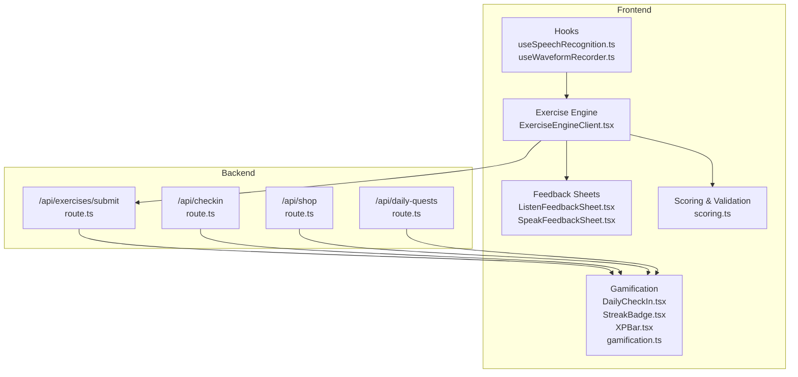
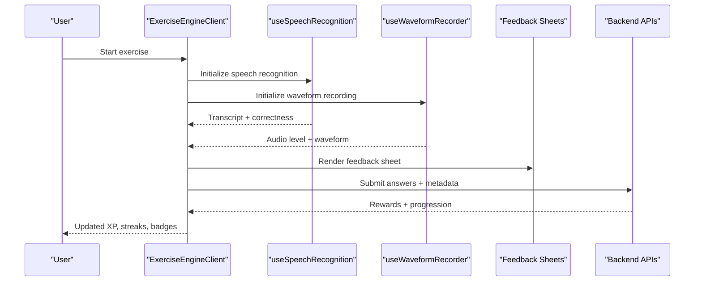
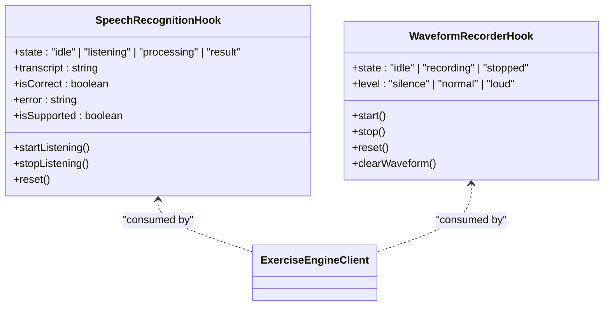
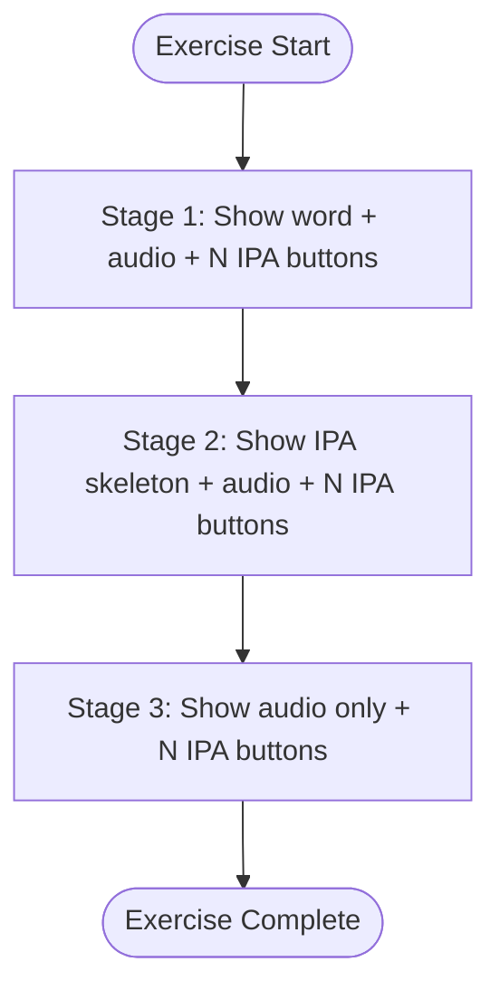
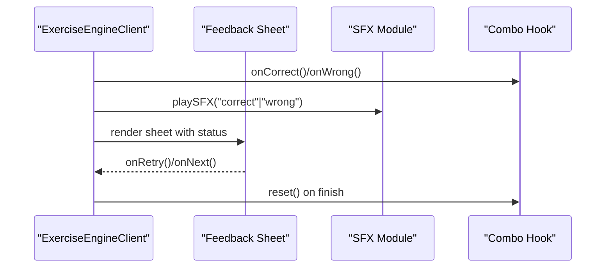
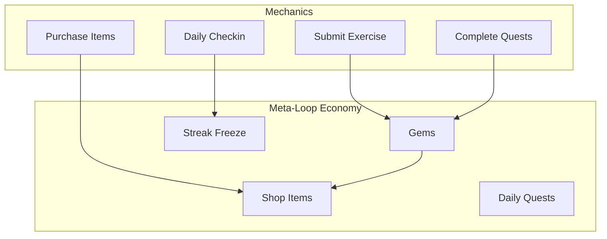
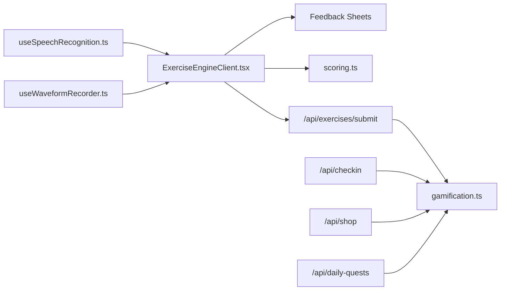

# Superpowers and Advanced Features

<cite>
**Referenced Files in This Document**
- [useSpeechRecognition.ts](file://english_pronunciation_app/frontend/src/hooks/useSpeechRecognition.ts)
- [useWaveformRecorder.ts](file://english_pronunciation_app/frontend/src/hooks/useWaveformRecorder.ts)
- [2026-06-18-listen-choose-3stage-phoneme-id.md](file://docs/superpowers/plans/2026-06-18-listen-choose-3stage-phoneme-id.md)
- [2026-06-18-sp1-in-exercise-feedback.md](file://docs/superpowers/plans/2026-06-18-sp1-in-exercise-feedback.md)
- [2026-06-19-sp4a-speak-feedback-bottomsheet.md](file://docs/superpowers/plans/2026-06-19-sp4a-speak-feedback-bottomsheet.md)
- [2026-06-19-sp7-gamification-3-elements.md](file://docs/superpowers/plans/2026-06-19-sp7-gamification-3-elements.md)
- [2026-06-18-listen-choose-3stage-phoneme-id-design.md](file://docs/superpowers/specs/2026-06-18-listen-choose-3stage-phoneme-id-design.md)
- [2026-06-18-sp1-in-exercise-feedback-design.md](file://docs/superpowers/specs/2026-06-18-sp1-in-exercise-feedback-design.md)
- [2026-06-19-sp4a-speak-feedback-bottomsheet-design.md](file://docs/superpowers/specs/2026-06-19-sp4a-speak-feedback-bottomsheet-design.md)
- [2026-06-19-sp7-gamification-3-elements-design.md](file://docs/superpowers/specs/2026-06-19-sp7-gamification-3-elements-design.md)
- [scoring.ts](file://english_pronunciation_app/frontend/src/lib/scoring.ts)
- [ExerciseEngineClient.tsx](file://english_pronunciation_app/frontend/src/app/exercises/[id]/ExerciseEngineClient.tsx)
- [ListenFeedbackSheet.tsx](file://english_pronunciation_app/frontend/src/app/exercises/[id]/ListenFeedbackSheet.tsx)
- [SpeakFeedbackSheet.tsx](file://english_pronunciation_app/frontend/src/app/exercises/[id]/SpeakFeedbackSheet.tsx)
- [DailyCheckIn.tsx](file://english_pronunciation_app/frontend/src/components/gamification/DailyCheckIn.tsx)
- [StreakBadge.tsx](file://english_pronunciation_app/frontend/src/components/gamification/StreakBadge.tsx)
- [XPBar.tsx](file://english_pronunciation_app/frontend/src/components/gamification/XPBar.tsx)
- [gamification.ts](file://english_pronunciation_app/frontend/src/lib/gamification.ts)
</cite>

## Table of Contents
1. [Introduction](#introduction)
2. [Project Structure](#project-structure)
3. [Core Components](#core-components)
4. [Architecture Overview](#architecture-overview)
5. [Detailed Component Analysis](#detailed-component-analysis)
6. [Dependency Analysis](#dependency-analysis)
7. [Performance Considerations](#performance-considerations)
8. [Troubleshooting Guide](#troubleshooting-guide)
9. [Conclusion](#conclusion)

## Introduction
This document presents the advanced features and specialized implementations powering the English pronunciation application. It focuses on enhanced speech recognition capabilities, three-stage phoneme identification exercises, sophisticated feedback mechanisms, gamification systems, and experimental development workflows. The content synthesizes design specifications, implementation plans, and code-level analyses to provide both technical depth and practical guidance for developers and stakeholders.

## Project Structure
The application follows a modular Next.js architecture with clear separation between frontend components, hooks, libraries, and backend APIs. Advanced features are integrated through:
- Hooks for speech recognition and audio waveform analysis
- Specialized exercise engines and feedback sheets
- Gamification utilities and UI components
- Data-driven exercise generation and scoring logic

**Diagram sources**
- [useSpeechRecognition.ts:1-111](file://english_pronunciation_app/frontend/src/hooks/useSpeechRecognition.ts#L1-L111)
- [useWaveformRecorder.ts:1-140](file://english_pronunciation_app/frontend/src/hooks/useWaveformRecorder.ts#L1-L140)
- [ExerciseEngineClient.tsx:1-645](file://english_pronunciation_app/frontend/src/app/exercises/[id]/ExerciseEngineClient.tsx#L1-L645)
- [ListenFeedbackSheet.tsx](file://english_pronunciation_app/frontend/src/app/exercises/[id]/ListenFeedbackSheet.tsx)
- [SpeakFeedbackSheet.tsx](file://english_pronunciation_app/frontend/src/app/exercises/[id]/SpeakFeedbackSheet.tsx)
- [DailyCheckIn.tsx:1-234](file://english_pronunciation_app/frontend/src/components/gamification/DailyCheckIn.tsx#L1-L234)
- [StreakBadge.tsx:1-63](file://english_pronunciation_app/frontend/src/components/gamification/StreakBadge.tsx#L1-L63)
- [XPBar.tsx:1-50](file://english_pronunciation_app/frontend/src/components/gamification/XPBar.tsx#L1-L50)
- [gamification.ts:1-575](file://english_pronunciation_app/frontend/src/lib/gamification.ts#L1-L575)
- [scoring.ts:1-227](file://english_pronunciation_app/frontend/src/lib/scoring.ts#L1-L227)

**Section sources**
- [2026-06-18-listen-choose-3stage-phoneme-id.md:1-889](file://docs/superpowers/plans/2026-06-18-listen-choose-3stage-phoneme-id.md#L1-L889)
- [2026-06-18-sp1-in-exercise-feedback.md:1-857](file://docs/superpowers/plans/2026-06-18-sp1-in-exercise-feedback.md#L1-L857)
- [2026-06-19-sp4a-speak-feedback-bottomsheet.md:1-557](file://docs/superpowers/plans/2026-06-19-sp4a-speak-feedback-bottomsheet.md#L1-L557)
- [2026-06-19-sp7-gamification-3-elements.md:1-780](file://docs/superpowers/plans/2026-06-19-sp7-gamification-3-elements.md#L1-L780)

## Core Components
This section outlines the primary advanced components and their roles:

- Enhanced Speech Recognition Hook: Provides robust speech-to-text with normalization and error handling tailored for pronunciation exercises.
- Waveform Recorder Hook: Implements real-time audio level monitoring and dynamic waveform visualization for speaking exercises.
- Three-Stage Phoneme Identification: A data-driven exercise mode transitioning from word-level to IPA skeleton to audio-only challenges.
- Advanced Feedback Systems: Persistent contextual feedback sheets for both listening and speaking exercises, integrating SFX, combo streaks, and contrast audio.
- Gamification Framework: Meta-loop economy with gems, shop items, daily quests, and streak freeze mechanics.
- Adaptive Scoring: Exact-match scoring for phoneme identification and normalized matching for word-based exercises.

**Section sources**
- [useSpeechRecognition.ts:1-111](file://english_pronunciation_app/frontend/src/hooks/useSpeechRecognition.ts#L1-L111)
- [useWaveformRecorder.ts:1-140](file://english_pronunciation_app/frontend/src/hooks/useWaveformRecorder.ts#L1-L140)
- [2026-06-18-listen-choose-3stage-phoneme-id-design.md:1-156](file://docs/superpowers/specs/2026-06-18-listen-choose-3stage-phoneme-id-design.md#L1-L156)
- [2026-06-18-sp1-in-exercise-feedback-design.md:1-196](file://docs/superpowers/specs/2026-06-18-sp1-in-exercise-feedback-design.md#L1-L196)
- [2026-06-19-sp4a-speak-feedback-bottomsheet-design.md:1-257](file://docs/superpowers/specs/2026-06-19-sp4a-speak-feedback-bottomsheet-design.md#L1-L257)
- [2026-06-19-sp7-gamification-3-elements-design.md:1-189](file://docs/superpowers/specs/2026-06-19-sp7-gamification-3-elements-design.md#L1-L189)

## Architecture Overview
The system integrates client-side hooks, exercise engines, and server-side APIs to deliver adaptive, data-driven pronunciation training with comprehensive feedback and gamification.

**Diagram sources**
- [ExerciseEngineClient.tsx:323-645](file://english_pronunciation_app/frontend/src/app/exercises/[id]/ExerciseEngineClient.tsx#L323-L645)
- [useSpeechRecognition.ts:15-111](file://english_pronunciation_app/frontend/src/hooks/useSpeechRecognition.ts#L15-L111)
- [useWaveformRecorder.ts:29-140](file://english_pronunciation_app/frontend/src/hooks/useWaveformRecorder.ts#L29-L140)
- [ListenFeedbackSheet.tsx](file://english_pronunciation_app/frontend/src/app/exercises/[id]/ListenFeedbackSheet.tsx)
- [SpeakFeedbackSheet.tsx](file://english_pronunciation_app/frontend/src/app/exercises/[id]/SpeakFeedbackSheet.tsx)
- [scoring.ts:74-106](file://english_pronunciation_app/frontend/src/lib/scoring.ts#L74-L106)

## Detailed Component Analysis

### Enhanced Speech Recognition and Waveform Analysis
The speech recognition and audio analysis components provide the foundation for accurate pronunciation assessment and real-time feedback.

**Diagram sources**
- [useSpeechRecognition.ts:13-111](file://english_pronunciation_app/frontend/src/hooks/useSpeechRecognition.ts#L13-L111)
- [useWaveformRecorder.ts:7-140](file://english_pronunciation_app/frontend/src/hooks/useWaveformRecorder.ts#L7-L140)
- [ExerciseEngineClient.tsx:1-645](file://english_pronunciation_app/frontend/src/app/exercises/[id]/ExerciseEngineClient.tsx#L1-L645)

Implementation highlights:
- Speech recognition supports normalized matching for word answers and exact matching for phoneme answers.
- Waveform analysis provides dynamic color feedback based on RMS thresholds for volume control.
- Both hooks manage lifecycle events and clean up resources to prevent memory leaks.

**Section sources**
- [useSpeechRecognition.ts:1-111](file://english_pronunciation_app/frontend/src/hooks/useSpeechRecognition.ts#L1-L111)
- [useWaveformRecorder.ts:1-140](file://english_pronunciation_app/frontend/src/hooks/useWaveformRecorder.ts#L1-L140)
- [scoring.ts:74-106](file://english_pronunciation_app/frontend/src/lib/scoring.ts#L74-L106)

### Three-Stage Phoneme Identification System
The listen-choose exercise mode transitions learners through three difficulty stages, focusing on phoneme identification rather than word guessing.

**Diagram sources**
- [2026-06-18-listen-choose-3stage-phoneme-id-design.md:61-96](file://docs/superpowers/specs/2026-06-18-listen-choose-3stage-phoneme-id-design.md#L61-L96)

Implementation details:
- Data-driven content JSON includes stage, target phoneme, contrast phonemes, and skeleton calculation.
- Scoring logic applies exact-match for phoneme answers while preserving normalized matching for word answers.
- Seed scripts generate questions with deterministic splits (4/4/2) and contrast phoneme selection.

**Section sources**
- [2026-06-18-listen-choose-3stage-phoneme-id.md:1-889](file://docs/superpowers/plans/2026-06-18-listen-choose-3stage-phoneme-id.md#L1-L889)
- [2026-06-18-listen-choose-3stage-phoneme-id-design.md:1-156](file://docs/superpowers/specs/2026-06-18-listen-choose-3stage-phoneme-id-design.md#L1-L156)
- [scoring.ts:74-106](file://english_pronunciation_app/frontend/src/lib/scoring.ts#L74-L106)
- [ExerciseEngineClient.tsx:182-304](file://english_pronunciation_app/frontend/src/app/exercises/[id]/ExerciseEngineClient.tsx#L182-L304)

### Advanced Feedback Mechanisms
Persistent contextual feedback sheets eliminate layout shifts and provide immediate, actionable insights.

**Diagram sources**
- [2026-06-18-sp1-in-exercise-feedback-design.md:80-131](file://docs/superpowers/specs/2026-06-18-sp1-in-exercise-feedback-design.md#L80-L131)
- [2026-06-19-sp4a-speak-feedback-bottomsheet-design.md:19-92](file://docs/superpowers/specs/2026-06-19-sp4a-speak-feedback-bottomsheet-design.md#L19-L92)
- [ExerciseEngineClient.tsx:323-645](file://english_pronunciation_app/frontend/src/app/exercises/[id]/ExerciseEngineClient.tsx#L323-L645)
- [ListenFeedbackSheet.tsx](file://english_pronunciation_app/frontend/src/app/exercises/[id]/ListenFeedbackSheet.tsx)
- [SpeakFeedbackSheet.tsx](file://english_pronunciation_app/frontend/src/app/exercises/[id]/SpeakFeedbackSheet.tsx)

Key features:
- Listen feedback sheet displays contrast audio comparisons and IPA highlighting for correct answers.
- Speak feedback sheets use persistent overlays to avoid layout shifts, with retry and next actions.
- SFX and combo streaks reinforce positive behavior and engagement.

**Section sources**
- [2026-06-18-sp1-in-exercise-feedback.md:1-857](file://docs/superpowers/plans/2026-06-18-sp1-in-exercise-feedback.md#L1-L857)
- [2026-06-19-sp4a-speak-feedback-bottomsheet.md:1-557](file://docs/superpowers/plans/2026-06-19-sp4a-speak-feedback-bottomsheet.md#L1-L557)

### Gamification Framework and Meta-Loop Economy
The gamification system introduces a meta-loop economy with gems, shop items, daily quests, and streak freeze mechanics.

**Diagram sources**
- [2026-06-19-sp7-gamification-3-elements-design.md:21-55](file://docs/superpowers/specs/2026-06-19-sp7-gamification-3-elements-design.md#L21-L55)
- [gamification.ts:533-575](file://english_pronunciation_app/frontend/src/lib/gamification.ts#L533-L575)
- [DailyCheckIn.tsx:1-234](file://english_pronunciation_app/frontend/src/components/gamification/DailyCheckIn.tsx#L1-L234)

Implementation highlights:
- Gems are awarded for EXCELLENT ratings and quest completions.
- Shop items unlock permanent abilities: slow audio playback and IPA reveal.
- Streak freeze prevents streak reset when users miss a day.
- Daily quests provide personalized targets aligned with common pronunciation mistakes.

**Section sources**
- [2026-06-19-sp7-gamification-3-elements.md:1-780](file://docs/superpowers/plans/2026-06-19-sp7-gamification-3-elements.md#L1-L780)
- [2026-06-19-sp7-gamification-3-elements-design.md:1-189](file://docs/superpowers/specs/2026-06-19-sp7-gamification-3-elements-design.md#L1-L189)
- [gamification.ts:1-575](file://english_pronunciation_app/frontend/src/lib/gamification.ts#L1-L575)
- [DailyCheckIn.tsx:1-234](file://english_pronunciation_app/frontend/src/components/gamification/DailyCheckIn.tsx#L1-L234)
- [StreakBadge.tsx:1-63](file://english_pronunciation_app/frontend/src/components/gamification/StreakBadge.tsx#L1-L63)
- [XPBar.tsx:1-50](file://english_pronunciation_app/frontend/src/components/gamification/XPBar.tsx#L1-L50)

### Experimental Features and A/B Testing Frameworks
The system supports experimental features and controlled experimentation through data-driven seeds and incremental rollouts.

Recommended framework components:
- Feature flags for enabling/disabling experimental features
- Analytics hooks to track feature usage and effectiveness
- Controlled rollout via seed variations and content JSON extensions
- Unit tests for critical paths (e.g., scoring, feedback rendering)

Integration points:
- Seed builders for generating experimental question pools
- Backend routes for feature toggles and experiment assignments
- Frontend components for rendering alternate UI variants

[No sources needed since this section provides general guidance]

### Research and Development Processes
The advanced features are developed through structured planning and specification cycles:

- Design documents define scope, integration points, and acceptance criteria
- Implementation plans detail file structures, tasks, and checkpoints
- TDD ensures reliability for critical logic (scoring, feedback, gamification)
- Quality gates encompass type checks, builds, and tests

**Section sources**
- [2026-06-18-listen-choose-3stage-phoneme-id.md:1-889](file://docs/superpowers/plans/2026-06-18-listen-choose-3stage-phoneme-id.md#L1-L889)
- [2026-06-18-sp1-in-exercise-feedback.md:1-857](file://docs/superpowers/plans/2026-06-18-sp1-in-exercise-feedback.md#L1-L857)
- [2026-06-19-sp4a-speak-feedback-bottomsheet.md:1-557](file://docs/superpowers/plans/2026-06-19-sp4a-speak-feedback-bottomsheet.md#L1-L557)
- [2026-06-19-sp7-gamification-3-elements.md:1-780](file://docs/superpowers/plans/2026-06-19-sp7-gamification-3-elements.md#L1-L780)

## Dependency Analysis
The advanced features exhibit well-defined dependencies and low coupling:

**Diagram sources**
- [useSpeechRecognition.ts:1-111](file://english_pronunciation_app/frontend/src/hooks/useSpeechRecognition.ts#L1-L111)
- [useWaveformRecorder.ts:1-140](file://english_pronunciation_app/frontend/src/hooks/useWaveformRecorder.ts#L1-L140)
- [ExerciseEngineClient.tsx:1-645](file://english_pronunciation_app/frontend/src/app/exercises/[id]/ExerciseEngineClient.tsx#L1-L645)
- [ListenFeedbackSheet.tsx](file://english_pronunciation_app/frontend/src/app/exercises/[id]/ListenFeedbackSheet.tsx)
- [SpeakFeedbackSheet.tsx](file://english_pronunciation_app/frontend/src/app/exercises/[id]/SpeakFeedbackSheet.tsx)
- [scoring.ts:1-227](file://english_pronunciation_app/frontend/src/lib/scoring.ts#L1-L227)
- [gamification.ts:1-575](file://english_pronunciation_app/frontend/src/lib/gamification.ts#L1-L575)

Key observations:
- Hooks are decoupled and reusable across exercises
- Exercise engine orchestrates multiple subsystems without tight coupling
- Backend APIs encapsulate server-authoritative logic for gamification
- Scoring logic remains centralized and testable

**Section sources**
- [ExerciseEngineClient.tsx:1-645](file://english_pronunciation_app/frontend/src/app/exercises/[id]/ExerciseEngineClient.tsx#L1-L645)
- [scoring.ts:1-227](file://english_pronunciation_app/frontend/src/lib/scoring.ts#L1-L227)
- [gamification.ts:1-575](file://english_pronunciation_app/frontend/src/lib/gamification.ts#L1-L575)

## Performance Considerations
- Speech recognition and waveform analysis use efficient DOM APIs and cleanup to minimize resource usage
- Persistent feedback sheets leverage requestAnimationFrame for smooth animations
- Scoring logic avoids unnecessary computations through early exits and exact-match prioritization
- Gamification calculations are optimized with pure functions and minimal database round-trips

[No sources needed since this section provides general guidance]

## Troubleshooting Guide
Common issues and resolutions:
- Browser compatibility: Speech recognition requires Chrome/Edge support; fallback messaging is provided
- Microphone access: Errors during recording are caught and surfaced gracefully
- Layout shifts: Persistent feedback sheets prevent content reflow during feedback display
- Gamification state: Server-authoritative APIs ensure consistent gem and streak states

**Section sources**
- [useSpeechRecognition.ts:25-41](file://english_pronunciation_app/frontend/src/hooks/useSpeechRecognition.ts#L25-L41)
- [useWaveformRecorder.ts:99-123](file://english_pronunciation_app/frontend/src/hooks/useWaveformRecorder.ts#L99-L123)
- [2026-06-19-sp4a-speak-feedback-bottomsheet-design.md:200-211](file://docs/superpowers/specs/2026-06-19-sp4a-speak-feedback-bottomsheet-design.md#L200-L211)
- [2026-06-19-sp7-gamification-3-elements-design.md:176-189](file://docs/superpowers/specs/2026-06-19-sp7-gamification-3-elements-design.md#L176-L189)

## Conclusion
The advanced features demonstrate a cohesive integration of speech recognition, data-driven exercises, sophisticated feedback mechanisms, and a meta-loop gamification economy. Through modular hooks, centralized scoring, and persistent feedback sheets, the system delivers an engaging, adaptive learning experience. The documented implementation plans and design specifications provide a clear roadmap for maintaining and extending these capabilities.