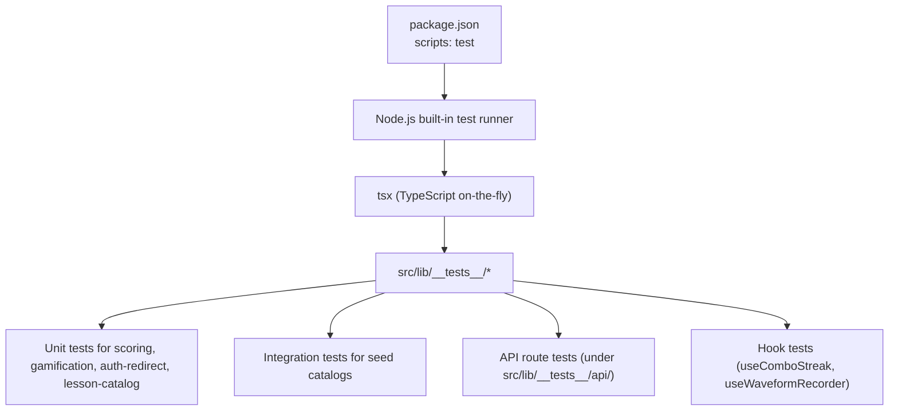
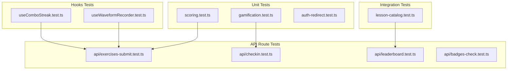
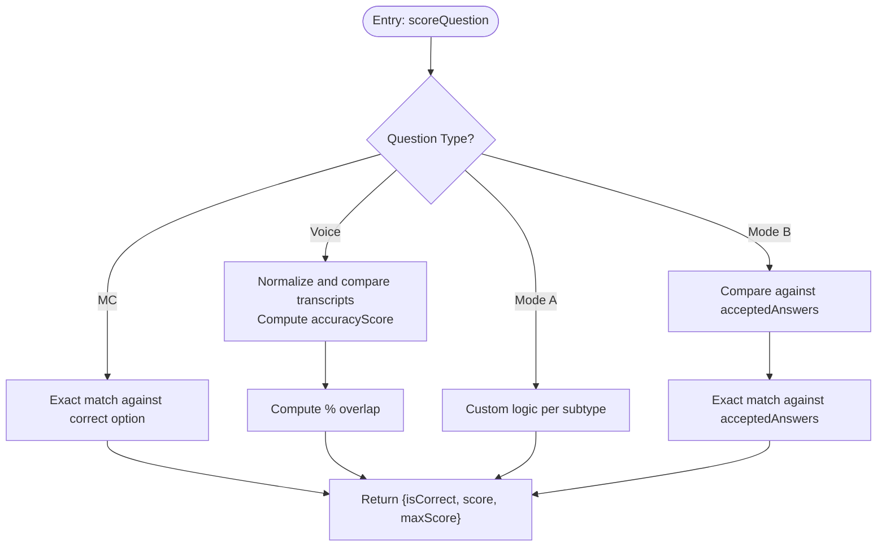
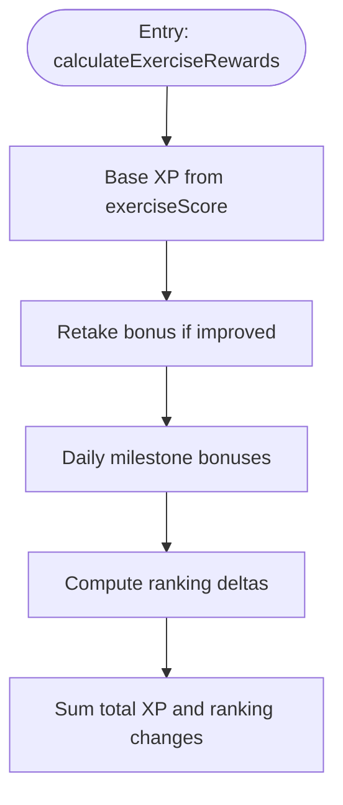
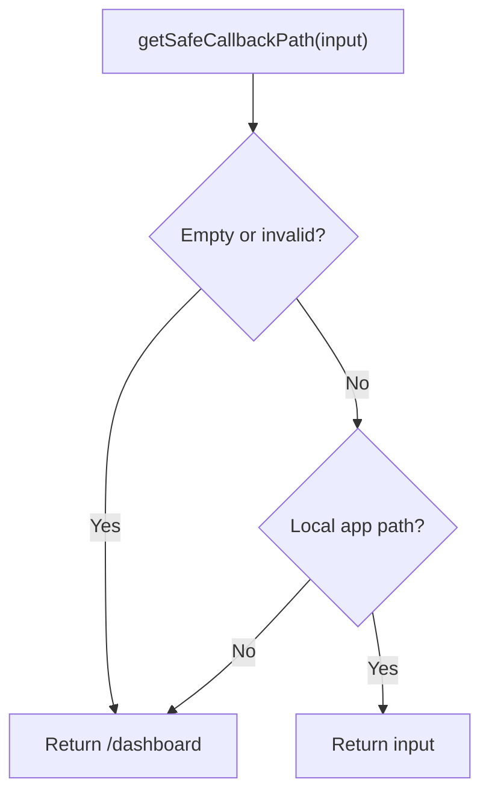
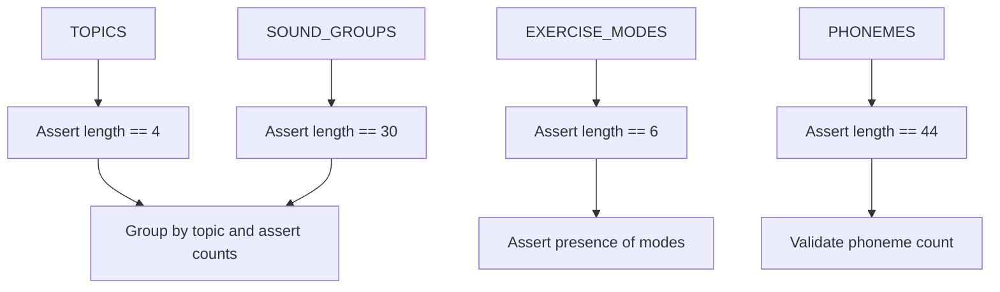
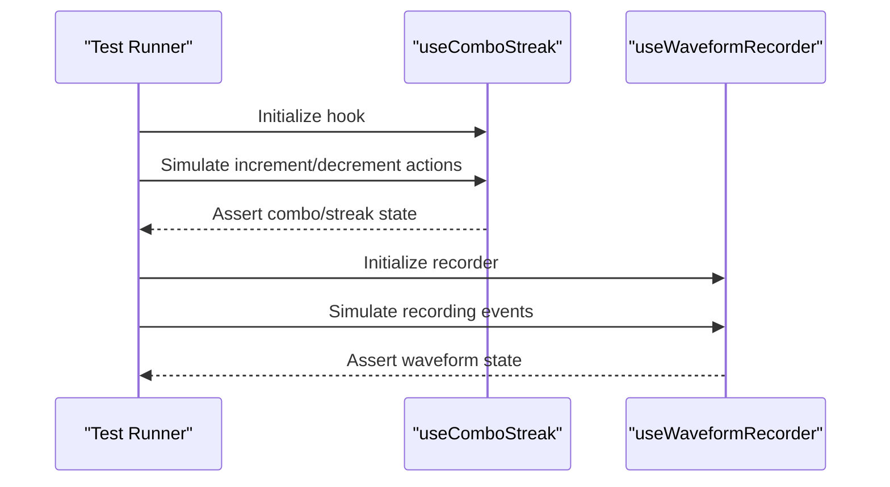
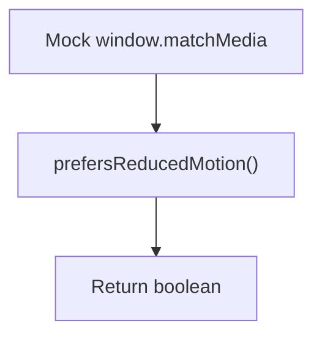
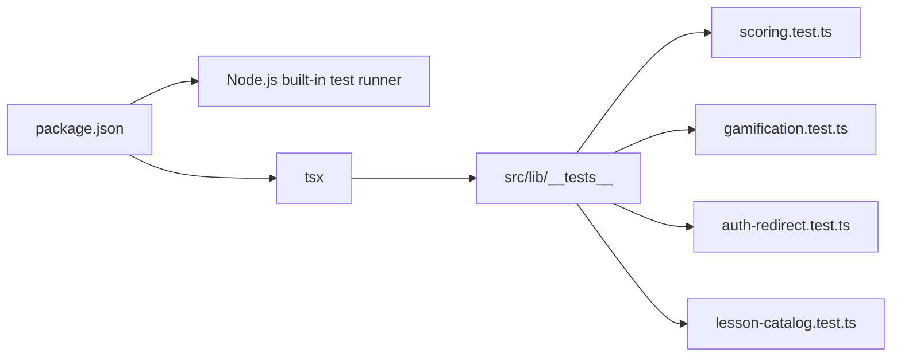

# Testing Strategy

<cite>
**Referenced Files in This Document**
- [package.json](file://english_pronunciation_app/frontend/package.json)
- [SKILL.md](file://english_pronunciation_app/.agents/skills/testing/SKILL.md)
- [scoring.test.ts](file://english_pronunciation_app/frontend/src/lib/__tests__/scoring.test.ts)
- [gamification.test.ts](file://english_pronunciation_app/frontend/src/lib/__tests__/gamification.test.ts)
- [auth-redirect.test.ts](file://english_pronunciation_app/frontend/src/lib/__tests__/auth-redirect.test.ts)
- [lesson-catalog.test.ts](file://english_pronunciation_app/frontend/src/lib/__tests__/lesson-catalog.test.ts)
- [useComboStreak.test.ts](file://english_pronunciation_app/frontend/src/hooks/__tests__/useComboStreak.test.ts)
- [useWaveformRecorder.test.ts](file://english_pronunciation_app/frontend/src/hooks/__tests__/useWaveformRecorder.test.ts)
- [confetti.test.ts](file://english_pronunciation_app/docs/superpowers/plans/2026-06-19-sp2-summary-redesign.md)
</cite>

## Table of Contents
1. [Introduction](#introduction)
2. [Project Structure](#project-structure)
3. [Core Components](#core-components)
4. [Architecture Overview](#architecture-overview)
5. [Detailed Component Analysis](#detailed-component-analysis)
6. [Dependency Analysis](#dependency-analysis)
7. [Performance Considerations](#performance-considerations)
8. [Troubleshooting Guide](#troubleshooting-guide)
9. [Conclusion](#conclusion)
10. [Appendices](#appendices)

## Introduction
This document defines the application’s quality assurance strategy for the English pronunciation learning platform. The project adopts a minimal, fast, and maintainable testing approach using Node.js built-in test runner with TypeScript via tsx. Tests focus on business logic and APIs rather than UI snapshots, emphasizing correctness, clarity, and ease of maintenance. Guidance covers unit testing, API route testing, gamification logic, seed catalog validation, and practical patterns for asynchronous operations, mocking, and CI workflows.

## Project Structure
The frontend test suite is organized under the frontend package with a dedicated test runner and minimal dependencies. Tests are colocated with the source modules they validate, mirroring the source tree to improve discoverability and maintainability.

**Diagram sources**
- [package.json:6-13](file://english_pronunciation_app/frontend/package.json#L6-L13)
- [SKILL.md:22-47](file://english_pronunciation_app/.agents/skills/testing/SKILL.md#L22-L47)

**Section sources**
- [package.json:6-13](file://english_pronunciation_app/frontend/package.json#L6-L13)
- [SKILL.md:22-47](file://english_pronunciation_app/.agents/skills/testing/SKILL.md#L22-L47)

## Core Components
- Test runner and toolchain
  - Runner: Node.js built-in test runner
  - Compiler: tsx for TypeScript
  - Command: npm test glob pattern for test discovery
- Test locations
  - Unit tests: src/lib/__tests__/*
  - API route tests: src/lib/__tests__/api/*
  - Integration/Seed tests: src/lib/__tests__/lesson-catalog.test.ts
  - Hook tests: src/hooks/__tests__/*
- Assertions and structure
  - Assertions: strict equality and descriptive messages
  - Structure: describe blocks grouping related cases; fixtures at file scope
- Mocking conventions
  - Scope: external dependencies only (Prisma, Next.js server helpers, Web Speech API)
  - Patterns: shape mocks with mock.fn for async methods

**Section sources**
- [SKILL.md:22-47](file://english_pronunciation_app/.agents/skills/testing/SKILL.md#L22-L47)
- [SKILL.md:131-184](file://english_pronunciation_app/.agents/skills/testing/SKILL.md#L131-L184)
- [SKILL.md:187-230](file://english_pronunciation_app/.agents/skills/testing/SKILL.md#L187-L230)

## Architecture Overview
The testing architecture emphasizes separation of concerns:
- Business logic tests live alongside the modules they validate
- API route tests validate server-side behavior without hitting production databases
- Integration tests validate seed catalogs and lesson structures
- Hooks tests validate client-side logic without mounting full UI

**Diagram sources**
- [scoring.test.ts:1-292](file://english_pronunciation_app/frontend/src/lib/__tests__/scoring.test.ts#L1-L292)
- [gamification.test.ts:1-188](file://english_pronunciation_app/frontend/src/lib/__tests__/gamification.test.ts#L1-L188)
- [auth-redirect.test.ts:1-23](file://english_pronunciation_app/frontend/src/lib/__tests__/auth-redirect.test.ts#L1-L23)
- [lesson-catalog.test.ts:1-103](file://english_pronunciation_app/frontend/src/lib/__tests__/lesson-catalog.test.ts#L1-L103)
- [useComboStreak.test.ts](file://english_pronunciation_app/frontend/src/hooks/__tests__/useComboStreak.test.ts)
- [useWaveformRecorder.test.ts](file://english_pronunciation_app/frontend/src/hooks/__tests__/useWaveformRecorder.test.ts)

## Detailed Component Analysis

### Scoring Logic Tests
These tests validate normalization, question scoring, exercise summarization, and rating thresholds. They cover:
- Text normalization and whitespace handling
- Multiple-choice scoring and correctness
- Voice scoring via word-overlap accuracy
- Specialized question types (stress tapping, multi-select, assimilation)
- Accepted answers for voice mode

**Diagram sources**
- [scoring.test.ts:33-83](file://english_pronunciation_app/frontend/src/lib/__tests__/scoring.test.ts#L33-L83)
- [scoring.test.ts:204-259](file://english_pronunciation_app/frontend/src/lib/__tests__/scoring.test.ts#L204-L259)
- [scoring.test.ts:263-291](file://english_pronunciation_app/frontend/src/lib/__tests__/scoring.test.ts#L263-L291)

**Section sources**
- [scoring.test.ts:12-292](file://english_pronunciation_app/frontend/src/lib/__tests__/scoring.test.ts#L12-L292)

### Gamification Logic Tests
These tests validate XP computation, streak mechanics, daily bonuses, leaderboard targets, badge progress metadata, gem rewards, and shop validation.

**Diagram sources**
- [gamification.test.ts:17-108](file://english_pronunciation_app/frontend/src/lib/__tests__/gamification.test.ts#L17-L108)

**Section sources**
- [gamification.test.ts:1-188](file://english_pronunciation_app/frontend/src/lib/__tests__/gamification.test.ts#L1-L188)

### Authentication Redirect Utilities Tests
These tests validate safe callback path handling and href building for auth pages.

**Diagram sources**
- [auth-redirect.test.ts:5-17](file://english_pronunciation_app/frontend/src/lib/__tests__/auth-redirect.test.ts#L5-L17)

**Section sources**
- [auth-redirect.test.ts:1-23](file://english_pronunciation_app/frontend/src/lib/__tests__/auth-redirect.test.ts#L1-L23)

### Lesson Catalog Integration Tests
These tests validate catalog structure, topic ordering, sound group counts, and phoneme totals.

**Diagram sources**
- [lesson-catalog.test.ts:12-103](file://english_pronunciation_app/frontend/src/lib/__tests__/lesson-catalog.test.ts#L12-L103)

**Section sources**
- [lesson-catalog.test.ts:1-103](file://english_pronunciation_app/frontend/src/lib/__tests__/lesson-catalog.test.ts#L1-L103)

### Hook Tests (useComboStreak, useWaveformRecorder)
Hook tests validate client-side logic without mounting full UI. These tests demonstrate:
- useComboStreak: combo and streak computations
- useWaveformRecorder: recorder lifecycle and waveform updates

**Diagram sources**
- [useComboStreak.test.ts](file://english_pronunciation_app/frontend/src/hooks/__tests__/useComboStreak.test.ts)
- [useWaveformRecorder.test.ts](file://english_pronunciation_app/frontend/src/hooks/__tests__/useWaveformRecorder.test.ts)

**Section sources**
- [useComboStreak.test.ts](file://english_pronunciation_app/frontend/src/hooks/__tests__/useComboStreak.test.ts)
- [useWaveformRecorder.test.ts](file://english_pronunciation_app/frontend/src/hooks/__tests__/useWaveformRecorder.test.ts)

### Testing Utilities and Mock Strategies
- Window matchMedia mock for reduced motion detection
- Prisma mock pattern for API route tests
- Next.js server helpers mock for API route tests

**Diagram sources**
- [confetti.test.ts:74-87](file://english_pronunciation_app/docs/superpowers/plans/2026-06-19-sp2-summary-redesign.md#L74-L87)

**Section sources**
- [confetti.test.ts:68-105](file://english_pronunciation_app/docs/superpowers/plans/2026-06-19-sp2-summary-redesign.md#L68-L105)
- [SKILL.md:195-215](file://english_pronunciation_app/.agents/skills/testing/SKILL.md#L195-L215)
- [SKILL.md:217-229](file://english_pronunciation_app/.agents/skills/testing/SKILL.md#L217-L229)

## Dependency Analysis
- Test runner and compiler
  - package.json defines the test script invoking tsx with a glob pattern
- Test organization
  - src/lib/__tests__ mirrors the source tree for easy navigation
- External dependencies
  - Minimal: only Node.js built-in test runner and tsx; no UI test framework

**Diagram sources**
- [package.json:6-13](file://english_pronunciation_app/frontend/package.json#L6-L13)
- [SKILL.md:22-47](file://english_pronunciation_app/.agents/skills/testing/SKILL.md#L22-L47)

**Section sources**
- [package.json:6-13](file://english_pronunciation_app/frontend/package.json#L6-L13)
- [SKILL.md:22-47](file://english_pronunciation_app/.agents/skills/testing/SKILL.md#L22-L47)

## Performance Considerations
- Keep tests small and focused to minimize runtime overhead
- Prefer pure functions and deterministic fixtures to avoid flakiness
- Use concise assertion messages to speed up diagnostics
- Avoid unnecessary network or I/O in unit tests; mock external dependencies

## Troubleshooting Guide
Common issues and resolutions:
- Test discovery fails
  - Verify the test script and glob pattern in package.json
  - Confirm test files are named with .test.ts extension
- Missing module errors during tests
  - Add minimal mocks for browser APIs (e.g., window.matchMedia) as shown in the confetti test plan
- API route tests failing due to framework dependencies
  - Mock Next.js server helpers and Prisma client according to the established patterns
- Type errors after refactors
  - Run typecheck locally before committing to catch regressions early

**Section sources**
- [package.json:6-13](file://english_pronunciation_app/frontend/package.json#L6-L13)
- [confetti.test.ts:68-105](file://english_pronunciation_app/docs/superpowers/plans/2026-06-19-sp2-summary-redesign.md#L68-L105)
- [SKILL.md:217-229](file://english_pronunciation_app/.agents/skills/testing/SKILL.md#L217-L229)

## Conclusion
The project’s testing strategy prioritizes correctness and maintainability through a minimal, Node.js-native approach. By focusing on business logic, API behavior, and seed catalogs, and by adopting clear mocking conventions, the team ensures reliable, fast feedback loops suitable for iterative development and continuous improvement.

## Appendices

### Continuous Integration and Quality Gates
- Test command
  - npm test runs the entire suite via tsx and the Node.js built-in test runner
- Pre-commit validation
  - Always run tests and typecheck together to prevent regressions
- CI integration
  - The test command is already defined; no additional setup is required

**Section sources**
- [SKILL.md:232-258](file://english_pronunciation_app/.agents/skills/testing/SKILL.md#L232-L258)
- [package.json:6-13](file://english_pronunciation_app/frontend/package.json#L6-L13)