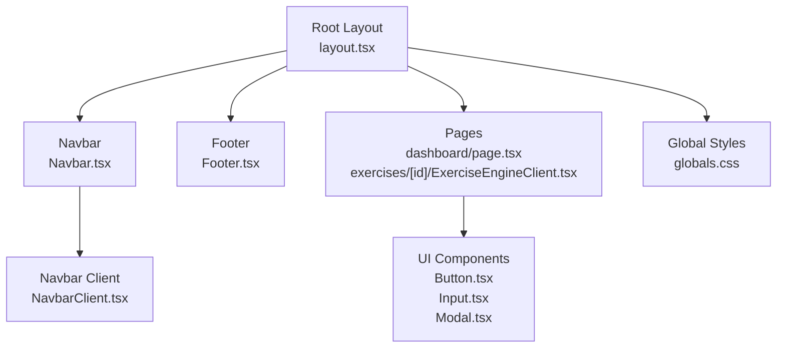
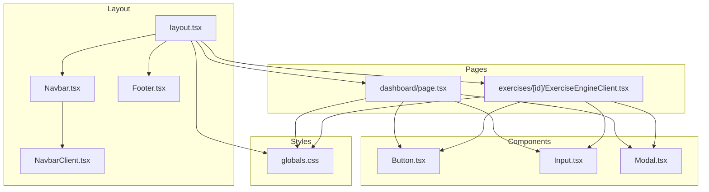
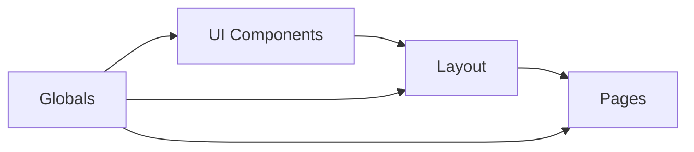

# Accessibility and Responsive Design

<cite>
**Referenced Files in This Document**
- [HCI_ACCESSIBILITY_AUDIT.md](file://PLAN/03_UI_UX/HCI_ACCESSIBILITY_AUDIT.md)
- [HCI_ACCESSIBILITY_AUDIT_UPDATE_2026-06-14.md](file://PLAN/03_UI_UX/HCI_ACCESSIBILITY_AUDIT_UPDATE_2026-06-14.md)
- [COLOR_SYSTEM_GUIDE.md](file://PLAN/03_UI_UX/COLOR_SYSTEM_GUIDE.md)
- [Button.tsx](file://english_pronunciation_app/frontend/src/components/ui/Button.tsx)
- [Input.tsx](file://english_pronunciation_app/frontend/src/components/ui/Input.tsx)
- [Modal.tsx](file://english_pronunciation_app/frontend/src/components/ui/Modal.tsx)
- [Navbar.tsx](file://english_pronunciation_app/frontend/src/components/layout/Navbar.tsx)
- [NavbarClient.tsx](file://english_pronunciation_app/frontend/src/components/layout/NavbarClient.tsx)
- [Footer.tsx](file://english_pronunciation_app/frontend/src/components/layout/Footer.tsx)
- [layout.tsx](file://english_pronunciation_app/frontend/src/app/layout.tsx)
- [globals.css](file://english_pronunciation_app/frontend/src/app/globals.css)
- [dashboard/page.tsx](file://english_pronunciation_app/frontend/src/app/dashboard/page.tsx)
- [exercises/[id]/ExerciseEngineClient.tsx](file://english_pronunciation_app/frontend/src/app/exercises/[id]/ExerciseEngineClient.tsx)
- [package.json](file://english_pronunciation_app/frontend/package.json)
</cite>

## Table of Contents
1. [Introduction](#introduction)
2. [Project Structure](#project-structure)
3. [Core Components](#core-components)
4. [Architecture Overview](#architecture-overview)
5. [Detailed Component Analysis](#detailed-component-analysis)
6. [Dependency Analysis](#dependency-analysis)
7. [Performance Considerations](#performance-considerations)
8. [Troubleshooting Guide](#troubleshooting-guide)
9. [Conclusion](#conclusion)
10. [Appendices](#appendices)

## Introduction
This document consolidates accessibility and responsive design practices implemented in the English pronunciation learning platform. It focuses on WCAG 2.1 AA compliance, including color contrast ratios, keyboard navigation, focus management, ARIA attributes, touch targets, reduced motion support, and screen reader compatibility. It also documents responsive design patterns, mobile-first approach, breakpoint management, inclusive design principles, and internationalization considerations for Vietnamese users. Finally, it outlines testing methodologies, audit procedures, and performance optimization strategies for accessibility features.

## Project Structure
The frontend follows a Next.js App Router structure with a clear separation of UI components, layouts, pages, and global styles. Accessibility-related improvements are concentrated in shared components and global CSS, while page-level enhancements refine semantics and ARIA usage.

**Diagram sources**
- [layout.tsx:1-51](file://english_pronunciation_app/frontend/src/app/layout.tsx#L1-L51)
- [Navbar.tsx:1-28](file://english_pronunciation_app/frontend/src/components/layout/Navbar.tsx#L1-L28)
- [NavbarClient.tsx:1-234](file://english_pronunciation_app/frontend/src/components/layout/NavbarClient.tsx#L1-L234)
- [Footer.tsx:1-67](file://english_pronunciation_app/frontend/src/components/layout/Footer.tsx#L1-L67)
- [Button.tsx:1-83](file://english_pronunciation_app/frontend/src/components/ui/Button.tsx#L1-L83)
- [Input.tsx:1-91](file://english_pronunciation_app/frontend/src/components/ui/Input.tsx#L1-L91)
- [Modal.tsx:1-110](file://english_pronunciation_app/frontend/src/components/ui/Modal.tsx#L1-L110)
- [globals.css:1-291](file://english_pronunciation_app/frontend/src/app/globals.css#L1-L291)
- [dashboard/page.tsx:1-297](file://english_pronunciation_app/frontend/src/app/dashboard/page.tsx#L1-L297)
- [exercises/[id]/ExerciseEngineClient.tsx:1-645](file://english_pronunciation_app/frontend/src/app/exercises/[id]/ExerciseEngineClient.tsx#L1-L645)

**Section sources**
- [layout.tsx:1-51](file://english_pronunciation_app/frontend/src/app/layout.tsx#L1-L51)
- [globals.css:1-291](file://english_pronunciation_app/frontend/src/app/globals.css#L1-L291)

## Core Components
This section highlights the core UI components and their accessibility features aligned with WCAG 2.1 AA:

- Button.tsx
  - Touch target sizes meet minimum 44x44px guidelines.
  - Focus rings and visible focus states.
  - Loading state with aria-hidden spinner.
  - Disabled state clearly indicated.
  - High-contrast variants for text and backgrounds.

- Input.tsx
  - Proper label association with htmlFor.
  - Error announcements via role="alert".
  - aria-invalid and aria-describedby for assistive technologies.
  - Helper text and required field indicators.

- Modal.tsx
  - Focus trap on open with initial focus inside modal.
  - ESC key closes modal.
  - Backdrop click to close.
  - aria-modal and role="dialog".
  - Focus restoration on close.

- Navbar.tsx and NavbarClient.tsx
  - Skip link to bypass navigation.
  - Active link indication via aria-current="page".
  - Mobile hamburger menu with aria-expanded and aria-controls.
  - Role="navigation" and aria-label for landmarks.
  - Focus-visible rings and keyboard operability.

- Footer.tsx
  - role="contentinfo" for footer landmark.
  - Footer navigation landmark with aria-label.

- Global Styles (globals.css)
  - Dark mode support with smooth transitions.
  - Reduced motion media query disables animations via "*".
  - Screen reader only utility class.
  - Color palette designed for WCAG 2.1 AA contrast.

- Dashboard and Exercise Pages
  - Semantic headings and section landmarks.
  - dl, dt, dd usage for statistics.
  - aria-labels for interactive elements.
  - Progress bar with ARIA attributes.

**Section sources**
- [Button.tsx:18-83](file://english_pronunciation_app/frontend/src/components/ui/Button.tsx#L18-L83)
- [Input.tsx:11-91](file://english_pronunciation_app/frontend/src/components/ui/Input.tsx#L11-L91)
- [Modal.tsx:14-110](file://english_pronunciation_app/frontend/src/components/ui/Modal.tsx#L14-L110)
- [Navbar.tsx:13-28](file://english_pronunciation_app/frontend/src/components/layout/Navbar.tsx#L13-L28)
- [NavbarClient.tsx:54-234](file://english_pronunciation_app/frontend/src/components/layout/NavbarClient.tsx#L54-L234)
- [Footer.tsx:14-67](file://english_pronunciation_app/frontend/src/components/layout/Footer.tsx#L14-L67)
- [globals.css:96-291](file://english_pronunciation_app/frontend/src/app/globals.css#L96-L291)
- [dashboard/page.tsx:104-297](file://english_pronunciation_app/frontend/src/app/dashboard/page.tsx#L104-L297)
- [exercises/[id]/ExerciseEngineClient.tsx:323-645](file://english_pronunciation_app/frontend/src/app/exercises/[id]/ExerciseEngineClient.tsx#L323-L645)

## Architecture Overview
The accessibility architecture centers on three pillars:
- Shared UI components enforcing WCAG 2.1 AA (Button, Input, Modal).
- Layout components providing landmarks, skip links, and keyboard navigation (Navbar, Footer).
- Global styles ensuring reduced motion, high contrast, and screen reader utilities.

**Diagram sources**
- [layout.tsx:1-51](file://english_pronunciation_app/frontend/src/app/layout.tsx#L1-L51)
- [Navbar.tsx:1-28](file://english_pronunciation_app/frontend/src/components/layout/Navbar.tsx#L1-L28)
- [NavbarClient.tsx:1-234](file://english_pronunciation_app/frontend/src/components/layout/NavbarClient.tsx#L1-L234)
- [Footer.tsx:1-67](file://english_pronunciation_app/frontend/src/components/layout/Footer.tsx#L1-L67)
- [Button.tsx:1-83](file://english_pronunciation_app/frontend/src/components/ui/Button.tsx#L1-L83)
- [Input.tsx:1-91](file://english_pronunciation_app/frontend/src/components/ui/Input.tsx#L1-L91)
- [Modal.tsx:1-110](file://english_pronunciation_app/frontend/src/components/ui/Modal.tsx#L1-L110)
- [dashboard/page.tsx:1-297](file://english_pronunciation_app/frontend/src/app/dashboard/page.tsx#L1-L297)
- [exercises/[id]/ExerciseEngineClient.tsx:1-645](file://english_pronunciation_app/frontend/src/app/exercises/[id]/ExerciseEngineClient.tsx#L1-L645)
- [globals.css:1-291](file://english_pronunciation_app/frontend/src/app/globals.css#L1-L291)

## Detailed Component Analysis

### Accessibility Audit Findings and Remediation
- Critical issues addressed:
  - Skip link added to bypass navigation.
  - Mobile hamburger menu implemented with aria-expanded and aria-controls.
  - Active navigation links marked with aria-current="page".
  - Footer landmark role="contentinfo" added.
  - Main content landmark corrected to direct child of body.
- Remaining work items:
  - Admin components require table captions, search input labels, and action button aria-labels.

**Section sources**
- [HCI_ACCESSIBILITY_AUDIT.md:65-322](file://PLAN/03_UI_UX/HCI_ACCESSIBILITY_AUDIT.md#L65-L322)
- [HCI_ACCESSIBILITY_AUDIT_UPDATE_2026-06-14.md:3-24](file://PLAN/03_UI_UX/HCI_ACCESSIBILITY_AUDIT_UPDATE_2026-06-14.md#L3-L24)

### Color System and Contrast (WCAG 2.1 AA)
- Color palette optimized for educational contexts with Blue + Orange.
- Contrast ratios verified for primary/accent colors against white background.
- Guidelines emphasize 60/30/10 rule, gradients sparingly, and avoiding low-contrast combinations.

**Section sources**
- [COLOR_SYSTEM_GUIDE.md:383-407](file://PLAN/03_UI_UX/COLOR_SYSTEM_GUIDE.md#L383-L407)

### Touch Target Sizing and Reduced Motion
- Buttons enforce minimum 44x44px touch targets.
- Reduced motion media query disables animations globally for users who prefer less motion.

**Section sources**
- [Button.tsx:50-55](file://english_pronunciation_app/frontend/src/components/ui/Button.tsx#L50-L55)
- [globals.css:280-291](file://english_pronunciation_app/frontend/src/app/globals.css#L280-L291)

### Keyboard Navigation and Focus Management
- Skip link allows keyboard users to bypass navigation.
- Focus rings and focus-visible classes ensure visible focus.
- Modals implement focus traps and restore focus after closing.
- Navigation menus support keyboard activation and ESC to close.

**Section sources**
- [NavbarClient.tsx:54-61](file://english_pronunciation_app/frontend/src/components/layout/NavbarClient.tsx#L54-L61)
- [NavbarClient.tsx:144-161](file://english_pronunciation_app/frontend/src/components/layout/NavbarClient.tsx#L144-L161)
- [Modal.tsx:38-62](file://english_pronunciation_app/frontend/src/components/ui/Modal.tsx#L38-L62)

### ARIA Attributes and Screen Reader Compatibility
- Landmark roles: navigation, dialog, contentinfo, region.
- aria-current for active links.
- aria-modal and role="dialog" for modals.
- aria-describedby and aria-invalid for form controls.
- aria-live and role="status" for dynamic feedback.
- aria-labels for buttons without visible text.

**Section sources**
- [NavbarClient.tsx:63](file://english_pronunciation_app/frontend/src/components/layout/NavbarClient.tsx#L63)
- [Modal.tsx:70-72](file://english_pronunciation_app/frontend/src/components/ui/Modal.tsx#L70-L72)
- [Input.tsx:62-64](file://english_pronunciation_app/frontend/src/components/ui/Input.tsx#L62-L64)
- [ExerciseEngineClient.tsx:314-321](file://english_pronunciation_app/frontend/src/app/exercises/[id]/ExerciseEngineClient.tsx#L314-L321)

### Responsive Design Patterns and Breakpoints
- Mobile-first approach with Tailwind breakpoints (sm, lg).
- Navbar transforms from desktop flex to mobile hamburger menu.
- Grid and flex utilities adapt content layout across screen sizes.
- Typography scales appropriately with viewport width.

**Section sources**
- [NavbarClient.tsx:74-90](file://english_pronunciation_app/frontend/src/components/layout/NavbarClient.tsx#L74-L90)
- [NavbarClient.tsx:165-230](file://english_pronunciation_app/frontend/src/components/layout/NavbarClient.tsx#L165-L230)
- [dashboard/page.tsx:106-130](file://english_pronunciation_app/frontend/src/app/dashboard/page.tsx#L106-L130)

### Internationalization and Cultural Considerations
- Root layout sets Vietnamese locale (lang="vi").
- Fonts include Inter and Noto Sans with Vietnamese subset.
- Content and UI use Vietnamese terminology and date formats.
- Accessibility labels and instructions are localized.

**Section sources**
- [layout.tsx:35](file://english_pronunciation_app/frontend/src/app/layout.tsx#L35)
- [layout.tsx:8-13](file://english_pronunciation_app/frontend/src/app/layout.tsx#L8-L13)

### Inclusive Design Principles
- Cognitive load reduction through simplified navigation and focused dashboards.
- Visual hierarchy using color psychology for education and motivation.
- Feedback mechanisms (progress bars, combo streaks) reinforce learning without overwhelming users.

**Section sources**
- [COLOR_SYSTEM_GUIDE.md:7-22](file://PLAN/03_UI_UX/COLOR_SYSTEM_GUIDE.md#L7-L22)
- [dashboard/page.tsx:114-129](file://english_pronunciation_app/frontend/src/app/dashboard/page.tsx#L114-L129)

### Accessibility Testing Methodologies and Audit Procedures
- Automated tools:
  - Lighthouse accessibility audit.
  - axe-core CLI.
  - Pa11y.
- Manual testing checklist:
  - Keyboard navigation (tab order, focus management).
  - Screen reader testing (NVDA/VoiceOver).
  - Zoom testing (200%).
  - High contrast mode.
  - Mobile device testing.

**Section sources**
- [HCI_ACCESSIBILITY_AUDIT.md:325-347](file://PLAN/03_UI_UX/HCI_ACCESSIBILITY_AUDIT.md#L325-L347)

### Compliance Verification Processes
- WCAG 2.1 AA scoring review per principle:
  - Perceivable: color contrast, alt text coverage.
  - Operable: keyboard navigation, skip links, reduced motion.
  - Understandable: labels, instructions, predictable behavior.
  - Robust: semantic HTML, ARIA usage correctness.
- Post-updates validation confirmed by TypeScript and build passes.

**Section sources**
- [HCI_ACCESSIBILITY_AUDIT.md:350-382](file://PLAN/03_UI_UX/HCI_ACCESSIBILITY_AUDIT.md#L350-L382)
- [HCI_ACCESSIBILITY_AUDIT_UPDATE_2026-06-14.md:18-20](file://PLAN/03_UI_UX/HCI_ACCESSIBILITY_AUDIT_UPDATE_2026-06-14.md#L18-L20)

## Dependency Analysis
Accessibility relies on:
- Shared UI components (Button, Input, Modal) consistently applying focus, ARIA, and contrast.
- Layout components (Navbar, Footer) providing landmarks and keyboard operability.
- Global styles enabling reduced motion and screen-reader utilities.
- Pages leveraging semantic markup and ARIA attributes.

**Diagram sources**
- [Button.tsx:1-83](file://english_pronunciation_app/frontend/src/components/ui/Button.tsx#L1-L83)
- [Input.tsx:1-91](file://english_pronunciation_app/frontend/src/components/ui/Input.tsx#L1-L91)
- [Modal.tsx:1-110](file://english_pronunciation_app/frontend/src/components/ui/Modal.tsx#L1-L110)
- [Navbar.tsx:1-28](file://english_pronunciation_app/frontend/src/components/layout/Navbar.tsx#L1-L28)
- [Footer.tsx:1-67](file://english_pronunciation_app/frontend/src/components/layout/Footer.tsx#L1-L67)
- [layout.tsx:1-51](file://english_pronunciation_app/frontend/src/app/layout.tsx#L1-L51)
- [globals.css:1-291](file://english_pronunciation_app/frontend/src/app/globals.css#L1-L291)
- [dashboard/page.tsx:1-297](file://english_pronunciation_app/frontend/src/app/dashboard/page.tsx#L1-L297)
- [exercises/[id]/ExerciseEngineClient.tsx:1-645](file://english_pronunciation_app/frontend/src/app/exercises/[id]/ExerciseEngineClient.tsx#L1-L645)

**Section sources**
- [package.json:17-44](file://english_pronunciation_app/frontend/package.json#L17-L44)

## Performance Considerations
- Minimize layout thrashing by batching DOM updates in components.
- Defer non-critical JavaScript to reduce First Contentful Paint impact.
- Use CSS transforms and opacity for animations; leverage reduced-motion media queries to avoid unnecessary work.
- Keep ARIA updates efficient; avoid frequent reflows by caching element references.
- Optimize images and icons; ensure SVGs are accessible with proper roles and labels.

## Troubleshooting Guide
Common accessibility issues and resolutions:
- Missing aria-current on active links:
  - Ensure active state sets aria-current="page".
- Insufficient focus indicators:
  - Apply focus-visible ring utilities and ensure focus trapping in dialogs.
- Low contrast text:
  - Verify color combinations meet 4.5:1 minimum; adjust shades accordingly.
- Missing labels for icons/buttons:
  - Add aria-labels for icon-only controls.
- Excessive motion:
  - Respect prefers-reduced-motion; disable animations via media query.
- Semantic HTML gaps:
  - Replace generic divs with proper roles and headings; use dl/dt/dd for stats.

**Section sources**
- [NavbarClient.tsx:82](file://english_pronunciation_app/frontend/src/components/layout/NavbarClient.tsx#L82)
- [Modal.tsx:40-62](file://english_pronunciation_app/frontend/src/components/ui/Modal.tsx#L40-L62)
- [globals.css:280-291](file://english_pronunciation_app/frontend/src/app/globals.css#L280-L291)
- [dashboard/page.tsx:114-129](file://english_pronunciation_app/frontend/src/app/dashboard/page.tsx#L114-L129)

## Conclusion
The project demonstrates strong adherence to WCAG 2.1 AA through dedicated UI components, layout landmarks, and global accessibility utilities. Recent updates have significantly improved keyboard navigation, focus management, and semantic markup. Ongoing efforts should address remaining admin component accessibility gaps and continue validating with automated and manual testing to maintain compliance.

## Appendices
- Tools and scripts for development and testing are defined in the frontend package configuration.

**Section sources**
- [package.json:6-13](file://english_pronunciation_app/frontend/package.json#L6-L13)