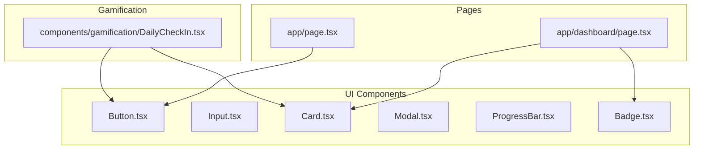
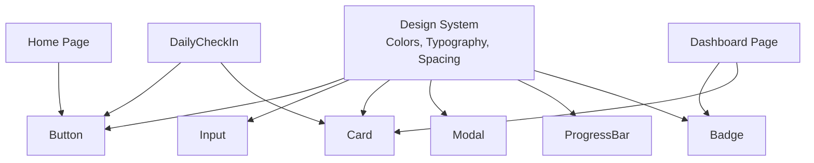
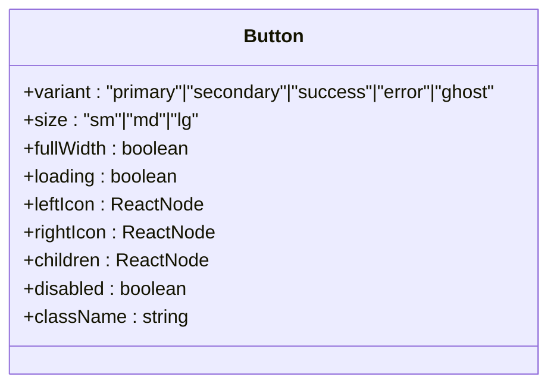
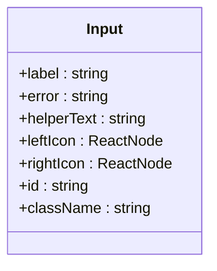
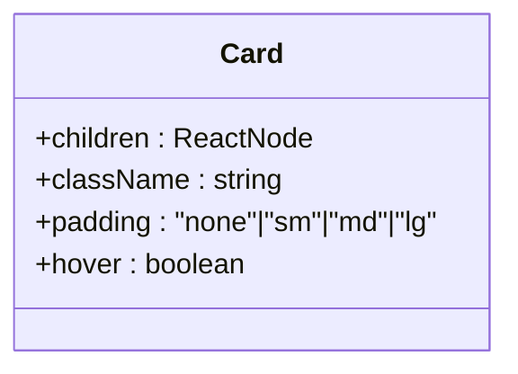
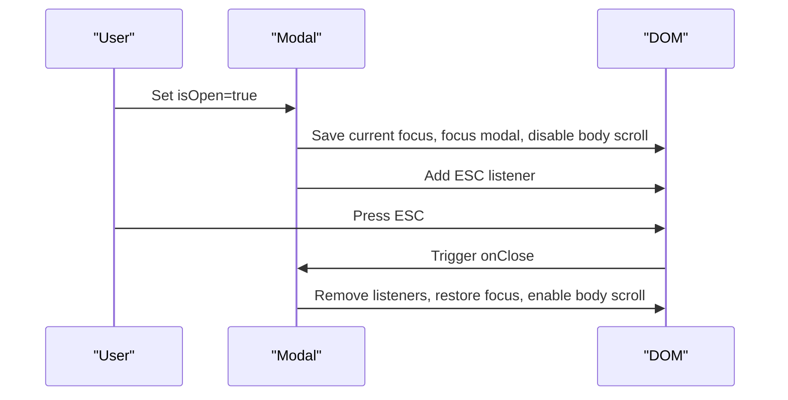
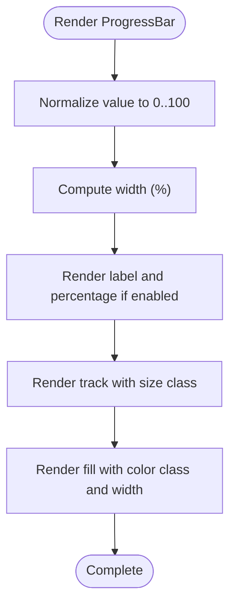
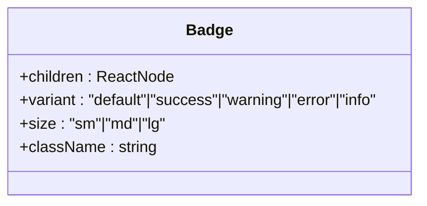
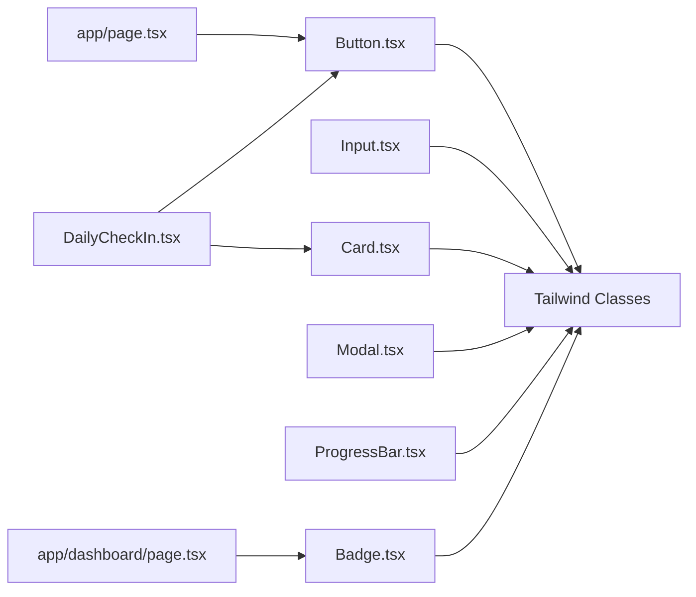

# Component Library Overview

<cite>
**Referenced Files in This Document**
- [Button.tsx](file://english_pronunciation_app/frontend/src/components/ui/Button.tsx)
- [Input.tsx](file://english_pronunciation_app/frontend/src/components/ui/Input.tsx)
- [Card.tsx](file://english_pronunciation_app/frontend/src/components/ui/Card.tsx)
- [Modal.tsx](file://english_pronunciation_app/frontend/src/components/ui/Modal.tsx)
- [ProgressBar.tsx](file://english_pronunciation_app/frontend/src/components/ui/ProgressBar.tsx)
- [Badge.tsx](file://english_pronunciation_app/frontend/src/components/ui/Badge.tsx)
- [UI_COMPONENTS_GUIDE.md](file://PLAN/03_UI_UX/UI_COMPONENTS_GUIDE.md)
- [COLOR_SYSTEM_GUIDE.md](file://PLAN/03_UI_UX/COLOR_SYSTEM_GUIDE.md)
- [page.tsx](file://english_pronunciation_app/frontend/src/app/page.tsx)
- [dashboard/page.tsx](file://english_pronunciation_app/frontend/src/app/dashboard/page.tsx)
- [DailyCheckIn.tsx](file://english_pronunciation_app/frontend/src/components/gamification/DailyCheckIn.tsx)
- [package.json](file://english_pronunciation_app/frontend/package.json)
- [postcss.config.mjs](file://english_pronunciation_app/frontend/postcss.config.mjs)
</cite>

## Table of Contents
1. [Introduction](#introduction)
2. [Project Structure](#project-structure)
3. [Core Components](#core-components)
4. [Architecture Overview](#architecture-overview)
5. [Detailed Component Analysis](#detailed-component-analysis)
6. [Dependency Analysis](#dependency-analysis)
7. [Performance Considerations](#performance-considerations)
8. [Troubleshooting Guide](#troubleshooting-guide)
9. [Conclusion](#conclusion)
10. [Appendices](#appendices)

## Introduction
This document provides a comprehensive overview of the UI component library used in the English pronunciation learning application. It describes the component architecture, design philosophy, and usage patterns for Button, Input, Card, Modal, ProgressBar, and Badge. It documents props, variants, sizes, and customization options, along with import patterns, usage examples, and integration guidelines. It also explains component composition principles, reusability patterns, best practices for consistent UI development, component states, interactive behaviors, responsive design considerations, and guidelines for extending components while maintaining design system consistency.

## Project Structure
The UI components are located under the frontend application’s shared component library. Each component is self-contained with TypeScript props, Tailwind-based styling, and built-in accessibility features. The components are designed to be reusable across pages and integrated with the broader design system.

**Diagram sources**
- [Button.tsx](file://english_pronunciation_app/frontend/src/components/ui/Button.tsx)
- [Input.tsx](file://english_pronunciation_app/frontend/src/components/ui/Input.tsx)
- [Card.tsx](file://english_pronunciation_app/frontend/src/components/ui/Card.tsx)
- [Modal.tsx](file://english_pronunciation_app/frontend/src/components/ui/Modal.tsx)
- [ProgressBar.tsx](file://english_pronunciation_app/frontend/src/components/ui/ProgressBar.tsx)
- [Badge.tsx](file://english_pronunciation_app/frontend/src/components/ui/Badge.tsx)
- [page.tsx](file://english_pronunciation_app/frontend/src/app/page.tsx)
- [dashboard/page.tsx](file://english_pronunciation_app/frontend/src/app/dashboard/page.tsx)
- [DailyCheckIn.tsx](file://english_pronunciation_app/frontend/src/components/gamification/DailyCheckIn.tsx)

**Section sources**
- [UI_COMPONENTS_GUIDE.md](file://PLAN/03_UI_UX/UI_COMPONENTS_GUIDE.md)
- [Button.tsx](file://english_pronunciation_app/frontend/src/components/ui/Button.tsx)
- [Input.tsx](file://english_pronunciation_app/frontend/src/components/ui/Input.tsx)
- [Card.tsx](file://english_pronunciation_app/frontend/src/components/ui/Card.tsx)
- [Modal.tsx](file://english_pronunciation_app/frontend/src/components/ui/Modal.tsx)
- [ProgressBar.tsx](file://english_pronunciation_app/frontend/src/components/ui/ProgressBar.tsx)
- [Badge.tsx](file://english_pronunciation_app/frontend/src/components/ui/Badge.tsx)

## Core Components
This section summarizes the six core UI components and their primary responsibilities, props, variants, sizes, and accessibility characteristics.

- Button
  - Purpose: Primary and secondary actions with variants, sizes, icons, loading state, and full-width option.
  - Props: variant, size, fullWidth, loading, leftIcon, rightIcon, children, plus standard button attributes.
  - Variants: primary, secondary, success, error, ghost.
  - Sizes: sm, md, lg.
  - Accessibility: minimum 44x44px touch target, high contrast, focus-visible ring, keyboard accessible, disabled state clearly indicated.

- Input
  - Purpose: Form input with optional label, helper/error messaging, and left/right icons.
  - Props: label, error, helperText, leftIcon, rightIcon, plus standard input attributes.
  - Accessibility: proper label association, aria-invalid and aria-describedby for assistive tech, required indicator.

- Card
  - Purpose: Container with visual grouping, padding options, and optional hover effects.
  - Props: children, className, padding, hover.
  - Padding options: none, sm, md, lg.

- Modal
  - Purpose: Dialog with focus trap, ESC-to-close, backdrop click to close, and configurable size.
  - Props: isOpen, onClose, title, children, size, showCloseButton.
  - Accessibility: role="dialog", aria-modal=true, focus management, prevent body scroll.

- ProgressBar
  - Purpose: Visual progress with label, percentage display, color variants, and size options.
  - Props: value, max, label, showPercentage, color, size, className.
  - Color variants: primary, success, warning, error.
  - Accessibility: ARIA roles and values for screen readers.

- Badge
  - Purpose: Status and labeling with color-coded variants and sizing.
  - Props: children, variant, size, className.
  - Variants: default, success, warning, error, info.
  - Accessibility: communicates meaning via text and color; avoid conveying information using color alone.

**Section sources**
- [Button.tsx](file://english_pronunciation_app/frontend/src/components/ui/Button.tsx)
- [Input.tsx](file://english_pronunciation_app/frontend/src/components/ui/Input.tsx)
- [Card.tsx](file://english_pronunciation_app/frontend/src/components/ui/Card.tsx)
- [Modal.tsx](file://english_pronunciation_app/frontend/src/components/ui/Modal.tsx)
- [ProgressBar.tsx](file://english_pronunciation_app/frontend/src/components/ui/ProgressBar.tsx)
- [Badge.tsx](file://english_pronunciation_app/frontend/src/components/ui/Badge.tsx)
- [UI_COMPONENTS_GUIDE.md](file://PLAN/03_UI_UX/UI_COMPONENTS_GUIDE.md)

## Architecture Overview
The UI components are designed around a consistent design system with a Blue + Orange color palette, strict accessibility standards (WCAG 2.1 AA), and responsive, accessible markup. Components are composed primarily with Tailwind utility classes and integrate with Next.js routing and server-side features.

**Diagram sources**
- [COLOR_SYSTEM_GUIDE.md](file://PLAN/03_UI_UX/COLOR_SYSTEM_GUIDE.md)
- [Button.tsx](file://english_pronunciation_app/frontend/src/components/ui/Button.tsx)
- [Input.tsx](file://english_pronunciation_app/frontend/src/components/ui/Input.tsx)
- [Card.tsx](file://english_pronunciation_app/frontend/src/components/ui/Card.tsx)
- [Modal.tsx](file://english_pronunciation_app/frontend/src/components/ui/Modal.tsx)
- [ProgressBar.tsx](file://english_pronunciation_app/frontend/src/components/ui/ProgressBar.tsx)
- [Badge.tsx](file://english_pronunciation_app/frontend/src/components/ui/Badge.tsx)
- [page.tsx](file://english_pronunciation_app/frontend/src/app/page.tsx)
- [dashboard/page.tsx](file://english_pronunciation_app/frontend/src/app/dashboard/page.tsx)
- [DailyCheckIn.tsx](file://english_pronunciation_app/frontend/src/components/gamification/DailyCheckIn.tsx)

## Detailed Component Analysis

### Button Component
- Implementation pattern: Uses a base style set and composes variant and size styles. Supports loading state with an inline spinner, and icon placement on left/right.
- Props and behavior:
  - variant: primary, secondary, success, error, ghost with distinct color schemes and focus rings.
  - size: sm/md/lg with explicit minimum height and padding for touch targets.
  - fullWidth: expands to 100% width.
  - loading: disables button and renders a spinner.
  - leftIcon/rightIcon: optional decorative icons with spacing.
- Accessibility: focus-visible ring, high contrast, minimum 44x44px touch target, keyboard accessible, disabled state handled.
- Composition: Intended to be used inside cards, modals, forms, and page layouts.

**Diagram sources**
- [Button.tsx](file://english_pronunciation_app/frontend/src/components/ui/Button.tsx)

**Section sources**
- [Button.tsx](file://english_pronunciation_app/frontend/src/components/ui/Button.tsx)
- [UI_COMPONENTS_GUIDE.md](file://PLAN/03_UI_UX/UI_COMPONENTS_GUIDE.md)

### Input Component
- Implementation pattern: Renders a labeled input with optional icons inside a relative container. Applies error or default styles and manages aria attributes for assistive technologies.
- Props and behavior:
  - label: optional label with required indicator.
  - error: displays error message with icon and applies error styling.
  - helperText: neutral helper text shown when no error.
  - leftIcon/rightIcon: positioned absolutely for visual cues.
- Accessibility: htmlFor/id association, aria-invalid, aria-describedby, required asterisk.
- Composition: Used within forms, cards, and modals.

**Diagram sources**
- [Input.tsx](file://english_pronunciation_app/frontend/src/components/ui/Input.tsx)

**Section sources**
- [Input.tsx](file://english_pronunciation_app/frontend/src/components/ui/Input.tsx)
- [UI_COMPONENTS_GUIDE.md](file://PLAN/03_UI_UX/UI_COMPONENTS_GUIDE.md)

### Card Component
- Implementation pattern: Provides a bordered, elevated container with configurable padding and optional hover shadow.
- Props and behavior:
  - padding: none/sm/md/lg for flexible inner spacing.
  - hover: adds subtle hover elevation and transition.
- Composition: Used to group related content, stats, and action blocks.

**Diagram sources**
- [Card.tsx](file://english_pronunciation_app/frontend/src/components/ui/Card.tsx)

**Section sources**
- [Card.tsx](file://english_pronunciation_app/frontend/src/components/ui/Card.tsx)
- [UI_COMPONENTS_GUIDE.md](file://PLAN/03_UI_UX/UI_COMPONENTS_GUIDE.md)

### Modal Component
- Implementation pattern: Controlled dialog with focus trap, ESC-to-close, backdrop click to close, and configurable size. Manages focus restoration and body scroll prevention.
- Props and behavior:
  - isOpen/onClose: control visibility and lifecycle.
  - title/showCloseButton: header rendering.
  - size: sm/md/lg/xl for max-width.
- Accessibility: role="dialog", aria-modal=true, focus management, aria-labelledby, ESC handling, prevent scroll.

**Diagram sources**
- [Modal.tsx](file://english_pronunciation_app/frontend/src/components/ui/Modal.tsx)

**Section sources**
- [Modal.tsx](file://english_pronunciation_app/frontend/src/components/ui/Modal.tsx)
- [UI_COMPONENTS_GUIDE.md](file://PLAN/03_UI_UX/UI_COMPONENTS_GUIDE.md)

### ProgressBar Component
- Implementation pattern: Renders a labeled progress bar with percentage display, color variants, and size scaling. Uses ARIA attributes for accessibility.
- Props and behavior:
  - value/max: normalized to 0–100%.
  - label: optional descriptive text.
  - showPercentage: toggles percentage display.
  - color: primary/success/warning/error.
  - size: sm/md/lg affecting thickness.
- Accessibility: role="progressbar", aria-valuenow/min/max, aria-label.

**Diagram sources**
- [ProgressBar.tsx](file://english_pronunciation_app/frontend/src/components/ui/ProgressBar.tsx)

**Section sources**
- [ProgressBar.tsx](file://english_pronunciation_app/frontend/src/components/ui/ProgressBar.tsx)
- [UI_COMPONENTS_GUIDE.md](file://PLAN/03_UI_UX/UI_COMPONENTS_GUIDE.md)

### Badge Component
- Implementation pattern: Lightweight status label with color-coded variants and sizing.
- Props and behavior:
  - variant: default/success/warning/error/info.
  - size: sm/md/lg.
- Accessibility: communicates meaning via text and color; avoid conveying information using color alone.

**Diagram sources**
- [Badge.tsx](file://english_pronunciation_app/frontend/src/components/ui/Badge.tsx)

**Section sources**
- [Badge.tsx](file://english_pronunciation_app/frontend/src/components/ui/Badge.tsx)
- [UI_COMPONENTS_GUIDE.md](file://PLAN/03_UI_UX/UI_COMPONENTS_GUIDE.md)

## Dependency Analysis
- Component dependencies:
  - Button depends on Tailwind classes for variants and sizes; integrates with icons and loading states.
  - Input depends on Tailwind for focus and error states; integrates with label and helper/error messaging.
  - Card depends on Tailwind for borders, shadows, and dark mode variants.
  - Modal depends on React refs and effects for focus trapping and ESC handling; integrates with Tailwind for layout and backdrop.
  - ProgressBar depends on Tailwind for color and size classes; integrates with ARIA attributes.
  - Badge depends on Tailwind for color and size classes.
- External dependencies:
  - Tailwind CSS and PostCSS are configured via the project’s PostCSS pipeline.
  - Next.js provides routing and SSR features used in pages that consume these components.

**Diagram sources**
- [Button.tsx](file://english_pronunciation_app/frontend/src/components/ui/Button.tsx)
- [Input.tsx](file://english_pronunciation_app/frontend/src/components/ui/Input.tsx)
- [Card.tsx](file://english_pronunciation_app/frontend/src/components/ui/Card.tsx)
- [Modal.tsx](file://english_pronunciation_app/frontend/src/components/ui/Modal.tsx)
- [ProgressBar.tsx](file://english_pronunciation_app/frontend/src/components/ui/ProgressBar.tsx)
- [Badge.tsx](file://english_pronunciation_app/frontend/src/components/ui/Badge.tsx)
- [page.tsx](file://english_pronunciation_app/frontend/src/app/page.tsx)
- [dashboard/page.tsx](file://english_pronunciation_app/frontend/src/app/dashboard/page.tsx)
- [DailyCheckIn.tsx](file://english_pronunciation_app/frontend/src/components/gamification/DailyCheckIn.tsx)
- [postcss.config.mjs](file://english_pronunciation_app/frontend/postcss.config.mjs)

**Section sources**
- [package.json](file://english_pronunciation_app/frontend/package.json)
- [postcss.config.mjs](file://english_pronunciation_app/frontend/postcss.config.mjs)

## Performance Considerations
- Prefer minimal re-renders by passing stable prop references where appropriate.
- Use component composition to avoid unnecessary wrappers; leverage className merging to minimize DOM depth.
- Keep icon usage efficient; ensure icons are lightweight and sized appropriately.
- For ProgressBar, avoid frequent updates to value; batch updates when animating progress.
- For Modal, defer rendering off DOM when closed to reduce initial payload.

## Troubleshooting Guide
- Button disabled state
  - Symptom: Button appears clickable but does nothing.
  - Cause: disabled or loading prop is true.
  - Resolution: Ensure disabled is false and loading is false when enabling interaction.
- Input error state
  - Symptom: Error message not visible or incorrect styling.
  - Cause: Missing error prop or mismatched id/aria-describedby.
  - Resolution: Provide error text and ensure unique id generation; verify aria-invalid and aria-describedby.
- Modal focus issues
  - Symptom: Focus escapes or cannot escape modal.
  - Cause: Focus trap not initialized or event listeners removed prematurely.
  - Resolution: Confirm isOpen lifecycle; ensure focus is saved/restored and ESC listener is attached/removed correctly.
- ProgressBar accessibility
  - Symptom: Screen reader does not announce progress.
  - Cause: Missing ARIA attributes or invalid value range.
  - Resolution: Provide aria-valuenow, aria-valuemin, aria-valuemax, and aria-label when needed.
- Badge semantics
  - Symptom: Badge conveys meaning only by color.
  - Cause: No text content or insufficient context.
  - Resolution: Include descriptive text alongside color.

**Section sources**
- [Button.tsx](file://english_pronunciation_app/frontend/src/components/ui/Button.tsx)
- [Input.tsx](file://english_pronunciation_app/frontend/src/components/ui/Input.tsx)
- [Modal.tsx](file://english_pronunciation_app/frontend/src/components/ui/Modal.tsx)
- [ProgressBar.tsx](file://english_pronunciation_app/frontend/src/components/ui/ProgressBar.tsx)
- [Badge.tsx](file://english_pronunciation_app/frontend/src/components/ui/Badge.tsx)

## Conclusion
The UI component library follows a consistent design system grounded in accessibility, responsive behavior, and composability. Components are intentionally minimal, highly customizable, and aligned with WCAG 2.1 AA guidelines. By adhering to the documented props, variants, sizes, and integration patterns, teams can maintain visual and behavioral consistency across pages and features.

## Appendices

### Import Patterns and Usage Examples
- Import components:
  - Button, Input, Card, Modal, ProgressBar, Badge are imported from the UI library.
- Example usage:
  - Home page demonstrates Button usage with icons and sizes.
  - Dashboard page demonstrates Badge and Card usage for stats and recent attempts.
  - DailyCheckIn integrates Button and Card within a gamification context.

**Section sources**
- [UI_COMPONENTS_GUIDE.md](file://PLAN/03_UI_UX/UI_COMPONENTS_GUIDE.md)
- [page.tsx](file://english_pronunciation_app/frontend/src/app/page.tsx)
- [dashboard/page.tsx](file://english_pronunciation_app/frontend/src/app/dashboard/page.tsx)
- [DailyCheckIn.tsx](file://english_pronunciation_app/frontend/src/components/gamification/DailyCheckIn.tsx)

### Design System and Color Guidelines
- Color palette and usage rules:
  - Primary Blue for main actions and headers.
  - Accent Orange for gamification highlights.
  - Success/Green for correct outcomes, Warning/Amber for needs-improvement, Error/Red for feedback.
  - Neutrals for backgrounds and text.
- Rules:
  - 60/30/10 rule for dominant/secondary/accent usage.
  - Maintain high contrast ratios and avoid relying solely on color to convey meaning.

**Section sources**
- [COLOR_SYSTEM_GUIDE.md](file://PLAN/03_UI_UX/COLOR_SYSTEM_GUIDE.md)