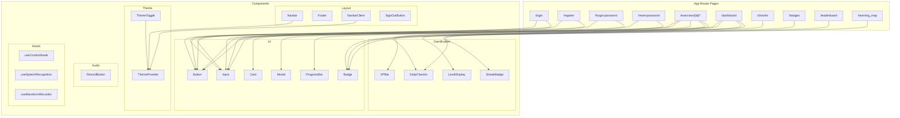
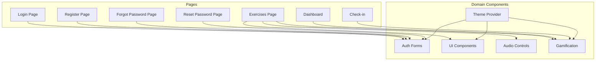
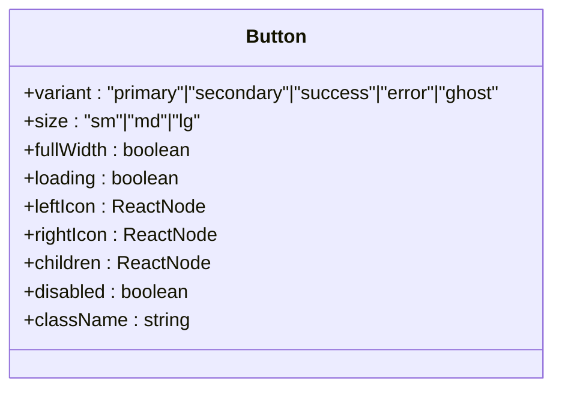
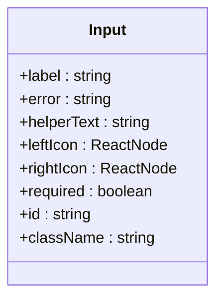
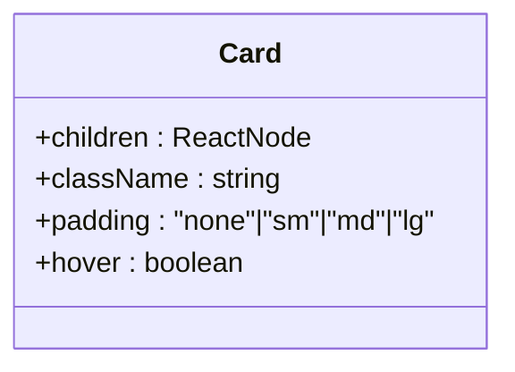
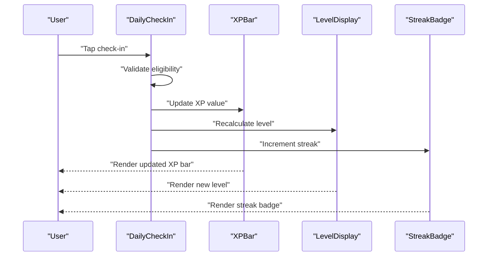
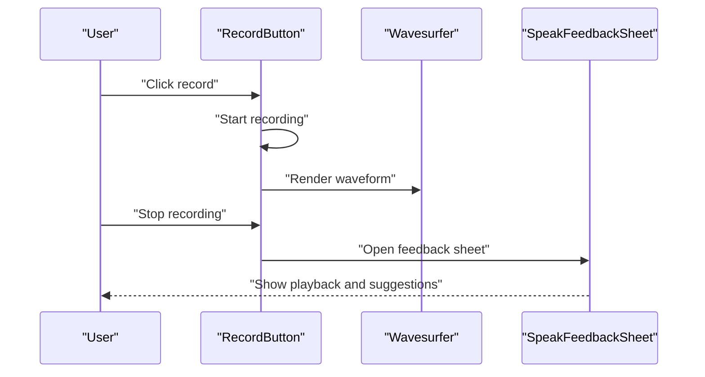
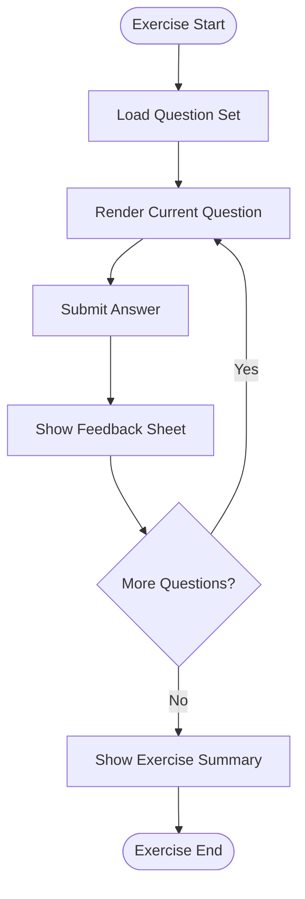
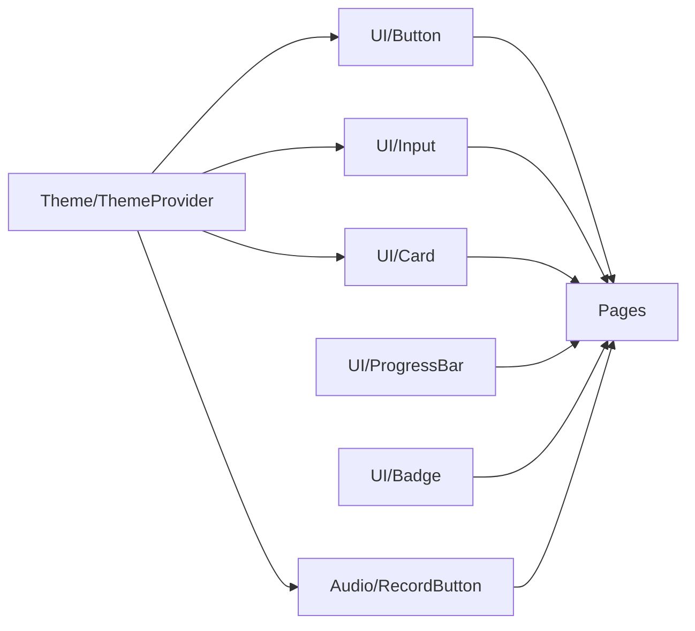

# Component Usage and Customization

<cite>
**Referenced Files in This Document**
- [Button.tsx](file://english_pronunciation_app/frontend/src/components/ui/Button.tsx)
- [Input.tsx](file://english_pronunciation_app/frontend/src/components/ui/Input.tsx)
- [Card.tsx](file://english_pronunciation_app/frontend/src/components/ui/Card.tsx)
- [Modal.tsx](file://english_pronunciation_app/frontend/src/components/ui/Modal.tsx)
- [ProgressBar.tsx](file://english_pronunciation_app/frontend/src/components/ui/ProgressBar.tsx)
- [Badge.tsx](file://english_pronunciation_app/frontend/src/components/ui/Badge.tsx)
- [RecordButton.tsx](file://english_pronunciation_app/frontend/src/components/audio/RecordButton.tsx)
- [DailyCheckIn.tsx](file://english_pronunciation_app/frontend/src/components/gamification/DailyCheckIn.tsx)
- [XPBar.tsx](file://english_pronunciation_app/frontend/src/components/gamification/XPBar.tsx)
- [LevelDisplay.tsx](file://english_pronunciation_app/frontend/src/components/gamification/LevelDisplay.tsx)
- [StreakBadge.tsx](file://english_pronunciation_app/frontend/src/components/gamification/StreakBadge.tsx)
- [LoginForm.tsx](file://english_pronunciation_app/frontend/src/app/login/LoginForm.tsx)
- [ForgotPasswordForm.tsx](file://english_pronunciation_app/frontend/src/app/forgot-password/ForgotPasswordForm.tsx)
- [RegisterForm.tsx](file://english_pronunciation_app/frontend/src/app/register/RegisterForm.tsx)
- [ResetPasswordForm.tsx](file://english_pronunciation_app/frontend/src/app/reset-password/ResetPasswordForm.tsx)
- [ExerciseEngineClient.tsx](file://english_pronunciation_app/frontend/src/app/exercises/[id]/ExerciseEngineClient.tsx)
- [ExerciseSummaryScreen.tsx](file://english_pronunciation_app/frontend/src/app/exercises/[id]/ExerciseSummaryScreen.tsx)
- [ListenFeedbackSheet.tsx](file://english_pronunciation_app/frontend/src/app/exercises/[id]/ListenFeedbackSheet.tsx)
- [SpeakFeedbackSheet.tsx](file://english_pronunciation_app/frontend/src/app/exercises/[id]/SpeakFeedbackSheet.tsx)
- [SpeakMinimalPairsQuestion.tsx](file://english_pronunciation_app/frontend/src/app/exercises/[id]/SpeakMinimalPairsQuestion.tsx)
- [SpeakSentenceQuestion.tsx](file://english_pronunciation_app/frontend/src/app/exercises/[id]/SpeakSentenceQuestion.tsx)
- [SpeakWordQuestion.tsx](file://english_pronunciation_app/frontend/src/app/exercises/[id]/SpeakWordQuestion.tsx)
- [TapStressQuestion.tsx](file://english_pronunciation_app/frontend/src/app/exercises/[id]/TapStressQuestion.tsx)
- [ChooseAssimilationQuestion.tsx](file://english_pronunciation_app/frontend/src/app/exercises/[id]/ChooseAssimilationQuestion.tsx)
- [ChooseLinkingQuestion.tsx](file://english_pronunciation_app/frontend/src/app/exercises/[id]/ChooseLinkingQuestion.tsx)
- [ChooseWeakQuestion.tsx](file://english_pronunciation_app/frontend/src/app/exercises/[id]/ChooseWeakQuestion.tsx)
- [layout.tsx](file://english_pronunciation_app/frontend/src/app/layout.tsx)
- [globals.css](file://english_pronunciation_app/frontend/src/app/globals.css)
- [ThemeProvider.tsx](file://english_pronunciation_app/frontend/src/components/theme/ThemeProvider.tsx)
- [ThemeToggle.tsx](file://english_pronunciation_app/frontend/src/components/theme/ThemeToggle.tsx)
- [Footer.tsx](file://english_pronunciation_app/frontend/src/components/layout/Footer.tsx)
- [Navbar.tsx](file://english_pronunciation_app/frontend/src/components/layout/Navbar.tsx)
- [NavbarClient.tsx](file://english_pronunciation_app/frontend/src/components/layout/NavbarClient.tsx)
- [SignOutButton.tsx](file://english_pronunciation_app/frontend/src/components/layout/SignOutButton.tsx)
- [useComboStreak.ts](file://english_pronunciation_app/frontend/src/hooks/useComboStreak.ts)
- [useSpeechRecognition.ts](file://english_pronunciation_app/frontend/src/hooks/useSpeechRecognition.ts)
- [useWaveformRecorder.ts](file://english_pronunciation_app/frontend/src/hooks/useWaveformRecorder.ts)
- [README.md](file://english_pronunciation_app/frontend/README.md)
- [package.json](file://english_pronunciation_app/frontend/package.json)
- [next.config.mjs](file://english_pronunciation_app/frontend/next.config.mjs)
- [postcss.config.mjs](file://english_pronunciation_app/frontend/postcss.config.mjs)
- [COLOR_SYSTEM_GUIDE.md](file://PLAN/03_UI_UX/COLOR_SYSTEM_GUIDE.md)
- [UI_COMPONENTS_GUIDE.md](file://PLAN/03_UI_UX/UI_COMPONENTS_GUIDE.md)
</cite>

## Table of Contents
1. [Introduction](#introduction)
2. [Project Structure](#project-structure)
3. [Core Components](#core-components)
4. [Architecture Overview](#architecture-overview)
5. [Detailed Component Analysis](#detailed-component-analysis)
6. [Dependency Analysis](#dependency-analysis)
7. [Performance Considerations](#performance-considerations)
8. [Troubleshooting Guide](#troubleshooting-guide)
9. [Conclusion](#conclusion)
10. [Appendices](#appendices)

## Introduction
This document provides comprehensive guidance for using and customizing UI components in the English Pronunciation App built with Next.js. It focuses on:
- Usage patterns and composition strategies for core UI components
- Prop drilling alternatives and state management integration
- Customization techniques including Tailwind class overrides, component extension, and theme customization
- Integration with Next.js routing, forms, and state management
- Performance optimization, lazy loading, and bundling considerations
- Common usage patterns, anti-patterns, and troubleshooting tips

## Project Structure
The frontend is organized around a component-driven architecture with feature-specific pages under the Next.js App Router. Components are grouped by domain (ui, layout, auth, gamification, audio, theme) and reused across pages.

**Diagram sources**
- [layout.tsx:1-10](file://english_pronunciation_app/frontend/src/app/layout.tsx#L1-L10)
- [Button.tsx:1-83](file://english_pronunciation_app/frontend/src/components/ui/Button.tsx#L1-L83)
- [Input.tsx:1-91](file://english_pronunciation_app/frontend/src/components/ui/Input.tsx#L1-L91)
- [Card.tsx:1-36](file://english_pronunciation_app/frontend/src/components/ui/Card.tsx#L1-L36)
- [Modal.tsx](file://english_pronunciation_app/frontend/src/components/ui/Modal.tsx)
- [ProgressBar.tsx](file://english_pronunciation_app/frontend/src/components/ui/ProgressBar.tsx)
- [Badge.tsx](file://english_pronunciation_app/frontend/src/components/ui/Badge.tsx)
- [Navbar.tsx](file://english_pronunciation_app/frontend/src/components/layout/Navbar.tsx)
- [Footer.tsx](file://english_pronunciation_app/frontend/src/components/layout/Footer.tsx)
- [NavbarClient.tsx](file://english_pronunciation_app/frontend/src/components/layout/NavbarClient.tsx)
- [SignOutButton.tsx](file://english_pronunciation_app/frontend/src/components/layout/SignOutButton.tsx)
- [ThemeProvider.tsx](file://english_pronunciation_app/frontend/src/components/theme/ThemeProvider.tsx)
- [ThemeToggle.tsx](file://english_pronunciation_app/frontend/src/components/theme/ThemeToggle.tsx)
- [DailyCheckIn.tsx](file://english_pronunciation_app/frontend/src/components/gamification/DailyCheckIn.tsx)
- [XPBar.tsx](file://english_pronunciation_app/frontend/src/components/gamification/XPBar.tsx)
- [LevelDisplay.tsx](file://english_pronunciation_app/frontend/src/components/gamification/LevelDisplay.tsx)
- [StreakBadge.tsx](file://english_pronunciation_app/frontend/src/components/gamification/StreakBadge.tsx)
- [RecordButton.tsx](file://english_pronunciation_app/frontend/src/components/audio/RecordButton.tsx)
- [useComboStreak.ts](file://english_pronunciation_app/frontend/src/hooks/useComboStreak.ts)
- [useSpeechRecognition.ts](file://english_pronunciation_app/frontend/src/hooks/useSpeechRecognition.ts)
- [useWaveformRecorder.ts](file://english_pronunciation_app/frontend/src/hooks/useWaveformRecorder.ts)

**Section sources**
- [README.md:1-33](file://english_pronunciation_app/frontend/README.md#L1-L33)
- [layout.tsx:1-10](file://english_pronunciation_app/frontend/src/app/layout.tsx#L1-L10)

## Core Components
This section documents the foundational UI components and their usage patterns.

- Button
  - Purpose: Primary action with variants, sizes, icons, loading state, and full-width support.
  - Key props: variant, size, fullWidth, loading, leftIcon, rightIcon, disabled, className.
  - Accessibility: Focus ring, keyboard navigation, minimum touch target, color contrast.
  - Usage pattern: Combine with icons and loading states for feedback. Prefer variants for semantic meaning.
  - Customization: Override className for additional Tailwind utilities; avoid overriding core variant classes.

- Input
  - Purpose: Form input with label, helper/error messaging, and optional left/right icons.
  - Key props: label, error, helperText, leftIcon, rightIcon, required, id, className.
  - Accessibility: Proper labeling, aria-invalid, aria-describedby for assistive tech.
  - Usage pattern: Use error and helperText to guide user correction; pair with form validation.
  - Customization: Add padding adjustments via className; keep icon slots for consistent spacing.

- Card
  - Purpose: Content container with padding and hover effects.
  - Key props: children, className, padding, hover.
  - Usage pattern: Group related controls or content; use hover for interactive cards.
  - Customization: Adjust padding via prop; override className for layout needs.

- Modal
  - Purpose: Overlay dialog with backdrop and close controls.
  - Usage pattern: Controlled visibility via parent state; render children inside modal body.
  - Customization: Override className for sizing and positioning; ensure focus trapping if extended.

- ProgressBar
  - Purpose: Visual progress indicator for exercises or tasks.
  - Usage pattern: Bind value to completion percentage; animate transitions.
  - Customization: Tailwind className overrides for track/background colors.

- Badge
  - Purpose: Status or metadata labels.
  - Usage pattern: Use for streaks, levels, or tags; combine with Card for contextual grouping.
  - Customization: Extend variant system or pass className for brand-specific styles.

**Section sources**
- [Button.tsx:1-83](file://english_pronunciation_app/frontend/src/components/ui/Button.tsx#L1-L83)
- [Input.tsx:1-91](file://english_pronunciation_app/frontend/src/components/ui/Input.tsx#L1-L91)
- [Card.tsx:1-36](file://english_pronunciation_app/frontend/src/components/ui/Card.tsx#L1-L36)
- [Modal.tsx](file://english_pronunciation_app/frontend/src/components/ui/Modal.tsx)
- [ProgressBar.tsx](file://english_pronunciation_app/frontend/src/components/ui/ProgressBar.tsx)
- [Badge.tsx](file://english_pronunciation_app/frontend/src/components/ui/Badge.tsx)

## Architecture Overview
The app follows a layered architecture:
- UI Layer: Reusable components under src/components/ui and domain-specific components under src/components/{domain}.
- Feature Pages: Next.js App Router pages under src/app that import and compose components.
- Hooks: Shared logic under src/hooks for speech recognition, waveform recording, and combo streak tracking.
- Theme: Provider and toggle under src/components/theme integrate with global CSS.

**Diagram sources**
- [ExerciseEngineClient.tsx:1-20](file://english_pronunciation_app/frontend/src/app/exercises/[id]/ExerciseEngineClient.tsx#L1-L20)
- [LoginForm.tsx](file://english_pronunciation_app/frontend/src/app/login/LoginForm.tsx)
- [RegisterForm.tsx](file://english_pronunciation_app/frontend/src/app/register/RegisterForm.tsx)
- [ForgotPasswordForm.tsx](file://english_pronunciation_app/frontend/src/app/forgot-password/ForgotPasswordForm.tsx)
- [ResetPasswordForm.tsx](file://english_pronunciation_app/frontend/src/app/reset-password/ResetPasswordForm.tsx)
- [DailyCheckIn.tsx](file://english_pronunciation_app/frontend/src/components/gamification/DailyCheckIn.tsx)
- [RecordButton.tsx](file://english_pronunciation_app/frontend/src/components/audio/RecordButton.tsx)
- [ThemeProvider.tsx](file://english_pronunciation_app/frontend/src/components/theme/ThemeProvider.tsx)

## Detailed Component Analysis

### Button Component
- Props and behavior:
  - Variants: primary, secondary, success, error, ghost.
  - Sizes: sm, md, lg with minimum touch targets.
  - Loading spinner renders automatically when loading is true.
  - Icons supported on left and right sides.
- Composition patterns:
  - Use with Input to attach actions (e.g., submit, clear).
  - Chain multiple Buttons for primary/secondary actions.
- Customization:
  - Override className for additional spacing or layout.
  - Do not override variant classes; use className to augment.
- Accessibility:
  - Focus-visible ring, keyboard operable, disabled state handled.

**Diagram sources**
- [Button.tsx:5-16](file://english_pronunciation_app/frontend/src/components/ui/Button.tsx#L5-L16)

**Section sources**
- [Button.tsx:18-83](file://english_pronunciation_app/frontend/src/components/ui/Button.tsx#L18-L83)

### Input Component
- Props and behavior:
  - Optional label with required asterisk.
  - Error and helper text with roles and aria attributes.
  - Left/right icons with proper spacing.
- Composition patterns:
  - Pair with Button for form submission.
  - Use within Card for grouped form sections.
- Customization:
  - Add className for layout; keep icon slots for consistency.
- Accessibility:
  - Proper id/htmlFor association, aria-invalid, aria-describedby.

**Diagram sources**
- [Input.tsx:3-9](file://english_pronunciation_app/frontend/src/components/ui/Input.tsx#L3-L9)

**Section sources**
- [Input.tsx:11-91](file://english_pronunciation_app/frontend/src/components/ui/Input.tsx#L11-L91)

### Card Component
- Props and behavior:
  - Padding variants: none, sm, md, lg.
  - Optional hover elevation.
- Composition patterns:
  - Wrap Input and Button pairs for form panels.
  - Nest Badges and Progress indicators for dashboards.
- Customization:
  - Use className for layout and responsive adjustments.

**Diagram sources**
- [Card.tsx:3-8](file://english_pronunciation_app/frontend/src/components/ui/Card.tsx#L3-L8)

**Section sources**
- [Card.tsx:10-36](file://english_pronunciation_app/frontend/src/components/ui/Card.tsx#L10-L36)

### Gamification Components
- DailyCheckIn: Presents daily reward collection with visual feedback.
- XPBar: Shows experience progression with thresholds.
- LevelDisplay: Renders current level with styling.
- StreakBadge: Displays current streak count and styling.

Usage patterns:
- Compose DailyCheckIn with XPBar and LevelDisplay on dashboard.
- Use StreakBadge within Card for prominent display.
- Coordinate state updates across components via shared hooks or context.

**Diagram sources**
- [DailyCheckIn.tsx](file://english_pronunciation_app/frontend/src/components/gamification/DailyCheckIn.tsx)
- [XPBar.tsx](file://english_pronunciation_app/frontend/src/components/gamification/XPBar.tsx)
- [LevelDisplay.tsx](file://english_pronunciation_app/frontend/src/components/gamification/LevelDisplay.tsx)
- [StreakBadge.tsx](file://english_pronunciation_app/frontend/src/components/gamification/StreakBadge.tsx)

**Section sources**
- [DailyCheckIn.tsx](file://english_pronunciation_app/frontend/src/components/gamification/DailyCheckIn.tsx)
- [XPBar.tsx](file://english_pronunciation_app/frontend/src/components/gamification/XPBar.tsx)
- [LevelDisplay.tsx](file://english_pronunciation_app/frontend/src/components/gamification/LevelDisplay.tsx)
- [StreakBadge.tsx](file://english_pronunciation_app/frontend/src/components/gamification/StreakBadge.tsx)

### Audio Recording Component
- RecordButton: Provides recording control with visual feedback and waveform rendering via wavesurfer.js.

Usage patterns:
- Integrate with exercise flows to capture user speech.
- Combine with SpeakFeedbackSheet for post-recording review.
- Manage permissions and device availability via hooks.

**Diagram sources**
- [RecordButton.tsx](file://english_pronunciation_app/frontend/src/components/audio/RecordButton.tsx)
- [SpeakFeedbackSheet.tsx](file://english_pronunciation_app/frontend/src/app/exercises/[id]/SpeakFeedbackSheet.tsx)

**Section sources**
- [RecordButton.tsx](file://english_pronunciation_app/frontend/src/components/audio/RecordButton.tsx)

### Exercise Question Components
- Question types:
  - SpeakMinimalPairsQuestion
  - SpeakSentenceQuestion
  - SpeakWordQuestion
  - TapStressQuestion
  - ChooseAssimilationQuestion
  - ChooseLinkingQuestion
  - ChooseWeakQuestion
- Composition patterns:
  - Render one question per screen in ExerciseEngineClient.
  - Use ProgressBar to indicate progress.
  - Use ExerciseSummaryScreen to show results and next steps.

**Diagram sources**
- [ExerciseEngineClient.tsx:1-20](file://english_pronunciation_app/frontend/src/app/exercises/[id]/ExerciseEngineClient.tsx#L1-L20)
- [ExerciseSummaryScreen.tsx:1-20](file://english_pronunciation_app/frontend/src/app/exercises/[id]/ExerciseSummaryScreen.tsx#L1-L20)
- [ProgressBar.tsx](file://english_pronunciation_app/frontend/src/components/ui/ProgressBar.tsx)

**Section sources**
- [SpeakMinimalPairsQuestion.tsx](file://english_pronunciation_app/frontend/src/app/exercises/[id]/SpeakMinimalPairsQuestion.tsx)
- [SpeakSentenceQuestion.tsx](file://english_pronunciation_app/frontend/src/app/exercises/[id]/SpeakSentenceQuestion.tsx)
- [SpeakWordQuestion.tsx](file://english_pronunciation_app/frontend/src/app/exercises/[id]/SpeakWordQuestion.tsx)
- [TapStressQuestion.tsx](file://english_pronunciation_app/frontend/src/app/exercises/[id]/TapStressQuestion.tsx)
- [ChooseAssimilationQuestion.tsx](file://english_pronunciation_app/frontend/src/app/exercises/[id]/ChooseAssimilationQuestion.tsx)
- [ChooseLinkingQuestion.tsx](file://english_pronunciation_app/frontend/src/app/exercises/[id]/ChooseLinkingQuestion.tsx)
- [ChooseWeakQuestion.tsx](file://english_pronunciation_app/frontend/src/app/exercises/[id]/ChooseWeakQuestion.tsx)
- [ExerciseEngineClient.tsx:1-20](file://english_pronunciation_app/frontend/src/app/exercises/[id]/ExerciseEngineClient.tsx#L1-L20)
- [ExerciseSummaryScreen.tsx:1-20](file://english_pronunciation_app/frontend/src/app/exercises/[id]/ExerciseSummaryScreen.tsx#L1-L20)

## Dependency Analysis
Component dependencies and coupling:
- UI components are leaf nodes and highly reusable.
- Domain components depend on UI primitives.
- Pages import domain components and pass props.
- Theme provider injects design tokens globally.

**Diagram sources**
- [Button.tsx:1-83](file://english_pronunciation_app/frontend/src/components/ui/Button.tsx#L1-L83)
- [Input.tsx:1-91](file://english_pronunciation_app/frontend/src/components/ui/Input.tsx#L1-L91)
- [Card.tsx:1-36](file://english_pronunciation_app/frontend/src/components/ui/Card.tsx#L1-L36)
- [ProgressBar.tsx](file://english_pronunciation_app/frontend/src/components/ui/ProgressBar.tsx)
- [Badge.tsx](file://english_pronunciation_app/frontend/src/components/ui/Badge.tsx)
- [RecordButton.tsx](file://english_pronunciation_app/frontend/src/components/audio/RecordButton.tsx)
- [ThemeProvider.tsx](file://english_pronunciation_app/frontend/src/components/theme/ThemeProvider.tsx)
- [layout.tsx:1-10](file://english_pronunciation_app/frontend/src/app/layout.tsx#L1-L10)

**Section sources**
- [layout.tsx:1-10](file://english_pronunciation_app/frontend/src/app/layout.tsx#L1-L10)
- [ThemeProvider.tsx](file://english_pronunciation_app/frontend/src/components/theme/ThemeProvider.tsx)

## Performance Considerations
- Lazy loading:
  - Defer non-critical components using dynamic imports with Suspense boundaries.
  - Lazy load waveform rendering until recording starts.
- Bundling:
  - Keep UI components tree-shakeable; avoid importing heavy assets directly in components.
  - Split vendor bundles if adding external libraries beyond existing ones.
- Rendering:
  - Memoize expensive computations in hooks; avoid unnecessary re-renders by passing stable callbacks.
  - Use shallow equality checks for prop updates in components.
- Assets:
  - Preload critical fonts and defer non-critical resources.
  - Keep audio seeds local to reduce runtime network dependencies.

[No sources needed since this section provides general guidance]

## Troubleshooting Guide
Common issues and resolutions:
- Button disabled unexpectedly:
  - Verify loading prop and disabled prop are not both set unintentionally.
  - Ensure className does not override disabled opacity.
- Input label or error not announced:
  - Confirm id generation and aria-describedby are set; ensure error prop toggles aria-invalid.
- Theme not applying:
  - Ensure ThemeProvider wraps the app layout and global CSS is included.
  - Check Tailwind and PostCSS configurations for build-time processing.
- Exercise feedback not appearing:
  - Verify SpeakFeedbackSheet receives the recording payload and is rendered conditionally.
- Waveform not rendering:
  - Confirm wavesurfer initialization occurs after DOM is ready and audio data is available.

**Section sources**
- [Button.tsx:58-81](file://english_pronunciation_app/frontend/src/components/ui/Button.tsx#L58-L81)
- [Input.tsx:62-87](file://english_pronunciation_app/frontend/src/components/ui/Input.tsx#L62-L87)
- [ThemeProvider.tsx](file://english_pronunciation_app/frontend/src/components/theme/ThemeProvider.tsx)
- [layout.tsx:1-10](file://english_pronunciation_app/frontend/src/app/layout.tsx#L1-L10)
- [SpeakFeedbackSheet.tsx](file://english_pronunciation_app/frontend/src/app/exercises/[id]/SpeakFeedbackSheet.tsx)
- [RecordButton.tsx](file://english_pronunciation_app/frontend/src/components/audio/RecordButton.tsx)

## Conclusion
The component library emphasizes accessibility, composability, and theme-awareness. By following the documented usage patterns, leveraging hooks for state, and applying Tailwind overrides judiciously, teams can maintain a consistent, performant UI while enabling rapid iteration on exercises, gamification, and audio features.

[No sources needed since this section summarizes without analyzing specific files]

## Appendices

### Customization Playbook
- Tailwind overrides:
  - Pass className to augment styles without breaking core variants.
  - Use spacing and sizing utilities sparingly; prefer component props for semantics.
- Component extension:
  - Wrap base components to add domain-specific behavior (e.g., form-aware Input).
  - Compose multiple UI primitives into domain components (e.g., AuthShell).
- Theme customization:
  - Centralize design tokens in theme provider; consume via CSS variables or Tailwind palette.
  - Maintain light/dark variants for all components.

**Section sources**
- [Button.tsx:38-58](file://english_pronunciation_app/frontend/src/components/ui/Button.tsx#L38-L58)
- [Input.tsx:49-65](file://english_pronunciation_app/frontend/src/components/ui/Input.tsx#L49-L65)
- [Card.tsx:30-34](file://english_pronunciation_app/frontend/src/components/ui/Card.tsx#L30-L34)
- [ThemeProvider.tsx](file://english_pronunciation_app/frontend/src/components/theme/ThemeProvider.tsx)
- [COLOR_SYSTEM_GUIDE.md](file://PLAN/03_UI_UX/COLOR_SYSTEM_GUIDE.md)
- [UI_COMPONENTS_GUIDE.md](file://PLAN/03_UI_UX/UI_COMPONENTS_GUIDE.md)

### Integration Patterns
- Next.js routing:
  - Use App Router pages to orchestrate component composition; pass data via props or server-side fetching.
- Form handling:
  - Use controlled components with Input and Button; manage validation with error and helperText.
- State management:
  - Use React state for UI state; leverage hooks for shared logic (e.g., useComboStreak, useSpeechRecognition).
  - For cross-component state, prefer React Context or a lightweight store if needed.

**Section sources**
- [LoginForm.tsx](file://english_pronunciation_app/frontend/src/app/login/LoginForm.tsx)
- [ForgotPasswordForm.tsx](file://english_pronunciation_app/frontend/src/app/forgot-password/ForgotPasswordForm.tsx)
- [RegisterForm.tsx](file://english_pronunciation_app/frontend/src/app/register/RegisterForm.tsx)
- [ResetPasswordForm.tsx](file://english_pronunciation_app/frontend/src/app/reset-password/ResetPasswordForm.tsx)
- [useComboStreak.ts](file://english_pronunciation_app/frontend/src/hooks/useComboStreak.ts)
- [useSpeechRecognition.ts](file://english_pronunciation_app/frontend/src/hooks/useSpeechRecognition.ts)
- [useWaveformRecorder.ts](file://english_pronunciation_app/frontend/src/hooks/useWaveformRecorder.ts)

### Build and Tooling Notes
- Dependencies include Next.js, React, Prisma, bcryptjs, canvas-confetti, wavesurfer.js, Tailwind 4, and PostCSS.
- Tailwind and PostCSS are configured for build-time processing.
- Global CSS is applied at the root layout.

**Section sources**
- [package.json:17-40](file://english_pronunciation_app/frontend/package.json#L17-L40)
- [next.config.mjs](file://english_pronunciation_app/frontend/next.config.mjs)
- [postcss.config.mjs](file://english_pronunciation_app/frontend/postcss.config.mjs)
- [globals.css](file://english_pronunciation_app/frontend/src/app/globals.css)
- [layout.tsx:1-10](file://english_pronunciation_app/frontend/src/app/layout.tsx#L1-L10)