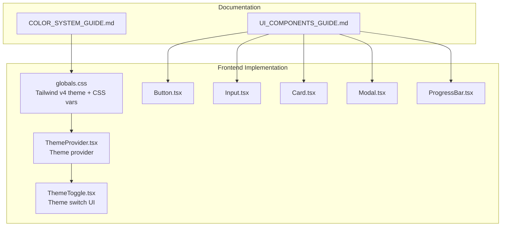
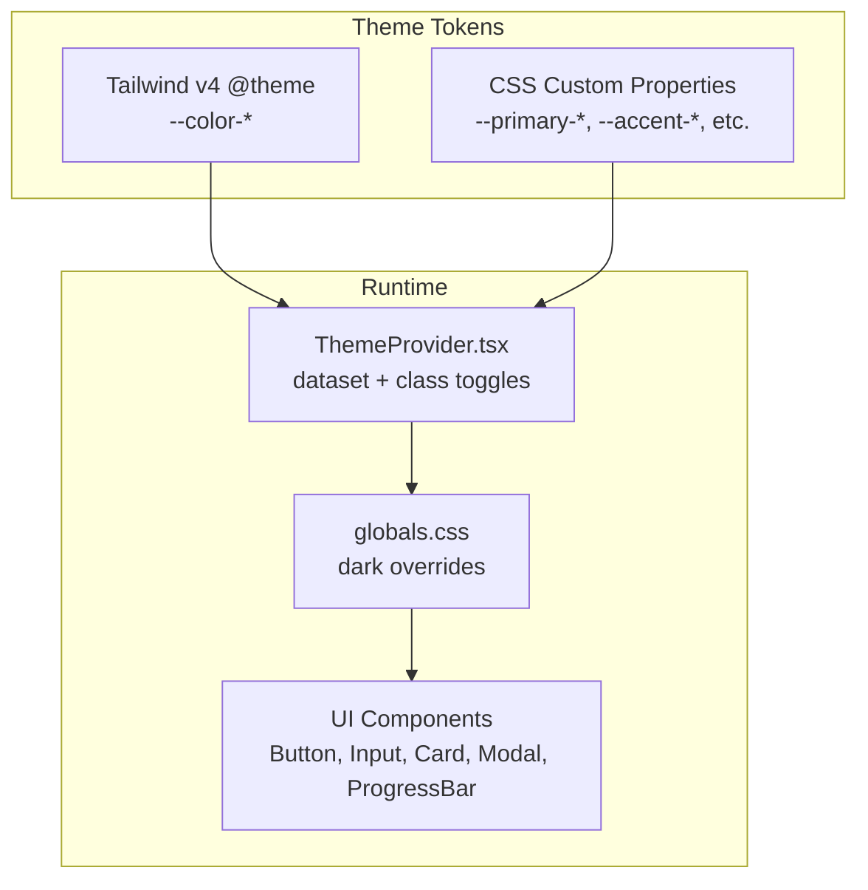
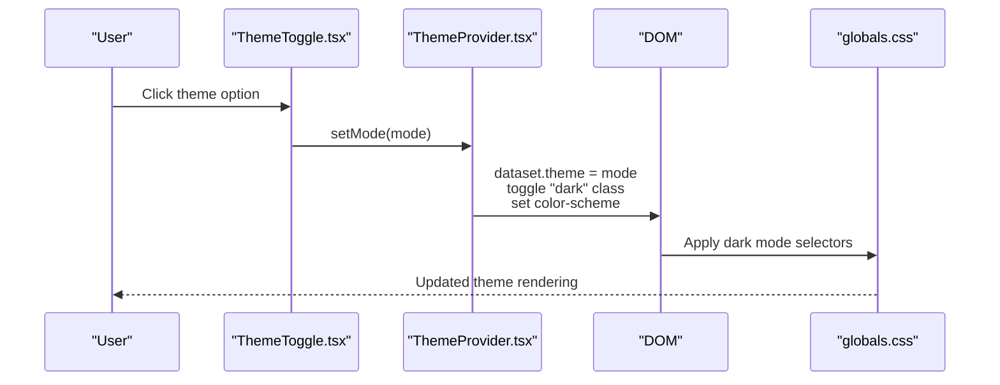
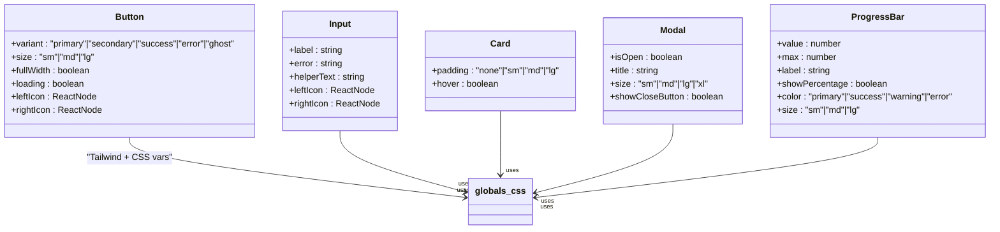
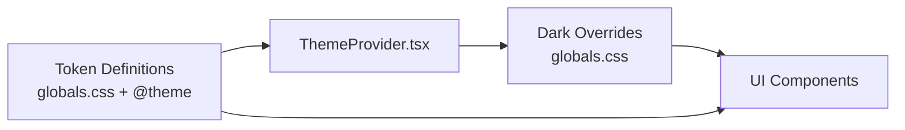

# Design System and Theming

<cite>
**Referenced Files in This Document**
- [COLOR_SYSTEM_GUIDE.md](file://PLAN/03_UI_UX/COLOR_SYSTEM_GUIDE.md)
- [UI_COMPONENTS_GUIDE.md](file://PLAN/03_UI_UX/UI_COMPONENTS_GUIDE.md)
- [globals.css](file://english_pronunciation_app/frontend/src/app/globals.css)
- [ThemeProvider.tsx](file://english_pronunciation_app/frontend/src/components/theme/ThemeProvider.tsx)
- [ThemeToggle.tsx](file://english_pronunciation_app/frontend/src/components/theme/ThemeToggle.tsx)
- [Button.tsx](file://english_pronunciation_app/frontend/src/components/ui/Button.tsx)
- [Input.tsx](file://english_pronunciation_app/frontend/src/components/ui/Input.tsx)
- [Card.tsx](file://english_pronunciation_app/frontend/src/components/ui/Card.tsx)
- [Modal.tsx](file://english_pronunciation_app/frontend/src/components/ui/Modal.tsx)
- [ProgressBar.tsx](file://english_pronunciation_app/frontend/src/components/ui/ProgressBar.tsx)
</cite>

## Table of Contents
1. [Introduction](#introduction)
2. [Project Structure](#project-structure)
3. [Core Components](#core-components)
4. [Architecture Overview](#architecture-overview)
5. [Detailed Component Analysis](#detailed-component-analysis)
6. [Dependency Analysis](#dependency-analysis)
7. [Performance Considerations](#performance-considerations)
8. [Troubleshooting Guide](#troubleshooting-guide)
9. [Conclusion](#conclusion)
10. [Appendices](#appendices)

## Introduction
This document describes the design system and theming architecture for the English pronunciation learning application. It documents the color palette, typography, spacing, borders, shadows, theme switching capabilities, and design token usage. It also outlines best practices for maintaining design consistency, accessibility compliance, and responsive design patterns.

## Project Structure
The design system spans two primary areas:
- Design guidelines and color system documentation
- Implementation in the frontend using Tailwind CSS v4 custom theme, CSS custom properties, and React components

**Diagram sources**
- [COLOR_SYSTEM_GUIDE.md](file://PLAN/03_UI_UX/COLOR_SYSTEM_GUIDE.md)
- [UI_COMPONENTS_GUIDE.md](file://PLAN/03_UI_UX/UI_COMPONENTS_GUIDE.md)
- [globals.css](file://english_pronunciation_app/frontend/src/app/globals.css)
- [ThemeProvider.tsx](file://english_pronunciation_app/frontend/src/components/theme/ThemeProvider.tsx)
- [ThemeToggle.tsx](file://english_pronunciation_app/frontend/src/components/theme/ThemeToggle.tsx)
- [Button.tsx](file://english_pronunciation_app/frontend/src/components/ui/Button.tsx)
- [Input.tsx](file://english_pronunciation_app/frontend/src/components/ui/Input.tsx)
- [Card.tsx](file://english_pronunciation_app/frontend/src/components/ui/Card.tsx)
- [Modal.tsx](file://english_pronunciation_app/frontend/src/components/ui/Modal.tsx)
- [ProgressBar.tsx](file://english_pronunciation_app/frontend/src/components/ui/ProgressBar.tsx)

**Section sources**
- [COLOR_SYSTEM_GUIDE.md](file://PLAN/03_UI_UX/COLOR_SYSTEM_GUIDE.md)
- [UI_COMPONENTS_GUIDE.md](file://PLAN/03_UI_UX/UI_COMPONENTS_GUIDE.md)
- [globals.css](file://english_pronunciation_app/frontend/src/app/globals.css)

## Core Components
- Color system: Tailwind v4 theme variables define primary, accent, success, warning, error, and neutral palettes with 50–900 shades. CSS custom properties mirror these values for programmatic usage.
- Typography: Inter for headings and body; Noto Sans for IPA symbols via a dedicated CSS class.
- Spacing: 8px grid tokens mapped to common spacing utilities.
- Borders and shadows: Rounded corners and shadow utilities aligned with component designs.
- Theming: Provider and toggle components manage theme state and persistence, with dark mode styles applied via CSS custom properties and targeted overrides.

**Section sources**
- [COLOR_SYSTEM_GUIDE.md](file://PLAN/03_UI_UX/COLOR_SYSTEM_GUIDE.md)
- [UI_COMPONENTS_GUIDE.md](file://PLAN/03_UI_UX/UI_COMPONENTS_GUIDE.md)
- [globals.css](file://english_pronunciation_app/frontend/src/app/globals.css)
- [Button.tsx](file://english_pronunciation_app/frontend/src/components/ui/Button.tsx)
- [Input.tsx](file://english_pronunciation_app/frontend/src/components/ui/Input.tsx)
- [Card.tsx](file://english_pronunciation_app/frontend/src/components/ui/Card.tsx)
- [Modal.tsx](file://english_pronunciation_app/frontend/src/components/ui/Modal.tsx)
- [ProgressBar.tsx](file://english_pronunciation_app/frontend/src/components/ui/ProgressBar.tsx)

## Architecture Overview
The design system architecture combines:
- A declarative Tailwind v4 theme with color tokens
- CSS custom properties for dynamic theming
- A React theme provider that applies dataset and class toggles
- Component libraries that consume tokens via Tailwind utilities and CSS classes

**Diagram sources**
- [globals.css](file://english_pronunciation_app/frontend/src/app/globals.css)
- [ThemeProvider.tsx](file://english_pronunciation_app/frontend/src/components/theme/ThemeProvider.tsx)
- [Button.tsx](file://english_pronunciation_app/frontend/src/components/ui/Button.tsx)
- [Input.tsx](file://english_pronunciation_app/frontend/src/components/ui/Input.tsx)
- [Card.tsx](file://english_pronunciation_app/frontend/src/components/ui/Card.tsx)
- [Modal.tsx](file://english_pronunciation_app/frontend/src/components/ui/Modal.tsx)
- [ProgressBar.tsx](file://english_pronunciation_app/frontend/src/components/ui/ProgressBar.tsx)

## Detailed Component Analysis

### Color Palette
The system defines six categories of colors with hex values and usage guidance:
- Primary (blue): Main actions, navigation, headers, progress indicators
- Accent (orange): Gamification highlights, streaks, rewards
- Success (green): Correct answers, completion, success messages
- Warning (amber): Improvement needed, caution
- Error (soft red): Incorrect answers, validation errors
- Neutral (gray): Backgrounds, text, borders, disabled states

Implementation details:
- Tailwind v4 theme variables define 50–900 shades for each color family
- CSS custom properties mirror these tokens for programmatic access
- Dark mode provides targeted overrides for backgrounds, borders, and text

Usage examples and rules are documented in the color guide, including contrast ratios and WCAG AA compliance.

**Section sources**
- [COLOR_SYSTEM_GUIDE.md](file://PLAN/03_UI_UX/COLOR_SYSTEM_GUIDE.md)
- [globals.css](file://english_pronunciation_app/frontend/src/app/globals.css)

### Typography
- Headings and body text use Inter
- IPA symbols use Noto Sans via a dedicated CSS class
- Fonts are configured globally and consumed by components

**Section sources**
- [UI_COMPONENTS_GUIDE.md](file://PLAN/03_UI_UX/UI_COMPONENTS_GUIDE.md)
- [globals.css](file://english_pronunciation_app/frontend/src/app/globals.css)

### Spacing System
- 8px grid alignment with tokens for common spacings
- Components expose padding and sizing props consistent with the grid

**Section sources**
- [UI_COMPONENTS_GUIDE.md](file://PLAN/03_UI_UX/UI_COMPONENTS_GUIDE.md)
- [Card.tsx](file://english_pronunciation_app/frontend/src/components/ui/Card.tsx)

### Border Radius and Shadows
- Rounded utilities align with component design (e.g., Card uses rounded-xl)
- Shadow utilities are applied consistently across components

**Section sources**
- [Card.tsx](file://english_pronunciation_app/frontend/src/components/ui/Card.tsx)
- [Button.tsx](file://english_pronunciation_app/frontend/src/components/ui/Button.tsx)
- [Modal.tsx](file://english_pronunciation_app/frontend/src/components/ui/Modal.tsx)

### Theme Switching and Dark Mode
- Provider supports light/dark/system modes and persists user preference
- Global CSS applies dark mode overrides for backgrounds, borders, and text
- ThemeToggle offers a compact UI for switching themes

Note: The current provider is locked to light mode in the implementation, but the infrastructure remains ready for future expansion.

**Diagram sources**
- [ThemeToggle.tsx](file://english_pronunciation_app/frontend/src/components/theme/ThemeToggle.tsx)
- [ThemeProvider.tsx](file://english_pronunciation_app/frontend/src/components/theme/ThemeProvider.tsx)
- [globals.css](file://english_pronunciation_app/frontend/src/app/globals.css)

**Section sources**
- [ThemeProvider.tsx](file://english_pronunciation_app/frontend/src/components/theme/ThemeProvider.tsx)
- [ThemeToggle.tsx](file://english_pronunciation_app/frontend/src/components/theme/ThemeToggle.tsx)
- [globals.css](file://english_pronunciation_app/frontend/src/app/globals.css)

### UI Components and Token Usage
Components consume tokens via Tailwind utilities and CSS classes:
- Button: variants and sizes with focus rings and transitions
- Input: labeled inputs with error and helper text, ARIA attributes
- Card: rounded borders, shadows, dark mode background
- Modal: focus trap, backdrop, ARIA dialog roles
- ProgressBar: accessible ARIA attributes and color variants

**Diagram sources**
- [Button.tsx](file://english_pronunciation_app/frontend/src/components/ui/Button.tsx)
- [Input.tsx](file://english_pronunciation_app/frontend/src/components/ui/Input.tsx)
- [Card.tsx](file://english_pronunciation_app/frontend/src/components/ui/Card.tsx)
- [Modal.tsx](file://english_pronunciation_app/frontend/src/components/ui/Modal.tsx)
- [ProgressBar.tsx](file://english_pronunciation_app/frontend/src/components/ui/ProgressBar.tsx)
- [globals.css](file://english_pronunciation_app/frontend/src/app/globals.css)

**Section sources**
- [Button.tsx](file://english_pronunciation_app/frontend/src/components/ui/Button.tsx)
- [Input.tsx](file://english_pronunciation_app/frontend/src/components/ui/Input.tsx)
- [Card.tsx](file://english_pronunciation_app/frontend/src/components/ui/Card.tsx)
- [Modal.tsx](file://english_pronunciation_app/frontend/src/components/ui/Modal.tsx)
- [ProgressBar.tsx](file://english_pronunciation_app/frontend/src/components/ui/ProgressBar.tsx)
- [globals.css](file://english_pronunciation_app/frontend/src/app/globals.css)

### Responsive Design and Accessibility
- Components enforce minimum touch targets and focus visibility
- ARIA attributes and roles are used for interactive elements
- Reduced motion support is included via media queries
- Typography and spacing scales are designed for readability across devices

**Section sources**
- [UI_COMPONENTS_GUIDE.md](file://PLAN/03_UI_UX/UI_COMPONENTS_GUIDE.md)
- [Button.tsx](file://english_pronunciation_app/frontend/src/components/ui/Button.tsx)
- [Input.tsx](file://english_pronunciation_app/frontend/src/components/ui/Input.tsx)
- [Modal.tsx](file://english_pronunciation_app/frontend/src/components/ui/Modal.tsx)
- [ProgressBar.tsx](file://english_pronunciation_app/frontend/src/components/ui/ProgressBar.tsx)
- [globals.css](file://english_pronunciation_app/frontend/src/app/globals.css)

## Dependency Analysis
The design system exhibits low coupling and high cohesion:
- Tokens are centralized in the global stylesheet and Tailwind theme
- Components depend on Tailwind utilities and CSS classes
- Theme provider is decoupled from components and manages persistence and runtime application

**Diagram sources**
- [globals.css](file://english_pronunciation_app/frontend/src/app/globals.css)
- [ThemeProvider.tsx](file://english_pronunciation_app/frontend/src/components/theme/ThemeProvider.tsx)
- [Button.tsx](file://english_pronunciation_app/frontend/src/components/ui/Button.tsx)
- [Input.tsx](file://english_pronunciation_app/frontend/src/components/ui/Input.tsx)
- [Card.tsx](file://english_pronunciation_app/frontend/src/components/ui/Card.tsx)
- [Modal.tsx](file://english_pronunciation_app/frontend/src/components/ui/Modal.tsx)
- [ProgressBar.tsx](file://english_pronunciation_app/frontend/src/components/ui/ProgressBar.tsx)

**Section sources**
- [globals.css](file://english_pronunciation_app/frontend/src/app/globals.css)
- [ThemeProvider.tsx](file://english_pronunciation_app/frontend/src/components/theme/ThemeProvider.tsx)
- [Button.tsx](file://english_pronunciation_app/frontend/src/components/ui/Button.tsx)
- [Input.tsx](file://english_pronunciation_app/frontend/src/components/ui/Input.tsx)
- [Card.tsx](file://english_pronunciation_app/frontend/src/components/ui/Card.tsx)
- [Modal.tsx](file://english_pronunciation_app/frontend/src/components/ui/Modal.tsx)
- [ProgressBar.tsx](file://english_pronunciation_app/frontend/src/components/ui/ProgressBar.tsx)

## Performance Considerations
- Prefer CSS custom properties for dynamic theming to avoid reflows
- Use Tailwind utilities for atomic styling to minimize CSS payload
- Keep gradients and shadows subtle to maintain smooth animations
- Avoid excessive nested selectors in dark mode overrides

## Troubleshooting Guide
Common issues and resolutions:
- Insufficient contrast: Verify color combinations meet WCAG AA; adjust shade or use higher-contrast variants
- Theme not applying: Ensure the provider is mounted at the root and dataset/class toggles are present
- Dark mode regressions: Confirm dark selectors override only intended tokens and do not cascade unintentionally
- Accessibility failures: Validate ARIA attributes and keyboard navigation in components

**Section sources**
- [COLOR_SYSTEM_GUIDE.md](file://PLAN/03_UI_UX/COLOR_SYSTEM_GUIDE.md)
- [UI_COMPONENTS_GUIDE.md](file://PLAN/03_UI_UX/UI_COMPONENTS_GUIDE.md)
- [globals.css](file://english_pronunciation_app/frontend/src/app/globals.css)
- [Button.tsx](file://english_pronunciation_app/frontend/src/components/ui/Button.tsx)
- [Input.tsx](file://english_pronunciation_app/frontend/src/components/ui/Input.tsx)
- [Card.tsx](file://english_pronunciation_app/frontend/src/components/ui/Card.tsx)
- [Modal.tsx](file://english_pronunciation_app/frontend/src/components/ui/Modal.tsx)
- [ProgressBar.tsx](file://english_pronunciation_app/frontend/src/components/ui/ProgressBar.tsx)

## Conclusion
The design system establishes a consistent, accessible, and extensible foundation for the application. The color palette, typography, spacing, and theming are clearly defined and implemented using Tailwind v4 and CSS custom properties. Components adhere to accessibility guidelines and provide robust user experiences across devices.

## Appendices

### Design Token Reference
- Color families: primary, accent, success, warning, error, neutral
- Typography: Inter for headings/body; Noto Sans for IPA
- Spacing: 8px grid-aligned tokens
- Borders: rounded-md, rounded-lg, rounded-xl, rounded-2xl
- Shadows: standard shadow utilities applied in components

**Section sources**
- [UI_COMPONENTS_GUIDE.md](file://PLAN/03_UI_UX/UI_COMPONENTS_GUIDE.md)
- [globals.css](file://english_pronunciation_app/frontend/src/app/globals.css)