# User Interface Components

<cite>
**Referenced Files in This Document**
- [UI_COMPONENTS_GUIDE.md](file://PLAN/03_UI_UX/UI_COMPONENTS_GUIDE.md)
- [COLOR_SYSTEM_GUIDE.md](file://PLAN/03_UI_UX/COLOR_SYSTEM_GUIDE.md)
- [HCI_ACCESSIBILITY_AUDIT.md](file://PLAN/03_UI_UX/HCI_ACCESSIBILITY_AUDIT.md)
- [Button.tsx](file://english_pronunciation_app/frontend/src/components/ui/Button.tsx)
- [Input.tsx](file://english_pronunciation_app/frontend/src/components/ui/Input.tsx)
- [Card.tsx](file://english_pronunciation_app/frontend/src/components/ui/Card.tsx)
- [Modal.tsx](file://english_pronunciation_app/frontend/src/components/ui/Modal.tsx)
- [ProgressBar.tsx](file://english_pronunciation_app/frontend/src/components/ui/ProgressBar.tsx)
- [Badge.tsx](file://english_pronunciation_app/frontend/src/components/ui/Badge.tsx)
- [XPBar.tsx](file://english_pronunciation_app/frontend/src/components/gamification/XPBar.tsx)
- [StreakBadge.tsx](file://english_pronunciation_app/frontend/src/components/gamification/StreakBadge.tsx)
- [IPAChart.tsx](file://english_pronunciation_app/frontend/src/components/ipa/IPAChart.tsx)
- [RecordButton.tsx](file://english_pronunciation_app/frontend/src/components/audio/RecordButton.tsx)
- [Footer.tsx](file://english_pronunciation_app/frontend/src/components/layout/Footer.tsx)
- [Navbar.tsx](file://english_pronunciation_app/frontend/src/components/layout/Navbar.tsx)
</cite>

## Table of Contents
1. [Introduction](#introduction)
2. [Project Structure](#project-structure)
3. [Core Components](#core-components)
4. [Architecture Overview](#architecture-overview)
5. [Detailed Component Analysis](#detailed-component-analysis)
6. [Dependency Analysis](#dependency-analysis)
7. [Performance Considerations](#performance-considerations)
8. [Troubleshooting Guide](#troubleshooting-guide)
9. [Conclusion](#conclusion)
10. [Appendices](#appendices)

## Introduction
This document describes the UI component library and design system for the English pronunciation training application. It covers component architecture, design principles, visual consistency, and accessibility compliance grounded in WCAG 2.1 AA. It documents foundational UI components (buttons, inputs, cards, modals, progress bars, badges), gamification components (XP bar, streak badge), and specialized components (IPA chart and audio recorder). It also provides guidance on responsive design, accessibility, cross-browser compatibility, component states/animations, Tailwind customization, theming, and composition patterns.

## Project Structure
The UI components are organized by domain and reuse shared design tokens and accessibility patterns:
- Shared UI primitives under components/ui
- Gamification components under components/gamification
- Specialized IPA and audio under components/ipa and components/audio
- Layout scaffolding under components/layout
- Design system and accessibility guidelines under PLAN/03_UI_UX

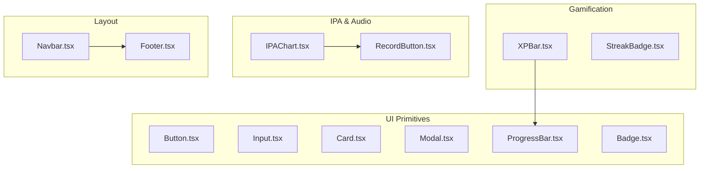

**Diagram sources**
- [Button.tsx:1-83](file://english_pronunciation_app/frontend/src/components/ui/Button.tsx#L1-L83)
- [Input.tsx:1-91](file://english_pronunciation_app/frontend/src/components/ui/Input.tsx#L1-L91)
- [Card.tsx:1-36](file://english_pronunciation_app/frontend/src/components/ui/Card.tsx#L1-L36)
- [Modal.tsx:1-110](file://english_pronunciation_app/frontend/src/components/ui/Modal.tsx#L1-L110)
- [ProgressBar.tsx:1-66](file://english_pronunciation_app/frontend/src/components/ui/ProgressBar.tsx#L1-L66)
- [Badge.tsx:1-43](file://english_pronunciation_app/frontend/src/components/ui/Badge.tsx#L1-L43)
- [XPBar.tsx:1-50](file://english_pronunciation_app/frontend/src/components/gamification/XPBar.tsx#L1-L50)
- [StreakBadge.tsx:1-63](file://english_pronunciation_app/frontend/src/components/gamification/StreakBadge.tsx#L1-L63)
- [IPAChart.tsx:1-111](file://english_pronunciation_app/frontend/src/components/ipa/IPAChart.tsx#L1-L111)
- [RecordButton.tsx:1-130](file://english_pronunciation_app/frontend/src/components/audio/RecordButton.tsx#L1-L130)
- [Navbar.tsx:1-28](file://english_pronunciation_app/frontend/src/components/layout/Navbar.tsx#L1-L28)
- [Footer.tsx:1-67](file://english_pronunciation_app/frontend/src/components/layout/Footer.tsx#L1-L67)

**Section sources**
- [UI_COMPONENTS_GUIDE.md:1-381](file://PLAN/03_UI_UX/UI_COMPONENTS_GUIDE.md#L1-L381)
- [COLOR_SYSTEM_GUIDE.md:1-446](file://PLAN/03_UI_UX/COLOR_SYSTEM_GUIDE.md#L1-L446)
- [HCI_ACCESSIBILITY_AUDIT.md:1-388](file://PLAN/03_UI_UX/HCI_ACCESSIBILITY_AUDIT.md#L1-L388)

## Core Components
This section summarizes the foundational UI components, their props, states, accessibility features, and usage patterns.

- Button
  - Props: variant, size, fullWidth, loading, leftIcon, rightIcon, plus native button attributes
  - States: idle, loading (spinning icon), hover/focus-visible ring, disabled
  - Accessibility: focus-visible ring, aria-hidden on spinner, minimum 44px touch target
  - Example usage: see [UI_COMPONENTS_GUIDE.md:20-33](file://PLAN/03_UI_UX/UI_COMPONENTS_GUIDE.md#L20-L33)

- Input
  - Props: label, error, helperText, leftIcon, rightIcon, plus native input attributes
  - Accessibility: label association, aria-invalid, aria-describedby, required indicator
  - Example usage: see [UI_COMPONENTS_GUIDE.md:54-65](file://PLAN/03_UI_UX/UI_COMPONENTS_GUIDE.md#L54-L65)

- Card
  - Props: padding, hover, plus className
  - Behavior: optional hover shadow, dark mode compatible borders/backgrounds
  - Example usage: see [UI_COMPONENTS_GUIDE.md:83-89](file://PLAN/03_UI_UX/UI_COMPONENTS_GUIDE.md#L83-L89)

- Modal
  - Props: isOpen, onClose, title, size, showCloseButton
  - Accessibility: focus trap, ESC to close, restore focus, role dialog, aria-modal
  - Example usage: see [UI_COMPONENTS_GUIDE.md:104-115](file://PLAN/03_UI_UX/UI_COMPONENTS_GUIDE.md#L104-L115)

- ProgressBar
  - Props: value, max, label, showPercentage, color, size
  - Accessibility: role progressbar, aria-valuenow/min/max, aria-label
  - Example usage: see [UI_COMPONENTS_GUIDE.md:138-147](file://PLAN/03_UI_UX/UI_COMPONENTS_GUIDE.md#L138-L147)

- Badge
  - Props: variant, size
  - Accessibility: color + text for meaning
  - Example usage: see [UI_COMPONENTS_GUIDE.md:164-168](file://PLAN/03_UI_UX/UI_COMPONENTS_GUIDE.md#L164-L168)

**Section sources**
- [Button.tsx:1-83](file://english_pronunciation_app/frontend/src/components/ui/Button.tsx#L1-L83)
- [Input.tsx:1-91](file://english_pronunciation_app/frontend/src/components/ui/Input.tsx#L1-L91)
- [Card.tsx:1-36](file://english_pronunciation_app/frontend/src/components/ui/Card.tsx#L1-L36)
- [Modal.tsx:1-110](file://english_pronunciation_app/frontend/src/components/ui/Modal.tsx#L1-L110)
- [ProgressBar.tsx:1-66](file://english_pronunciation_app/frontend/src/components/ui/ProgressBar.tsx#L1-L66)
- [Badge.tsx:1-43](file://english_pronunciation_app/frontend/src/components/ui/Badge.tsx#L1-L43)
- [UI_COMPONENTS_GUIDE.md:9-172](file://PLAN/03_UI_UX/UI_COMPONENTS_GUIDE.md#L9-L172)

## Architecture Overview
The component library follows a layered design:
- Primitive UI components (Button, Input, Card, Modal, ProgressBar, Badge) encapsulate base styling and accessibility.
- Domain-specific components (IPAChart, RecordButton) orchestrate primitives and integrate with hooks/services.
- Gamification components (XPBar, StreakBadge) compose primitives to deliver motivational UI.
- Layout components (Navbar, Footer) provide consistent navigation and information architecture.

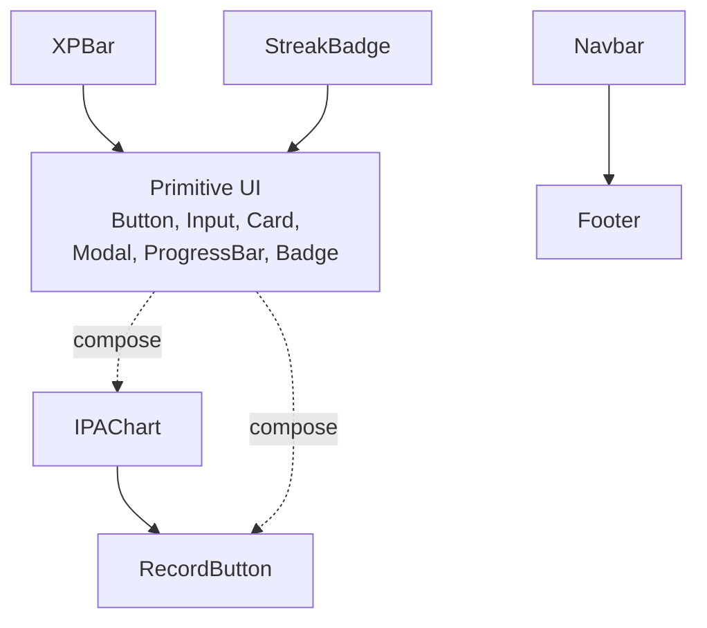

**Diagram sources**
- [Button.tsx:1-83](file://english_pronunciation_app/frontend/src/components/ui/Button.tsx#L1-L83)
- [Input.tsx:1-91](file://english_pronunciation_app/frontend/src/components/ui/Input.tsx#L1-L91)
- [Card.tsx:1-36](file://english_pronunciation_app/frontend/src/components/ui/Card.tsx#L1-L36)
- [Modal.tsx:1-110](file://english_pronunciation_app/frontend/src/components/ui/Modal.tsx#L1-L110)
- [ProgressBar.tsx:1-66](file://english_pronunciation_app/frontend/src/components/ui/ProgressBar.tsx#L1-L66)
- [Badge.tsx:1-43](file://english_pronunciation_app/frontend/src/components/ui/Badge.tsx#L1-L43)
- [IPAChart.tsx:1-111](file://english_pronunciation_app/frontend/src/components/ipa/IPAChart.tsx#L1-L111)
- [RecordButton.tsx:1-130](file://english_pronunciation_app/frontend/src/components/audio/RecordButton.tsx#L1-L130)
- [XPBar.tsx:1-50](file://english_pronunciation_app/frontend/src/components/gamification/XPBar.tsx#L1-L50)
- [StreakBadge.tsx:1-63](file://english_pronunciation_app/frontend/src/components/gamification/StreakBadge.tsx#L1-L63)
- [Navbar.tsx:1-28](file://english_pronunciation_app/frontend/src/components/layout/Navbar.tsx#L1-L28)
- [Footer.tsx:1-67](file://english_pronunciation_app/frontend/src/components/layout/Footer.tsx#L1-L67)

## Detailed Component Analysis

### Button
- Purpose: Primary affordance for actions with strong accessibility and visual feedback.
- Props and behavior: See [Button.tsx:8-16](file://english_pronunciation_app/frontend/src/components/ui/Button.tsx#L8-L16).
- Accessibility: Focus ring, disabled state, aria-hidden on spinner.
- Variants and sizes: See [Button.tsx:42-55](file://english_pronunciation_app/frontend/src/components/ui/Button.tsx#L42-L55).
- Usage examples: [UI_COMPONENTS_GUIDE.md:20-33](file://PLAN/03_UI_UX/UI_COMPONENTS_GUIDE.md#L20-L33)

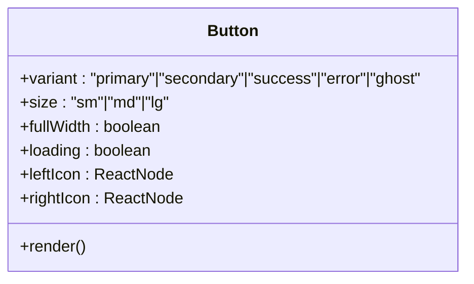

**Diagram sources**
- [Button.tsx:5-16](file://english_pronunciation_app/frontend/src/components/ui/Button.tsx#L5-L16)

**Section sources**
- [Button.tsx:1-83](file://english_pronunciation_app/frontend/src/components/ui/Button.tsx#L1-L83)
- [UI_COMPONENTS_GUIDE.md:13-40](file://PLAN/03_UI_UX/UI_COMPONENTS_GUIDE.md#L13-L40)

### Input
- Purpose: Form input with integrated label, helper/error messaging, and icons.
- Accessibility: Label association, aria-invalid, aria-describedby, required marker.
- Usage examples: [UI_COMPONENTS_GUIDE.md:54-65](file://PLAN/03_UI_UX/UI_COMPONENTS_GUIDE.md#L54-L65)

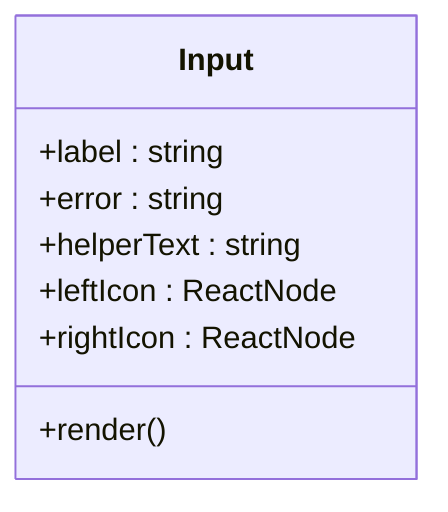

**Diagram sources**
- [Input.tsx:3-9](file://english_pronunciation_app/frontend/src/components/ui/Input.tsx#L3-L9)

**Section sources**
- [Input.tsx:1-91](file://english_pronunciation_app/frontend/src/components/ui/Input.tsx#L1-L91)
- [UI_COMPONENTS_GUIDE.md:47-72](file://PLAN/03_UI_UX/UI_COMPONENTS_GUIDE.md#L47-L72)

### Card
- Purpose: Visual grouping container with optional hover and padding controls.
- Usage examples: [UI_COMPONENTS_GUIDE.md:83-89](file://PLAN/03_UI_UX/UI_COMPONENTS_GUIDE.md#L83-L89)

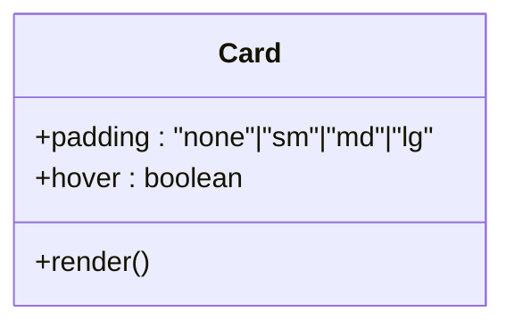

**Diagram sources**
- [Card.tsx:3-8](file://english_pronunciation_app/frontend/src/components/ui/Card.tsx#L3-L8)

**Section sources**
- [Card.tsx:1-36](file://english_pronunciation_app/frontend/src/components/ui/Card.tsx#L1-L36)
- [UI_COMPONENTS_GUIDE.md:79-91](file://PLAN/03_UI_UX/UI_COMPONENTS_GUIDE.md#L79-L91)

### Modal
- Purpose: Dialog with focus trap, ESC to close, and ARIA attributes.
- Accessibility: Focus management, body scroll prevention, restore focus, role and aria-modal.
- Usage examples: [UI_COMPONENTS_GUIDE.md:104-115](file://PLAN/03_UI_UX/UI_COMPONENTS_GUIDE.md#L104-L115)

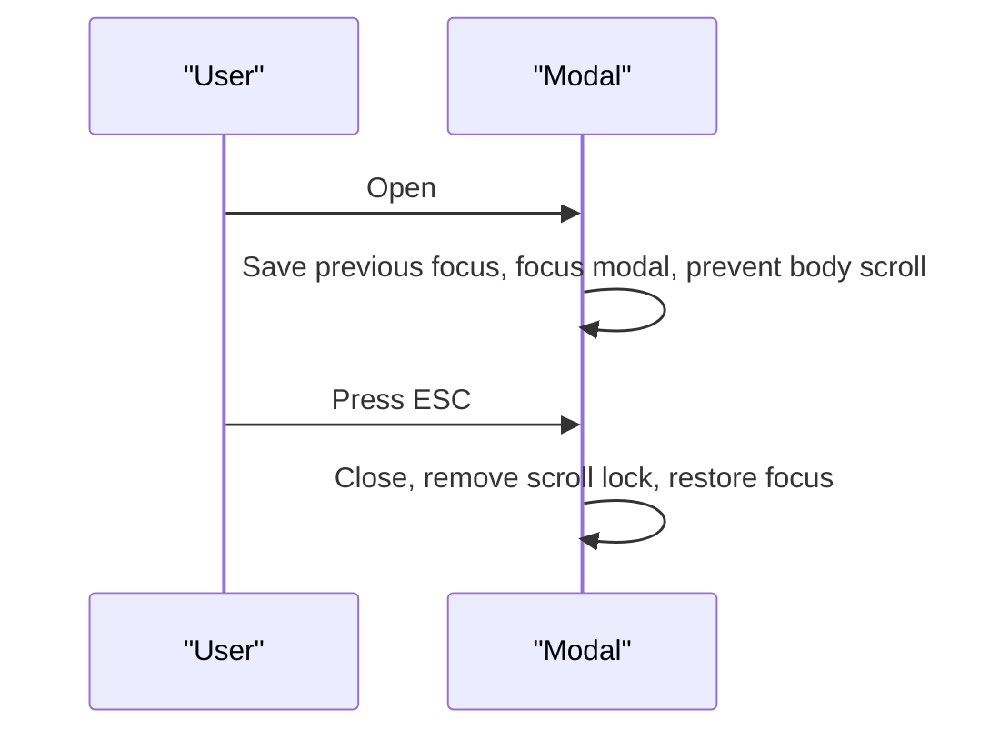

**Diagram sources**
- [Modal.tsx:38-62](file://english_pronunciation_app/frontend/src/components/ui/Modal.tsx#L38-L62)

**Section sources**
- [Modal.tsx:1-110](file://english_pronunciation_app/frontend/src/components/ui/Modal.tsx#L1-L110)
- [UI_COMPONENTS_GUIDE.md:97-123](file://PLAN/03_UI_UX/UI_COMPONENTS_GUIDE.md#L97-L123)

### ProgressBar
- Purpose: Visual progress with accessible ARIA attributes.
- Accessibility: role progressbar, aria-valuenow/min/max, aria-label fallback.
- Usage examples: [UI_COMPONENTS_GUIDE.md:138-147](file://PLAN/03_UI_UX/UI_COMPONENTS_GUIDE.md#L138-L147)

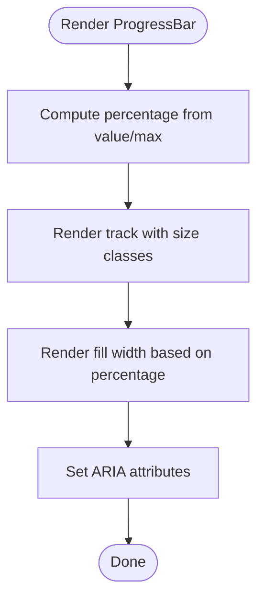

**Diagram sources**
- [ProgressBar.tsx:27-56](file://english_pronunciation_app/frontend/src/components/ui/ProgressBar.tsx#L27-L56)

**Section sources**
- [ProgressBar.tsx:1-66](file://english_pronunciation_app/frontend/src/components/ui/ProgressBar.tsx#L1-L66)
- [UI_COMPONENTS_GUIDE.md:130-153](file://PLAN/03_UI_UX/UI_COMPONENTS_GUIDE.md#L130-L153)

### Badge
- Purpose: Status and labeling with color-coded variants.
- Accessibility: Combine color with text for meaning.
- Usage examples: [UI_COMPONENTS_GUIDE.md:164-168](file://PLAN/03_UI_UX/UI_COMPONENTS_GUIDE.md#L164-L168)

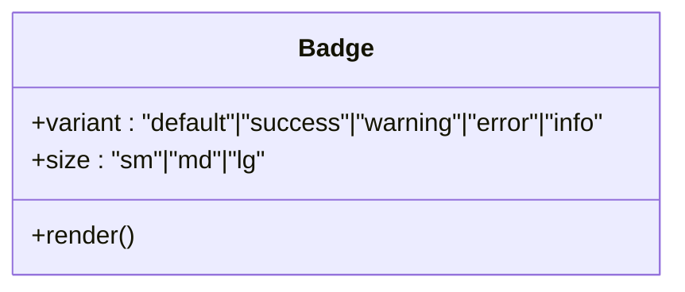

**Diagram sources**
- [Badge.tsx:3-10](file://english_pronunciation_app/frontend/src/components/ui/Badge.tsx#L3-L10)

**Section sources**
- [Badge.tsx:1-43](file://english_pronunciation_app/frontend/src/components/ui/Badge.tsx#L1-L43)
- [UI_COMPONENTS_GUIDE.md:160-172](file://PLAN/03_UI_UX/UI_COMPONENTS_GUIDE.md#L160-L172)

### XPBar (Gamification)
- Purpose: Visual XP progression with level display and progress bar.
- Composition: Uses ProgressBar internally.
- Usage examples: [UI_COMPONENTS_GUIDE.md:186-193](file://PLAN/03_UI_UX/UI_COMPONENTS_GUIDE.md#L186-L193)

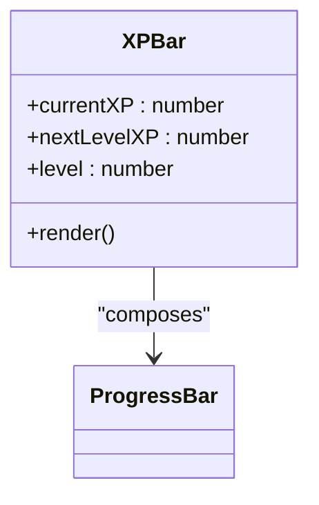

**Diagram sources**
- [XPBar.tsx:4-9](file://english_pronunciation_app/frontend/src/components/gamification/XPBar.tsx#L4-L9)
- [ProgressBar.tsx:1-66](file://english_pronunciation_app/frontend/src/components/ui/ProgressBar.tsx#L1-L66)

**Section sources**
- [XPBar.tsx:1-50](file://english_pronunciation_app/frontend/src/components/gamification/XPBar.tsx#L1-L50)
- [UI_COMPONENTS_GUIDE.md:177-194](file://PLAN/03_UI_UX/UI_COMPONENTS_GUIDE.md#L177-L194)

### StreakBadge (Gamification)
- Purpose: Motivational streak counter with dynamic gradient and milestone messages.
- Behavior: Dynamic gradient and messages based on day count.
- Usage examples: [UI_COMPONENTS_GUIDE.md:204-207](file://PLAN/03_UI_UX/UI_COMPONENTS_GUIDE.md#L204-L207)

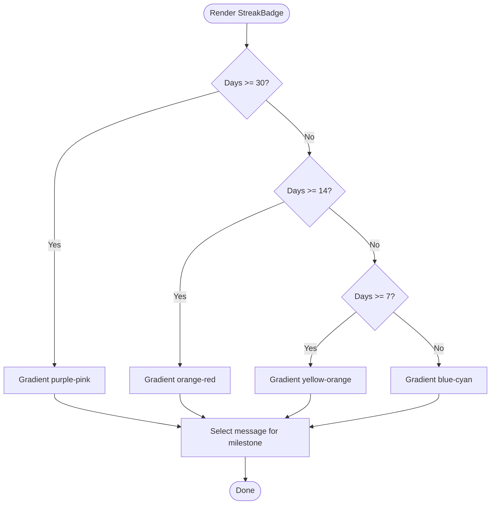

**Diagram sources**
- [StreakBadge.tsx:14-29](file://english_pronunciation_app/frontend/src/components/gamification/StreakBadge.tsx#L14-L29)

**Section sources**
- [StreakBadge.tsx:1-63](file://english_pronunciation_app/frontend/src/components/gamification/StreakBadge.tsx#L1-L63)
- [UI_COMPONENTS_GUIDE.md:197-212](file://PLAN/03_UI_UX/UI_COMPONENTS_GUIDE.md#L197-L212)

### IPA Chart
- Purpose: Interactive IPA chart for selecting phonemes and initiating practice.
- Behavior: Grid of phonemes, selection highlighting, practice area with listening and recording.
- Accessibility: aria-labels, focus-visible rings, live regions for announcements.
- Integration: Uses RecordButton for audio practice.

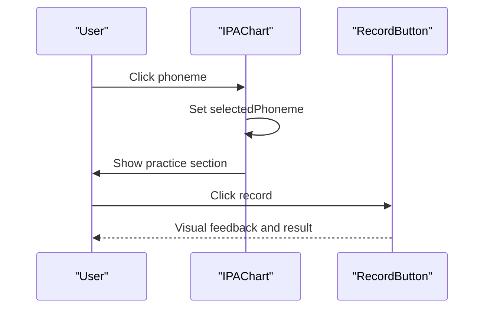

**Diagram sources**
- [IPAChart.tsx:13-17](file://english_pronunciation_app/frontend/src/components/ipa/IPAChart.tsx#L13-L17)
- [RecordButton.tsx:10-19](file://english_pronunciation_app/frontend/src/components/audio/RecordButton.tsx#L10-L19)

**Section sources**
- [IPAChart.tsx:1-111](file://english_pronunciation_app/frontend/src/components/ipa/IPAChart.tsx#L1-L111)
- [UI_COMPONENTS_GUIDE.md:242-246](file://PLAN/03_UI_UX/UI_COMPONENTS_GUIDE.md#L242-L246)

### RecordButton
- Purpose: Speech-driven recording with state machine and live announcements.
- States: idle, listening (with pulse), processing, result.
- Accessibility: aria-live region, aria-label updates, reduced motion considerations.
- Integration: Consumes useSpeechRecognition hook.

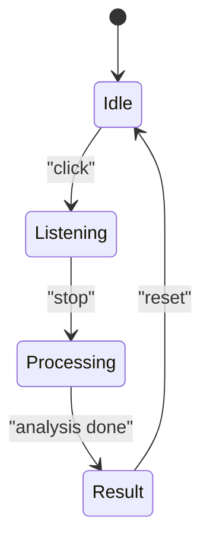

**Diagram sources**
- [RecordButton.tsx:33-69](file://english_pronunciation_app/frontend/src/components/audio/RecordButton.tsx#L33-L69)

**Section sources**
- [RecordButton.tsx:1-130](file://english_pronunciation_app/frontend/src/components/audio/RecordButton.tsx#L1-L130)
- [UI_COMPONENTS_GUIDE.md:242-246](file://PLAN/03_UI_UX/UI_COMPONENTS_GUIDE.md#L242-L246)

### Layout Components
- Navbar: Conditional links based on authentication state; integrates with client-side navigation.
- Footer: Semantic footer with contentinfo role and navigational links.

**Section sources**
- [Navbar.tsx:1-28](file://english_pronunciation_app/frontend/src/components/layout/Navbar.tsx#L1-L28)
- [Footer.tsx:1-67](file://english_pronunciation_app/frontend/src/components/layout/Footer.tsx#L1-L67)

## Dependency Analysis
- IPAChart depends on RecordButton and consumes IPA data.
- XPBar composes ProgressBar.
- Layout components provide global structure and landmarks.

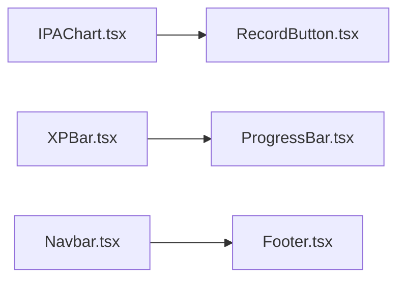

**Diagram sources**
- [IPAChart.tsx:1-111](file://english_pronunciation_app/frontend/src/components/ipa/IPAChart.tsx#L1-L111)
- [RecordButton.tsx:1-130](file://english_pronunciation_app/frontend/src/components/audio/RecordButton.tsx#L1-L130)
- [XPBar.tsx:1-50](file://english_pronunciation_app/frontend/src/components/gamification/XPBar.tsx#L1-L50)
- [ProgressBar.tsx:1-66](file://english_pronunciation_app/frontend/src/components/ui/ProgressBar.tsx#L1-L66)
- [Navbar.tsx:1-28](file://english_pronunciation_app/frontend/src/components/layout/Navbar.tsx#L1-L28)
- [Footer.tsx:1-67](file://english_pronunciation_app/frontend/src/components/layout/Footer.tsx#L1-L67)

**Section sources**
- [IPAChart.tsx:1-111](file://english_pronunciation_app/frontend/src/components/ipa/IPAChart.tsx#L1-L111)
- [RecordButton.tsx:1-130](file://english_pronunciation_app/frontend/src/components/audio/RecordButton.tsx#L1-L130)
- [XPBar.tsx:1-50](file://english_pronunciation_app/frontend/src/components/gamification/XPBar.tsx#L1-L50)
- [ProgressBar.tsx:1-66](file://english_pronunciation_app/frontend/src/components/ui/ProgressBar.tsx#L1-L66)
- [Navbar.tsx:1-28](file://english_pronunciation_app/frontend/src/components/layout/Navbar.tsx#L1-L28)
- [Footer.tsx:1-67](file://english_pronunciation_app/frontend/src/components/layout/Footer.tsx#L1-L67)

## Performance Considerations
- Prefer lightweight state machines (as in RecordButton) to minimize re-renders.
- Use CSS transitions and transforms for animations (e.g., focus rings, hover states).
- Defer heavy computations off the main thread; leverage browser APIs (Web Speech) responsibly.
- Keep ARIA live regions minimal and scoped to necessary updates.

## Troubleshooting Guide
Common accessibility gaps and remediation aligned with the audit:
- Navbar: Add skip link, mobile hamburger menu, aria-current for active pages, aria-controls/aria-haspopup for user menu.
- Dashboard: Ensure main landmark, add aria-labels for buttons, use semantic structures (definition lists).
- Home page: Verify gradient text contrast against background; mark decorative elements aria-hidden.
- Footer: Apply role="contentinfo".
- Admin components: Add captions for tables, labels for search inputs, aria-labels for action buttons; group filter controls with role="group".

**Section sources**
- [HCI_ACCESSIBILITY_AUDIT.md:67-275](file://PLAN/03_UI_UX/HCI_ACCESSIBILITY_AUDIT.md#L67-L275)

## Conclusion
The UI component library emphasizes accessibility (WCAG 2.1 AA), responsive design, and consistent design tokens. Components are modular, reusable, and composed thoughtfully. Gamification elements reinforce learning outcomes, while specialized components like the IPA chart and audio recorder enable immersive pronunciation practice. Adhering to the guidelines herein ensures visual consistency, inclusive UX, and maintainable architecture.

## Appendices

### Design Tokens and Theming
- Color palette: Primary Blue, Accent Orange, Success/Green, Warning/Amber, Error/Red, Neutral Grays.
- Typography: Inter for headings/body; Noto Sans for IPA symbols.
- Spacing grid: 8px base units; rounded corners standardized.
- Theming: Dark mode compatible variants for primitives; gradients applied sparingly for emphasis.

**Section sources**
- [COLOR_SYSTEM_GUIDE.md:26-324](file://PLAN/03_UI_UX/COLOR_SYSTEM_GUIDE.md#L26-L324)
- [UI_COMPONENTS_GUIDE.md:270-312](file://PLAN/03_UI_UX/UI_COMPONENTS_GUIDE.md#L270-L312)

### Responsive and Cross-Browser Guidance
- Responsive breakpoints: Use grid classes (e.g., sm:grid-cols-6) and max-width utilities to scale layouts.
- Cross-browser: Test focus-visible rings, ARIA attributes, and CSS animations across browsers; provide reduced-motion alternatives.
- Accessibility: Ensure keyboard navigation, focus management, and screen reader announcements remain functional.

**Section sources**
- [UI_COMPONENTS_GUIDE.md:292-312](file://PLAN/03_UI_UX/UI_COMPONENTS_GUIDE.md#L292-L312)
- [HCI_ACCESSIBILITY_AUDIT.md:325-347](file://PLAN/03_UI_UX/HCI_ACCESSIBILITY_AUDIT.md#L325-L347)